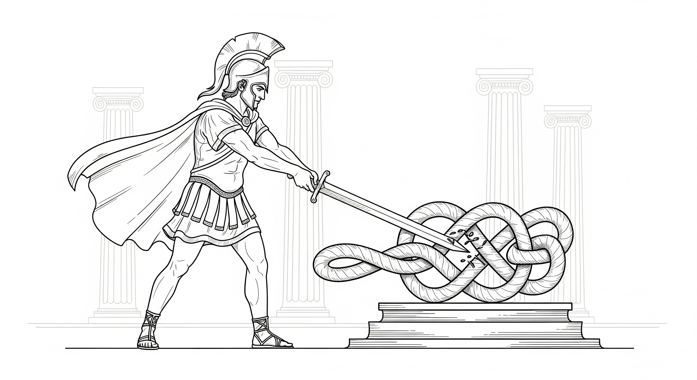

# 1 戈尔迪结

>在当前的危机中，政府不是解决问题的办法；政府本身就是问题所在。
> --- 罗纳德·里根（Ronald Reagan）1981 年美国总统就职演说

## 1.1 启示

古希腊传说往往在引人入胜的情节中包裹着人类文明的内涵。其中，小亚细亚弗里吉亚王国关于“人为系统困境”的叙事，便是一个极具洞察力的深刻隐喻。农夫戈尔迪正于田间驱赶牛车劳作，一只雄鹰却突然飞来并伫立于他的车轭上，久久不肯离去。他认为这是神迹，便赶着牛车前往神庙寻求指引，途中偶遇了一位睿智的女祭司并求婚成功。此时，弗里吉亚王国因老王绝嗣而陷入动荡，神谕宣称：下一任国王将乘牛车而来。当戈尔迪与女祭司驾车进城时，民众随即拥戴他为王。为了感恩，戈尔迪将这辆改变命运的牛车献祭给神灵。为了防止牛车被窃，他用绳索在车轴上系下一个错综复杂的死结，这便是历史上著名的“戈尔迪之结”（Gordian Knot）。这个结盘根错节，既找不到绳头，也看不见终点。之后神谕宣称谁能解开它，谁就将成为亚洲之王。几个世纪以来，无数自负的智者和强壮的武士试图理清其中的脉络，却都铩羽而归。直到公元前 333 年，年轻的亚历山大大帝站在了这个死结面前。面对这个看似无解的难题，他沉思片刻，做了一件令所有人瞠目结舌的事：他没有试图去寻找绳头，而是拔出腰间的佩剑，一剑斩断了绳结。亚历山大以一种近乎野蛮的直白，昭示了一个冷峻的事实：在第一性的物理定律面前，任何人造的复杂逻辑或主观设定的枷锁，都不过是一触即破的幻象。

这个古老的故事，正是我们今天数字世界处境的完美隐喻。在 21 世纪，作为一个普通的互联网用户，你正面对着一个现代版的“戈尔迪之结”。这个结由隐形的算法、晦涩的服务条款、无孔不入的监控网络以及庞大的官僚体系编织而成，它在安全与便利的糖衣下悄然收紧，让我们在不知不觉中失去了作为独立个体最宝贵的自由。传统的文明防御机制——无论是纸面上的法律条文，还是机构的道德 自我束缚——都正在系统性地失效。

人类文明经过了数千年的血腥洗礼，在付出了无数生命与自由的惨痛代价后，才终于达成了一个脆弱的共识：个人自由是文明的基石与发展的动力。作为这一难得共识的具体体现，绝大多数现代国家都签署了联合国的《世界人权宣言》，庄严承诺“私生活不得任意干涉”与“财产不得任意剥夺”。然而，历史的残酷讽刺在于：那些在纸面上签下名字的权力中心，往往正是现实中最强横的破坏者。当个体面对资源无限的商业巨头或拥有核武器的超级国家时，力量的悬殊让这些神圣的“权利”往往变成了一种奢侈的幻觉。尽管我们对“理论脱离实际”早有心理准备，但现实运行的荒诞逻辑，往往比任何悲观的预测都还要令人触目惊心。

## 1.2 从费米的大衣到斯诺登的裸奔

为了理解这个死结是如何越系越紧的，我们需要回望历史，看一看对个人自由的剥夺是如何进化的。1938 年，诺贝尔奖得主、物理学家恩里科·费米（Enrico Fermi）发现自己陷入了绝境：墨索里尼的法西斯政权颁布了排犹法案，为了保护犹太裔妻子，他必须逃离意大利，但他面临着严苛的财产管制——他拥有的里拉属于“国家”，他可以走，但只能带少量钱离境。面对这种物理层面的暴政，费米做了一个极其“物理”的决定，他购买了昂贵的貂皮大衣，借着前往斯德哥尔摩领取诺贝尔奖的机会，实际上是把尽可能多的财富“穿”在了身上带往美国。在那个时代，暴政的边界是有形的，也是有缝隙的，只要你越过那条边境线，你就自由了。

然而，七十五年后，另一位逃亡者爱德华·斯诺登（Edward Snowden）发现自己处在一个完全不同的世界。2013 年，当斯诺登揭露美国国家安全局（NSA）违宪的全球监控计划时，他并没有大衣可以穿，因为他面对的不再是边境线上的卫兵，而是一个数字化的全景监狱。当他逃离美国后，惩罚以光速降临：美国的司法机构只需让人在金融网络中敲下一串代码，他的银行账户就被冻结，书稿版税被没收，甚至连支持者试图通过 PayPal 转账的捐款也会被瞬间拦截。这极具讽刺意味：作为《世界人权宣言》的主要起草国与推行者，美国在面对所谓的“国家安全”威胁时，以前所未有的效率撕碎了它向世界兜售的自由契约。

费米的故事揭示了旧世界的局限：对个人的剥夺曾受制于时空与物质；而斯诺登的故事则照亮了当下的真相：在高度数字化的今天，剥夺是流动的、实时的、无远弗届的。我们不再拥有“穿在身上的财富”，多数资产只是服务器里的一些文本和数字；我们不再拥有“私密的耳语”，通信只是日志里的几条轨迹。如果说费米是在与具体的卫兵周旋，那么斯诺登面对的则是无形的数字世界牢笼——一种连接被彻底切断、存在被强行抹除的窒息感。这正是现代版的戈尔迪之结：绳索已化作数据与代码，你看不见它，却动弹不得。
