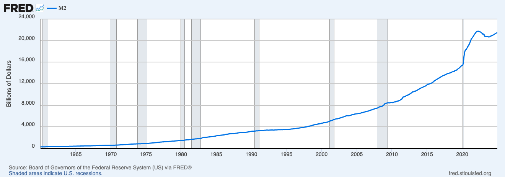

# 第四章 被稀释与锁定的财富

相比于对信息的窥探，政府对财产的控制更加隐蔽且全面。

在微观层面，你的钱从来不完全属于你。我们往往抱有一种错觉，认为存入银行的钱就像停在车库里的车一样，所有权依然归我们所有。但从法律和技术本质上看，当你把钱存入银行的那一刻，它就变成了银行的资产，你拥有的仅仅是一张“欠条”。在数字化时代，这种关系变得更加脆弱：你毕生积累的财富，本质上只是中心化数据库里的一串代码。这串代码并不由你控制，而是由银行和国家共同掌管。只要系统判定你“违规”，或者国家发布一道行政命令，这串数字就能被瞬间冻结、清零或限制用途。在这个意义上，你不是财富的主人，你只是财富的“看守者”，时刻等待着真正的主人——利维坦——的审阅。

1970 年通过的《银行保密法》（Bank Secrecy Act, BSA）堪称“双重思想”的杰作。它的名字听起来像是在保护你的隐私，实际上却恰恰相反——它强迫银行撕毁与储户之间的保密契约，变身为政府的秘密警察。这项法案确立了一个令人不安的原则：金融隐私不再是权利，而是嫌疑。 它规定任何超过 1 万美元的现金交易都必须向政府报告。在 1970 年，1 万美元是一笔巨款，足以买下一栋房子，当时的监控目标主要是大毒枭和黑手党。然而，半个多世纪过去了，通货膨胀让货币贬值了 90% 以上，但这个“1 万美元”的门槛却从未调整。这就好比原本用来捕鲸的网，现在却在捕捞小虾米。今天，一个普通家庭购买二手车、装修房子或支付学费，都可能触发警报，不仅交易会被记录，还可能面临随后而来的盘问。

更荒诞的是所谓的“结构化交易罪”（Structuring）。如果你只是为了保护隐私，或单纯觉得手续繁琐，将数万美元分拆成多笔低于一万美元的金额存入银行——即便你既未逃税，资金来源也完全合法——仍然可能因“试图规避监管”而被定罪，甚至面临牢狱之灾。由此产生了一种深刻的悖论：使用自己的钱本不需要任何理由，但一旦出于避免被监控的动机来使用自己的钱，反而可能构成犯罪。在这一法律阴影之下，每一笔交易都可能被视为呈堂证供，每一位储户都成了潜在的嫌疑人，而银行柜员则被制度性地推向了半执法、半告密者的角色。

从宏观视角看，大多数政府都从事一场漫长的‘隐形劫掠’。利维坦无需冻结你的账户，只需通过印钞机或增加信贷规模，便能悄无声息地稀释你口袋里的财富。这种最直接的干预被称为扩张性货币政策，其核心在于增加货币供应量。这个不是现代才有的情形，是人类历史的正常状态。罗马帝国的开国皇帝屋大维在公元前 24 年确立了极为严格的金银本位制度，金币是名副其实的 99% 的几乎纯金，流通更广的银币则有 95% 到 98% 的含银量。但是从公元 64 年暴君尼禄开始到公元 268 的皇帝克劳狄二世仅仅二百多年时间，银币的含银量不断减少到仅剩 0.5%，成为镀了一层薄银的劣质铜铁。所谓的劣币驱逐良币就是民间的自然反应。普通人只要一拿到早期的高纯度老银币，立刻在藏在家里或熔成银块留做它用，市面上只有不断贬值的伪劣货币。值得说明的是这种劣币驱逐良币的现象只有在强权政府垄断货币发行和流动时才会发生。而在完全自由、没有政府垄断的市场中，发生的现象是相反的良币驱逐劣币。在 1837 年至 1863 年的美国，没有中央银行，成百上千家私人银行、企业、甚至教堂都可以自己印制纸币（Banknotes）。因为没有政府垄断发行权，劣质银行印的废纸很快就会在市场上折价（比如面值 10 美元的劣质纸币只能当 5 美元花），而信誉极佳、能百分百兑换黄金的银行纸币则被大家疯抢。这就是标准的市场选择良币。现代社会里很多人购买金条而不是储蓄法币也是同样的道理，都知道法币在不停地贬值。

在现代金融语境下，‘钱’的定义被划分为不同层次：M1 是指那些随时可以提取使用的现金与活期存款；而 M2 则是一个更宏大的水库，它不仅包含 M1，还涵盖了储蓄和定期存款等‘准货币’。当美联储通过降息或购债向市场注入流动性、推高 M2 增速时，虽然短期内刺激了消费，却也开启了通胀的魔盒。回看过去几十年，美国 M2 指数那条持续上扬的曲线，正是这笔隐形税收最直观的注脚。下面是 1960-2024 美国的 M2 货币供应量、通货膨胀率以及美元的购买力数据。

[1960-2024 美国M2货币供应量](https://fred.stlouisfed.org/series/M2SL)

[1960-2024 美国通货膨胀率和消费者价格指数](https://fred.stlouisfed.org/series/CUUR0000SA0R)

[美国城市消费者价格指数：美国城市平均消费美元购买力](https://fred.stlouisfed.org/series/CUUR0000SA0R)

可以看到，从 1960 年到 2024年 的 64 年内， M2 货币供应量从 $298 billion 增加到 $21,408 billion，增加了 72 倍。平均年通货膨胀率大约 3%，美元购买力则从 340 减少到 32.4，减少了 9.5 倍。通货膨胀就像一种没有痛感的慢性毒药，它稀释了工薪阶层的储蓄，却让拥有资产的富人和背负债务的政府获益。而当这种债务游戏玩不下去导致金融危机时，政府又会用纳税人的钱去救助那些“大而不能倒”的机构。

但这还不是最糟的。最极致的控制将会是政府主导的货币数字化与可编程化，即央行数字货币（CBDC）。CBDC 代表了货币的终极异化：钱不再是价值的载体，而变成了可编程的控制工具。在 CBDC 构建的金融全景监狱中，每一分钱都不再是冷冰冰的价值符号，而是带有“政治属性”的代码。通过实时更新的数字化账本，利维坦获得了上帝视角：它不仅能瞬间洞悉你“何时、何地、向谁”支付了多少钱，甚至能通过算法解析出每一笔交易背后的生活底色与政治取向。现金使用的匿名性，这一工业文明保护个体自由的最后堡垒，在 CBDC 面前彻底坍塌。更深远的威胁在于货币权力的“颗粒度”进化。当货币变得可编程，它就从一种天赋的权利退化为一种被赐予的许可。

- 空间与时间的锁死：政府可以为你的资金设定“地理围栏”，规定它只能在特定区域使用；或者设定“有效期”，通过人为制造的货币腐烂来强制驱动消费。这类似于政府发行的食品救济劵，有诸多使用限制，比如只能在特定商场买指定的品类。CBDC 会把所有货币的使用都加上类似的限制和实时监控。
- 行为主义的社会工程：资金的使用被挂钩复杂的条件矩阵。你购买的是否是“绿色产品”？你的社交行为是否符合“合规指标”？通过对商户黑名单和交易限额的动态调整，利维坦实现了对个人意志的精准校准。这不再是简单的经济干预，而是一场数字化的“行为驯化”。

在宏观权力版图上，CBDC 模糊了财政与金融的边界。它赋予了主权者前所未有的“精准手术”能力——定向补贴、即时征收、乃至绕过传统银行体系的金融动员。这种极度高效的集中化，背后是极度危险的权力膨胀。不夸张地说，CBDC 是货币发展史上的一次“逆向革命”。它将货币从一种促进自发秩序的通用媒介，异化为一种可随时断电、随时溯源、随时没收的统治利器。对于个人而言，这不仅是隐私的终结，更是财产权这一古老观念的终极噩梦。
