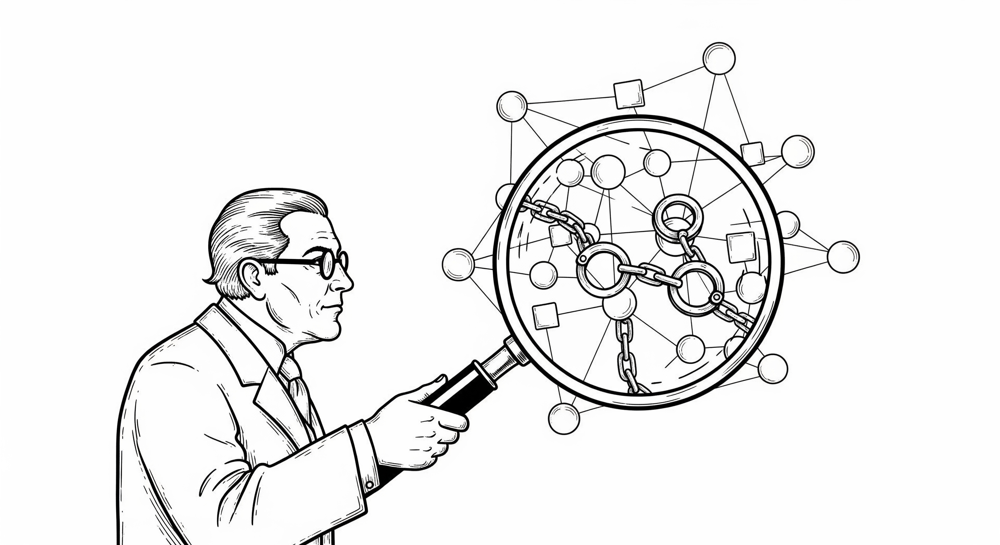

# 第二部 自由为何沦陷

> 技术并非中立；它给予的，必然会以另一种方式带走。
> --- 尼尔·波兹曼（Neil Postman） 《技术垄断：文化向技术投降》

人类从未像今天这样依赖信息系统：我们的通信、财富、身份、乃至最隐秘的思想，都被紧紧包裹在一层层数字界面与技术协议之中。我们曾天真地以为互联网将带来前所未有的解放，但现实却展示了硬币的另一面：这种深度的依赖并没有带来更大的自主性。相反，技术的进步在极大赋能机构的同时，也在系统性地剥夺个体的权利。当政府与商业巨头掌握了近乎无限的数据与算力，它们便拥有了定义身份、裁决信任、以及控制通信与财产的“上帝权限”。而普通人，就像生活在数字化温室里的植物，在享受便利的供养时，逐渐失去了在野外生存的能力，最终只能被动地接受、使用、服从。

本章旨在深入剖析个人自由在数字时代沦陷的成因，我们将从两个层面展开：显而易见的表象与深藏其下的根源。进行这种结构化分析的动机非常明确——只有彻底明白了问题的原因，特别是透过现象看清表象之下的根本技术症结，我们才能找到问题的要害。诊断是治疗的前提，唯有如此，我们才能发现并给出真正有效的解决方案，而不仅停留在表面的修补上。具体而言，在信息时代个人自由陷入了多重困境。这种困境体现在可以感知的表面现象与难以察觉的根源这二个层面。

在现象层面，个人在数字世界处于全然的被动地位。个人权利面临着来自利维坦（政府）和数字巨兽（科技巨头）的双重挤压。这些机构拥有近乎无限的资源来收集数据、训练算法、构建网络，以实现其管理或盈利的目标。在这个由机构编织的宏大叙事中，个体逐渐沦为被支配的客体。这种支配有三个明显标志：在数字身份上被定义，在信任关系中被支配，在通信与财产上被掌控。

如果究其根源，这是一场不对称的技术战争。其根本原因有二：个体不拥有处理信息的私有资产（算力、存储与网络），也缺乏自我保护的安全防御工具。如果我们愿意拨开那些由法律条文和商业宣传编织的迷雾，从纯粹的技术视角去审视这个世界，我们会发现个人自由沦陷的根本原因并非仅仅是道德的滑坡或法律的缺位，而在于一场技术力量的极端不对称。这是一场手无寸铁的平民面对全副武装的巨人的战争。在这个战场上，我们之所以节节败退，归根结底是因为我们在技术层面不拥有数字资产并且缺乏必要的防御能力。而这二个问题都有经济可行的解决方法。
