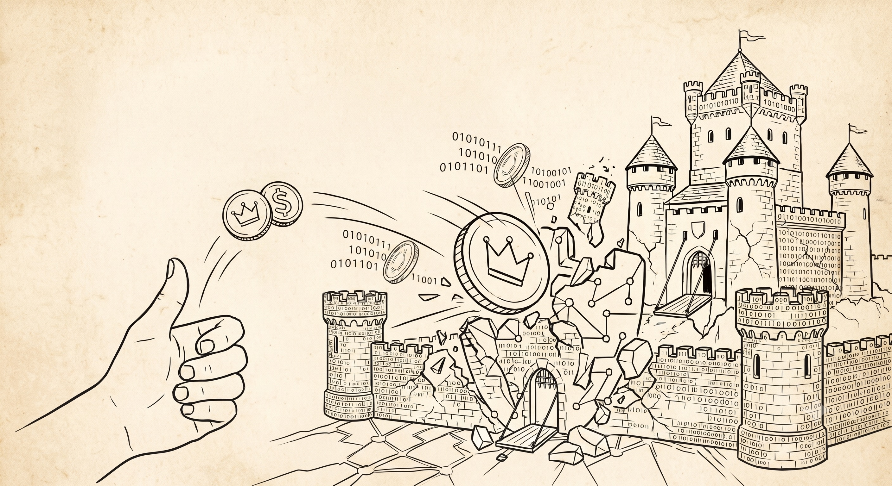

# 第一章 抛硬币和主权个人时刻

> 在一个信息社会里，密码学是关于权力的 —— 更是关于重新分配权力的。
> —— 布鲁斯·施奈尔 (Bruce Schneier) 《Click Here to Kill Everybody: Security and Survival in a Hyper-connected World》

## 1 谁都可以抛硬币

在漫长的人类文明进程中，自由的代价向来昂贵甚至血腥。数千年来，为了捍卫思想交流的权利或私产的边界，个体别无选择：只能被迫依附于某位仁慈的君主，或将权利让渡给开明的官僚体制，以此换取高耸的城墙与强大武力的庇护。本质上这些都是一种对物理暴力和组织权力无可奈何的深度依附。然而，信息时代的到来触发了一个前所未有的范式转折：获取个体主权，无论是信息的自由传递还是财富的终极掌控，已不再取决于你动员物质资源或指挥暴力机器的能力，也不取决于你在庞大国家建制中占据何种地位，你需要的仅仅是一枚普通的硬币，一点制造随机性的耐心，以及对简单数学法则的基本理解。

让我们想象一下这样一个充满仪式感的场景：你独自坐在桌前将一枚硬币轻轻抛向空中，硬币旋转、下落、定格。如果是正面，你记下一个 1；如果是反面，你记下一个 0。这个动作枯燥乏味，甚至有些荒诞，但如果坚持做完 256 次，你就完成了一项现代意义上的炼金术：你得到了一串由 0 和 1 组成的随机序列。

就在这一刻，奇迹发生了。这串看似杂乱无章的数字，在密码学的世界里，既是坚固的基石，也是神奇的种子。如果你将其用于加密，它就是那把独一无二、纵使穷尽全宇宙算力也无法强行开启的密钥；如果你将其用于构建数字身份，它则是一颗数学里的随机种子，会通过算法生长出一对共生的密钥：一把是深藏于你手中的私钥，如同绝对无法被仿造的私章；另一把则是向世界宣告的公钥，是你在数字生活里的个人身份，只有你手中的私钥可以证明其拥有者。至此，整座宏伟的、完全属于个人的数字主权大厦，已然在你的指尖拔地而起。

从数量级的角度看，产生这串随机数字背后的组合总数多得难以置信，它比可观测宇宙中所有原子的总数还要多。这意味着，任何现有的超级计算机，哪怕它从宇宙大爆炸的那一刻起就开始运算，也不能通过暴力破解猜出这串数字。握住这串数字，你就拥有了一把通往新世界的钥匙：它能为你的对话加密，让最先进的监控系统也只能看到无意义的乱码；它也能为你的资产签名，让任何强权组织或黑客都无法冻结或掠夺你的财富。这听起来像是科幻小说中才有的情节，但它已经成为坚硬的现实。

## 2 主权个人时刻

今天，我们正站在一个与 1989 年 Web 诞生时刻惊人相似的历史节点上，甚至可以说，我们正面临着一次更为深远的范式重构。摩尔定律总结了过去几十年计算能力呈指数级爆炸的事实：今天我们口袋里的智能手机，其算力远远超过 1989 年全球最快的超级计算机；密码学的工程化突破，则让数据保护变得坚不可摧。个体第一次在技术层面上，拥有了对抗大规模监控的非对称防御能力。有史以来人类苦苦追寻的个人主权，即对自己的身份、言论、财产以及信任的绝对支配权不再仅仅是哲学家笔下的乌托邦。

有两个里程碑宣告了这个时刻的到来。第一个里程碑是菲尔·齐默尔曼（Phil Zimmermann）于 1991 年开发的 PGP（Pretty Good Privacy）。这是一款开源加密程序，为任何人的数据通信提供无法破解的加密隐私与认证功能。2009 年比特币的横空出世，是这场变革的另一个里程碑。它仅凭区区数千行核心代码，就从虚空中创造出一个价值万亿级美元的全球数字货币，并向世界证明了一个震撼的事实：通过开源代码、数学算法与去中心化共识，货币主权得以彻底回归个体，无需任何中心化机构的背书。

但这仅仅是序幕，摆在我们面前的机会就是利用经过考验的信息技术去设计和实现个人自由的新一代互联网，我们称之为主权个人互联网 SovinWeb（Sovereign Individual Web）。在这个更宏大也更普及的生态中，身份不是恩赐，而是自己生成；言论自由不再是一种法律上的虚设，而是技术上的不可审查与无法监控；财产自由也不再是银行账户里的数字，而是技术上的不可剥夺；信任也不再被动，而是个体的自主选择。SovinWeb 将这些主权交还给个体，构建起一个有真正个人自由的数字社会。

这并非遥不可及的幻梦，构建它的基石早已散落在我们周围：公开密钥算法让个人拥有主权个人身份，现成的端到端加密协议保护个人隐私，成熟的分布式账本系统让个人财产不可剥夺，普及的高性能计算设备与高速通信网络，让个体得以建立完全自主的社交信任网络。

我们要做的，是像当年的蒂姆·伯纳斯-李一样，将这些碎片有机地编织在一起，创造一个新的个人数字系统和互联通信协议。在这个新系统中，你的数字身份是自主创建的；你的数据存储在私人数字城堡里；你的财产是由一串随机数守护的价值共识；你的社交是基于个人真实的信任网络（Web of Trust）。哪怕是最强大的帝国，动用其所有的计算资源，也无法强行闯入这个由 256 位随机数与数学定律所构筑的个人数字堡垒。

本书将剥开技术晦涩的外衣，用平实易懂的语言为你拆解信息时代主权个人需要了解的基本数字生活常识。我们将从抛一枚硬币的逻辑起点出发，教你如何一步步夺回本该属于你的个人主权，即包括身份、隐私、财产以及信任的所有权与控制权。

理解随机性产生个人主权的奥秘以及 SovinWeb 带来的根本转变与巨大价值，其实远比你想象中更加浅显直观。你甚至不用担心反复抛硬币这种机械枯燥的体力活，你的手机瞬间即可为你代劳。这是一次信息时代底层逻辑的范式跃迁，理解这些新范式会赋予你一种深刻的洞察力，让你重构审视世界的认知维度和更多地掌控自己的生活。
