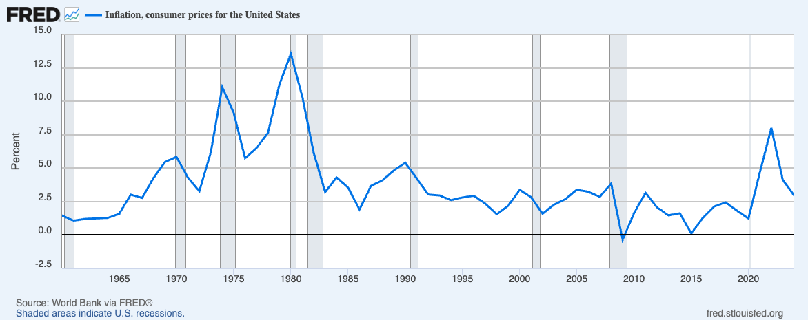
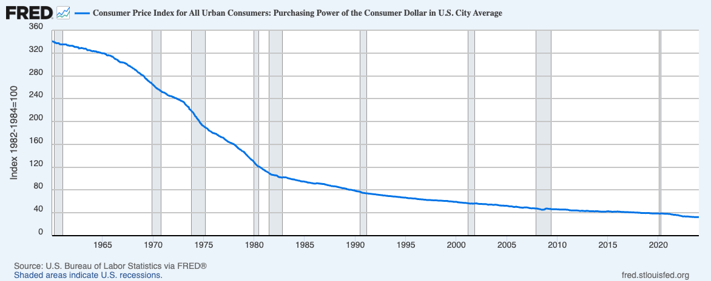

# 1-3 自负的利维坦

编织死结的第二股力量，也是更强大的一股，来自国家机器。在政治哲学中，它有一个令人敬畏的名字——利维坦（Leviathan）。这个词源于《圣经》，原指上帝创造的一只盘踞在深海中的多头巨兽。哲学家霍布斯用它来隐喻国家主权：人类为了秩序，将权利让渡给这个庞大的人造怪物。然而，一旦这只巨兽被唤醒，个体在它面前便如蝼蚁般渺小。在信息时代，利维坦进化出了前所未有的感知器官和消化系统。

## 1 被剥夺的个人隐私

首先受到伤害的是被政府法律触角穿透的个人隐私。纵观人类政治史，政府官僚对民众隐私的窥探与剥夺并非数字时代的产物，而是权力这种生物根深蒂固的本能。对于一个试图进行宏大社会工程的机构来说，不可见的民众是效率的大敌。

历史上，利维坦始终渴望将复杂的社会景观简化为可管理的图表，以便更彻底地收缴资源与控制思想。然而，在漫长的古代和工业时代，个人的秘密躲藏在厚重的纸质档案、漫长的空间距离以及缓慢的信息传递之后。这些物理世界的摩擦力曾是保护个人自由的一道天然屏障。

然而，在数字时代，这种平衡被彻底打破，权力的古老野心终于遇到了前所未有的技术便利。权力要求民众必须完全透明地活在算法的凝视之下，而它自己却躲入加密算法与法律豁免权编织的暗箱中。尽管现代国家大多披着法治的外衣，宣称对公民隐私拥有严密的法律保护，但在现实的博弈中，这些法律往往在遭遇那块名为国家安全的挡箭牌时，便如初雪般消融。“国家安全”或者“保护公众的利益与安全”在今天已成为一种近乎魔术般的咒语，只要它们被吟唱出来，法庭的逻辑、程序的正义以及宪法的底线往往都会悄然退场。如果你仔细审视那些冠冕堂皇的法案，你会发现利维坦正在利用代码与法律编织一张覆盖全球的捕网。

美国的《爱国者法案》（Patriot Act）开启了一个危险的先例，它允许情报机构在无需传统搜查令的情况下广泛获取公民的商业、金融和通信记录。随后的《云法案》（CLOUD Act）则彻底抹去了主权的边界，它宣称只要数据掌握在美国公司手中，无论这些服务器物理上存储在冰岛的冻土还是新加坡的机房，都必须无条件接受美国政府的管辖。

这种剥夺的极致体现，莫过于英国 2023 年通过的《在线安全法案》（Online Safety Act）中极具争议的扫描义务（Scanning Obligation）。所谓“扫描义务”，是指政府要求通信平台必须在用户的信息被端到端加密算法打碎成乱码之前，就利用本地算法自动扫描其中的内容。如果算法判定你的私人对话、甚至只是由于你个人的私密记录不符合某种预设的安全标准，系统就会自动拦截甚至报警。在技术界，它有一个更具侵略性的术语：“客户端扫描”（Client-Side Scanning）。这是一种极为阴险的技术方案。它避开了那些在公共互联网上飞驰的加密数据流，转而将利维坦的眼睛直接植入你的私有设备：你的手机和电脑。这种做法的逻辑是：既然在信封封死后无法偷看，那就干脆在你写信的时候就站在你肩膀后面盯着。这就像是法律规定，虽然邮递员无权私拆信件，但每一个公民在封口之前，必须先将信件摊开在自家的桌子上，让墙角那个由政府控制的摄像头先过一遍。同时这项法案赋予了监管机构 Ofcom（英国通讯管理局）极其庞大的执法权力。如果像 WhatsApp 或 Signal 这样的加密通讯软件拒绝在客户端执行这种扫描义务，Ofcom 有权对其开出天价罚单，罚款额度可高达该企业全球年营业额的 10%，或者 1800 万英镑（以较高者为准）。对于 Meta 这样的千亿级巨头，10% 的全球营收意味着上百亿美元的经济绞索。这是一种赤裸裸的强权胁迫：它利用商业公司的逐利本能，强迫它们背叛用户，转而充当政府的编外探员。如果平台不配合安装这套“在封口前读信”的算法，利维坦就会通过金融系统勒死它们。这种做法实际上彻底终结了私密空间的可能。当权力的监控深入到你的私人设备中，并由天价罚款保驾护航时，所谓的个人隐私与通信自由，在这种无处不在的算法监视下，实际上已经走向了尽头。

可以看到这些法案共同指向一个清晰而令人战栗的趋势：政府正在试图建立一种合法的全知全能。在古老的传说中，只有神能洞察人心；而在数字时代，算法和数据库成了利维坦的神性化身。这绝不仅仅是法理上的推演，而是正在发生的现实。2013 年，爱德华·斯诺登揭开了棱镜计划（PRISM）的帷幕，让全世界看到了一幅前所未有的图景：政府不再需要笨拙地跟踪特定的嫌疑人，而是直接将监控的吸管插进了 Google、Apple 和 Facebook 的心脏。在那一刻，隐私的幻觉被彻底击碎——你的每一封邮件、每一次通话、每一个私密瞬间，其实都在某个遥远机房的数据库里留下了永恒的残影。

在实际运作中，这种干涉远比法律授权更加随意和隐秘。2025 年，谷歌母公司披露的一封律师函揭示了权力的软控制艺术：白宫官员通过非正式渠道持续向平台施压，要求删除那些并未违规、但政府不喜欢或不悦的言论。无论是打着反恐、打击犯罪还是公共卫生的旗号，理由总是随着政治风向不断漂移，但其底层的逻辑始终如一：它要让这个信息的黑箱对权力保持单向透明。 在这个数字全景监狱中，权力不仅要看清你的过去，还要掌控你的现在，最终预测并引导你的未来。当你的一举一动都处于某种不可言说的监视与控制之下，那种原本属于主权个人的信息自由也就随之枯萎了。

## 2 被稀释与锁定的财富

相比于对信息的窥探，政府对财产的控制更加隐蔽且全面。

在微观层面，你的钱从来不完全属于你。我们往往抱有一种错觉，认为存入银行的钱就像停在车库里的车一样，所有权依然归我们所有。但从法律和技术本质上看，当你把钱存入银行的那一刻，它就变成了银行的资产，你拥有的仅仅是一张欠条。在数字化时代，这种关系变得更加脆弱：你毕生积累的财富，本质上只是中心化数据库里的一串代码。这串代码并不由你控制，而是由银行和国家共同掌管。只要系统判定你违规，或者国家发布一道行政命令，这串数字就能被瞬间冻结、清零或限制用途。在这个意义上，你不是财富的主人，你只是财富的看守者，时刻等待着真正的主人（国家）的审阅。

美国 1970 年通过的《银行保密法》（Bank Secrecy Act, BSA）堪称“名不副实”的杰作。它的名字听起来像是在保护你的隐私，实际上却恰恰相反，它强迫银行撕毁与储户之间的保密契约，变身为政府的秘密警察。这项法案确立了一个令人不安的原则：金融隐私不再是权利，而是嫌疑。它规定任何超过一万美元的现金交易都必须向政府报告。在 1970 年，一万美元是一笔巨款，足以买下一栋房子，当时的监控目标主要是大毒枭和黑手党。然而，半个多世纪过去了，通货膨胀让货币贬值了 90% 以上，但这个一万美元的门槛却从未调整。这就好比原本用来捕鲸的网，现在却在捕捞小虾米。今天，一个普通家庭购买二手车、装修房子或支付学费，都可能触发警报，不仅交易会被记录，还可能面临随后而来的盘问。

更荒诞的是所谓的结构化交易罪（Structuring）。如果你只是为了保护隐私，或单纯觉得手续繁琐，将数万美元分拆成多笔低于一万美元的金额存入银行，即便你既未逃税，资金来源也完全合法，仍然可能因试图规避监管而被定罪，甚至面临牢狱之灾。由此产生了一种深刻的悖论：使用自己的钱本不需要任何理由，但一旦出于避免被监控的动机来使用自己的钱，反而可能构成犯罪。在这一法律阴影之下，每一笔交易都可能被视为呈堂证供，每一位储户都成了潜在的嫌疑人，而银行柜员则被制度性地推向了半执法、半告密者的角色。

## 3 政府的隐形掠夺

从宏观视角看，大多数政府都从事一场漫长的隐形劫掠。利维坦无需冻结你的账户或加税，只需通过印钞机或增加信贷规模，便能悄无声息地稀释你口袋里的财富。这种最直接的干预被称为扩张性货币政策，其核心在于增加货币供应量。

这个不是现代才有的情形，是人类历史的正常状态。罗马帝国的开国皇帝屋大维在公元前 24 年确立了极为严格的金银本位制度，金币是名副其实的 99% 的几乎纯金，流通更广的银币则有 95% 到 98% 的含银量。但是从公元 64 年暴君尼禄开始到公元 268 的皇帝克劳狄二世仅仅二百多年时间，银币的含银量不断减少到仅剩 0.5%，成为镀了一层薄银的劣质铜铁。所谓的劣币驱逐良币就是民间的自然反应。普通人只要一拿到早期的高纯度老银币，立刻在藏在家里或熔成银块留做它用，市面上只有不断贬值的伪劣货币。值得说明的是这种劣币驱逐良币的现象只有在强权政府垄断货币发行和流动时才会发生。而在完全自由、没有政府垄断的市场中，发生的现象是相反的良币驱逐劣币。在 1837 年至 1863 年的美国，没有中央银行，成百上千家私人银行、企业、甚至教堂都可以自己印制纸币（Banknotes）。因为没有政府垄断发行权，劣质银行印的废纸很快就会在市场上折价（比如面值 10 美元的劣质纸币只能当 5 美元花），而信誉极佳、能百分百兑换黄金的银行纸币则被大家疯抢。这就是标准的市场选择良币。现代社会里很多人购买金条而不是储蓄法币也是同样的道理，都知道法币在不停地贬值。

在现代金融语境下，钱的定义被划分为不同层次：M1 是指那些随时可以提取使用的现金与活期存款；而 M2 则是一个更宏大的水库，它不仅包含 M1，还涵盖了储蓄和定期存款等准货币。当美联储通过降息或购债向市场注入流动性、推高 M2 增速时，虽然短期内刺激了消费，却也开启了通胀的魔盒。回看过去几十年，美国 M2 指数那条持续上扬的曲线，正是这笔隐形税收最直观的注脚。下面是 1960-2024 美国的 M2 货币供应量、通货膨胀率以及美元的购买力数据。

[1960-2024 美国M2货币供应量]

[1960-2024 美国通货膨胀率和消费者价格指数]

[美国城市消费者价格指数：美国城市平均消费美元购买力]

可以看到，从 1960 年到 2024年 的 64 年内， M2 货币供应量从 $298 billion 增加到 $21,408 billion，增加了 72 倍。平均年通货膨胀率大约 3%，美元购买力则从 340 减少到 32.4，减少了 9.5 倍。通货膨胀就像一种没有痛感的慢性毒药，它稀释了工薪阶层的储蓄，却让拥有资产的富人和背负债务的政府获益。而当这种债务游戏玩不下去导致金融危机时，政府又会用纳税人的钱去救助那些“大而不能倒”的机构。

## 4 终极异化

但这还不是最糟的。最极致的控制将会是政府主导的货币数字化与可编程化，即央行数字货币（CBDC）。CBDC 代表了货币的终极异化：钱不再是价值的载体，而变成了可编程的控制工具。在 CBDC 构建的金融全景监狱中，每一分钱都不再是冷冰冰的价值符号，而是带有政治属性的代码。通过实时更新的数字化账本，利维坦获得了上帝视角：它不仅能瞬间洞悉你“何时、何地、向谁”支付了多少钱，甚至能通过算法解析出每一笔交易背后的生活底色与政治取向。现金使用的匿名性，这一工业文明保护个体自由的最后堡垒，在 CBDC 面前彻底坍塌。更深远的威胁在于货币权力的颗粒度进化。当货币变得可编程，它就从一种天赋的权利退化为一种被赐予的许可。

- 空间与时间的锁死：政府可以为你的资金设定地理围栏，规定它只能在特定区域使用；或者设定有效期，通过人为制造的货币腐烂来强制驱动消费。这类似于政府发行的食品救济劵，有诸多使用限制，比如只能在特定商场买指定的品类。CBDC 会把所有货币的使用都加上类似的限制和实时监控。
- 行为主义的社会工程：资金的使用被挂钩复杂的条件矩阵。你购买的是否是绿色产品？你的社交行为是否符合合规指标？通过对商户黑名单和交易限额的动态调整，利维坦实现了对个人意志的精准校准。这不再是简单的经济干预，而是一场数字化的行为驯化。

在宏观权力版图上，CBDC 模糊了财政与金融的边界。它赋予了主权者前所未有的精准手术能力——定向补贴、即时征收、乃至绕过传统银行体系的金融动员。这种极度高效的集中化，背后是极度危险的权力膨胀。不夸张地说，CBDC 是货币发展史上的一次逆向革命。它将货币从一种促进自发秩序的通用媒介，异化为一种可随时断电、随时溯源、随时没收的统治利器。对于个人而言，这不仅是隐私的终结，更是财产权这一古老观念的终极噩梦。

## 参考资料

[1960-2024 美国M2货币供应量]: https://fred.stlouisfed.org/series/M2SL
[1960-2024 美国通货膨胀率和消费者价格指数]: https://fred.stlouisfed.org/series/FPCPITOTLZGUSA
[美国城市消费者价格指数：美国城市平均消费美元购买力]: https://fred.stlouisfed.org/series/CUUR0000SA0R
