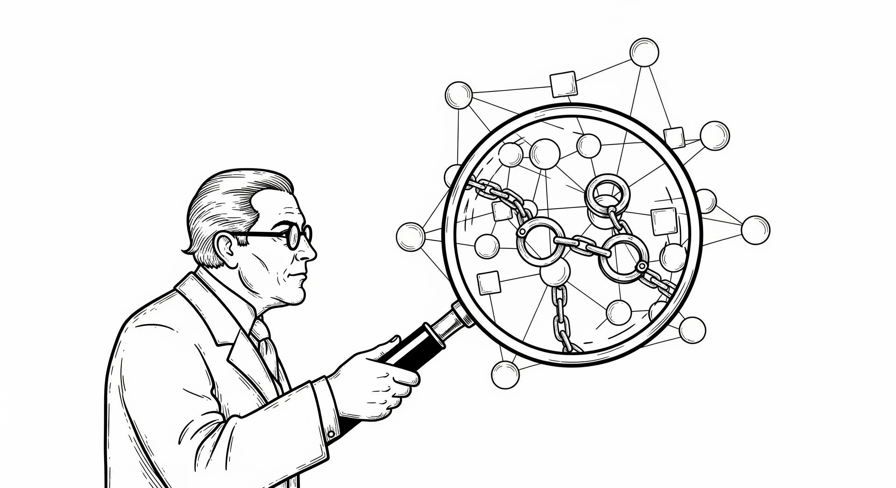

# 第二章 个人自由沦陷的原因与解决之道

> 技术并非中立；它给予的，必然会以另一种方式带走。
> -- 尼尔·波兹曼（Neil Postman） 《技术垄断：文化向技术投降》

人类从未像今天这样依赖信息系统：我们的通信、财富、身份，乃至最隐秘的思想，都被紧紧包裹在一层层数字界面与技术协议之中。我们曾天真地以为互联网将带来前所未有的解放，但现实却截然相反。这种深度的依赖并未带来更大的自主性；相反，技术的进步在极大赋能巨型机构的同时，也在系统性地剥夺个体的权利。当政府与商业巨头掌握了近乎无限的数据与算力，它们便拥有了定义身份、裁决信任以及控制通信与财产的上帝权限。而普通人，就像生活在数字化温室里的植物，在享受便利供养的同时，逐渐失去了在野外生存的能力，最终只能被动地接受、使用与服从。

本章旨在深入剖析个人自由在信息时代沦陷的成因与解决之道。我们将从两个层面展开探讨：显而易见的表象，与深藏其下的根源。这种层次化的剖析至关重要，只有看清表象背后的核心技术症结，我们才能精准切中要害。唯有如此，我们才能开出真正有效的技术解药，而非仅仅停留在制度与道德表面的缝补上。

在现象层面，个体在数字世界中已处于全然的被动地位，其权利面临着来自政府与科技巨头的双重挤压。这些庞然大物拥有近乎无限的资源来收集数据、训练算法、构建网络，以实现其管理控制或商业盈利的目的。在这个由巨头编织的宏大叙事中，个体逐渐沦为被支配的客体。这种支配具有四个明显的标志：数字身份被强行定义、通信隐私被彻底剥夺、个人财产被全面掌控，以及在信任关系中处于绝对被动。

探其根源，这本质上是一场不对称的技术战争。如果我们愿意拨开由法律条文与商业宣传编织的迷雾，从纯粹的技术视角审视现实，就会发现：个人自由沦陷的核心原因，并非仅仅是道德的滑坡或法律的缺位，而在于一场技术力量的极度失衡。这是一场手无寸铁的平民与全副武装的巨人之间的对决。在这个战场上，我们之所以节节败退，归根结底是因为个体在技术底层被彻底缴械。我们既不拥有处理信息的私有资产（算力、存储与网络），也缺乏自我保护的防御武器。

找准了病灶，便不难寻得技术的解药：夺回数字资产的所有权，并重新武装个人的防御能力。幸运的是，半个多世纪以来的信息技术大爆发，不仅让这种技术反击变得经济可行，其颠覆性的效果也将远超大多数人的想象。
