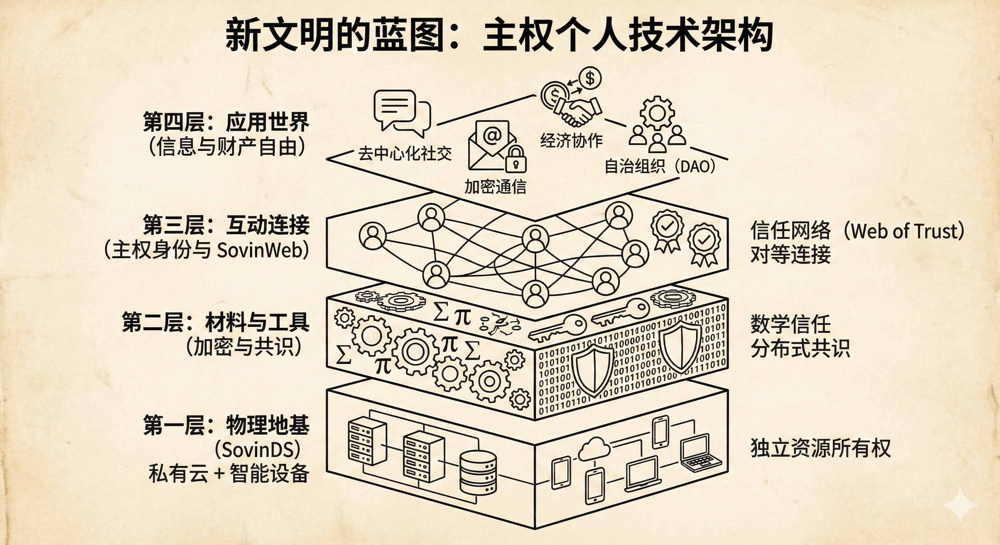

# 2-5 新文明的蓝图

为了挣脱信息时代的自由困境，实现文明形态的跃迁，我们必须从底层重构一套以个人主权为核心的新型数字架构。这套架构是未来数字社会运行的基础设施。我们可以将其想象为一个从物理地基、材料与工具、连接互动到顶层应用生态的四层完整支撑体系，每一层都精准对应并修复了我们目前面临的技术困境与权利沦陷。

这一文明体系的底层，是作为物理地基的主权个人数字系统 SovinDS（Sovereign Individual Digital System）。其核心要素包括后端的私有云计算节点与前端的智能交互设备。它直指我们在数字世界中数字资产缺失的根本病灶。在旧系统秩序下，尽管我们每天都在生产数据，但由于这些数据寄居在巨头的服务器上，个人实质上处于一种没有数字资产的状态。SovinDS 通过前后端的功能集成，让个体重新夺回了对数字资产的绝对控制权。私有云赋予了个体可靠、可扩展且持久在线的计算资源，让数据、程序与通信真正回归个人的物理掌控。通过实现数字资产的居者有其屋，个体从技术地基上终结了寄人篱下的不确定性，确立了数字主权的原点。

在稳固的地基之上的第二层，是加密与去中心化算法构成的支撑新文明的材料与工具。其构成包含了端到端加密、数字签名以及分布式共识算法等各种安全算法与合作协议。这一层正面回应了防御能力缺失带来的安全危机。在现有的互联网逻辑中，信任被中心化机构所劫持，个人在网络森林中几乎处于裸奔状态。通过引入这些新材料与工具，客观的数学逻辑取代了主观的机构官僚，成为唯一的绝对仲裁者。它为信息穿上了数学层面的防弹衣，让信任不再建立在对权威的被动信仰之上，而是建立在数学定理的确定性之上，从而为主权个人铸造了一面无法攻破的数字盾牌。

紧接着的第三层是主权个人身份与主权互联网 SovinWeb（Sovereign Individual Web）形成的连接互动层，主要由个体生成的独立自主身份 SSI（Self-Sovereign Identity）与许许多多属于个体的去中心化信任网络（Web of Trust）编织而成。这一层旨在彻底打破许可制生存的枷锁。在旧文明里，我们的数字身份是租来的，生存需要获得平台的特许。而通过自主生成的身份，个体能够彻底摆脱对机构账户的被动依附。基于信任网络构筑的 SovinWeb，让互联网从中心化控制的星形拓扑，回归为真正对等的去中心化网状经络，确保了信息的流动与信任的建立不再受制于商业巨头或行政门槛。

最终，这一架构的顶层是信息自由与财产自由的应用世界，具体表现为去中心化社交、加密通信、基于共识的数字货币（如比特币）应用、分布式对等交易以及自治组织等丰富形态。这是个人主权最直接的外在表达，将原本被官僚和商业系统异化的数字主权重新归还个体。在这里，自由不再是抽象的口号，而是可以被代码精准执行的日常实践。无论是社交互动、资产管理还是经济协作，都是这套主权根系自然繁衍出的自由生态。这种从物理地基到社会协作的全方位重构，正在催生一个前所未有的新物种：信息时代的主权个人。他们不仅是新文明的拓荒者，更是这片自由之境最核心的主人。

值得强调的是，SovinDS 及其互联而成的 SovinWeb 并非要凭空创造一个物理上的互联网，它们是在现有互联网基础设施上运行的叠加网络（Overlay Network）。叠加网络是指构建在现有物理底层网络之上的虚拟逻辑网络，它利用现有的互联网协议作为其数据传输的载体。这意味着，我们通过软件定义的方式，在现有的互联网平台上开辟出一片全新的、由逻辑主权定义的新大陆。这种架构允许主权个人在不脱离现代社会便利的同时，逐步实现权利的实质性迁移。

同时，SovinWeb 也不是对现有文明系统的全面替代，而是其必要的进化与补充。商业公司的信息平台在处理海量非主权信息、提供极致用户体验方面仍具有其独特优势；传统金融体系在提供安全信贷服务和社会保障方面也扮演着重要角色。新文明的崛起，旨在解决那些旧系统无法触及或正在腐蚀的领域：即关乎个体尊严、核心隐私与财富控制权的个人主权区域。在这种架构下，SovinWeb 的财产与金融应用将深度利用比特币（Bitcoin）生态作为其底层安全模型和价值锚点。比特币历经多年验证的、不可篡改的账本，为新文明的经济协作提供了提供了坚固的价值交换媒介。

这种共存而非取代的关系，正是新文明得以迅速萌芽的生命力所在。SovinWeb 在旧世界的缝隙中生长，利用旧世界的养分（现有的传输层和各种已有应用），却锻造出了一种完全不同的社会组织逻辑。它在保障稳定性的基础上，提供了一种拥有无限潜力的新文明蓝图：一个机构与个人各司其职、个体主权落实的多元共生图景。接下来的部分，我们将对新技术架构的各层进行概要拆解，为后面各章的详细介绍提供一个高层全景视图。
