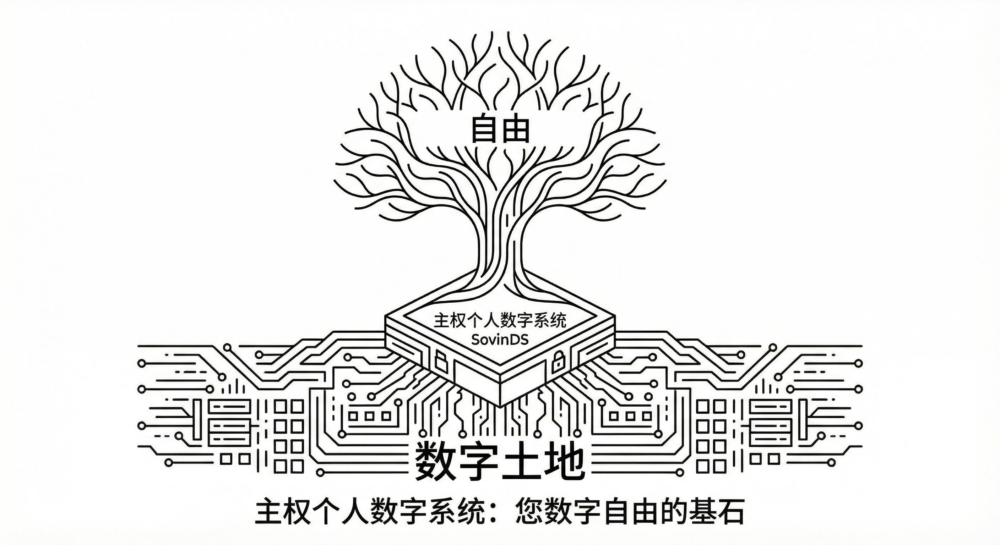

# 第三章 主权个人数字系统 SovinDS

> 正是因为生产资料和经济决策权分散在许多彼此独立的个人和组织手中，权力才无法集中到任何一个人或机构那里；而一旦这种分散被消除，自由也就随之消失。
> —— 哈耶克 《通往奴役之路》

新文明的物理地基，是主权个人数字系统 SovinDS（Sovereign Individual Digital System）。随着人类的工作与生活向数字世界全面迁徙，理解信息技术带来的算力平权及和其赋能的不可剥夺的个人权利，已成为觉醒的第一步。同时，唯有深刻意识到拥有一个持续在线的私有后端的必要性，个体才会真正去铸造并绝对掌控自己的数字资产。在此基础上，掌握 SovinDS 的底层构造与运作逻辑，将不再是极客的专属，而是每一位主权个人在信息时代安身立命的必备常识。
