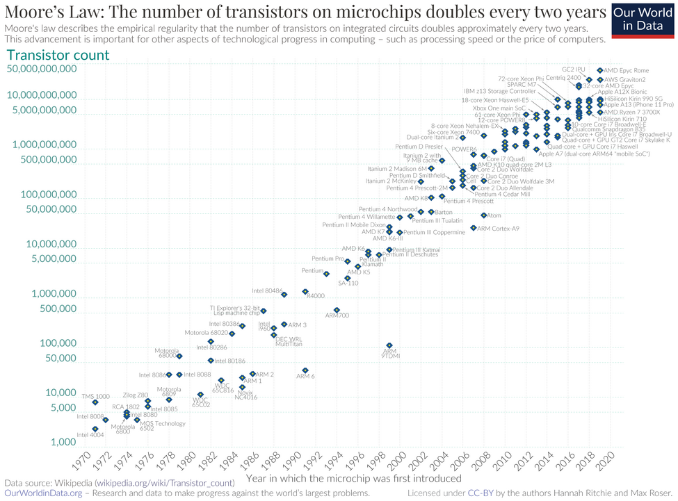

# 3-1 信息技术平权

个人自由不能仅仅是被动地祈求法律条文的保护，因为法律的制定权、解释权以及最终执行权，往往掌握在有着自身利益诉求的官僚机构手中。幸运的是，今天的信息技术已经足以赋能个人去建立一个可以独立安全运作的技术实体，从而保障自己的合法权益。正如工业时代的自由建立在对生产工具的掌握之上，数字时代的自由也必须锚定于对信息工具与数据资产的掌控。信息技术的飞速发展使得个人掌控数字资产成为可能。

最能体现信息技术进步的是著名的摩尔定律（Moore’s Law）。这一规律最早由英特尔公司联合创始人戈登·摩尔（Gordon Moore）于 1965 年提出。他通过长期的研发经验观察到集成电路上可容纳的晶体管数量大约每隔 18 至 24 个月就会翻一倍，而生产成本却能保持稳定甚至下降。在过去半个世纪中，摩尔定律不仅是一条技术经验曲线，更是揭示了推动现代文明进程的核心力量。芯片技术让计算能力的增长远远超越任何传统资源的扩张速度，信息的处理、存储与通信都呈现了长期的指数增长。在人类历史上，没有任何能源、材料或交通技术能以如此稳定的指数趋势持续演进数十年。这也带来了前所未有的现象：技术第一次以自我加速的方式推动社会演化。

[Source: Wikipedia]

上图给出了一块芯片上的晶体管数量，从 1970 年的 1000 多到 2020 年的 500 亿，增长了五千万倍。人类的直觉往往在应对线性增长时非常可靠，但在面对指数增长时却难以理解。为了理解摩尔定律在过去五十年里究竟制造了怎样的奇迹，我们可以从多个维度审视信息技术的力量。

首先是知识的承载量。古代最大的图书馆是位于古埃及的亚历山大图书馆，由托勒密王朝于公元前 3 世纪建立。它是古代世界最大和最重要的知识中心，收藏了大量的手稿，但最终毁于战火。根据估算，亚历山大图书馆约有 50 万卷藏书，折算成数字文本大约 16.5GB。2025 年发布的 iPhone 17 Pro Max 用 2TB 存储空间，能装下 120 个以上的亚历山大图书馆的文本量。一部口袋里的手机就能装下若干古文明的书海！

依照维基百科超级计算机历史数据 [History of supercomputing]，1999 年全球最快的超级计算机 Intel ASCI Red/9632 的性能约为 2.4 万亿次浮点运算。维基百科数据显示，苹果 iPhone 17 Pro 搭载的 [A19 Pro 芯片] 运算能力已达到每秒 2.5 万亿次浮点数运算，超过 1999 年全球最快超级计算机。换言之，如今一部智能手机的计算性能，已经超越了二十世纪末代表人类科技巅峰的超级计算机算力。如果物理世界的汽车工业也遵循这一规律，那么今天你只需要花费不到 1 美分就能买到一辆超音速法拉利，且一加仑汽油提供的能量足以绕地球行驶数百圈。这种近乎魔法的演进，让计算设备这一核心生产资料完成了从机构垄断向个体赋能的彻底转变。

与此同时，全球范围内的网络基础设施已将连接力推向了物理极限。从横跨大洋的海底光缆到覆盖城市乡村的 5G 基站集群，再到马斯克（Elon Musk）旗下的星链（Starlink）卫星系统，一个无处不在的数字经络已经将地球的每一个角落紧密连接在一起。以 iPhone 17 为例，它在微观尺度支持 NFC 与蓝牙近场通信，在宏观尺度通过蜂窝网络与 Wi-Fi 智能切换，而当个体置身于荒原或孤岛等传统网络盲区时，星链卫星的高速连接则确保了数字主权永不掉线。这一整套体系使高清视频、实时协作与大规模数据交互成为了普通人的日常体验。在这些遍布全球的数据加速与即时响应机制支撑下，个人设备能够以毫秒级延迟调动周边的计算资源，并自动选择最通畅的信息传输路径。这种从海底到太空的立体覆盖，让主权个人能够以前所未有的深度与速度，将自身数字资产接入全球数据洪流。

从经济的角度看，摩尔定律的深刻含义在于计算成本的指数级坍缩。这种持续数十年的技术红利，最终引发了社会资源分配的质变，将计算从一种极少数科研机构和超级大国才能供养的巨额资产，转化为了人人皆可负担的廉价基础能力。我们可以通过财务维度的对比清晰地观察到这一历史进程：1999 年全球最快的超级计算机 Intel ASCI Red 造价高达 4600 万美元，计入通货膨胀约折合今天的 8900 万美元，这无疑是个人甚至多数机构都无法奢望的天文数字。然而，二十五年后的今天，拥有同等甚至更强运算能力的 iPhone 17 Pro，其零售价仅约 1099 美元，差不多仅相当于美国普通劳动者约一周的工资收入。这种成本跨度的极度收缩，从根本上瓦解了数字世界的租佃制经济基础。当主权个人能够以极其低廉的价格获取曾经的顶级运算资源时，他便不再需要为了获取算力或存储而将隐私与数据典当给中心化巨头。更重要的是，除了硬件购置成本，运行私有系统的能源与维护支出也随着集成度的提升大幅下降，使得持有并运营一整套数字资产在经济上变得完全可持续且极具吸引力。这种算力平权标志着信息时代最核心的生产资料已经彻底回归个体。

这种生产关系的重构在人类文明史上早有回响。正如十八世纪爆发的工业革命，蒸汽机与随后的电力技术以前所未有的效率取代了繁重的体力劳动，从根本上动摇了奴隶制的经济逻辑。量化的数据最能说明这种冲击：一名壮年劳动力在持续工作时产生的功率大约只有 75 到 100 瓦特，而一台普通的一百马力电机所释放的能量，足以瞬间抵偿超过一千名壮年劳力的肉体产出。更具决定性的是能源成本的剪刀差：维持一名奴隶的基本生存（食物、住所与管束成本）即便在古代也是一笔不菲的开支；而今天，产生等同于一名成年劳动力全天连续工作十小时的体力能量，仅需消耗约一度电，其工业电费成本通常不到 0.15 美元。这种数百倍的成本差距，使得任何形式的人身奴役在经济账簿上都显得荒诞且低效。当冰冷的机器能以更低的成本、更高的稳定性提供这种跨越数量级的动力时，依靠剥削人身自由来换取生产力的旧模式不仅在道德上破产，在经济上也失去了存在的必要。技术进步通过提供更廉价、更高效的替代方案，完成了单纯依靠道德呼吁难以实现的社会变革。如今，算力对数字劳作的覆盖，正如同当年的机械能对肌肉力量的替代，它正将人类从中心化平台的“数字劳役”中解脱出来，开启了一场基于硅基算力的个体解放。

硬件性能的飞跃只是序曲，真正赋予硬件主权灵魂的是配套软件技术的代际突破。在过去十年中，曾经专属于大型互联网公司的分布式架构、容器化技术与高级加密算法，已经通过全球开源社区的协作成为了普通人随手可得的技术资源。容器化技术（如 Docker）彻底改变了应用程序的部署逻辑。简单来说，它就像是为软件打造了标准化、全封闭的数字集装箱，将复杂的运行环境、系统配置和程序代码一并打包。这种封装方式消除了不同设备间的兼容性障碍，确保应用在个人服务器上能像在专业机房里一样稳定运行。这意味着普通用户只需在自己的系统上一键点击，即可部署各类复杂应用，极大地降低了个人维护数字系统的技术门槛与运维成本，而稳健性却直逼商业数据中心。

更具划时代意义的是各种去中心化协议与本地化人工智能（Local AI）的普及。现代加密协议确保了数据在产生源头即被封锁，而分布式存储则让信息不再依赖任何单一节点的存亡。随着具备强大神经网络处理能力的芯片普及，原本必须在巨头服务器端运行的大语言模型，现在可以完全在本地部署。这意味着个人第一次拥有了不被窥探的数字大脑，人工智能不再是监控个体的间谍，而是严守主权边界、完全忠于个人的数字管家。这种算力平权与软件自治的交汇，让个人从数字世界的租客正式晋升为拥有完整领土、自主算法与独立智慧的技术主体。

## 参考资料

[Source: Wikipedia]: <https://en.wikipedia.org/wiki/Moore%27s_law>
[History of supercomputing]: <https://en.wikipedia.org/wiki/History_of_supercomputing>
[A19 Pro 芯片]: <https://en.wikipedia.org/wiki/Apple_A19>
