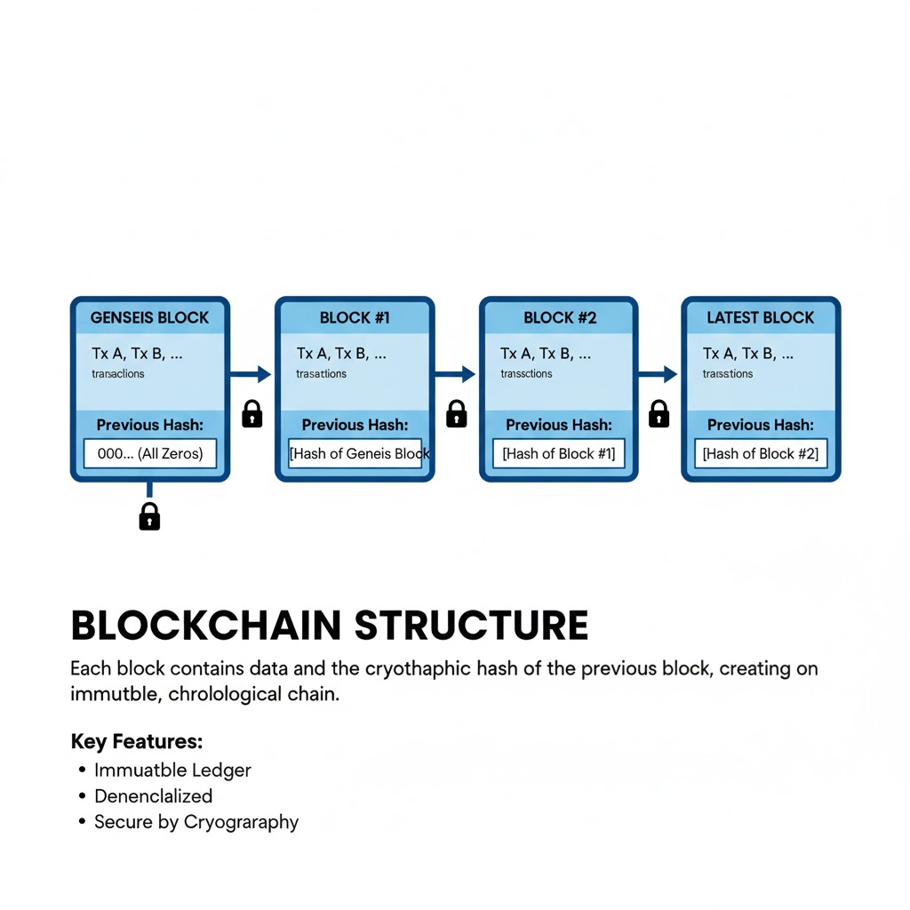
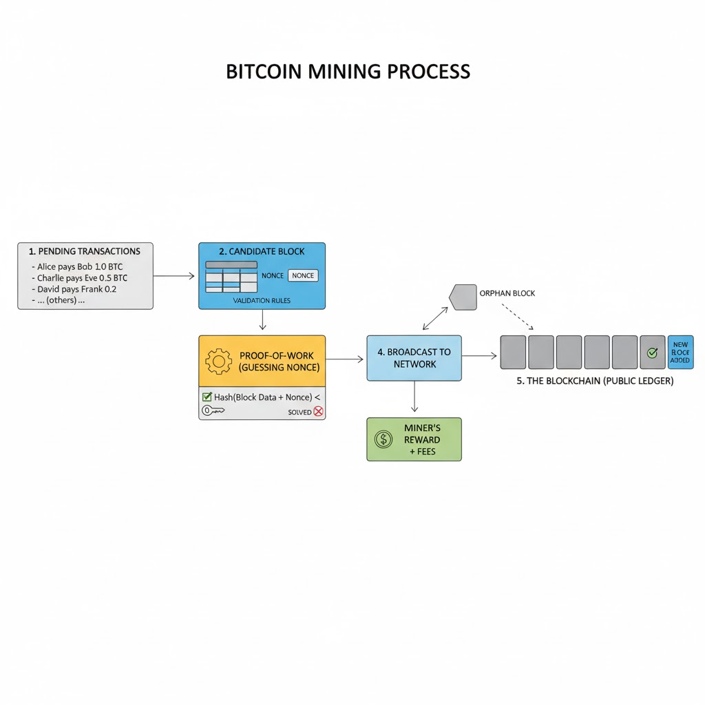

# 6-6 比特币如何运作

抛开技术细节，比特币的运作机制其实相当简单。因为实际生活中，货币的功能和信任谁这些概念早已成为人们的基本常识。比特币只不过是在数字世界里更合理而自然地实现这些已有概念。不妨将比特币看成是雅浦岛莱石货币的一个高仿数字模型。

## 1 公共账本

人们习惯于用加密算法、哈希值或去分布式系统等复杂的科技术语来包装它，但比特币最根本的创新是成功地构建了一个全球公共账本。这种创新可以追溯到雅浦岛莱石货币。与那些笨重的莱石币在人脑中的记录一样，比特币的精髓是其透明、共享且不可篡改的价值所有权数字账本。在雅浦岛，当村民进行支付时，他们并不移动数吨重的巨石，而是通过整个社区的大脑共识更新来宣告所有权的转移。比特币正是这种古老、朴素传统的数字化继承者。它并非简单的电子硬币，而是一个在数万个网络节点中一致更新的公共帐本。这种从私有账本（银行维护）向公共账本（全网验证）的转变，是个人主权货币的根本基石：如果每个人都能记账、每个人都能查账，那么任何权威机构都无法在暗处篡改历史或捏造资产。

由于数字信息极易被无损且无限量地复制，所有数字货币都面临一个致命挑战：双重支付。传统的解决方法是引入一个中心化的中间人（如银行）来维护私有账本并验证真伪。而比特币则通过分布式账本（Distributed Ledger）机制，在无需任何第三方信任的前提下解决了这一难题。这里的分布式意味着网络中的每个节点并非只掌握账本的碎片，而是各自拥有一份完整的、一模一样的账本副本。这就像雅浦岛的每一位村民都在头脑里携带一个记录着全岛莱石变动的小本子，每当发生新的交易，全村人都会聚在一起确认并同步更新自己的本子。这种高度冗余和公开透明的设计，确保了任何虚假的账目变更都会立刻被全网识破，从而为价值共识打下了最稳固的地基。

### 1.1 独立开放账户

比特币承诺的个人货币主权，首先体现在其账户体系的彻底独立与开放性上。不同于传统银行需要身份验证、填写繁琐表格并等待审批，比特币账户的本质仅仅是一对基于数学定理生成的钥匙对：公钥和私钥。比特币账户是公钥经过哈希运算后的结果，这种单向加密不仅缩短了地址长度，还通过哈希不可逆性为你的原始公钥增加了一道安全护盾。从普通用户的视角来看，使用开源软件在普通的电脑或智能手机上立刻就能独立生成自己的比特币账户，无需向任何政府或机构申请。

比特币网络里的账户是完全开放的，也就是无须准入（Permissionless）的。这意味着世界上任何人，无论其国籍、信用评分还是法律身份，都可以立即创建一个地址来接收全球资产。在这个民主化的网络里，唯一的入场券就是你对私钥的掌控，它是你在数学层面对财富所有权的终极证明。这种优雅的设计确保了系统不仅全球可访问，且具备极强的抗审查性：只要你能守住那串秘密字符，就没有任何权威能够剥夺你使用这个网络的权利。

### 1.2 交易

在比特币的世界里，交易的本质是所有权的重新分配。由于公共账本详尽记录了从创世区块以来的每一笔资金动向，因此任何一个地址中的数额都是可被全网回溯并验证的。当你发起一笔交易时，你实际上是在向全球节点网络广播一条带有你数字签名的指令：“我决定将之前收到的某些比特币，重新分配给以下这些新的接收地址”。这种设计允许你在一笔交易中同时处理复杂的业务需求，比如同时向两个不同的商家付款，并将剩余的金额（找零）退回到你控制的一个新地址中。

为了维持这个庞大账本的持续运行，每笔交易都需要包含一份小额的手续费。这份费用并非支付给某个中心公司，而是作为奖励提供给那些通过消耗资源来验证并记录你交易的节点。用户可以根据自己对确认速度的需求灵活调整费用水平：如果你急于完成支付，支付较高的费用将使你的交易在全网待办清单中获得优先处理权。本质上，比特币交易是一种公开的、受密码学保护的权利声明，它在定义财富转移的同时，也通过市场化的费用激励机制，确保了整个网络的去中心化运营。

### 1.3 未花费交易输出（UTXO）

为了彻底根除双重支付并确保账本的稳健性，比特币并没有采用我们熟悉的账户余额模型，而是基于一种名为未花费交易输出 UTXO（Unspent Transaction Output）的会计体系。这个术语听起来很专业，但它的逻辑其实很简单：在比特币网络中，你的钱包里并没有一个存储总数的罐子，你的余额实际上是你当前所有尚未花费出去的交易收据的总和。

举例来说，如果你拥有 0.5 个比特币，这意味着别人转到你账户的所有未花费的余额之和是 0.5 个比特币。别人之前付给你的钱是那些交易的输出（Transaction Output）：比如一笔 0.1 BTC，一笔 0.15 BTC 和一笔 0.25 BTC 的收入。你没有动用的这些钱就是 UTXO。

当你决定花费这些钱时，你必须像融化旧金币一样，将这些特定的 UTXO 彻底消耗掉，然后重新铸造成新的 UTXO 分配给接收方。一旦某个 UTXO 被使用，它就永远在账本中标记为已花费，从此失效。这种模型提供了极致的会计清晰度，因为网络中的每一笔金额都可以清晰地追溯到其诞生的一刻，彻底消除了所有权状态的任何歧义。

### 1.4 交易构建：输入、输出和找零

一笔典型的比特币交易是由现有的 UTXO 作为输入构建而成的。要动用这些资金，你必须提供解锁这些收据的数字签名。这里有一个基本规则：所有输入的总价值必须大于或等于你打算支付的金额，其差额即为给矿工的手续费。

由于作为输入的每个 UTXO 都必须被一次性全额销毁，因此对于你不想支付给对方的余额，你必须显式地创建一个发回给自己的找零输出。为了保护隐私，有经验的用户通常会将这笔找零发送到一个全新生成的地址，从而模糊自己的财富分布。整个过程遵循严密的会计恒等式：你消耗的旧输入，必须精确地等于你创建的新输出：给对方的钱 + 给自己的找零 + 留给网络的交易手续费。

中本聪之所以放弃传统的余额账户，而选择 UTXO 模型，主要是为了实现极简的验证逻辑与深度的隐私保护。一方面，在 UTXO 机制下，系统无需进行复杂的加减法来维护全局账户余额，只需查验单笔数字收据是否处于“未花费”状态就可操作，这让防范双重支付变得极其简单高效。另一方面，由于找零机制和输出账户结构天然鼓励用户每次交易都生成全新账户地址来接收资金，避免了使用单一账户容易被追踪全部资产和流水的风险，从而为个人主权财富提供了极强的隐私屏障。

### 1.5 手续费

交易的最后一个组成部分是交易手续费。该手续费并非指定的输出，而是剩余价值：输入金额的总和减去所有显式输出（接收方和找零）的总和。这部分剩余金额故意不予分配，由成功验证包含该交易的比特币网络矿工节点收取，作为通过工作量证明机制保障网络安全的经济激励。

因为矿工会优先处理有较高交易费的交易，发送方通过管理输入和输出之间的差异来设定其有效手续费率，进而影响交易确认的速度。

## 2 区块与区块的链

### 2.1 区块

比特币网络由数万个节点构成，所有的交易需要发送到所有节点并且最后需要统一确认其有效性与一致性，因此不可能一笔一笔处理交易。区块（block）存在的主要目的是为了通过批量处理提高效率和安全性。它并非将每笔交易立即添加到公共账本（这样做会造成混乱且消耗大量资源），而是将交易打包成一个单一的、统一的数据结构，即区块。区块是比特币网络数据存储与验证的基本单位。

块基交易（Coinbase Transaction）是每个比特币区块中的第一笔交易。块基交易至关重要，因为它是新比特币进入流通供应的唯一方式。与其他所有消耗现有未花费交易输出 (UTXO) 作为输入的交易不同，块基交易没有输入。相反，它承担着两个关键功能：区块奖励与区块标识。区块奖励由区块补贴与交易手续费两部分组成。区块补贴是新铸造的比特币，初始数量为 50 BTC，大约每四年减半。这是所有新比特币的来源。交易手续费则是该特定区块中包含的所有交易支付的手续费的总和。成功解决工作量证明难题的矿工节点可以创建此交易，并将总奖励（补贴 + 手续费）作为输出发送到他们选择的比特币地址。

区块标识是块基交易的输入字段，用于存储网络节点选择的任意数据。节点有时会使用此字段公开标识自身，或者在历史上，用于嵌入简短消息或时间戳。

### 2.2 区块的链

比特币的巨大成功催生了一个无处不在却又常被误解的术语：区块链（blockchain）。讽刺的是，中本聪最初发布的九页白皮书《比特币：点对点电子现金系统》中，从未出现过区块链这个单一而又意义深远的词汇。相反，中本聪选择了一种功能性的描述：区块的链（chain of blocks）。中本聪刻意选择强调功能而非抽象概念，重点放在了技术流程上：区块是经过验证的数据单元，而链则是防止双重支付并确保时间顺序的加密连接。

这种功能描述对于比特币的理念至关重要，因为它将人们的注意力引向工作量证明（PoW）机制和最长链规则，这些机制是实现共识的保障。早期，比特币协议被视为一种基于时间链或分布式公共账本的数字现金技术创新，这种说法将这项发明定义为货币领域的突破，而链结构仅仅作为货币的安全机制。

区块链的英文“blockchain”作为单独的名词发生在后期，主要是因为企业和金融机构试图在不接受比特币激进的政治和货币原则的情况下，想利用其底层的分布式账本技术做更多应用。在比特币证明了分布式账本技术的稳健性之后，企业界产生了一种错觉，开始尝试将其应用于供应链管理、投票系统等领域，这其实是对其底层逻辑的一种严重误用。后面会详细讨论这个话题。

此处用”区块的链“表达链式数据结构的中本聪本意。区块是批量存储交易的容器，而链是连接这些区块的组织方式，旨在无需依赖中央管理者即可保证记录所有交易的账本的完整性和永久性。链结构的主要目的是创建一个完整、可验证且不易篡改的历史。

每个新区块一旦经过验证并添加到网络中，其头部就包含一个关键信息：紧邻其前一个区块的加密哈希值。该哈希值是一个独特的数字指纹，源自前一个区块的所有数据。如果前一个区块（或其中的任何交易）中的任何一个字符发生更改，其哈希值将完全改变。因此，当前区块头部存储的哈希值将不再与前一个区块的哈希值匹配，从而立即使整个后续链失效。

这便形成了一种数字化的链条：每个区块都锁定了其之前所有区块的时间顺序和交易历史记录。在区块的链末尾添加一个新的有效区块相对比较容易，但重写历史（即试图通过重组区块来撤销现有交易）则是一项几乎不可能完成的任务。

如果攻击者试图篡改五年前的一笔交易，他们必须先成功重新计算出该旧区块的正确哈希值，然后重新计算出此后添加的每一个区块的有效哈希值。由于系统的工作量证明安全机制（后面会介绍），重建不仅要消耗巨额成本，还要在算力上超越全网的诚实节点，这在计算上是几乎是不可能的（或者说过于昂贵）。

由于链的重建成本极其巨大，区块的链成为一个仅可追加的账本。它通过一条耗费巨大物理能量加固的加密证明链，将网络中的每一笔交易都追溯到第一个创世区块，从而建立了一条全球认可且不可更改的所有权时间线。

### 2.3 创世区块 The Genesis Block

创世区块是比特币区块的链的第一个区块，由中本聪于 2009 年 1 月 3 日创建，它确立了整个货币体系的核心参数和交易区块结构等基本规则。

创世区块在技术上是独一无二的，因为它是区块的链中唯一一个不引用前一个区块的区块。每个后续区块都使用前一个区块的哈希值链接回其父区块，但创世区块的前一个区块哈希值字段则填充为零。这使创世区块成为了一个永恒不变的锚点，所有后续历史和未来的工作量证明安全机制都由此衍生而来。

尽管该区块包含了首笔块基交易产生的最初 50 个比特币矿工奖励，但由于代码中的一个缺陷（是的，中本聪也会犯错），这些原始比特币永久无法使用，仅作为区块创建的证明，从未进入流通。

## 3 比特币的共识机制：工作量证明 PoW（Proof of Work）

货币的本质是价值共识，所以比特币的运行逻辑完全建立在共识机制之上。这不仅仅是一套精妙的密码学算法，更是一场利用博弈论构建的经济大戏。它确保了全球数以万计、互不相识甚至互不信任的参与者（节点），能够对交易历史的唯一正确版本达成绝对一致。通过工作量证明 PoW（Proof of Work），比特币在无需中央仲裁的情况下，完美解决了三大难题：验证新交易的真伪、定义账本更新的节奏，以及构建一道坚不可摧的防线。本质上，这是一套以物理代价换取数字信任的精密程序，它让诚实成为了系统内最有利可图的选择，从而在混沌的网络世界中锚定了一个唯一的、不可篡改的现实。

### 3.1 节点和矿工

比特币网络的安全性由两种截然不同但又相互制衡的角色共同维系：节点和矿工。节点是网络的全天候守望者，任何运行比特币完整软件并下载了全量账本复本的计算机都可以成为节点。它们是规则的铁面执行者：验证每笔交易的签名是否合法、检查 UTXO 是否是双重支付、确认提议的区块是否符合协议。如果矿工试图递交一个违背规则的区块，分布在全球的节点会瞬间将其拒绝并拉黑。这意味着，在比特币的世界里，即便你拥有再强的算力，也无法强迫网络接受不合规的假账错帐。

相比之下，矿工则是网络中主动破壁的劳动力。作为特殊节点，矿工不仅要验证规则，还必须承担起最沉重的任务：执行工作量证明。他们将收集到的验证交易打包成候选区块，然后投身于一场耗资巨大的暴力哈希竞赛中。矿工的动力源自纯粹的经济激励，通过区块奖励（新币补贴与手续费）获取报酬。

这种设计将矿工的个人逐利行为与全网的安全防御完美绑定：为了拿到奖励，矿工必须投入能源；而为了确保拿到的奖励有价值，矿工必须维护这个账本的诚实与稳定。这种利益共生的结构，是比特币的合作与技术基石。

### 3.2 区块验证

在比特币的流程中，一个新区块从提议到被全网接纳，必须经过一系列堪称严苛的数字安检。矿工在生成区块时，深知全世界的节点都在屏息凝视，任何细微的违规都会导致其投入的巨大电力付之东流。

首先是语法与格式的有效性检查，确保区块符合协议的通信标准；其次是交易的审计，确保区块内的每一笔资金流向都清晰可溯、签名无误且未被二次花费。最关键的验证点在于工作量证明的合规性以及金额的限制。系统通过块基交易（Coinbase）严格锁定了矿工的奖励上限，任何试图私自多领工资的行为都会导致整个区块被全网废弃。此外，新区块必须在头部完美链接前一个区块的指纹，形成一条不可断裂的时间证据。这种多维度的交叉验证机制，确保了比特币网络在处理每秒数以千计的信息时，依然能维持如精密机械般的准确性。

### 3.3 工作量证明流程

工作量证明（PoW）的核心是一场资源密集型的竞赛，通常被称为挖矿。你可以将 PoW 想象成一场全天候、全球规模的数字印章竞猜。为了赢得记账权，全世界的矿工需要竞争寻找一个极其罕见的哈希值，这个指纹必须满足特定的数学难度。为了生成这串指纹，矿工会将区块内所有的交易内容，连同一个不断尝试的随机数（称为 Nonce），一起投入 SHA-256 哈希函数进行运算。

这种数学难度体现在哈希值开头的“0”的个数。由于哈希算法的单向性和不可预测性，没有任何数学捷径可以推算出什么样的随机数加上区块内容能产生指定个数的“0”开头的指纹。矿工们唯一的办法就是不断改变随机数的值，然后不停地计算哈希值直到满足要求。这就像是在一座巨大的沙漠中寻找一粒特定形状的沙子，除了一粒一粒检查，没有任何公式可以帮忙。

这种难度并不是固定不变的，而是比特币网络的一套核心自我调节机制。随着全球算力的波动，比如有更多矿机加入竞争，或者芯片技术迭代导致算力飞跃，找到正确哈希值的理论速度会加快。为了维持大约每十分钟产生一个区块的心跳频率，比特币协议会自动调整门槛：如果过去一段时间区块产生得太快，系统就会增加开头所需“0”的个数，这使得难度加大，让中奖概率呈指数级下降；反之，则减少“0”的个数降低难度从而更快完成工作。这种动态调整确保了无论算力如何膨胀，这道数学屏障始终维持着恒定的时间跨度，将瞬息万变的技术竞争转化为了一种可预测、极具韧性的文明节律。

而 PoW 的精妙之处在于一种极度不对称的成本结构：寻找正确答案的过程是大海捞针，需要全世界成千上万台矿机消耗海量的电力和算力；但验证过程却极其轻盈。其他验证者只需将矿工提供的那个关键数字（Nonce）代入公式，进行一次哈希运算，就能在毫秒间确认真相。这意味着，即使你没有昂贵的专业矿机，仅凭手边一部普通的智能手机或家用电脑，也能瞬间化身为数字世界的审计员，不依赖任何人的承诺而独立验证全网账本的真实性。

这种生产极其昂贵、验证近乎免费的特性，彻底瓦解了中心化权力对真相的垄断，让每一个主权个人都能以极低的门槛站稳在事实的底座之上，确立了比特币作为全球主权账本的公正性与坚固度。

### 3.4 冲突解决：最长链规则

由于全球网络存在传输延迟，偶尔会出现两名矿工几乎同时解出题目并广播区块的情况。这会导致区块的链出现临时的分叉，网络进入一种短暂的徘徊状态。为了解决这种冲突，比特币引入了优雅的最长链原则，或者更准确地说，是累计工作量证明最多的规则。

当节点面临两条竞争的链时，它会采取中立立场，暂时维持多条链的现状，并等待下一个区块的诞生。矿工们通常会选择在自己最先接收到的那个版本上继续挖掘。一旦下一个区块在其中一条链上被成功附加，这条链就积累了更高的计算能量，成为了全网公认的最长链。此时，所有诚实的节点都会瞬间达成共识，转向这条包含更多工作量的新区块的链，而另一条较短链上的区块则会变成孤儿区块被遗弃。

这种竞争机制确保了整个网络最终总能收敛到单一、全球公认的交易历史。在比特币的世界里，真理不取决于谁的声音大，而取决于谁做了最大量的真实物理劳动。
