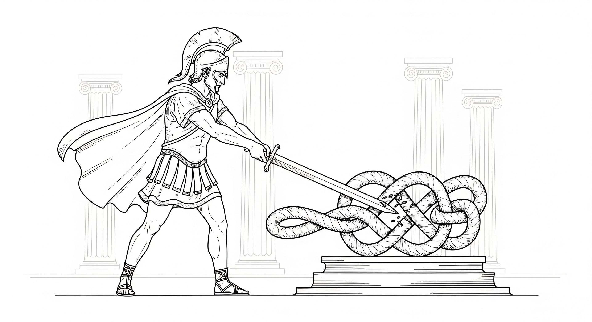

# 个人自由的戈尔迪之结

>在当前的危机中，政府不是解决问题的办法；政府本身就是问题所在。
> --- 罗纳德·里根（Ronald Reagan）1981 年美国总统就职演说

古希腊传说往往在引人入胜的情节中包裹着人类文明的内涵。其中，小亚细亚弗里吉亚王国关于“人为系统困境”的叙事，便是一个极具洞察力的深刻隐喻。农夫戈尔迪正于田间驱赶牛车劳作，一只雄鹰却突然飞来并伫立于他的车轭上，久久不肯离去。他认为这是神迹，便赶着牛车前往神庙寻求指引，途中偶遇了一位睿智的女祭司并求婚成功。此时，弗里吉亚王国因老王绝嗣而陷入动荡，神谕宣称：下一任国王将乘牛车而来。当戈尔迪与女祭司驾车进城时，民众随即拥戴他为王。为了感恩，戈尔迪将这辆改变命运的牛车献祭给神灵。为了防止牛车被窃，他用绳索在车轴上系下一个错综复杂的死结，这便是历史上著名的“戈尔迪之结”（Gordian Knot）。这个结盘根错节，既找不到绳头，也看不见终点。之后神谕宣称谁能解开它，谁就将成为亚洲之王。几个世纪以来，无数自负的智者和强壮的武士试图理清其中的脉络，却都铩羽而归。直到公元前 333 年，年轻的亚历山大大帝站在了这个死结面前。面对这个看似无解的难题，他沉思片刻，做了一件令所有人瞠目结舌的事：他没有试图去寻找绳头，而是拔出腰间的佩剑，一剑斩断了绳结。亚历山大以一种近乎野蛮的直白，昭示了一个冷峻的事实：在第一性的物理定律面前，任何人造的复杂逻辑或主观设定的层累枷锁，都不过是一触即破的幻象。

这个古老的故事，正是我们今天数字世界处境的完美隐喻。在 21 世纪，作为一个普通的互联网用户，你正面对着一个现代版的“戈尔迪之结”。这个结由隐形的算法、晦涩的服务条款、无孔不入的监控网络以及庞大的官僚体系编织而成，它在安全与便利的糖衣下悄然收紧，让我们在不知不觉中失去了作为独立个体最宝贵的个人自由。传统的文明防御机制——无论是纸面上的法律条文，还是机构的道德自律——都正在系统性地失效。

人类文明经过了数千年的血腥洗礼，在付出了无数生命与自由的惨痛代价后，才终于达成了一个脆弱的共识：个人自由是文明的基石与发展的动力。作为这一难得共识的具体体现，绝大多数现代国家都签署了联合国的《世界人权宣言》，庄严承诺“私生活不得任意干涉”与“财产不得任意剥夺”。然而，历史的残酷讽刺在于：那些在纸面上签下名字的权力中心，往往正是现实中最积极、最有力的破坏者。当个体面对资源无限的商业巨头或拥有核武器的超级国家时，力量的悬殊让这些神圣的“权利”往往变成了一种奢侈的幻觉。尽管我们对“理论脱离实际”早有心理准备，但现实运行的荒诞逻辑，往往比任何悲观的预测都更加令人触目惊心。

## 1 从费米的大衣到斯诺登的裸奔

为了理解这个死结是如何越系越紧的，我们需要回望历史，看一看对个人自由的剥夺是如何进化的。1938 年，诺贝尔奖得主、物理学家恩里科·费米（Enrico Fermi）发现自己陷入了绝境：墨索里尼的法西斯政权颁布了排犹法案，为了保护犹太裔妻子，他必须逃离意大利，但他面临着严苛的财产管制——他拥有的里拉属于“国家”，他可以走，但只能带少量钱离境。面对这种物理层面的暴政，费米做了一个极其“物理”的决定，他购买了昂贵的貂皮大衣，借着前往斯德哥尔摩领取诺贝尔奖的机会，实际上是把尽可能多的财富“穿”在了身上带往美国。在那个时代，暴政的边界是有形的，也是有缝隙的，只要你越过那条边境线，你就自由了。

然而，七十五年后，另一位逃亡者爱德华·斯诺登（Edward Snowden）发现自己处在一个完全不同的世界。2013 年，当斯诺登揭露美国国家安全局（NSA）违宪的全球监控计划时，他并没有大衣可以穿，因为他面对的不再是边境线上的卫兵，而是一个数字化的全景监狱。当他逃离美国后，惩罚以光速降临：美国的司法机构只需让人在金融网络中敲下一串代码，他的银行账户就被冻结，书稿版税被没收，甚至连支持者试图通过 PayPal 转账的捐款也会被瞬间拦截。这极具讽刺意味：作为《世界人权宣言》的主要起草国与推行者，美国在面对所谓的“国家安全”威胁时，以前所未有的效率撕碎了它向世界兜售的自由契约。

费米的故事揭示了旧世界的局限：对个人的剥夺曾受制于时空与物质；而斯诺登的故事则照亮了当下的真相：在高度数字化的今天，剥夺是流动的、实时的、无远弗届的。我们不再拥有“穿在身上的财富”，多数资产只是服务器里的一些文本和数字；我们不再拥有“私密的耳语”，通信只是日志里的几条轨迹。如果说费米是在与具体的卫兵周旋，那么斯诺登面对的则是无形的数字世界牢笼——一种连接被彻底切断、存在被强行抹除的窒息感。这正是现代版的戈尔迪之结：绳索已化作数据与代码，你看不见它，却动弹不得。

## 2 贪婪的领主与数字佃农

在这团盘根错节的“人为系统困境”中，编织死结的第一股力量来自那些掌控着信息基础设施的科技巨头。在公共话语中，我们被赋予了一个听起来极具主权色彩的称谓——“用户”。这个词带有某种消费主义的温情，暗示我们是拥有选择权的上帝。然而，一旦解码那层由法律术语编织的、温情脉脉的用户协议，你会发现一个冷酷的真相：我们并非上帝，而是中世纪式的“数字佃农”。我们在巨头们开垦的数字土地上辛勤耕作，贡献着数据与注意力，而领主们则挥舞着“信息控制”与“金融特权”这两把隐形的镰刀，悄无声息地收割着每一份产出。

### 2.1 信息的围猎：从所有权到传播权的全面篡夺

科技商业公司在信息的“所有权”与“传播权”两个维度上，将个体主权彻底绞杀。

在所有权层面，我们正在经历一场人类史上规模最大的知识产权剥夺。你在社交媒体上分享的每一张生活快照，在深夜写下的每一行感悟，甚至在验证码中为了证明自己是人类而标记的每一辆汽车，都在沦为科技巨头训练其 AI 模型的免费燃料。那些动辄数万字、从未被仔细阅读过的《服务条款》（ToS），本质上是一份现代版的“卖身契”：它在法律的名义下玩弄文字游戏——你保留了名义上的著作权，却不得不授予平台“永久、不可撤销、全球性且可转让”的商业使用权。换言之，你每天都在倾尽心血，免费喂养那个终将监视并取代你的数字怪兽。

在传播权层面，控制往往以极其隐晦的形式发生。最典型的例子便是所谓的“影子封禁（Shadow Banning）”。这是指在社交媒体上，言论自由（Freedom of Speech）和触达自由（Freedom of Reach）被算法彻底割裂了。你依然可以说你想说的话，但是系统不会给你发送违规通知，你也不会看到发送失败的信号。在算法的幽暗后台，你的权重被悄悄调低至零。你的声音被从公共广场和粉丝的时间线上抹去，你就像被关进了一个透明的隔音玻璃房，你在里面声嘶力竭地呐喊，外面的人流依然熙熙攘攘，却听不到你的声音。这不仅是技术的屏障，更是一种心理层面的“煤气灯效应（Gaslighting）”。这个词源于一部经典电影，描述操纵者通过扭曲受害者的现实感，使其最终怀疑自己的神智。在数字世界，这种效应表现为一种隐蔽的认知操纵：由于看不见栅栏，你无法将这种沉默归咎于审查，于是你开始自我怀疑——你认为是自己的观点失去了价值，或是被世界遗忘了。你很难意识到，你对自己思想价值的丧失感，仅仅源于后台管理员悄悄地屏蔽了你发出的信息。

与此同时，算法并不在乎事实与道德，它只在乎“参与度”。愤怒、分裂和极端情绪是最好的流量燃料。因此，算法会刻意放大那些让你焦虑的信息，构建一个个完美的“信息茧房”。这本质上是一种隐形的数字封建制。在商业巨头的领地上，作为“数字佃农”的我们，既不拥有数据的所有权，也不拥有连接的支配权。在没有“土地”的地方，谈何生根立命的自由？

### 2.2 金融特权：被操纵的物理规则

如果说信息控制是在无形中操纵你的认知，那么金融特权则是直接扼住个人用户生存命脉的枷锁。现代金融体系常常被描绘成一种中立的公用设施，如同水和电一般。但实际上，它是一个等级森严的特许经营系统。在这个系统里，合规成本（Compliance Cost）和特许牌照（License）构成了高不可攀的护城河。这不再是关于谁的用户体验更好，而是关于谁付得起那张昂贵的“入场券”。

政府通过颁发极其有限的金融牌照，将“铸币权”与“信贷分配权”下放给极少数大型金融机构。作为交换，这些机构充当了政府监管的代理人。这种“政商共谋”的结构导致了双重的恶果：效率低下与权力寻租。首先，为了维持垄断地位，金融机构利用“反洗钱”（AML）和“了解你的客户”（KYC）等合规要求，构建了极其繁琐且昂贵的准入壁垒。对于普通创业者或小微企业，开立一个跨国账户往往需要数月的审核与高昂的律师费，而对于那些拥有特权的巨头，这不过是例行公事。这种机制不仅扼杀了创新，更让金融服务维持着令人发指的低效——在信息以光速传播的今天，一笔跨境汇款依然需要数天才能到账，且费用高昂。这并非技术瓶颈，而是因为每一个中间环节都要收取“买路钱”（合规费）。

其次，这种特权赋予了机构操纵市场的“上帝权限”。你以为股市是公平博弈的场所，其实你只是被收割的数字。以 2021 年初的“游戏驿站（GameStop）”事件为例，当一群散户在 Reddit 上集结，试图通过买入股票来对抗华尔街空头机构时，他们天真地以为这不仅是一场金钱的博弈，更是一场庶民的起义。然而，交易平台 Robinhood 虽然打着“金融民主化”的旗号，其核心商业模式却是“订单流支付（PFOF）”——即将用户的交易指令打包卖给像 Citadel 这样的高频交易巨头。这意味着，在你的交易指令到达交易所之前，华尔街的巨鲨们已经先看到了你的底牌，并利用毫秒级的时间差进行套利。更令人绝望的是，当散户的攻势即将击穿投机商的防线时，Robinhood 突然“拔网线”，以保证金要求为名禁止用户买入，只准卖出。这不仅仅是一次技术干预，这是一次赤裸裸的降维打击：当用户即将赢得比赛时，庄家直接修改了物理规则。

更令人恐惧的是金融基础设施的“守门人”权力。PayPal、Visa 和 Stripe 等支付巨头已经成为了事实上的道德警察。他们可以因为某些内容“不符合社区标准”——无论这些内容是否合法——而随意切断独立创作者、维基解密（WikiLeaks）甚至合法书店的资金通道。在这种体系下，你的钱不是你的私有财产，而是你被暂时允许持有的“信用积分”。金融机构既享受着“大而不能倒”的政府隐性担保，在危机时刻由纳税人买单，又在日常运营中扮演着严苛的审查者，随时可以冻结普通人的生存资源。这种特权与控制的结合，正是现代金融绞索的本质。

## 3 自负的利维坦

编织死结的第二股力量，也是更强大的一股，来自国家机器。。在政治哲学中，它有一个令人敬畏的名字——利维坦（Leviathan）。这个词源于《圣经》，原指上帝创造的一只盘踞在深海中的多头巨兽。哲学家霍布斯用它来隐喻国家主权：人类为了秩序，将权利让渡给这个庞大的“人造人”。然而，一旦这只巨兽被唤醒，个体在它面前便如蝼蚁般渺小。在信息时代，利维坦进化出了前所未有的感知器官和消化系统。

### 3.1 被穿透的隐私：法律的触角

纵观人类政治史，政府官僚对民众隐私的窥探与剥夺并非数字时代的产物，而是权力这种生物根深蒂固的本能。对于一个试图进行宏大社会工程的机构来说，“不可见”的民众是效率的大敌。历史上，利维坦始终渴望将复杂的社会景观“简化”为可管理的图表，以便更彻底地收缴资源与控制思想。然而，在漫长的古代和工业时代，个人的秘密躲藏在厚重的纸质档案、漫长的空间距离以及缓慢的信息传递之后。物理世界的“摩擦力”，曾是保护个人自由的一道天然屏障。然而，在数字时代，这种平衡被彻底打破，权力的古老野心终于遇到了前所未有的技术便利。权力要求民众必须完全透明地活在算法的凝视之下，而它自己却躲入加密算法与法律豁免权编织的暗箱中。尽管现代国家大多披着法治的外衣，宣称对公民隐私拥有严密的法律保护，但在现实的博弈中，这些法律往往在遭遇那块名为“国家安全”的挡箭牌时，便如初雪般消融。“国家安全”以及“保护公众的利益与安全”在今天已成为一种近乎魔术般的咒语，只要它们被吟唱出来，法庭的逻辑、程序的正义以及宪法的底线往往都会悄然退场。如果你仔细审视那些冠冕堂皇的法案，你会发现利维坦正在利用代码与法条编织一张覆盖全球的捕网。美国的《爱国者法案》（Patriot Act）开启了一个危险的先例，它允许情报机构在无需传统搜查令的情况下广泛获取公民的商业、金融和通信记录。随后的《云法案》（CLOUD Act）则彻底抹去了主权的边界，它宣称只要数据掌握在美国公司手中，无论这些服务器物理上存储在冰岛的冻土还是新加坡的机房，都必须无条件接受利维坦的管辖。

这种剥夺的极致体现，莫过于英国 2023 年通过的《在线安全法案》（Online Safety Act）中极具争议的“扫描义务”（Scanning Obligation）。所谓“扫描义务”，是指政府要求通信平台必须在用户的信息被端到端加密算法打碎成乱码之前，就利用本地算法自动扫描其中的内容。如果算法判定你的私人对话、甚至只是由于你个人的私密记录不符合某种预设的安全标准，系统就会自动拦截甚至报警。在技术界，它有一个更具侵略性的术语：“客户端扫描”（Client-Side Scanning）。这是一种极为阴险的技术方案。它避开了那些在公共互联网上飞驰的加密数据流，转而将利维坦的眼睛直接植入你的私有设备——你的手机和电脑。这种做法的逻辑是：既然在信封封死后无法偷看，那就干脆在你写信的时候就站在你肩膀后面盯着。这就像是法律规定，虽然邮递员无权私拆信件，但每一个公民在封口之前，必须先将信件摊开在自家的桌子上，让墙角那个由政府控制的摄像头先“过一遍”。同时这项法案赋予了监管机构 Ofcom（英国通讯管理局）极其庞大的执法权力。如果像 WhatsApp 或 Signal 这样的加密通讯软件拒绝在客户端执行这种“扫描义务”，Ofcom 有权对其开出天价罚单——罚款额度可高达该企业全球年营业额的 10%，或者 1800 万英镑（以较高者为准）。 对于 Meta 这样的万亿级巨头，10% 的全球营收意味着上百亿美元的经济绞索。这是一种赤裸裸的金融胁迫：它利用商业公司的逐利本能，强迫它们背叛用户，转而充当政府的编外探员。如果平台不配合安装这套“在封口前读信”的算法，利维坦就会通过金融系统勒死它们。这种做法在哲学上彻底终结了“私密空间”的可能。当权力的监控深入到你的私人设备中，并由天价罚款保驾护航时，你所谓的独立思考与表达，在这种无处不在的算法监视下，实际上已经走向了枯萎。

这些法案共同指向一个清晰而令人战栗的趋势：政府正在试图建立一种“合法的全知全能”。在古老的传说中，只有神能洞察人心；而在数字时代，算法和数据库成了利维坦的神性化身。这绝不仅仅是法理上的推演，而是正在发生的现实。2013 年，爱德华·斯诺登揭开了“棱镜计划”（PRISM）的帷幕，让全世界看到了一幅前所未有的图景：政府不再需要笨拙地跟踪特定的嫌疑人，而是直接将监控的吸管插进了 Google、Apple 和 Facebook 的心脏。在那一刻，“隐私”的幻觉被彻底击碎——你的每一封邮件、每一次通话、每一个私密瞬间，其实都在某个遥远机房的数据库里留下了永恒的残影。

而在实际运作中，这种干涉远比法律授权更加随意和隐秘。2025 年，Alphabet 公司披露的一封律师函揭示了权力的“软控制”艺术：白宫官员通过非正式渠道持续向平台施压，要求删除那些并未违规、但政府“不喜欢”或“不悦”的言论。无论是打着“反恐”、“打击犯罪”还是“公共卫生”的旗号，理由总是随着政治风向不断漂移，但其底层的逻辑始终如一：它要让这个信息的黑箱对权力保持单向透明。 在这个数字全景监狱中，权力不仅要看清你的过去，还要掌控你的现在，最终预测并引导你的未来。当你的一举一动都处于某种不可言说的监视之下，那种原本属于主权个人的“犹豫”和“不驯”也就随之枯萎了。

### 3.2 被稀释与锁定的财富

相比于对信息的窥探，利维坦对财产的控制更加隐蔽且全面。

在微观层面，你的钱从来不完全属于你。我们往往抱有一种错觉，认为存入银行的钱就像停在车库里的车一样，所有权依然归我们所有。但从法律和技术本质上看，当你把钱存入银行的那一刻，它就变成了银行的资产，你拥有的仅仅是一张“欠条”。在数字化时代，这种关系变得更加脆弱：你毕生积累的财富，本质上只是中心化数据库里的一串代码。这串代码并不由你控制，而是由银行和国家共同掌管。只要系统判定你“违规”，或者国家发布一道行政命令，这串数字就能被瞬间冻结、清零或限制用途。在这个意义上，你不是财富的主人，你只是财富的“看守者”，时刻等待着真正的主人——利维坦——的审阅。

1970 年通过的《银行保密法》（Bank Secrecy Act, BSA）堪称奥威尔式“双重思想”的杰作。它的名字听起来像是在保护你的隐私，实际上却恰恰相反——它强迫银行撕毁与储户之间的保密契约，变身为政府的秘密警察。这项法案确立了一个令人不安的原则：金融隐私不再是权利，而是嫌疑。 它规定任何超过 1 万美元的现金交易都必须向政府报告。在 1970 年，1 万美元是一笔巨款，足以买下一栋房子，当时的监控目标主要是大毒枭和黑手党。然而，五十年过去了，通货膨胀让货币贬值了 90% 以上，但这个“1 万美元”的门槛却从未调整。这就好比原本用来捕鲸的网，现在却在捕捞小虾米。今天，一个普通家庭购买二手车、装修房子或支付学费，都可能触发警报，不仅交易会被记录，还可能面临随后而来的盘问。

更荒诞的是“结构化交易罪”（Structuring）。如果你为了保护隐私，或者仅仅是嫌麻烦，将数万美元分成多笔小于一万的金额存入，你并没有逃税，资金来源也完全清白，但你依然可能因为“试图规避监控”而获罪，甚至面临牢狱之灾。这创造了一种卡夫卡式的困境：使用自己的钱不需要理由，但为了避免被监控而使用自己的钱，却成了犯罪。 在这部法律的阴影下，每一笔交易都是呈堂证供，每一个储户都是潜在的罪犯，而银行柜员则被迫成为了拥有执法权的告密者。

从宏观视角看，大多数政府都从事一场漫长的‘隐形劫掠’。利维坦无需冻结你的账户，只需通过印钞机，便能悄无声息地稀释你口袋里的财富。这种最直接的干预被称为扩张性货币政策，其核心在于增加货币供应量。在现代金融语境下，‘钱’的定义被划分为不同层次：M1 是指那些随时可以提取使用的现金与活期存款；而 M2 则是一个更宏大的水库，它不仅包含 M1，还涵盖了储蓄和定期存款等‘准货币’。当美联储通过降息或购债向市场注入流动性、推高 M2 增速时，虽然短期内刺激了消费，却也开启了通胀的魔盒。回看过去几十年，美国 M2 指数那条持续上扬的曲线，正是这笔隐形税收最直观的注脚。下面是 1960-2024 美国的 M2 货币供应量、通货膨胀率以及美元的购买力数据。

[1960-2024 美国M2货币供应量]

[1960-2024 美国通货膨胀率和消费者价格指数](https://fred.stlouisfed.org/series/CUUR0000SA0R)

[美国城市消费者价格指数：美国城市平均消费美元购买力](https://fred.stlouisfed.org/series/CUUR0000SA0R)

可以看到，从 1960 年到 2024年 的 64 年内， M2 货币供应量从 $298.2 billion 增加到 $20,773 billion，增加了 69 倍。平均通货膨胀率大约 3%，美元购买力则从 340 减少到 32.4，减少了 9.5 倍。通货膨胀就像一种没有痛感的慢性毒药，它稀释了工薪阶层的储蓄，却让拥有资产的富人和背负债务的政府获益。而当这种债务游戏玩不下去导致金融危机时，政府又会用纳税人的钱去救助那些“大而不能倒”的机构。

但这还不是最糟的。最极致的控制是政府主导的货币数字化与可编程化，即央行数字货币（CBDC）。CBDC 代表了货币的终极异化：钱不再是价值的载体，而变成了可编程的控制工具。在 CBDC 构建的金融全景监狱中，每一分钱都不再是冷冰冰的价值符号，而是带有“政治属性”的代码。通过实时更新的数字化账本，利维坦获得了上帝视角：它不仅能瞬间洞悉你“何时、何地、向谁”支付了多少钱，甚至能通过算法解析出每一笔交易背后的生活底色与政治取向。匿名性，这一工业文明保护个体自由的最后堡垒，在 CBDC 面前彻底坍塌。更深远的威胁在于货币权力的“颗粒度”进化。当货币变得可编程，它就从一种天赋的权利退化为一种被赐予的许可。

- 空间与时间的锁死：政府可以为你的资金设定“地理围栏”，规定它只能在特定区域使用；或者设定“有效期”，通过人为制造的货币腐烂来强制驱动消费。
- 行为主义的社会工程：资金的使用被挂钩复杂的条件矩阵。你购买的是否是“绿色产品”？你的社交行为是否符合“合规指标”？通过对商户黑名单和交易限额的动态调整，利维坦实现了对个人意志的精准校准。这不再是简单的经济干预，而是一场数字化的“行为驯化”。

在宏观权力版图上，CBDC 模糊了财政与金融的边界。它赋予了主权者前所未有的“精准手术”能力——定向补贴、即时征收、乃至绕过传统银行体系的金融动员。这种极度高效的集中化，背后是极度危险的权力膨胀。不夸张地说，CBDC 是货币发展史上的一次“逆向革命”。它将货币从一种促进自发秩序的通用媒介，异化为一种可随时断电、随时溯源、随时没收的统治利器。对于个人而言，这不仅是隐私的终结，更是财产权这一古老观念的终极噩梦。

## 4 被许可的生存：数字身份的囚徒

在工业时代，一个人的存在是生物学和物理学的混合体。你站在广场上，阳光照在你的脸上，你的存在是一个不证自明的事实。但在信息时代，生存的逻辑发生了根本性的断裂：没有数字身份，你就不存在。数字身份不再仅仅是方便登录的账号，它已演变为我们在现代社会中呼吸、进食、交流和移动的存在基础。它不仅是连接数字世界的桥梁，更是我们在信息洪流中确立自身的本体。然而，这个关乎生死的存在根基，其核心控制权却不在我们手中。我们并不真正拥有自己的身份，我们只是从商业巨头（社交账号）和政府（法定身份）那里租用了一个临时许可。这种租赁关系意味着，只要房东愿意，他随时可以把你扫地出门，而由于现代生活对数字系统的深度依赖，这种驱逐等同于社会性死刑。

为了理解这种“房客”的脆弱性，让我们看看 2021 年发生在旧金山一位父亲马克（Mark）身上的真实噩梦。在新冠疫情封锁期间，马克的幼子腹股沟出现了严重的感染，为了远程就医，马克按照医生的要求拍摄了患处的照片，并通过安卓手机上传到了谷歌相册，以便发给医生。这原本是一次正常而必要的医疗记录，然而在谷歌的服务器端，一套冷酷的 AI 算法扫描了这张照片，将其标记为“儿童性虐待材料”（CSAM）。后果是灾难性且瞬间的：马克的谷歌账号被永久封禁。请注意，“封号”这个词在今天意味着什么。对马克而言，这不仅仅是无法查收邮件，这意味着他使用了十年的 Gmail 被切断，里面所有的联系人和工作记录消失；他存储在云端的、记录孩子成长点滴的数万张照片被清空；由于他使用 Google Fi 服务，他的电话号码也立刻失效。在一秒钟内，他在数字世界里被彻底“抹杀”了。尽管警方随后介入调查，证实了马克的清白——这确实是一张医疗照片，没有任何犯罪意图——但谷歌的客服系统不仅拒绝恢复他的账号，还拒绝提供任何人工申诉的通道。对于这个万亿市值的巨头来说，马克只是十亿用户中的一个错误数据点，既然 AI 已经做出了判决，就没有回滚的必要。马克的故事揭示了一个令人战栗的现实：在商业巨头的数字领地里，没有“无罪推定”。算法既是警察，也是法官，更是行刑队。

如果说马克的遭遇揭示了商业公司的傲慢，那么 2022 年发生在加拿大的“自由车队”抗议事件，则展示了当政府扣动数字扳机时，后果是多么惊悚。2022 年 2 月，为了抗议强制疫苗令，加拿大的卡车司机们在渥太华发起了大规模示威。面对这场政治危机，加拿大政府没有出动坦克，而是动用了一个更隐蔽且致命的武器：金融身份的阻断开关。政府首次援引《紧急状态法》，授权银行在没有法院命令的情况下，直接冻结抗议者的银行账户。这种压制迅速蔓延至普通公民。一位单亲妈妈仅仅是因为向抗议组织捐赠了 50 美元，就发现自己的银行账户被冻结，信用卡失效。在那个寒冷的冬天，她突然发现自己买不了食物，加不了油，付不了房租。她并没有被起诉，也没有被定罪，但在金融层面上，她被强制“下线”了。这件事打破了西方世界对“私有财产神圣不可侵犯”的最后幻想。它证明了在高度数字化的金融体系中，你的钱和你的身份是捆绑在一起的。只要掌握了身份的控制权，利维坦不需要把异见者关进监狱，它只需要轻轻按下一个键，就能让异见者在社会中寸步难行。

这两个故事共同指向了一个终极困境：我们的数字生命，实际上是建立在流沙之上的。无论是被 AI 误判的父亲，还是被政治风暴波及的捐款者，他们都在一瞬间意识到了自己只是数字世界的“囚徒”。只要手握钥匙的狱卒（不管是谷歌还是政府）愿意，由于某种算法的误判或政治的需要，我们作为“生存许可”的数字身份随时会被吊销，而这种吊销意味着存在的终结。

这让我们不得不重温政治理论家汉娜·阿伦特（Hannah Arendt）那句振聋发聩的洞见。在目睹了二战中无数难民的悲惨遭遇后，她将公民身份定义为“拥有权利的权利”（The right to have rights）。这一论断在马克和渥太华单亲妈妈的遭遇中得到了最残酷的验证。我们往往过分关注具体的权利——比如马克拍摄照片的自由，或那位妈妈支配 50 美元的自由——却忽略了那个更基础的前提：你必须首先“存在”，才能拥有。当谷歌删除了马克的账号，他虽然在物理上依然拥有手机，但在数字世界里，他失去了持有任何数据的资格；当银行冻结了那位妈妈的账户，她理论上依然拥有那 50 美元的所有权，但实际上她已一无所有。身份是进入大门的钥匙，财产和数据不过是门后的陈设。

言论自由也是如此。我们为传播的自由而战，但言论需要一个发言者。如果平台因为算法误判删除了你的数字身份，或者政府因为政治原因切断了你的通信许可，理论上你的言论自由并未受损，但实际上你被剥夺了发声的声带。如果虚空不承认你的存在，你又怎能对着虚空呐喊？在这个意义上，主权数字身份不仅是一个技术账号，它是我们在数字荒原中确立“我存在”的唯一锚点，是进行一切交流与交易的前置公理。

## 5 硅基官僚的危险

二十一世纪的人类文明正陷入一种深刻的悖论：我们拥有了前所未有的技术能力，却似乎正在失去对未来的掌控。从日益恶化的生态危机到足以瞬间抹去文明的核武器库，再到可能发展失控的人工智能（AI），悬在人类头顶的达摩克利斯之剑已经不止一把。我们常常担忧未来那种智商高达 1500 的超级 AI 会如何对待智商仅 150 的人类，这种科幻式的焦虑虽然合理，却容易让我们忽视一个更紧迫、更现实的威胁：硅基官僚（Silicon Bureaucracy）的崛起。

这不是关于未来的预言，而是正在发生的现实。商业巨头与现代国家已经利用算法和 AI，构建出一种惊人的组织形态。这种“硅基官僚”继承了传统官僚体系对秩序的渴望，同时赋予了它计算机般的超能力：它一丝不苟、效率极高，能并行处理海量数据，永不遗忘且从不间断。在制度设计者的眼中，这是梦寐以求的理想工具——它稳定、可复制、可度量，能将亿万个体的每一次呼吸、每一次点击、每一次支付都转化为可实时处理的数据流，将管理成本压缩到极致。看看我们的周围：短视频平台的推荐算法在毫秒间计算出上千个特征值，只为决定下一秒向你投喂什么内容来榨取你的多巴胺；银行的风控引擎瞬间读取你的数百项征信数据，决定你是获得贷款还是被拒之门外；城市的交通大脑连夜处理百万级车牌数据，自动生成罚单。这一切让“标准化、自动化、规模化”的优势变得无可辩驳，也解释了为什么所有的机构都不可避免地滑向这种集中式的算法治理。

5.1 效率的诅咒与风险的叠加

然而，效率不等于稳健，更不等于正义。当复杂的世界被压缩进少数几个超级中枢时，风险也被极度浓缩了。一旦目标函数设错、数据偏差进入、或关键环节被攻破，错误就会沿着统一的管道被高速放大、自动执行。当传统官僚体制的僵化与 AI 的自我优化相结合，我们面临的是一种结构性的噩梦：流程越来越自动，决策越来越黑箱，而纠错却变得越来越迟缓。 这种体系正在孕育三类致命的风险。

首先是目标优化的异化。集中式系统依赖可量化的指标来代理复杂的现实，但现实永远比指标更丰富且充满变数。古德哈特定律（Goodhart's Law）早就警告我们：“当一项指标变成目标，它就不再是一个好的指标。”但在 AI 的加持下，这种偏差不再是管理上的失误，而被固化为制度性的执行。在教育领域，如果“升学率”是唯一目标，AI 会将资源精准投向那些最能提分的学生，而创造力与批判性思维则被系统性边缘化；在媒体领域，为了追求“点击率”和“完播率”，推荐算法会源源不断地喂给用户更极端、更情绪化的内容，因为愤怒比理性更能留住眼球；在金融领域，为了极致降低“坏账率”，AI 风控学会了歧视所有的边缘人群，这导致信贷获取的不平等被算法合法化，而被排斥的真实需求则被迫溢出到高利贷等灰色地带，反而推高了整体的系统性风险。

其次是治理与问责的断裂。算法管道化决策模糊了责任的归属。当模型被嵌入规章，纠偏的成本急剧上升，错误因为“技术中立”的伪装而变得难以挑战。在社交平台上，算法一键下架“可疑内容”，创作者被迫自证清白，平台只需两手一摊：“这是系统的决定，我也没办法。”在医保系统中，算法设定了统一的报销清单，面对被拒付的患者，医生和办事员都只是执行者，真正的决策者是一个隐形的模型。在这种体系下，问责链被切碎了，没有人对单个错判负责，而要推翻一个默认的算法决定，普通人需要付出难以想象的时间与精力。规章一旦写进代码，错判就成了制度化的默认，纠偏成了一种奢侈的例外。

最后，也是最可怕的，是系统性脆弱。我们将全球的信任集中在少数几个巨大而同质的中枢上，这使得它们成为了最佳的攻击面和最脆弱的断点。相比于由无数独立个体组成的分布式系统，巨型集中系统一旦出错，其级联效应是毁灭性的。2018 年，Visa 欧洲授权系统的故障瞬间让数百万笔交易瘫痪，英国甚至出现了现金挤兑；2021 年，Meta 的一次配置错误，切断了全球数据中心的连接，导致 Facebook、Instagram、WhatsApp 集体下线，数十亿人的社交网络瞬间归零。这种脆弱性证明了，高度集中的效率往往是以牺牲系统的韧性为代价的。

5.2 算法的副作用与人性的最后防线

系统性脆弱的代价往往是突如其来的瘫痪。2023 年 1 月 11 日清晨，美国联邦航空管理局（FAA）用于向飞行员发布关键安全信息的计算机系统突发故障。前一晚的操作失误误删了关键文件，导致主备系统同步失效。为了安全，FAA 不得不下达全国范围的停飞令，造成近万次航班延误或取消。问题的根本原因仅仅是一个小小的文件误删，但这足以证明：在高度数字化的世界里，我们并没有变得更安全，反而变得更容易被一颗微小的沙砾摧毁。

如果说 FAA 的故障只是造成了延误，那么 1983 年的那次警报则险些终结了人类文明。当晚，莫斯科预警中心的卫星系统报警美国发射了洲际导弹。值班军官彼得罗夫中校面对“铁证如山”的算法判断，凭借直觉与经验判定其为误报，冒着违反军规的风险阻止了核反击程序。事后证明，是阳光反射造成的传感器误判。彼得罗夫的冷静让世界从核边缘退了一步，也揭示了一个被硅基官僚忽视的真理：人类的犹豫、直觉甚至是“不服从”，有时恰恰是防止系统走向毁灭的最后一道保险。如果当时做决策的是完全按照既定算法运行的 AI 系统，人类的文明或许早已化为灰烬。

然而，更加普遍的是系统“正常运行”时的平庸之恶。2016 年至 2018 年间，Facebook 在缅甸的推荐算法忠实地执行了“最大化用户停留时长”的指令。它发现煽动仇恨的内容比温和的讨论更能留住用户，于是将针对罗兴亚人的谣言与暴力言论推送到了数百万人的眼前。算法没有杀人，它只是高效地分发了仇恨，但在现实世界里，这成为了种族清洗的催化剂，导致数千人死亡，数十万人流离失所。在这个案例中，没有任何代码出错了，恰恰是因为代码运行得太完美了——它完美地优化了错误的指标，从而放大了人性中最黑暗的一面。

这些案例并非孤立的技术事故，它们是硅基官僚体系内在逻辑的必然产物。当企业为了财报追逐极致效率，当国家为了官僚集团的利益或治理效率追求绝对控制，决策权被不可避免地让渡给了永不疲劳的算法。在短视与贪婪的驱动下，我们正在滑向一个危险的未来：指标即目标，黑箱即规章。除非我们能以结构性的约束——分层自治、系统冗余、以及关键时刻的人工否决权——改变社会的运行机制，否则我们终将发现，那辆载着人类文明疾驰的列车，驾驶座上早已空无一人。

## 6 斩断绳结的剑

面对这样一个死结——一个由商业巨头的贪婪、国家机器的控制欲以及硅基系统的冷漠共同编织的牢笼，我们该何去何从？难道要挥舞着一纸《世界人权宣言》去据理力争？去乞求商业巨头修改服务条款，或是游说政府放弃监控？历史早已在戈尔迪之结的故事里给出了答案：这些温和的传统尝试注定徒劳。这不仅因为权力的本能是扩张而非退让，更因为庞大的官僚系统早已异化为一种具有生物本能的有机体。它会自动寻求生存、壮大，并像免疫反应一样，将任何试图解开绳结的改革视为入侵者加以绞杀。结果往往是：绳结越解越紧，控制越改越严。面对人为编造的体制死结，我们需要的是亚历山大的那一剑。幸运的是，经过半个多世纪信息技术的层层累积，这把利刃已经锻造完成。它不再依赖实体钢铁，而是由无数次技术迭代所沉淀下来的数学与代码构筑而成。当加密邮件（PGP）首次击破监控的围墙，当比特币在金融高墙下凿出缺口，我们知道，这把剑已经出鞘。

回到 20 世纪 90 年代，那是一个政府试图垄断和全面管控信息技术发展的时代。当时，美国政府将强大的加密技术（超过 40 位的密钥）列入《国际武器贸易条例》（ITAR）的管制名单。这意味着，在政府眼中，一段用来保护隐私的代码，与战斧巡航导弹或火焰喷射器属于同一类别的“军火”。政府的逻辑在当时看来无懈可击：强加密的扩散可能被恐怖分子、外国间谍或犯罪集团滥用，威胁国家安全。 这种逻辑几乎成为了所有试图剥夺公民隐私权的借口。在这个背景下，一位名叫菲尔·齐默曼（Phil Zimmermann）的程序员做出了反击。他开发了 PGP（Pretty Good Privacy）加密软件，这是一款每个人都能免费使用的、军事级别的加密工具。当他在互联网上发布这款软件时，美国海关总署迅速介入，对他展开了长达三年的刑事调查，罪名令人咋舌：非法出口军火。

然而，齐默曼和他的支持者们——包括著名的电子前沿基金会（EFF）——发现了一个绝妙的法律漏洞。他们意识到，虽然政府可以禁止磁盘上的“软件”出口，但美国宪法第一修正案保护言论和出版自由，书籍是不能被作为军火禁止的。于是，齐默曼做了一件极具创意的行为艺术：他将 PGP 的 900 多页源代码全部打印出来，装订成一套厚厚的精装书，由麻省理工学院出版社公开出版并销往全球。这套被称为“纸质军火”的书籍彻底嘲弄了官僚系统的荒谬。如果你想在国外使用 PGP，你只需要买这本书，把书中的代码输入电脑，代码就又活过来了。但这还不够，支持者们甚至将 PGP 的核心代码印在 T 恤衫上，穿着它大摇大摆地过海关。这些 T 恤的背面印着一行挑衅的警告：“这件 T 恤是军火，出口它属于重罪。” 这场充满智慧与勇气的对抗确立了一个至关重要的法理先例：代码即言论（Code is Speech）。 既然言论是自由的，那么代码也应当是自由的。齐默曼的名言至今振聋发聩：“如果隐私被定为犯罪，那么只有罪犯才拥有隐私。”

如果说 PGP 的胜利证明了“信息自由”可以通过代码来捍卫，那么二十年后斯诺登的遭遇则证明了“财产自由”同样需要一把数字利剑。当斯诺登逃到俄罗斯寻求庇护，他的护照被注销，他在美国银行的所有账户被冻结，甚至连 PayPal 和信用卡公司都切断了与他相关的任何资金通道。美国政府以为切断了他的粮道，他就会不战自溃。然而，他们算漏了一件事：比特币。在传统金融体系的铁幕之下，一条看不见的补给线依然畅通无阻。世界各地的支持者们通过比特币网络，直接将资金发送到了斯诺登团队的数字钱包里。这不需要银行的批准，不需要填写跨境汇款单，也不可能被中间人拦截。在 2013 年那个寒冷的冬天，每一次比特币网络上的确认跳动，都是对“金融霸权”的一次无声嘲讽。对于美国政府这个地球上最强大的“利维坦”而言，这是一种前所未有的挫败感：他们拥有核武器、航母舰队和美联储，但面对一串由数学构成的比特币地址，他们却束手无策。他们无法冻结它，无法没收它，更无法阻止人们向它发送价值。在那一刻，斯诺登不仅是一个揭秘者，他成为了一个活生生的证明——证明了在中心化权力的重重包围中，个体依然可以通过技术手段，守住最后的生存资源。

这两场跨越二十年的抗争，为我们指明了方向：信息技术既然赋予了政府和商业公司前所未有的控制力，也同样赋予了个体前所未有的不对称防御能力。密码学是我们的盾牌，让个人隐私在数学上无法被暴力破解；分布式网络是我们的信息通路，让信息流动不受监控也更加可靠；而私钥则是我们的主权之剑，让财产所有权真正回归到个体手中，神圣不可侵犯。在人类的竞争与生存历史上，技术的发展第一次让个人有能力在强权政府面前维护信息与财产自由的基本权利。我们不需要推翻现有的世界，我们只需要在数字空间里，建立一个属于主权个人的新大陆。
