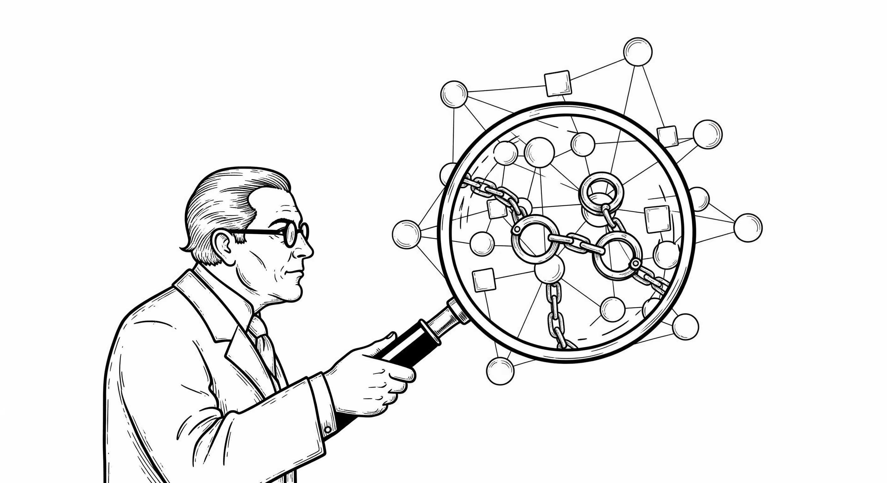

# 第二章 个人自由为何沦陷

> 技术并非中立；它给予的，必然会以另一种方式带走。
> --- 尼尔·波兹曼（Neil Postman） 《技术垄断：文化向技术投降》

人类从未像今天这样依赖信息系统：我们的通信、财富、身份、乃至最隐秘的思想，都被紧紧包裹在一层层数字界面与技术协议之中。我们曾天真地以为互联网将带来前所未有的解放，但现实却展示了硬币的另一面：这种深度的依赖并没有带来更大的自主性。相反，技术的进步在极度赋能机构的同时，也在系统性地剥夺个体的权利。当政府与商业巨头掌握了近乎无限的数据与算力，它们便拥有了定义身份、裁决信任、以及控制通信与财产的“上帝权限”。而普通人，就像生活在数字化温室里的植物，在享受便利的供养时，逐渐失去了在野外生存的能力，最终只能被动地接受、使用、服从。

本章旨在深入剖析个人自由在数字时代沦陷的成因，我们将从两个层面展开：显而易见的表象与深藏其下的根源。进行这种结构化分析的动机非常明确——只有彻底明白了问题的原因，特别是透过现象看清表象之下的根本技术症结，我们才能找到问题的要害。诊断是治疗的前提，唯有如此，我们才能发现并给出真正有效的解决方案，而不是停留在表面的修补上。具体而言，信息时代的个人自由陷入了深重的困境。这种困境可以分成两个层面：

- 表象层面：个人在数字世界处于完全的被动地位。用三个明显标志：在数字身份上被定义，在信任关系中被支配，在通信与财产上被掌控。
- 根源层面：这是一场不对称的技术战争。有二个根本原因：个体不拥有处理信息的私有资产（算力、存储与网络），也缺乏自我保护的安全防御工具。

## 1 问题的表象

在信息时代，个人权利面临着来自“利维坦”（政府）和“数字巨兽”（科技巨头）的双重挤压。这些机构拥有近乎无限的资源来收集数据、训练算法、构建网络，以实现其管理或盈利的目标。在这个由机构编织的宏大叙事中，个体逐渐沦为被支配的客体。我们可以从三个维度来解剖这种被支配的状态。

## 1.1 数字身份：借来的面具

在物理世界，你的存在是生物学的必然；但在数字世界里，你的存在必须获得“系统”的许可。若没有一个可被认证的数字身份，你在信息网络中便是不存在的幽灵。然而，残酷的现实是：那些你引以为傲的数字身份，大概率没有一个真正地属于你。让我们逐一审视那些构建我们数字生活的核心身份，看看它们的控制权究竟掌握在谁的手中。

### 电子邮箱（Email）：寄人篱下的通信锚点

你可能拥有一个 `alice@gmail.com` 或 `bob@outlook.com` 的邮箱。这看起来像是你的私有地址，但请看一看 `@` 符号后面的名字——那才是真正的“房东”。即便你试图通过注册域名来建立属于自己的 `bob@bob.com`，这在技术层面上也是一场注定失败的战斗。为了理解其中的困境，我们需要先科普一下什么是域名。简单来说，域名（Domain Name）就是互联网世界里的“门牌号”。在网络的底层，计算机之间是通过一串像 `192.0.2.1` 这样冷冰冰且难以记忆的数字（即 IP 地址）来互相定位的。为了方便人类记忆，工程师们发明了域名系统，它就像一本巨大的全球自动电话簿，负责把你输入的 `bob.com` 翻译成电脑能懂的数字地址。

首先，所谓的“拥有域名”本身就是一个幻觉。虽然你可以去注册一个看似属于你的门牌号，但这并不意味着你买下了这块地。这就好比你在互联网上租了一块地，虽然你付了租金，但只要管理这块地的国际互联网管理机构（ICANN）或其代理商愿意，或者你忘记续费，这块地随时会被收回，通往你数字家园的路就会被连根拔起。

更让人绝望的是，即使你花钱租了域名，在这个只有巨头说了算的世界里，你自己建的“小邮局”也很难发出去信。为了防止有人乱发垃圾广告，像 Google 和 Microsoft 这样的大公司建立了一道高高的围墙。他们手里有一份庞大的“信誉名单”。作为一个刚建立的个人小邮局，你既不在这个名单上，也搞不懂那些复杂的数字防伪签名技术。结果就是，你发出的信，会被对方的邮局直接当作垃圾扔掉。实际上，原本自由的电子邮件规则已经被巨头们修改了，你不得不依赖 Gmail 这样的大公司邮件系统，因为只有盖了它们“邮戳”的信，才能在互联网的世界里畅通无阻。

事实上，如果我们回到 1982 年，那是电子邮件刚诞生的时候，规则非常简单。在那个互联网的“田园时代”，只要写信的人和收信的人知道对方地址，一方的电脑可以直接把信投递到对方的电脑上，不需要经过任何大公司的检查。这种“点对点”的直连模式，就像两个人直接递纸条一样自由。然而，那时候的设计太单纯了，以为大家都是好人，所以没有设计锁和防盗门。在如今这个充斥着坏人和垃圾广告的“黑暗森林”里，如果还坚持那样直接送信，就像在战场上不穿盔甲一样危险。因此，虽然理论上我们依然拥有“直接通信”的自由，但在现实中，这种自由已经变成了一种难以实现的梦想。

### 护照号码：国家授予的许可

在物理世界，护照号码是你移动的许可。当海关官员扫描你的护照时，他并不是在看那本纸质小册子，而是在向国家庞大的数据库发送一个查询请求：“这个人是否被允许通过？” 你的护照本质上只是一个指向该数据库记录的索引指针。你的生物特征（照片、指纹、虹膜）都可能被数字化并与那一串号码深度绑定，而这串号码的所有权完全归属于政府。只要后台管理员按下“注销”键，你手中的护照瞬间就会变成一本毫无意义的废纸。

这种控制的极端体现是无国籍者。没有护照，在现代社会几乎寸步难行——无法跨越国境、无法开设银行账户、无法预订酒店，甚至在某些情况下无法证明自己的生物学存在。这赤裸裸地揭示了一个事实：现代公民身份本质上并非天赋人权，而是国家颁发的一种“特许经营权”。 你只是被允许使用这个身份，而非真正拥有它。

为了打破这种垄断，巴拉吉·斯里尼瓦桑（Balaji Srinivasan）在《网络国家》（The Network State）中提出了一种激进的构想：利用技术手段建立一种新型的政治实体。他设想的“网络国家”并非那种只有卡通头像的线上俱乐部，而是一个高度组织化的实体。其演化路径是：首先在互联网上聚集一群拥有高度一致价值观和道德准则的社区（Startup Society）；接着，这个社区通过众筹在现实世界购买分散的土地（群岛式领土）；最后，通过人口规模、经济实力和集体行动能力，争取获得传统主权国家的外交承认。这种构想试图证明，正如我们可以用代码创建公司和货币（比特币），我们也可以用代码创建国家。

然而，这一宏大愿景在现实中面临着极高的真实困难。首先是“暴力垄断权”的缺失，传统国家定义的基石是对领土内暴力的合法垄断，而网络国家在面对物理世界的警察与军队时极其脆弱。其次是“外交承认”的极高门槛，现有的国际秩序是基于主权国家俱乐部的，哪怕是仅仅获得一个微型国家的承认都难如登天。最后是基础设施的依赖，即便你在云端拥有主权，你的物理肉身依然生活在传统国家的电网、供水和法律管辖之下。因此，在网络国家真正获得与传统国家平起平坐的地位之前，我们的物理身份依然被牢牢锁定在旧世界的版图之中。

### 金融账户：被审计的生存许可

如果说护照决定了你能去哪里，那么金融账户则决定了你能否活下去。在现代经济中，没有银行账户通常意味着无法领取薪水、无法支付房租、无法进行任何非现金交易——实际上等同于“经济性死亡”。然而，获取并持有这个账户的成本，是出让全部的财务隐私。个人参与金融业务活动的第一步就是开户，而开户的核心功能，并非为你提供服务，而是将你的生物肉身与国家金融监控网进行深度绑定。这一过程被称为 KYC（了解你的客户） 和 AML（反洗钱），它们构成了金融世界的“高墙”与“电网”。

- KYC 是入场的“安检”：各国政府强制要求金融机构收集用户的详尽数据。这绝非简单的实名制，而是一场数字化的“搜身”。你需要提供法定全名、出生日期、居住地址证明（如水电费单）、以及高敏感度的身份标识（如美国的社会安全号 SSN、护照号或税号）。对于那些缺乏稳定住所或完整证件的底层民众，这道门槛很可能直接将其拒之门外。一个残酷的现实是，即使到了 2021 年，仍然有大约 24% 的世界成年人没有银行账户。
- AML 是持续的“监控”：开户只是开始。为了防止洗钱、恐怖融资、逃税或诈骗，银行必须实时监控你的资金流向。算法时刻审视着你的交易：一笔来自海外的汇款、一次偶然的大额提现，都可能触发“可疑活动报告”。在“合规优于服务”的逻辑下，机构有权在不经审判、甚至不予通知的情况下冻结你的账户。

在这种体系下，个人不仅没有属于自己的金融账号（那只是银行账本上的一行记录），而且必须时刻自证清白才能维持对自有财产的访问权。要摆脱这种困境，建立一个无需许可、人人可拥有的开放金融交易体系（如比特币网络），或许比建立一个全新的“网络国家”更为紧迫且现实。

### 社交账号：数字农奴的工牌

社交媒体账号（Twitter, Facebook, WeChat ID）是现代人的社交名片。但这些账号的所有权从未属于你。在用户协议（ToS）的深处写着：平台拥有账号的所有权，你只拥有使用权。这意味着，你花费数年积累的粉丝、内容和社交关系，随时可能因为一次“违规判定”或平台的倒闭而烟消云散。在中心化的社交平台上，用户更像是“数字农奴”：我们在巨头的土地上耕作（生产内容），贡献流量（缴纳地租），却随时可能被领主驱逐。

但变革的曙光已经出现。以 Nostr 为代表的去中心化协议正在重塑我们对“账号”的理解。在 Nostr 的世界里，你的身份不再是腾讯或推特服务器上的一行记录，而是一对你自己生成的“数字钥匙”（公钥和私钥）。公钥就是你的 ID，像身份证号一样公开；私钥就是你的密码，只有你手里有。只要你握紧私钥，就没有人能封禁你的账号，也没有人能删除你的好友列表。另一种方案是 Bluesky 使用的 AT 协议，它实现了“身份可携带”。这就好比你可以带着你的手机号转网去任何一家运营商一样，你也可以带着你的粉丝和内容“搬家”到另一个服务商，而不需要从零开始。这些技术正在试图把“你是谁”的定义权，从巨头手中夺回来，交还给每一个具体的个人。

### 1.2 被动的信任：别无选择的服从

从通用电子计算机发明至今不到百年，人类尚处于信息时代的早期。在这个阶段，普通人对技术的认知远远落后于政府与科技巨头对技术的操控能力。利用这种认知落差，机构构建了一个庞大的控制网络，使得个人的信任不再是一种基于了解的主动选择，而变成了一种基于无奈的“出厂设置”。这种被动信任的形成，主要源于制度安排、技术结构和社会心理三个维度的合围。

首先，在制度层面，信任被异化为一种强制性的入场券。政府垄断了底层的公民身份体系（身份证、社保号、税号），并拥有强制的监管权；商业巨头则瓜分了通信、支付、存储与社交的基础设施。在这样的格局下，个人在互联网中“存在”的前提，就是无条件同意并依赖这些平台。人们信任谷歌或苹果公司的支付系统，并非因为相信它们在道德上无懈可击，而是因为没有替代方案。一个普通人无法自建支付网络，也无法发明一套被广泛认可的通信协议。这种信任不是出自自由意志，而是一种“无路可退”的被迫参与。

其次，在技术层面，现代系统的复杂度早已超越了普通人的认知极限。技术的复杂性与不透明性造成了极致的知识不对称，而这种不对称直接转化为信任的不平等。用户无法验证社交媒体算法如何决定自己的时间线，也无法知晓云端数据如何被复制或出售。当个人面对一个由代码决定的世界时，他的信任对象不再是具体的“人”或“机构”，而是看不见的系统逻辑。而这些逻辑完全服务于机构的盈利或管控目标。因此，个人的信任实际上被算法和黑箱所“劫持”：信任变成了不得不接受的默认状态，而非自主判断的结果。

再者，在心理层面，商业公司用极致的“用户体验”编织了一张舒适的网。界面友好、服务便捷的假象，让用户习惯了“用得越多，依赖越深”，进而产生了“便利即信任”的错觉。政府则通过安全叙事，将监控包装成保护。久而久之，人们形成了一种群体性的心理依附：“既然大家都在用，就不会有问题”、“坏人才怕被监控”。这种心态是被动信任的温床，它用便利带来的心理安慰，掩盖了个人自由被逐步剥夺的残酷事实。

然而，这种对中心化机构的依附并非不可打破的宿命。在密码学的世界里，每个人都有机会重新拿回信任的定义权。以 PGP 作者齐默曼为代表的互联网先驱们早就使用过“信任网络” WoT（Web of Trust, WoT）的概念搭建系统。WoT 是一种完全去中心化的信任建立机制，其运作方式更像我们现实生活中依靠熟人推荐构建的社交圈，而非依赖单一权威颁发的通行证。

在信任网络中，你不需要等待某个中心机构（如政府部门或社交平台）来赋予你身份，而是通过数学算法自主生成一对数字钥匙。你的公钥就是你的身份，而这层身份的真实性，并非来自盖章认证，而是源于你周围朋友的背书。当你的朋友用他们的私钥为你的公钥签名时，他们实际上是在用自己的信誉为你担保。这种信任关系具有奇妙的传递性：如果我信任爱丽丝，而爱丽丝信任鲍勃，那么即便我不认识鲍勃，我也能基于爱丽丝的担保对他产生一定程度的信任。这种信任像涟漪一样在人群中扩散，交织成一张没有中心节点、却紧密相连的网。每一次信任的建立都基于公开透明且可验证的数学签名，而非黑箱里的算法。通过这种方式，我们不仅能构建一个抗审查的社区信任体系，更是在以技术手段对“被动服从”进行最直接的反击。

### 1.3 控制权的丧失：被囚禁的财富与信息

在这个时代，最宝贵的资产不仅是可见的财富，更是那些无形的信息。无论是信息还是财富，它们的控制权正在经历一场前所未有的转移——从个人手中，悄然流向了巨大的中心化系统。

信息的失控是隐形的，也是最深刻的掠夺。“免费是世界上最昂贵的东西”这句话在数字时代成为了真理。当你免费使用搜索引擎、社交网络或地图服务时，你以为你是用户，实际上你不仅是产品，更是原材料。正如肖莎娜·祖博夫（Shoshana Zuboff）在《监视资本主义时代》中所揭示的，科技巨头通过无处不在的触角，提取我们的行为剩余（behavioral surplus）。你的每一次点击、每一次停留、甚至每一次情绪的波动，都被提炼成数据，用于训练更强大的算法。这些算法最终反过来操控你的消费决策，甚至潜移默化地塑造你的政治倾向。这种失控还体现在数据的“不死性”上：你以为点击“删除”键就抹去了聊天记录，但在云端的冷备份里，它可能永生。你拥有的只是前台界面的一个“可见性开关”，而后台数据库的“物理删除权”，从未真正掌握在你手中。你的记忆、你的社交关系、你的数字轨迹，本质上是寄生在别人服务器上的幽灵，随时可能因“违反社区规则”而被一键清除。

财产的失控也同样是日趋严重。我们往往抱有一种错觉，认为银行卡里的余额就像放在保险柜里的金条一样属于自己。但在现代数字化金融体系中，钱不再是实体的金银，甚至不是纸币，它只是银行数据库里的一行代码。从法律和会计角度看，你的存款本质上是银行对你的一笔负债（IOU）。这意味着，你并不拥有这些钱，你拥有的只是向银行索取这些钱的“请求权”。而这个请求权，是极其脆弱的。

如果风控系统判定你的交易“可疑”，或者你卷入了某种政治风波，你的千万财富可以在一秒钟内变成无法调用的死数据。加拿大卡车司机抗议事件是一个令人不寒而栗的例子：政府无需经过法院审判，仅仅通过行政命令，就迫使银行冻结了数百名普通抗议者及捐款者的账户。那一刻，现代人引以为傲的财产权，在中心化权力的开关面前显得不堪一击。即便你的账户安全无虞，你依然面临着另一种形式的掠夺——通货膨胀。法币的发行权掌握在央行手中，通过量化宽松，通过点击键盘增加货币供应，你的劳动成果可以在不知不觉中被稀释殆尽。这是一种没有小偷在场的盗窃，一种合法的财富转移。

卢梭曾说：“人生而自由，却又无往不在枷锁之中。” 在数字时代，这句话变成了：“人生而连接，却又无往不在监视与控制之中。”幸运的是，这并非不可逆转的终局。历史告诉我们，每一种垄断力量的崛起，往往都伴随着去中心化反抗力量的萌芽。正如印刷术打破了知识的垄断，密码学与分布式网络正在为我们锻造斩断数字枷锁的利剑。我们并非注定要成为算法的奴隶或数据的矿藏，个人完全有能力选择另一种活法——一种保有隐私、掌控财富、自主连接的活法。但这需要勇气，更需要认知。在试图夺回自由之前，我们必须先潜入这台庞大机器的底层，看清那些让我们失去自由的根本原因——究竟是什么样的技术贫困，让我们在全副武装的巨头面前手无寸铁？

## 2 问题的根源

如果我们愿意拨开那些由法律条文和商业宣传编织的迷雾，从纯粹的技术视角去审视这个世界，我们会发现个人自由沦陷的根本原因并非仅仅是道德的滑坡或法律的缺位，而在于一场技术力量的极端不对称。这是一场手无寸铁的平民面对全副武装的巨人的战争。在这个战场上，我们之所以节节败退，归根结底是因为我们在技术层面丧失了两大核心能力，这也正是导致个人自由沦陷的两个根本原因：不拥有数字资产与防御能力的缺失。

2.1 不拥有数字资产：我们是数字世界的“租客”

在工业时代，自由的基础是拥有生产资料——土地、工厂和机器。而在信息时代，自由的基础发生了转移，它变成了拥有信息资产——即处理、存储和发送信息的能力。然而，今天的互联网架构从底层基因上决定了我们不拥有数字资产。这种架构被称为“客户端-服务器”（Client-Server）模式，它是现代数字世界的主要运行架构。

在这个架构中，权力被严格地一分为二。服务器端（Server）拥有绝对的统治权，它们掌握着强大的算力、无限的存储空间和不可挑战的数据主权。这些服务器属于 Google、Amazon、Facebook 这样的科技巨头，它们是数字世界的“地主”和“领主”。而我们手中的设备——无论是昂贵的 iPhone 还是高性能的笔记本电脑——在本质上只是客户端（Client）。它们虽然计算能力惊人，但在网络关系中却扮演着卑微的角色：它们只有展示内容和发出请求的权利。我们以为自己拥有手机，但最有价值的数据却并往往不存在手机里。想想看，你的某些照片很可能只存储在 iCloud 上，本质上你是租用了苹果公司的硬盘；你的存款数字记录在银行的主机里，你是借用了银行的记账簿；你的社交关系网维护在微信的服务器上，你是利用了腾讯的连接能力。甚至连我们常说的“云端”，也不过是一个精妙的营销术语，它的真实含义是“别人的计算机”（The Cloud is just someone else's computer）。

当一个人的所有生存资源都建立在租来的基础设施之上时，所谓的“自由”就成了一个摇摇欲坠的伪命题。这就好比你住在一间随时可能被房东收回的公寓里，房东不仅拥有备用钥匙，可以随时进屋检查，甚至还可以在你不听话时直接换锁。在数字世界里，这种“换锁”表现为账号封禁、服务中断或数据删除，而作为“租客”的你，往往无处申冤。因此，只要我们还没有建立起属于自己的、物理上可控的私有服务器（Personal Server），我们在数字世界里就注定是一群流浪汉，无论我们的账号等级有多高，我们依然是无产者。

2.2 防御能力的缺失：在互联网上裸奔

如果说不拥有数字资产让我们受制于人，那么防御能力的缺失则让我们在危险丛生的网络森林中赤身裸体。在物理世界，我们懂得用门锁保护家庭，用保险柜保护财物，甚至学习防身术来应对暴力。但在信息世界里，令人遗憾的是绝大多数人至今仍在互联网上“裸奔”。虽然我们每天都在使用 HTTPS 这样的加密协议，但这通常只是传输层加密——就像是你雇了一辆装甲运钞车来运送你的信件，虽然路上的强盗抢不走，但负责运送的邮局（服务商）却拥有打开信封的钥匙。真正的端到端加密（End-to-End Encryption），即只有通信双方拥有钥匙，并没有在日常生活中普及。我们的微信聊天记录、我们的电子邮件内容，对于服务商来说都是透明的“明信片”。

此外，我们的身份认证体系也极其脆弱。我们习惯了依赖中心化的数据库来证明“我是我”——通过手机短信验证码、通过 Google 或 Facebook 账号登录。这种方式本质上是将通往我们数字生命的钥匙交给了第三方保管。一旦这个第三方数据库被黑客攻破，或者遭遇内部人员作恶，我们的身份就会被瞬间窃取。

由于缺乏易用且普及的加密工具（如私钥管理硬件、端到端加密通讯软件），个人在面对机构的窥探、大数据的杀熟以及黑客的攻击时，几乎毫无还手之力。我们唯一的策略就是祈祷——祈祷巨头们能坚守“不作恶”的道德底线，祈祷法律能提供事后的救济。但这就像是把自家的钥匙交给路人，然后祈祷他不要进门偷东西一样荒谬且无力。

## 3 出路

如果我们拉长历史的镜头，会发现自由从来不是一种静止的状态，而是一种技术与制度持续不断的博弈。在信息时代，个体之所以陷入被支配的处境，不是因为本该如此，而是因为机构在技术发展的初期取得暂时的优势。当信息的生产、存储与传播掌握在少数机构之手，当防御的能力被算法与平台垄断，个人的自由就从内核被掏空，只剩下表面的选择与幻觉的安全感。但这种自由的受侵蚀不是终结，而是历史长河的一个短暂过程。自由的历史，可以看作是一部权力分配的技术史。每当一种新技术出现，它不仅改变生产方式，更重塑人类之间的权力结构。在十五世纪，印刷术的发明打破了教会对知识的垄断。书籍从修道院的密室流向民间，思想从神权的控制中解放出来。那一次技术性的分权革命让个人获得了表达与传播的主权，由此诞生了宗教改革、启蒙运动与现代公民社会。

而今，我们正处在信息时代的早期，数据的所有权、通信的安全、身份的定义与财富的控制，都被“数字帝国”的机构紧紧掌握。我们仿佛又回到了印刷术之前的世界：思想、信息与财产都需要通过权威的“抄写员”与“审阅者”才能存在和分享。但历史从不止步于集中控制，人类总会发明新的分权技术。信息技术与加密算法正是当代的印刷术，而且更加可以赋能个人：它不仅帮助个人传播和处理知识，还可以让个人获得信息与财产的主权和控制权。

真正的出路，不在于乞求法律的宣告，也不在于等待机构的仁慈，而在于每一位个体重掌技术利剑。若信息技术要解放个人，它必须首先被个人所掌握。我们必须夺回两样东西：私有的信息资产和坚不可摧的独立防御能力。让每一个人重新拥有自己的计算资源，掌握通信与防御的工具。让自由不再是一种脆弱的信念，而是一行行可执行的代码、一把把掌握在自己手中的私钥以及各种可执行的去中心化计算。这，就是我们在下一章将要探讨的：技术如何重建个人自由。
