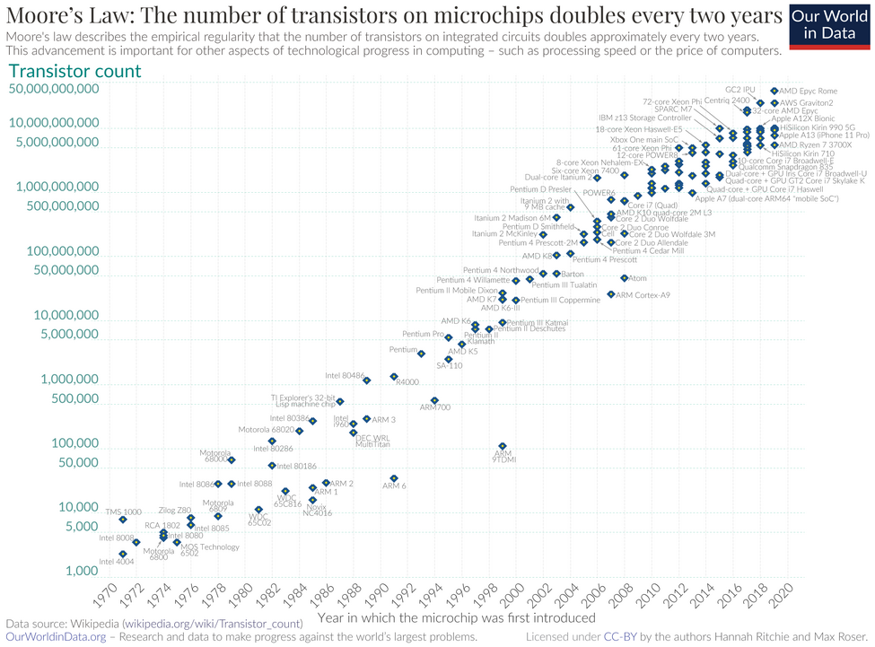

# 第四章 主权个人数字系统

> 正是因为生产资料和经济决策权分散在许多彼此独立的个人和组织手中，权力才无法集中到任何一个人或机构那里；而一旦这种分散被消除，自由也就随之消失。
> --- 哈耶克 《通往奴役之路》

个人自由不能仅仅是被动地祈求法律条文的保护，因为法律的制定权、解释权以及最终执行权，往往掌握在有着自身利益诉求的官僚机构手中。幸运的是，今天的信息技术已经足以赋能个人去建立一个可以独立安全运作的技术实体，从而保障自己的合法权益。正如工业时代的自由建立在对生产工具的掌握之上，数字时代的自由也必须锚定于对信息工具与数据资产的掌控。

主权个人数字系统 SovinDS（Sovereign Individual Digital System）是指由个人拥有并控制的一整套信息处理、存储与通信系统，它是完全从属于个人的数字资产。它既是个体在数字空间中的技术孪生，也是其主权的实现方式。在这个系统中，个人可以独立地存储数据、运行程序、进行安全通信，而不必依附于任何第三方平台或机构。这种数字资产不仅是一种物理性的技术事实，更是一种权力结构。它让个体从被动的使用者变为主动的拥有者，从租用他人服务的用户转变为掌控自己信息系统的主权主体。这种自主体系的出现，不仅改变了个体在数字世界的地位，也从底层重新定义了法律、经济与社会的边界。本章将从 SovinDS 的技术与经济可行性以及法律地位出发，探讨其设计理念与系统结构，揭示它如何成为捍卫个人自由的终极物理基石。

## 1 信息技术平权

主权个人数字系统 SovinDS 的可能性建立在技术与法律的双重前提之上：当计算与通信能力已经普及且强大到足以支持个体独立运作时，个人不仅具备构建自身数字基础设施的能力，也应当拥有这样做的权利。

### 1.1 信息技术赋能

最能体现信息技术进步的是著名的摩尔定律（Moore’s Law）。这一规律最早由英特尔公司联合创始人戈登·摩尔（Gordon Moore）于 1965 年提出。他通过长期的研发经验观察到集成电路上可容纳的晶体管数量大约每隔 18 至 24 个月就会翻一倍，而生产成本却能保持稳定甚至下降。在过去半个世纪中，摩尔定律不仅是一条技术经验曲线，更是揭示了推动现代文明进程的核心力量。芯片技术让计算能力的增长远远超越任何传统资源的扩张速度，信息的处理、存储与通信都呈现了长期的指数增长。在人类历史上，没有任何能源、材料或交通技术能以如此稳定的指数趋势持续演进数十年。这也带来了前所未有的现象：技术第一次以自我加速的方式推动社会演化。

[Source: Wikipedia](https://en.wikipedia.org/wiki/Moore%27s_law)

上图给出了一块芯片上的晶体管数量，从 1970 年的 1000 多到 2020 年的 500 亿，增长了五千万倍。人类的直觉往往在应对线性增长时非常可靠，但在面对指数增长时却难以理解。为了理解摩尔定律在过去五十年里究竟制造了怎样的奇迹，我们可以从多个维度审视信息技术的力量。首先是知识的承载量。古代最大的图书馆是位于古埃及的亚历山大图书馆，由托勒密王朝于公元前3世纪建立。它是古代世界最大和最重要的知识中心，收藏了大量的手稿，但最终毁于战火。根据估算，亚历山大图书馆约有 50 万卷藏书，折算成数字文本大约 16.5GB。2025 年发布的 iPhone 17 Pro Max 用 2TB 存储空间，能装下 120 个以上的亚历山大图书馆的文本量。一部口袋里手机就能装下若干古文明的书海！依照维基百科超级计算机历史数据 [History of supercomputing](https://en.wikipedia.org/wiki/History_of_supercomputing)， 1999 年全球最快的超级计算机 Intel ASCI Red/9632 的性能约为 2.4 万亿次浮点运算 。维基百科数据显示，苹果 iPhone 17 Pro 搭载的 [A19 Pro 芯片](https://en.wikipedia.org/wiki/Apple_A19) 运算能力已达到每秒 2.5 万亿次浮点数运算，超过 1999 年全球最快超级计算机。换言之，如今一部智能手机的计算性能，已经超越了二十世纪末代表人类科技巅峰的超级计算机算力。如果物理世界的汽车工业也遵循这一规律，那么今天你只需要花费不到 1 美分就能买到一辆超音速法拉利，且一加仑汽油提供的能量足以绕地球行驶数百圈。这种近乎魔法的演进，让计算设备这一核心生产资料完成了从机构垄断向个体赋能的彻底转变。

与此同时，全球范围内的网络基础设施已将连接力推向了物理极限。从横跨大洋的海底光缆到覆盖城市乡村的 5G 基站集群，再到马斯克（Elon Musk）旗下的星链（Starlink）卫星系统，一个无处不在的数字经络已经将地球的每一个角落紧密连接在一起。以 iPhone 17 为例，它在微观尺度支持 NFC 与蓝牙近场通信，在宏观尺度通过蜂窝网络与 Wi-Fi 智能切换，而当个体置身于荒原或孤岛等传统网络盲区时，星链卫星的高速连接则确保了数字主权永不掉线。这一整套体系使高清视频、实时协作与大规模数据交互成为了普通人的日常体验。在这些遍布全球的数据加速与即时响应机制支撑下，个人设备能够以毫秒级延迟调动周边的计算资源，并自动选择最通畅的信息传输路径。这种从海底到太空的立体覆盖，让主权个人能够以前所未有的深度与速度，将自身的 SovinDS 接入全球数据洪流。

从经济的角度看，摩尔定律的深刻含义在于计算成本的指数级坍缩。这种持续数十年的技术红利，最终引发了社会资源分配的质变，将计算从一种极少数科研机构和超级大国才能供养的巨额资产，转化为了人人皆可负担的廉价基础能力。我们可以通过财务维度的对比清晰地观察到这一历史进程：1999 年全球最快的超级计算机 Intel ASCI Red 造价高达 4600 万美元，计入通货膨胀约折合今天的 8900 万美元——这无疑是个人甚至多数机构都无法奢望的天文数字。然而，二十五年后的今天，拥有同等甚至更强运算能力的 iPhone 17 Pro，其零售价仅约 1099 美元，差不多仅相当于美国普通劳动者约一周的工资收入。这种成本跨度的极度收缩，从根本上瓦解了数字世界的“租佃制”经济基础。当主权个人能够以极其低廉的价格获取曾经的顶级运算资源时，他便不再需要为了获取算力或存储而将隐私与数据“典当”给中心化巨头。更重要的是，除了硬件购置成本，运行私有系统的能源与维护支出也随着集成度的提升大幅下降，使得持有并运营一套 SovinDS 在经济上变得完全可持续且极具吸引力。这种“算力平权”标志着信息时代最核心的生产资料已经彻底回归个体。

这种生产关系的重构在人类文明史上早有回响。正如十八世纪爆发的工业革命，蒸汽机与随后的电力技术以前所未有的效率取代了繁重的体力劳动，从根本上动摇了奴隶制的经济逻辑。量化的数据最能说明这种冲击：一名壮年劳动力在持续工作时产生的功率大约只有 75 到 100 瓦特，而一台普通的一百马力电机所释放的能量，足以瞬间抵偿超过一千名壮年劳力的肉体产出。更具决定性的是能源成本的剪刀差：维持一名奴隶的基本生存（食物、住所与管束成本）即便在古代也是一笔不菲的开支；而今天，产生等同于一名成年劳动力全天连续工作十小时的“体力能量”，仅需消耗约一度电，其工业电费成本通常不到 0.15 美元。这种数百倍的成本差距，使得任何形式的人身奴役在经济账簿上都显得荒诞且低效。当冰冷的机器能以更低的成本、更高的稳定性提供这种跨越数量级的动力时，依靠剥削人身自由来换取生产力的旧模式不仅在道德上破产，在经济上也失去了存在的必要。技术进步通过提供更廉价、更高效的替代方案，完成了单纯依靠道德呼吁难以实现的社会变革。如今，算力对数字劳作的覆盖，正如同当年的机械能对肌肉力量的替代，它正将人类从中心化平台的“数字劳役”中解脱出来，开启了一场基于硅基算力的个体解放。

硬件性能的飞跃只是序曲，真正赋予硬件主权灵魂的是配套软件技术的代际突破。在过去十年中，曾经专属于大型互联网公司的分布式架构、容器化技术与高级加密算法，已经通过全球开源社区的协作成为了普通人随手可得的技术资源。容器化技术（如 Docker）彻底改变了应用程序的部署逻辑。简单来说，它就像是为软件打造了标准化、全封闭的“数字集装箱”，将复杂的运行环境、系统配置和程序代码一并打包。这种封装方式消除了不同设备间的兼容性障碍，确保应用在个人服务器上能像在专业机房里一样稳定运行。这意味着普通用户只需在自己的系统上一键点击，即可部署各类复杂应用，极大地降低了个人维护数字系统的技术门槛与运维成本，而稳健性却直逼商业数据中心。更具划时代意义的是各种去中心化协议与本地化人工智能（Local AI）的普及。现代加密协议确保了数据在产生源头即被封锁，而分布式存储则让信息不再依赖任何单一节点的存亡。随着具备强大神经网络处理能力的芯片普及，原本必须在巨头服务器端运行的大语言模型，现在可以完全在个人的 SovinDS 本地部署。这意味着个人第一次拥有了不被窥探的数字大脑，人工智能不再是监控个体的间谍，而是严守主权边界、完全忠于个人的数字管家。这种算力平权与软件自治的交汇，让个人从数字世界的租客正式晋升为拥有完整领土、自主算法与独立智慧的技术主体。

### 1.2 个人数字资产的合法权益

在法治社会中，个人拥有并掌控数字资产的权利并非某种法外施恩，而是基本人权在新介质上的逻辑必然与自然延伸。这种权利重构的核心，在于将物理世界的宪法精神映射至数字比特的疆域。通信自由在这里延伸为“数字通信主权”，它不仅保护个人选择通信工具与加密协议的绝对自由，更确保个体在技术底层免于不当的系统性审查——其法理逻辑在于，数字时代的“表达”已不仅限于说话的内容，更涵盖了对表达渠道与保护形式的自主选择。隐私权则相应演进为“数据自决权”，它将个人的私有设备与私有云定义为受法律保护的“数字居所”，任何机构若试图获取其中的数据，必须遵循等同于进入物理住宅的合法法理依据与严格程序，彻底终结了数字数据被视为“无主荒地”的荒谬现状。而财产权则以“物理上的排他性控制”为终极判定标准，确认了通过私钥控制的数据资产具备不可剥夺的财产属性，任何未经所有者授权的系统侵入与数据篡改，在法理上都等同于对私人领地的暴力侵犯。

这一法律逻辑的坚固支撑点在于：软件系统本质上是文本的排列组合，而在法律层面，这种逻辑表达被视为“言论”的延伸。这一保护伞源于美国宪法第一修正案（First Amendment），它规定国会不得制定任何法律来限制言论自由或出版自由。在数字主权的法理博弈中，最著名的先例是 20 世纪 90 年代的“加密战争”。当时，PGP（Pretty Good Privacy）的作者通过将代码印成书籍出版，利用了“政府无法禁止书籍出版”的古老准则，成功挑战了严苛的武器出口管制法案。随后，一系列司法判例确认了“代码即言论（Code is Speech）”的原则，即程序员通过代码表达的逻辑思维与作家通过文字表达的思想一样，受宪法的最高级别保护。因此，SovinDS 的运行不仅是技术行为，更是一种受法律保护的表达。在一个尊崇法治的现代国家，由于第一修正案的存在，政府很难在不违宪的前提下禁止某种加密算法或私有协议的运行——因为如果保护隐私的代码被判定为非法，那么逻辑上，任何形式的数字化思想表达都将面临被禁锢的风险。这种技术与法律的深层耦合，使 SovinDS 不再是脆弱的技术尝试，而是披着宪法铠甲的个体主权声明。

随之而来的是一种深刻的权责去中介化。由于 SovinDS 的物理所有权、算力资源及数据均完全归属于个人，根据法律对通信与财产的底线保护，个体在该系统内的所有活动都被划入了神圣不可侵犯的私人领域。在此架构下，软硬件供应商的角色发生了根本性的位移：他们不再是拥有“上帝权限”的数据监护人，而回归到了纯粹的“建筑商”或“锁匠”地位。这意味着，供应商仅提供工具的物理可能性，而没有钥匙，更无法得知用户在保险柜中存放了什么。因此，正如房屋建筑商不应对屋内的私人谈话负责一样，SovinDS 的提供者也不再承担任何连带的通信监管责任。这种结构从物理层面终止了平台“替用户做主”的借口，通过将权利锚定于“物理受控”这一事实，为个人自由构建了一道坚实的防火墙。数字主权由此从权力的随心施舍，转化为了一种基于技术赋能与法理逻辑的确定性结果。

值得补充的是，SovinDS 及其底层的运维系统软件均构建在开源与免费的基石之上。作为全球开源社区协作的产物，这种开放性确保了系统逻辑的完全透明，排除了任何隐藏监控后门的可能，使得主权系统本身成为了普通人“随手可得”且无需支付高昂授权费的公共技术资源。然而，这种底层的开放与免费并不限制上层应用的自由度；用户作为系统的最高仲裁者，完全可以在这一坚实的主权基座之上，根据自身偏好自由地运行各种不开源的商业软件、收费应用或高度专业化的商业服务，从而在保障核心主权的前提下，实现了技术使用的无限可能性。

## 2 SovinDS 系统结构

前一章介绍过 SovinDS 是一个由前端的用户设备与后端的私有云共同构成的计算系统。一个基本的设计理念是系统包含一个持续在线后端。这里有必要先了解一下其必要性。

### 2.1 持续在线后端的必要性

很多读者可能会有疑问：“我的手机计算性能可能已经过剩了，为什么还要麻烦地去维护一个后端？”这其实是在问：“在这个数字时代，我们究竟是想做一个背着所有家当流浪的数字游民，还是一个拥有固定资产和安全领地的数字定居者？”

答案其实很简单：数字世界的运作是跨越时区、24/7 永不停歇的，而人类及其随身智能设备（前端）却受制于生物节律和物理限制——我们需要睡觉，手机需要充电，信号可能会中断。这种时空维度的不对称，正是个人主权被中心化巨头悄然劫持的缝隙。若没有一个私有的后端作为你的“数字常驻外交官”，当你的手机屏幕熄灭时，你在数字世界里就实质性地“失踪”了。这种必要性源于数字交互模式的深刻演变。在数字世界中，存在着三种维度的交互：人与人（H2H）、人与计算机（H2C）、以及计算机与计算机（C2C）。

- 人与人（H2H）： 传统的社交与通信，这仅仅是数字世界的表层。
- 人与计算机（H2C）： 个体调取远程资源、指令 AI 执行任务。
- 计算机与计算机（C2C）： 协议间的自动握手、节点同步、数据备份与智能合约的执行。

随着技术进步，后两种交互模式——尤其是那些没有人类直接实时参与的自动化过程——正占据数字流量的绝对主流。当数字世界开始以前所未有的密度执行自动化功能时，一个仅能靠人手点击来驱动的手机终端显然无法胜任。如果没有后端，你不仅在 H2H 中失踪，更在日益繁重的 C2C 与自动化 H2C 进程中失去了参与权。

这种“失踪”的代价比想象中更大。试想一个场景：你正坐在万米高空的机舱内，手机处于飞行模式。此时，一位朋友通过端到端加密通道向你发送了一份极具时效性的机密文件。在没有私有后端的传统模式下，这份数据流无处可去，只能被迫寄存在科技巨头的服务器上，等待你落地。在那一刻，你实际上已经交出了主权——你不得不信任那个替你“值夜班”的第三方平台不会记录你的通信元数据，不会因受到合规压力而拦截你的信息。而拥有 SovinDS 后端则彻底改写了这一剧本：你那个永不疲倦的私有服务器会第一时间替你接收、验证并妥善存入加密保险柜。当你落地开机，所有信息已由你自家的“数字管家”备好，中间没有任何第三只眼。

此外，智能手机的设计初衷是便携与交互，而非高强度的持续计算。尽管芯片算力惊人，但受限于电池续航和散热，它无法胜任那些需要全天候运行的“重体力活”——比如运行一个本地的大语言模型来整理你的知识库。在金融主权层面，这种局限性在比特币的深度应用中尤为显著。以比特币全节点为例，为了不依赖任何第三方服务商而独立验证交易的真伪，系统需要持续处理繁重的数据索引与数学校验，这对于依赖电池寿命的智能手机而言是沉重的负担。更具代表性的是作为比特币小额支付的闪电网络（Lightning Network）：作为一种追求极致速度的支付协议，它要求节点必须保持 24 小时在线，以便随时接收支付请求或为网络提供中继路由。如果将此类任务交给不稳定的手机终端，一旦遭遇电量耗尽或网络切换引发的掉线，不仅可能错失交易，甚至可能触发复杂的通道安全机制。

相比之下，后端系统则像是一座永不熄灭的能量灯塔，拥有稳定的能源供应和冗余的算力，能够让复杂的自动化任务（特别是那些高频发生的 C2C 交互）在后台静默完成。更关键的是，手机在物理上是脆弱的，它极易丢失、跌落或被盗。如果你的数字身份和所有资产都只绑定在这一台设备上，那无异于将全家身家性命都装在一个透明且易碎的玻璃袋里。

后端为这种脆弱性提供了终极的解决方案：它是一个物理级别可控的数字避风港。在主权个人的视野中，数据丢失等同于部分生命的湮灭。依托于持续在线的后端，数据备份不再是一项需要用户刻意记起的繁琐任务，而变成了像呼吸一样自然的后台律动。复杂的安全策略，如增量快照、多区域冗余备份，都在自动运行。这意味着，即便你随身携带的手机意外损毁，你的数字生命毫发无伤。你只需拿起一部新设备，通过身份认证，就能瞬间从后端恢复所有状态。这种“端”的轻盈与“云”的厚重相结合，让 SovinDS 真正成为了个体在数字荒原中得以安生立命的永恒基石。

### 2.2 体用合一的前后端结构

要深入理解主权个人数字系统构造，首先需要借用一个古老的哲学范畴：“体”与“用”。所谓“体”，是指事物的本体、底座与主权之源；所谓“用”，则是指事物的表现、功用与交互方式。在技术层面，SovinDS 沿用了经典的“客户-服务器（Client-Server）”架构，但其本质突破在于打破了传统互联网中所有权与控制权的不对称。在传统模式下，“服务器端”（体）是由中心化平台垄断的重资产，普通用户仅拥有轻量级的“客户端”（用），这种物理上的权力倒悬注定了个人必须在数据和逻辑上依附于他人的领地；而在 SovinDS 中，个人通过物理分层与数学锁定的手段，让“服务器端”也成为了私有的数字资产。这种设计追求的是一种真正的“体用合一”——确保了个体的使用行为（用）与其主权底座（体）始终处于同一个受控的闭环中，从而在架构底层终结了“数字租赁”带来的不确定性。

在这种架构下，前端客户端与后端服务器并非松散连接，而是通过一条基于现代密码学的“数字脐带”紧紧绑定在一起。两者的核心纽带在于双向加密认证与持续性安全信道。每当用户启动前端设备，系统首先会通过密码甚至面容或指纹等生物特征确认其身份，随后前端与后端之间会进行双向数字证书握手。这种双向认证机制确保了“只有这台特定的受控终端”才能访问“这个特定的私有中枢”。一旦握手成功，所有交互指令与数据流都会进入一个由工业级加密协议保护的通信隧道。这意味着，即便你正置身于一个充满窥探的公共网络环境（如机场 Wi-Fi），你与数字家园之间的数据交换依然像是在一条深埋地下的私人暗道中运行，外界既无法截获内容，也无法伪造指令。这种“端交互、云驻留”的闭环，让个体在数字世界中拥有了一个既能灵活游走、又能稳固扎根的完整技术主体。

前端是主权个人在信息世界中的意志感官触角。它主要由智能手机、个人电脑或可穿戴设备组成，在功能定位上扮演着“意志解释器”的角色。它利用面容或指纹等生物特征确认用户的最高仲裁权，并将用户的指令转化为经过数字签名的加密封包发送至远端处理。由于前端设备强调便携性，它承担了物理定位、环境感知与随机交互的任务，但为了维持其“轻盈”的特性，前端并不直接负责核心数据的持久化存储，也不承担繁重的后台逻辑运行。这种剥离确保了即便是交互终端遭遇物理损坏或丢失，个人的主权根基依然在数字深处稳固如初。

后端则是整个系统的灵魂驻留地，也是主权得以在物理世界确立的支点。正如结构图所示，它由三个互为支撑的物理核心模块构成，共同承担了从防御到生产的全周期任务：首先是负责全天候运作的计算中继节点，它是主权个人在数字空间的“常驻执行官”，负责处理通信协议、过滤外部请求并执行如区块校验或恶意攻击拦截等自动化策略。其次是存放所有核心资产的私有存储核心，它是主权领土的“第一现场”，安放着私密密钥、往来记录及财务账本等关键资产，构成了“物理可及、逻辑排他”的安全边界。最后是作为数字生命保险机制的备份存储系统，它通过自动化远程数据备份，将加密快照实时同步至异地，确保即便原始服务器损毁，用户也能在全新的环境迅速重启服务，实现“数据在远方，主权在手中”的永续韧性。

### 2.3 后端实现路径

在工程实践中，用户可以根据自身对主权深度的追求、技术门槛的接受度以及预算成本，在以下三种演进路径中进行深度权衡与布局。

第一种是用家庭物理私有云构建“数字不动产”的终极堡垒。 这相当于在你的物理书桌上买下了一块真正意义上的数字领地，实现了从底层硅片到顶层应用的全栈掌控。对于追求极致主权的用户，建议部署由至少两台高性能主机构成的高可用（HA）计算集群。这种设计通过虚拟化层确保了“故障自愈”能力：一旦其中一台机器遭遇硬件失效，运行在其上的关键服务（如个人邮件服务器、私有大模型或财务节点）能瞬间在另一台机器上重启，业务几乎无感。存储层面则需配合 ZFS 等现代文件系统，结合磁盘阵列（RAID）技术提供物理级别的位衰减防护与数据冗余。为了让这套“微型数据中心”具备机构级的鲁棒性，系统必须配备带有通信接口的不间断电源（UPS），确保在电网波动时能优雅关机或平滑切换。网络侧则应构建“多重冗余出口”：以本地高速光纤为常规通道，辅以 5G 工业路由器或 Starlink 星链终端作为备用链路。这种方案虽然在硬件选型、散热管理及网络配置上有着较高的运维挑战，但它彻底抹除了对外部服务商的心理依赖，提供了最高级别的物理隔离与“肉眼可见”的安全感。

第二种是租用受控实例（虚拟私有云 VPS），这是数字时代的“安全屋”与主权套利。 这相当于在受保护的专业建筑中租赁了一个具备独立防火墙的数字单元，是目前兼具高性能与易用性的主流普适方案。在经济层面，这是一种极具魅力的主权投资：每月约 20 美元的月租——在发达地区仅相当于连锁餐厅员工一小时的最低起薪——即可换取数据中心级别的电力冗余、专业级 DDoS 防护以及近乎无限的对称带宽。用户并非简单地托管数据，而是通过“全盘加密（FDE）”和“内核级管控”在逻辑上实现了对实例的绝对排他性占有。通过部署加密卷通信与私有网络，服务商即便拥有物理访问权限，在没有你本地密钥的情况下也只能看到一堆毫无意义的随机噪声。更重要的是，VPS 路径允许用户进行“地理位置套利”：你可以根据各国隐私保护法律的差异，策略性地将后端部署在尊重数据主权的司法管辖区。通过跨区域、跨供应商的自动化镜像备份协议，你可以在几分钟内将整套系统从一个国家的云端迁移到另一个国家，从而在行政封锁或服务商违约发生前实现主权转移。这种“寄人篱下但反客为主”的模式，极大程度规避了单点故障与物理损毁带来的风险。

第三种是协作式分布式节点（P2P 资源池），让个人计算隐藏为网络中的“数字碎片”。 这是一种最具前瞻性的“无政府主义”方案，旨在将个体主权底座彻底消融在全球对等网络中，使其如同空气般不可捕捉却又无处不在。该方案抛弃了传统的“中心化服务器”概念，转而拥抱基于 IPFS、Filecoin 或类似协议的分布式架构。你的数据被高级加密算法切碎成无数微小的片段，并带冗余地散布在全球成千上万个互信个体的闲置存储空间内；没有任何单一节点拥有你的完整数据，但只要网络中还有一部分节点存活，你就能随时重组出原始信息。计算端则通过零知识证明（ZKP）等前沿技术，调用网络中的匿名算力来协同处理任务，确保你的隐私在运算过程中不被执行方窥视。通信层面，系统利用由信任关系编织的 Gossip 协议直接穿梭，彻底绕过中心化的交换中枢。这种方案勾勒出了主权个人的终极技术蓝图：它没有物理上的攻击点，没有单一的行政管辖断点，是一种真正意义上的“抗脆弱”系统。虽然目前它在访问延迟、算法激励及大规模部署上仍处于工程演进的早期，但它代表了技术赋予个体的最高自由度——只要互联网逻辑尚存，你的数字主权便永不掉线。

在实际的选择与应用中，这三种路径呈现出鲜明的梯次性：第二种租用受控实例（VPS）凭借其在成本、性能与主权保护之间的平衡，且无需承担物理硬件维护的繁琐，会是绝大多数寻求数字主权个体的现实选择；第一种家庭物理私有云则更适合那些拥有较高技术背景、追求极致掌控权，且需要运行大吞吐量应用（如本地化大语言模型或海量流媒体服务）的专业用户；而第三种方案虽然在愿景上最具革命性，但作为稳定、低延迟的日常生产力底座，仍有待相关底层协议与激励机制的进一步成熟。

无论采取哪种实现形态，SovinDS 的核心信仰在于通过自动化机制实现资产的“永恒化”。这一逻辑严格遵循工业级的 3-2-1 备份原则：即个体必须至少拥有 3 份完整的数据拷贝；这些数据应存储在至少 2 种不同的物理介质上（如本地 SSD 与异地云端）；并且其中至少有 1 份备份必须实现物理意义上的异地。在这种严苛的多重冗余设计下，即便面对火灾、地震或突发性的行政关停，个体数据的可靠性与可恢复性也将达到甚至超越传统大型金融机构的水准。这种架构设计不仅是技术的堆砌，更是对数字生命权的根本捍卫，它彻底终结了个体在数字灾难面前无能为力的宿命，让数据资产从易碎的消耗品转变为可传承的数字遗产。

## 3 SovinDS 系统特性

### 3.1 系统安全性

著名天文学家卡尔·萨根（Carl Sagan）曾说过：“如果你想从零开始制作一个苹果派，你首先必须创造宇宙。”在信息系统的语境下引用这句话，是为了揭示一个深刻的技术事实：数字主权并非孤立的顶层应用，它是一个深不见底的技术堆栈。如果你想让一个操作（如发送一条私密消息或存储一份资产）绝对安全，你不能只关注软件界面的那把“锁”，你必须审视支撑这个动作的整个技术“宇宙”——从芯片的物理逻辑到计算机的启动代码，再到操作系统的内核协议。信息系统存在着复杂的层级信任问题，任何一层的疏漏都会导致整座主权大厦的坍塌。当然，对于个人而言，我们虽无法从零开始构建一整套庞杂的信息系统，但可以通过技术手段，从一个实用的、经过严格工程验证且足够安全的基础开始，逐步构建起属于自己的数字主权大厦。

这种信任首先锚定在硬件的物理确定性上。对于普通用户而言，虽然无法亲自审查芯片内部的亿万个晶体管，但现代计算设备通过一套被称为“信任链（Chain of Trust）”的启动机制，建立了一种类似“严密接力赛”的防御体系：第一棒是芯片内部固化的一小段不可篡改的代码（称为 Mask ROM），它作为最初的“信任支点”，利用数学摘要校验下一级引导程序的“身份证”（数字签名），确认无误后才交出控制权，直到操作系统完全启动。这一安全开机检查**过程确保了设备从通电瞬间就在执行经过授权的合法代码。

面对厂商是否留有“后门”的普遍担忧，真正的信任并非源于对道德的寄托，而是源于数学规律与商业利益的博弈。现代安全芯片的设计使得硬件若想留存一个隐秘出口，就必须在物理层面破坏掉其用来吸引高价值客户的安全校验闭环，这种“自毁长城”的代价极其昂贵。更具决定性意义的是自定义密钥的应用，它允许用户抹除预设的厂商印章，植入自己的信任根。此时，硬件变成了一个只听从主权者命令的“忠诚卫士”：由于所有代码必须经过你的私人签名才能加载，即便厂商在压力下被迫发布带有后门的更新，由于无法通过你的数学验签，硬件在物理层面就会拒绝执行，从而彻底切断了外部权力对私人领地的渗透路径。

为了保护最核心的秘密，现代设备在内部构建了一个物理隔离的“避难所”——内置安全芯片（如 Secure Enclave 安全隔区或 TPM 可信平台模块）。它拥有独立的处理器和存储空间，遵循“钥匙永不出门”的铁律：即使外部系统中毒，黑客也只能在门外徘徊，因为私钥明文永远不会暴露在内存中，所有敏感操作都在安全芯片内部闭环完成。对于追求极致透明度的用户，开源硬件（如 RISC-V 架构）进一步将硬件的“图纸”公之于众，消除了任何物理层面的隐藏陷阱。而在软件层面，SovinDS 坚定地采用开源软件（Open Source），利用全球成千上万名专家的持续审查来取代闭源软件的“暗箱操作”，实现了基于透明度的客观安全。

对于选择租用云服务器（VPS）作为后端的用户，安全性通过容器化技术与全盘加密得到了巧妙保障。容器化就像是在房东的房子里放置全封闭的“数字集装箱”，将应用与外部环境严密隔离；而全盘加密则确保了对于云服务商而言，你的服务器只是一堆无法解读的乱码数据。最后，数据的安全由存储加密与传输端到端加密共同守护，这两道防线将资产封锁在数学的密室中，确保即便系统面临物理失窃或全球骨干网络的窃听，外界看到的也仅仅是一串毫无意义的数学噪音。通过这一整套从物理底层到逻辑顶层的严密堆栈，主权个人的安全感不再建立在对他人的承诺上，而是建立在不可撼动的物理定律与数学法则之上。

### 3.2 易用与自动管理

如果一个主权系统要求用户必须具备计算机科学博士学位才能运行，那么它在捍卫大众自由的使命上就已经失败了。SovinDS 的核心成败，并不取决于它堆砌了多少前沿技术，而在于它能否像 iPhone 一样，将极端复杂的底层架构封装在直觉化的操作之下。真正的技术巅峰，是让技术“消失”在日常的使用体验中，让非专业用户也能在安全且方便的环境中行使主权。

基于这一目标，SovinDS 的设计哲学可以总结为：“把复杂交给系统，把确定还给人。” 在传统模式下，安全与易用往往像是一架天平的两端，此消彼长。但 SovinDS 试图打破这种零和博弈，建立一套“默认安全”且“无感运维”的管理机制。这意味着，系统必须像家里的供电系统一样默默工作——你只需要插上插头（使用服务），而不需要去关心变压器是如何调节电压的。一切可自动化的任务，如加密算法的迭代、多节点的数据同步、异常访问的风控、以及系统漏洞的修补，都应该静默地沉入后台执行。用户只应当在那些“不可替代的决策点”——例如涉及身份根基的变动或重大的资产转移时——被唤醒并介入。

最好的管理模式其实是“无需管理”。为了实现这一点，SovinDS 在后台维持着如呼吸般自然的节律。系统通过持续的“数字体检”实现高度自愈：它会实时审计硬件健康度、进程运行状态及通信链路质量。当遇到常见问题时，系统会启动预设的自动化方案，例如当检测到关键服务进程意外挂起时，它会静默尝试重启并恢复会话上下文；若网络主干线路波动，它会自动切换至备用链路；即便是最严重的硬件级故障，如集群中某块备份硬盘出现物理损坏，系统也不会报出一串晦涩的代码，而是以通俗的语言告知用户“备份领地的一块基石受损，建议在方便时更换”，并早已利用镜像冗余在后台完成了初步的数据保护。为了确保绝对的韧性，SovinDS 实施了基于 3-2-1 原则的静默增量备份。这不仅是数据的搬运，更是一部“数字时光机”，记录了系统每一个健康的瞬间。在极罕见的灾难性故障（如系统内核逻辑崩溃且自动修复失效）发生时，SovinDS 允许用户一键回滚。系统会自动检测最近一个可信的完整快照，在全新的逻辑容器中重新加载所有配置与数据。这种从备份中瞬间“重启人生”的能力，确保了无论软件环境如何变迁，个人的主权资产始终处于可恢复的确定性之中。

为了验证这种“安全易用”的设计理念，我们可以看看另一个具挑战性的场景：前端设备的更换与丢失。在 SovinDS 的逻辑中，更换手机不应是一场数据迁移的苦差。如果是主动换机，用户只需在旧手机上点击授权，新设备扫描一个识别码，便能通过加密隧道瞬间同步所有操作偏好与会话状态。整个过程流畅得如同呼吸。而一旦发生手机丢失的极端情况，系统则展现出严谨与温情并重的逻辑：当你拿起新手机初次尝试连接私有后端时，系统不会立刻拒绝或立刻放权，而是先以“只读模式”恢复账户快照。这意味着你可以立刻查阅紧急联系人、处理关键消息，但无法进行任何不可逆的写操作（如修改密钥或转账）。同时，系统会清晰地显示最后一次同步的时间点和设备位置，引导你确认旧设备是否已失控。一旦你做出吊销旧设备的决定，后端会立即启动“主权接管”程序：自动轮换全线密钥，废除旧设备的访问令牌，并重塑安全边界。这种设计确保了即便在混乱的灾难时刻，用户得到的也是清晰、可读且可追溯的确认，而不是面对冰冷的报错界面束手无策。这种对易用性的极致追求，本质上是对个人主权的最高尊重。只有当主权系统变得简单、可靠且无需费心维护时，普通人才能真正从数字佃农的身份中解脱出来，在不牺牲便利的前提下，有尊严地立足于自己的数字领土。

## 4 SovinDS 系统功能

前端与后端紧密结合，使 SovinDS 演化为一个功能完备、物理受控的数字资产中枢。这里需要明确一个核心前提：即使在尚未全面采用 SovinWeb 等新型通信协议的今天，仅仅通过自托管（Self-hosting）现有的各类成熟应用，就已经能够为个人带来极大的自由。这种转型的本质在于通过技术手段，将目前由中心化平台垄断的主要服务重新部署在个人掌控的领地内，从而实现数字身份的本体化回归。在 SovinDS 中，你不再依赖 Google 或 Facebook 的账号体系作为“通行证”，而是直接在你的私有后端托管自主生成的数字身份服务器。这意味着你拥有了全球唯一的身份标识，所有的应用签名、契约验证以及权限授权都直接在受控环境中完成，确立了你对“我是谁”这一基本事实的最终仲裁权。

在数字生活的基础资产管理层面，SovinDS 赋予了个体对全量多媒体资产（文件、照片、视频）的绝对所有权与分享自决权。通过在私有后端自托管个人多媒体资料库，你可以完全摆脱对中心化网盘和云相册的依赖。这意味着你不仅能够以极低的硬件成本存储 TB 甚至 PB 级的超高清照片和原始视频，还能通过自有的索引系统实现精准的资产管理，而无需担心服务商的隐私协议变更或空间限速。更进一步，SovinDS 支持运行私有流媒体服务。无论你身在何处，都可以通过加密信道直接点播托管在自家服务器上的无损音乐或 4K 影片，享受不被转码降质、不被算法追踪的纯净视听体验。这种自托管模式确信了隐私的物理封锁——你的私人生活点滴绝不会成为 AI 模型的训练养料，也不会因平台的误判而被瞬间抹除。当你想要分享时，系统生成的是直连你私有领地的加密链路，你可以精准控制谁能看、能看多久，甚至随时“撤回”数据，让数字记忆真正回归主权掌控，并作为家庭的“数字遗产”在代际间安全传承。

SovinDS 的全天候在线能力，使其天然地成为了全球分布式对等网络（P2P）中的一个主权节点。这意味着个体可以无缝运行各种 P2P 应用，将自身的计算资源直接贡献给全球协作网络。以 IPFS（星际文件系统） 为代表的内容寻址协议是这一权能的最佳注脚。通过在私有后端自托管 IPFS 节点，你不仅能为自己创建一个“烧不毁”的个人资料库，确保即使原始链接失效，数据依然能在分布式网络中永生；还能以零成本发布抗审查的个人网页或大体量文件。在 P2P 的逻辑下，数据的分发不再依赖于昂贵的中心化 CDN，而是通过节点间的对等传输实现。这不仅极大地降低了带宽成本，更打破了平台对信息流向的控制，让个人成为了网络基础设施的主动构建者，而非单纯的流量消费者。

这种独立性在自托管个人网站与电商系统中得到了进一步升华。在 SovinDS 架构下，发布不再需要经过社交巨头的算法过滤。个体可以轻松自托管独立博客或高度定制化的官网，确保思想的传递不受流量操纵。更具革命性的是，主权个人可以部署属于自己的电商系统。不同于在传统平台上运营，自托管商业系统意味着你不再需要支付高达 10%-30% 的平台抽成，也不必时刻担心账号因竞争对手的恶意投诉而被封禁。通过自托管的支付接口，每一笔收入都直接流入你的受控钱包，实现了资金的即时到账与逻辑闭环。这种去中介化的商业路径，以极低的边际成本确立了微型商业实体在数字世界中的生存主权，让商业协作重新回归到“你我之间”的原始纯粹，从物理层面终结了平台对生产力与利润的抽成。

在自托管的通信与社交领域，Matrix、Nostr 与 BlueSky 分别从联邦协作、协议驱动与账号携带三个维度，系统性地重构了个体的连接主权。Matrix 协作平台展示了主权沟通的极致可能，用户通过运行私有家庭服务器拥有完全属于自己的聊天历史，并利用“网桥（Bridges）”能力在单一界面接管 Telegram、Signal 乃至传统短信，实现对所有外部连接的物理级阻断与过滤；Nostr 协议则构建了一种更激进的“密钥即身份”范式，由于身份不再绑定于特定服务器账号而是取决于自主生成的公私钥对，用户通过自托管中继节点（Relay）确信了内容的持久性与抗审查权，彻底摆脱了被大厂算法“影子封禁”的风险；BlueSky 及其 AT 协议则进一步在工程上实现了“社交账号的可携带性”，通过在私有后端运行个人数据服务器（PDS），用户可以将自己的社交图谱、身份标识和内容存档完整地存储在受控硬件上，从而获得不依赖平台许可的“数字迁徙自由”。这些去中心化范式虽然路径各异，但共同指向了一个核心目标：让个体的社交存在从平台的临时租借物，回归为由主权架构支撑的、不可夺取的个人能力。

而在金融主权层面，SovinDS 则通过自托管比特币全栈体系实现了资产所有权与处分权的完美合一。通过在后端运行比特币全节点，个体不再是区块链数据的“旁观者”，而是真相的“验证者”——你无需信任任何第三方行情或账本，而是直接通过自己的设备验证全球每一笔交易的真伪，彻底根除了被中介误导的可能。与之配套的非托管钱包确保了私钥永远不离开物理隔离的安全区域，实现了“你的私钥，你的货币”这一古老而神圣的格言。进一步地，通过集成去中心化交易（DEX）协议，个体可以在无需提交身份审核（KYC）的情况下，直接在主权节点间进行资产交换。这种从验证、持有到交易的闭环，使个人财富彻底从银行和平台的行政许可中解脱出来，转化为由数学和代码捍卫的自由意志。

为了保障上述功能的稳定运行，SovinDS 通过高可用的自动化运维与监控，为这种全栈独立提供了企业级的韧性。系统不仅能通过异地备份实现数据的“永恒化”，更能通过自托管的监控面板实时感知自身数字领土的健康状态。无论是自动执行复杂的智能合约策略，还是在检测到外部异常访问时瞬间切断连接，这一切都由属于你自己的算法代劳。由此，“主权个人”不再是一个悬浮的理念，而成为了通过自托管技术实现衣食住行、财、信全面自主的工程现实。借助 SovinDS，个体首次能够在数字世界中建立起不依赖任何外部恩赐的永久定居点，以技术的形式真正拿回了真正属于自己的主权。

需要明确的是，上述所有的应用范式虽然已经极大地拓宽了个体的自主边界，但它们目前大多仍基于现有的互联网协议或相对孤立的去中心化技术实现。更大程度的信息与财产自由，将来自于全新的、专门为主权个人数字系统设计的通信协议，以及基于个人信任网络（WoT）构建的 SovinWeb。在 SovinWeb 的架构下，我们将迎来一系列传统互联网环境下难以想象的全新应用形态，它们将不再是旧有服务的简单替代，而是人类社会协作模式的一次根本性进化。关于 SovinWeb 的深层逻辑及其孕育的全新文明生态，我们将在后续章节中展开详尽的叙述。

然而，在迈向 SovinWeb 的新一代互联网架构之前，我们必须先深入其核心，理解那些定义了数字世界“真理”的基石。如果说硬件是主权领土的土壤，软件是地面上的建筑，那么加密算法就是守护这座城堡的物理定律——它以数学的必然性，在比特荒原中确立了秩序与公正。从赋予个体唯一身份的非对称加密，到确保数据不可篡改的哈希函数，再到实现隐私保护高级形态的零知识证明，这些不仅仅是深奥的计算公式，更是主权个人捍卫自由的终极武器。在接下来的第五章中，我们将揭开这些密码学核心概念的神秘面纱，将这些抽象的技术原理转化为数字世界中人人必备的“基本生活常识”。
