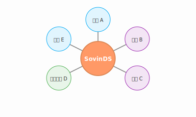

# 第六章 主权个人互联网

> 网络不是一种将人们聚集在一起的手段，它就是人们聚集在一起的结果。
> 佚名

在前二章中，我们详细构建了作为数字主权地基的个人数字系统（SovinDS），并掌握了保护这片领地的核心工具——加密学。然而，孤立的城堡即便再坚固，也无法独自构成一个完整的文明。为了实现真正的主权协作，我们需要将这些独立的“主权孤岛”有序连接。本章要讨论的 SovinWeb（Sovereign Individual Web），正是通过采纳已有的信任网络（Web of Trust, WoT）模式并设计全新的去中心化通信协议，将无数座“数字城堡”通过信任桥梁连接而成的全球大陆。在传统的互联网中，人们像是租住在大型科技平台（如 Facebook、微信、谷歌）提供的廉价公寓里，隐私是租金，数据是被收割的庄稼。而 SovinWeb 彻底颠覆了这种结构：它不再以平台为中心，而是以拥有数字主权的个人为中心。

## 1 为什么需要新的互联网协议？

要理解 SovinWeb 的诞生，并不意味着要否定现有的 TCP/IP 或万维网（Web）协议。事实上，这些底层协议本身是极为成功且中立的协作奇迹，它们完成了信息从物理层到超文本传输的伟大跃迁，支撑了人类历史上最大规模的跨时空协作。真正的问题不在于这些基础协议本身，而在于由于历史局限性而建立其上的“中心化应用范式”。在上个世纪互联网爆发的初期，尽管公钥密码学已经问世，但其实际应用远未成熟，高昂的算力成本与复杂的管理流程使得普通用户根本无法拥有自己的“数字主权工具包”。在这种背景下，早期的互联网应用为了追求效率与用户门槛的降低，不得不将身份验证、数据存储与信用中介等职能全部上收至中心化服务器。这种底层协议的“主权留白”，最终演变成了由巨头平台垄断的“被动信任”模式：个体在连接他人时，必须首先向中介机构让渡自己的基础权利。SovinWeb 的使命，正是要在协议之上补齐这块缺失的“主权层”，通过重构信任模式、归还传播权以及确立主权优先的设计原点，从底层逻辑上完成数字权力的交接。

1.1 信任模式

在信任模式的维度上，数字世界长期在三种范式之间摇摆与博弈，每种模式都代表了对“风险”与“效率”的不同权衡。

首先是目前占据统治地位的高度中心化“被动信任”模式。它的优点在于极致的用户体验和极低的认知门槛，平台作为“超级管家”接管了一切复杂的逻辑。然而，这种模式的代价是权力的极度不对称：用户必须接受平台作为全能神般的“黑盒”运行，将数据、身份乃至资产的生杀大权托付给随时可能修改规则的巨头。在这种语境下，信任本质上是一种基于无奈的数字顺从，一旦中心节点发生故障、受到审查或产生恶意，个体将面临瞬间的“数字放逐”。

其次是以比特币和以太坊为代表的完全去中心化“绝对无信任”模式。这种模式利用共识算法在数学上排除了“人”的不确定性，其优点是拥有无与伦比的抗审查性和不可篡改性。然而，这种模式为了达成全网范围内的高度一致性，付出了极其沉重的架构代价。由于它要求网络中每一个节点都必须对每一个状态变更达成共识，导致系统在处理交互时存在天然的延迟与扩展性瓶颈。在这种范式下，即便是两个邻居之间的微小转账，也被视为必须知会全球的“宏大事件”，这种对“绝对真相”的追求使得网络在应对海量、即时的社会协作时显得异常笨重。

更层的问题在于，这种僵硬的算法逻辑很难承载现实人类社会中那些复杂的、基于语境的信用关系。在“代码即法律”的无信任模型中，人的介入被视为一种威胁，但这同时也剥夺了系统处理异常、意图与社会常识的能力。一个典型的例子是早期的“The DAO”事件：当黑客利用代码逻辑中的漏洞合法地“盗取”资产时，由于缺乏人的介入与主观意愿判断，算法会严格执行这些破坏性的指令。在它眼中，一次恶意的攻击和一次正常的转账在数学上是平等的。又如，在现实的商业信用中，如果一个长期诚信的伙伴因不可抗力遭遇临时的流动性危机，人类的信任模式允许通过主观判断进行债务延期或重组；而在无信任的自动合约中，算法只会冷酷地执行强制清算。这种缺乏“意愿识别”机制，使得数字世界变成了一个脆弱且充满冷酷确定性的丛林，任何微小的代码误差都可能演变成不可挽回的系统性灾难。

SovinWeb 则开辟了第三条道路——社会性信任网络（Web of Trust, WoT）模式。WoT 认为，真实世界的运行并不依赖于全网共识，而是依赖于亲友、伙伴、同事之间点对点的局部信任。它的优势在于极其自然且灵活：它精准地映射了现实中的“社会关系数字孪生”，让信任回归为一种主权个人之间基于数字签名构建的、可验证的社会契约。这种模式既避开了中心化审查的风险，又解决了共识算法的臃肿，让数字连接具备了如肌肉纤维般的自然韧性。

然而，尽管 WoT 在逻辑上最趋近于自由意志的本原，但在过去几十年里，由于缺乏像 SovinDS 这样易用的底层系统，WoT 的基础协议和应用生态发展得异常缓慢。在大多数人的认知中，它仍停留在 PGP（Pretty Good Privacy）时代那种繁琐的密钥交换流程里。在 PGP 的传统实践中，建立信任的过程近乎于某种原始的宗教仪式：用户不仅要手动生成并妥善保管极其脆弱的公私钥文件，还必须在没有任何自动化搜索机制的情况下，通过物理手段去核实对方的身份。为了确保屏幕后的“Alice”确实是其本人，极客们往往需要在线下举行“密钥签名聚会”（Key Signing Parties）。在聚会上，参与者会像交换秘密情报一样互相查验护照或证件，并手动比对那一长串长达数十位的十六进制密钥指纹（Fingerprint）。一旦确认无误，Alice 才会用自己的私钥在 Bob 的公钥上签下名字，这种“数字背书”虽然在数学上无懈可击，但在应用层却极其低效且充满门槛。用户需要亲自处理过期的证书、复杂的密钥环管理，并时刻防范因单个私钥文件丢失而导致的社交网络彻底崩塌。这种极高的认知负荷和缺乏无感交互的现状，导致 WoT 长期处于“有理论、缺工具”的尴尬境地。SovinWeb 的出现，正是要通过现代化的工程手段，激活这一沉睡已久的最优信任范式。

1.2 传播权

在传播权与注意力的争夺中，新协议的必要性体现为对“拉取式主权”的捍卫。现行互联网协议大多默认采用“推送范式”（Push Protocol），这导致了一种“发送者中心”的丛林法则：只要掌握了你的 IP 或 ID，任何营销号、算法平台或骚扰者都能将信息强行塞进你的屏幕。在流量经济的操纵下，我们的注意力沦为被任意收割的公产，认知资源在无尽的通知与算法投喂中碎片化。

SovinWeb 引入的“拉取式协议”（Pull Protocol）彻底扭转了这种权力不对称。在“拉取”模式下，信息的流动不再取决于发送者的意志，而是取决于接收者的请求。这意味着数据默认留在创作者的“城堡”内，只有当获得授权的访问者主动发出查询时，信息才会发生位移。这种范式其实在互联网历史上并非毫无先例。最经典的例子莫过于 RSS（简易信息聚合）：用户通过订阅自己感兴趣的内容源，由阅读器主动去检查并拉取更新，而不是被动等待平台的推送。另一个例子是 BitTorrent（点对点文件分发）：当你想下载一个文件时，你的客户端会主动向拥有该片段的邻居发出“拉取”请求，这种去中心化的协作极大地提高了效率。

然而，这些优秀的拉取式尝试之所以未能成为主流，核心原因在于缺乏一种通用的、与具体应用无关的基础设施。在 RSS 的世界里，如果没有一个集中的平台，普通用户很难发现内容源，也无法管理成千上万个孤立的地址。现有的 Web 协议能够解决“地址在哪里”，却无法在协议层解决“我为什么要信任这个地址”以及“如何安全地拉取私有数据”。当这种通用的、具备主权特质的基础设施缺失时，巨头平台便趁虚而入，通过提供“推送式”的便捷服务换取了用户的注意力和数据所有权。SovinWeb 的使命，正是要建立这种通用的拉取基础设施：它确立了一个默认闭合且静默的私有系统，就像一个安宁的私人图书馆，除非你主动向外发出请求或授权特定的信任节点，否则外界任何比特的流动都无法侵入你的城堡。这种基于协议层的“按需索取”转移，不仅终结了垃圾信息，更让每一个主权个人重新夺回了对大脑认知资源的绝对分配权。

1.3 主权优先：设计的原点

SovinWeb 协议设计的核心逻辑，在于将“主权个人”确立为系统的唯一原点。在这一设计哲学中，现存的利益分配格局、复杂的官僚秩序以及既有的机构权力都不在设计的考虑范畴之内。协议的每一行代码、每一个参数的设定，其出发点都是为了确保个体在数字空间中的绝对自治与防御能力。

在传统互联网中，协议往往是被机构“捕获”的，设计者必须平衡平台与用户、监管与效率之间的多方利益，这导致了主权被稀释。而 SovinWeb 是纯粹的技术理性产物。它不致力于“推翻”某种秩序，而是通过赋予个体完整的数字控制权，使得旧秩序赖以生存的地基自然消解。当个体掌握了身份验证、社交图谱和支付网关的底层控制权时，机构曾经拥有的那种凌驾于个体之上的议价能力便会作为一个“副产品”而彻底瓦解。

这种设计范式带来了几个深远的经济学结论：

- 服务商的工具化降级：当用户握有完整的数据主权，信息服务商将失去“寻租”的门槛。它们将从规则的制定者、权力的垄断者，降级为纯粹的工具开发者。在主权个人互联网中，服务商必须通过提供更极致、更安全的体验来获取用户的临时授权，而非通过封锁数据来锁定用户。
- “退出权”作为数字市场的终极平衡：SovinWeb 确保了用户可以随时带着自己的全部数字资产（身份、历史、关系）无损地迁移。这种“一键搬家”的能力让市场从“捕获经济”回归到“服务经济”。如果一个工具产生恶意或变得臃肿，用户可以瞬间撤销授权并转向竞争对手，这种极高的流动性从根本上消解了平台霸权。
- 官僚租金的终结：不再依赖中心化机构签发信用证或验证身份，意味着围绕这些环节产生的复杂官僚体系将失去存在的必要。价值的发现与协作将沿着信任的脉络自主寻径，将原本被机构攫取的“过路费”重新分配给创造价值的个体。

这种从“设计利益平衡”向“设计个体主权”的深刻转型，才是 SovinWeb 能够从底层逻辑上重构数字文明、并最终构建自由未来的根本动力。

## 2 SovinWeb 的结构

SovinWeb 的构建并非自上而下，而是从每一个主权个体向外生长。它呈现为一种由内而外的生长型拓扑：从每一个独立的主权个人数字系统（SovinDS）出发，通过真实的人际信任向外延展，由微观的、私密的连接最终汇聚成宏大的全球图景。这两者之间存在着严密的递进逻辑：首先是作为数字“原子”的自我网络（Ecocentric Network），它界定了主权个体的安全边界与社交半径；随后是这些原子通过信任重叠而演化出的主权个人互联网（SovinWeb），它展现了去中心化连接所能达到的全球广度与网络韧性。这种“由点及面”的演进，构成了数字主权时代的底层景观。

### 2.1 以个人为中心的自我网络 Ecocentric Network

在 SovinWeb 的架构中，个人的 SovinDS 系统并不依附于任何中央服务器，而是通过一种名为“信任网络”（Web of Trust）的机制，直接连接那些被个体真实信任的对象。这种连接并非生硬的代码指令，而是现实世界复杂社会关系的数字孪生，它精准地映射了从“生死之交”到“泛泛而谈”的完整信任光谱。

作为数字生活的基石，强信任关系构成了自我网络最核心的支柱。这不仅关乎日常的沟通，更涉及主权在生命维度上的延续。例如，在由家庭成员构成的私有网中，强信任协议允许主权个人将珍贵的家族记忆、敏感财务数据甚至是比特币私钥的“死亡开关”备份授权给至亲。这种基于血缘与绝对信任的连接，使得数字资产的继承与共享不再依赖于律师或银行，而成为了主权在家族内部的自然流动。甚至当个体遭遇极端情况，如物理设备丢失或私钥遗忘时，预设的几个强信任节点——如多年挚友或核心合伙人——可以通过共同签名的“社交恢复”机制协助找回身份。这种设计让数字主权的安全性不再孤立地维系于一串冷冰冰的字符，而是深深植根于真实且厚重的人际契约之中。

然而，真实的社交生活并不仅仅由这些深刻的联系组成，自我网络同样包容了广泛的弱连接与临时社交场景。这种灵活性使得网络具备了如同人类肌肉般的伸缩性。例如，对于那些仅仅因为周末球赛而结识的球友，或者在行业会议上初次谋面的同行，主权个人只需通过近场通信交换一个专门针对该场景生成的数字身份。在这种路径下，权限被严格限制在特定的边界内：对方或许只能查阅球赛日程或进行即时名片交换，而无法窥见个体的家庭生活或财务主权。当会议结束或社交兴趣转移，这种弱连接可以被随时撤销或静默，不再像传统社交平台那样，一旦添加好友便意味着将整个人生轨迹向对方敞开。

通过这种颗粒化的身份管理，主权个人得以在不同的社交舞台上自由切换角色。无论是作为核心合伙人签署机密契约，还是作为化名用户参与社区讨论，个体的不同身份之间始终保持着数据上的逻辑隔离。这种“自我网络”构成了个人数字生活的首圈护度河，确保了隐私与安全始终处于个体的绝对掌控之下。

上图勾勒出了“自我网络”作为数字主权基本原子的微观结构。位于核心的主权个人系统（SovinDS）不再是中心化服务器上一个可被随时抹去的被动数据点，而是演化成了自身数字引力场的源头。通过点对点的个人信任连接，它将至亲、挚友与各种伙伴紧密地凝聚在周围，形成了一个个人可控的网络信息系统。在这里，所有的信息流转与隐私屏障都发轫于这种最基础的人际契约，从而确立了主权个体在数字空间中赖以生存的第一道坚实防线。

### 2.2 从个体到全局的主权个人互联网 SovinWeb

当成千上万个这样的“自我网络”相互重叠与交织时，协同效应随之产生，最终汇聚成了全球性的 SovinWeb。这不再是一个由中心化机房驱动的虚拟世界，而是一张巨大的、具备“小世界”特征的数字神经网。它没有中心大脑，却能通过无数个微小的信任节点灵敏地传递价值与信息。在 SovinWeb 的全球图景中，信息的发现与路由不再依赖于搜索引擎的黑盒算法，而是源于真实人际关系的自然延伸。若甲信任乙，乙信任丙，那么甲与丙之间便建立了一条可验证的信任路径。这种“信任跳跃”构成了一种去中心化的寻址机制：当个体在网络中发布信息或寻求服务时，请求会沿着信任的脉络在节点间异步传递，直至抵达匹配的目标。这意味着，网络中的每一笔交易、每一条消息，其实都是在无数个主权城堡之间完成的一次次“握手”，没有任何外部中介能够截获或操纵这个过程。

由于 SovinWeb 彻底消解了“中心服务器”的概念，它展现出了前所未有的网络韧性。在传统互联网中，单一骨干网的故障或巨头服务器的宕机可能导致数亿人的数字生活陷入停滞；但在 SovinWeb 中，网络是分布式的、非线性的。即便某个区域的连接被切断，由于自我网络之间存在大量跨地域的“随机连接”（如跨国好友或国际商务路径），信息总能像流水一样找到新的缝隙继续穿行。

更深层的影响在于，SovinWeb 将数字世界的权力结构从“租户模式”彻底转变为“主权模式”。在这个网络上，不存在可以一键关闭的“全网开关”，也不存在能够随意审查内容的“超级管理员”。每一座 SovinDS 城堡都是独立运行的基站，它们共同维护着一个无须许可、不可封禁的全球基础设施。这种由个体自下而上构建的宏大系统，实现了真正的全球性信息自由与财产自由，让互联网回归了其最初的愿景：一个连接全人类、却不奴役任何人的开放网格。

上图描绘了 SovinWeb 的宏观全景：一个由无数“自我网络”有机交织而成的全球化网格。它不再寄生于中心化的互联网中介，而是通过跨越地理与文化边界的“信任桥梁”，将局部的信任簇连接成一个具备极高冗余度与抗干扰能力的全球生命体。在这一生态中，信息的每一次跳动、价值的每一次流转都顺着信任的脉络自主寻径，彻底摆脱了中心化机构的审查与操纵。至此，全球范围内的信息自由与财产自由不再是遥不可及的政治愿景，而是成为了触手可及的技术现实。

### 2.3 通信与协议：数字世界的隐形动脉

主权个人互联网的运行，不仅需要数字身份的“名片”，还需要切实可行的通信架构。如果把各个主权城堡比作独立的城邦，那么通信信道就是连接它们的各种道路，而协议则是决定包裹如何封装、如何投递以及如何防篡改的法则。

SovinWeb 的通信系统首先建立在极高的适应性之上。它被设计为一种“覆盖网络”（Overlay Network），这意味着它并不依赖于特定的物理媒介，而是能够像一个“不择手段”的信使，灵活调度任何可用的数字化通路。在光纤宽带和移动 5G 覆盖的城市，它利用现有的互联网作为高速公路；在基础设施薄弱或通讯受阻的场景下，它能迅速降级到设备间的蓝牙、点对点 Wi-Fi 甚至是短波无线电；对于身处荒野的城堡，它则可以通过卫星链路实现跨越地理障碍的直接对接。这种“信道无关性”确保了只要环境中存在比特的流动，主权个体的连接就永远不会被彻底切断。

而在这些信道之上奔跑的规则，则体现了一种深刻的“注意力的主权”。传统互联网大多采用“推送”范式，平台和服务商拥有随时向终端“塞入”信息的权利，这正是垃圾广告和算法操控的根源。SovinWeb 彻底扭转了这一逻辑，转向了声明式的“拉取协议”（Pull-based Protocol）。这就像建立了一个安静的私人图书馆，除非主权个人主动发出请求去获取某份特定的内容，否则没有任何外部信息能强行闯入其私有系统。这种范式转移不仅消灭了干扰，更让个体重新夺回了对数字通信的控制权。

与此同时，路由协议也经历了从“找地址”到“找内容”的进化。在传统模式下，你必须知道数据存放在哪个特定的 IP 地址上；而在 SovinWeb 的“命名数据网络”（NDN）中，个体只需向自己的信任网发出一个信号：“谁有这份唯一编号为 X 的文件？”。基于信任路径寻址的路由机制会自动在节点间探寻，如果好友没有，系统会顺着好友的信任网继续向外搜索。这种基于真实社会关系的路由方式，使得信息的获取始终处于一个可审计、可过滤的信任链条之中，极大地过滤了虚假与恶意内容。

最后，安全被深深地刻进了这些隐形动脉的每一处接缝。默认开启的端到端加密（E2EE）确保了任何包裹在离开城堡大门的那一刻起，就进入了不可破解的密文状态，连信道运营商也无法窥视其内容。而为了进一步防御元数据层面的追踪，SovinWeb 甚至模糊了“谁在和谁说话”的社交图谱，通过混淆路径和类似匿名路由的技术，将通信的起源与终点深埋在数字迷雾之中。正是这些隐形的规则，支撑起了一个坚韧、私密且绝对自由的全球网络系统。

## 3 SovinWeb 的核心特质

与传统的中心化互联网相比，SovinWeb 的特质展现了从技术权力向主权个人的深刻转型。这种转型不仅改变了数据的流动方式，更从根本上重新定义了个体在数字丛林中的生存姿态。

3.1 数学驱动的独立性与身份平权

在 SovinWeb 的世界里，身份的产生不再是一场向上位权力的“祈求”。它是纯粹数学的产物，源于个体对随机性的绝对掌控——即抛掷硬币产生的 256 位随机数。这种“数学即身份”的逻辑，赋予了每个节点绝对平等的“数字出生权”。这与需要第三方机构签发证书或平台审核账号的传统体系有着云泥之别。在 SovinWeb 上，没有任何机构可以单方面撤销个人的数字存在，也没有任何力量可以剥夺个体接入网络的天然权利。

我们可以想象这样一个极端的场景：一位身处偏远山区或因自然灾害导致通信基础设施全线崩溃的志愿者。在传统网络架构下，如果无法连接到位于大城市的身份验证服务器，他将陷入“数字死亡”，无法登录任何协作平台或验证自己的身份。然而，依靠 SovinDS 系统的独立性，他的身份始终随身而动。即便外界一切服务都已停摆，只要他能通过手机的蓝牙或点对点 Wi-Fi 连接到近旁另一位志同道合的同伴，两人之间就能瞬间建立起受主权保护的信任信道。这种“生存于边缘”的能力，让网络连接从一种平台赐予的恩惠，回归为个体的基本技术人权。

3.2 完全去中心化的抗脆弱韧性

SovinWeb 的第二个显著特质是其完全去中心化所具备极强的抗脆弱性。由于彻底消解了对中心服务器的依赖，这个网络不再拥有那个脆弱的“单一崩溃点”。它如同一个具备高度自我修复能力的全球性生物组织：如果说传统互联网是一座高度依赖脆弱地基的摩天大楼，那么 SovinWeb 更像是一片茂密的原始森林。

这种韧性在面临宏观灾难时表现得尤为突出。当一场毁灭性的地震摧毁了一个国家的骨干光缆和核心数据中心时，传统互联网会瞬间陷入大面积黑洞，信息的荒漠随之蔓延。但在 SovinWeb 的生态下，受影响地区的节点会自动启动一种名为“信任路径重寻”的生存本能。即便光纤断裂，数据也会敏锐地寻找信任网中那些拥有独立卫星链路或跨城无线电连接的邻居节点进行绕行。这种由内而外的网络韧性，确保了即便在极端的社会动荡或自然灾害中，关键的价值传输和信息流通依然能像岩缝中的流水一样，通过无数细小的缝隙继续穿行。它保护了人类社会的数字化底座，使其不会因为任何单一环节的倾覆而整体崩塌。

3.3 意愿驱动的信息治理与注意力的主权

更为关键的变革在于，SovinWeb 实现了从“算法投喂”向“意愿拉取”的范式飞跃。在传统的中心化平台中，个体往往被动地沉溺于系统精准设计的推送信息中，注意力和认知在流量逻辑的操纵下逐渐碎片化。而在 SovinWeb 的拉取协议驱动下，信息的流动始终始于个体的自主请求——只有当你主动推开城堡的大门，外面的世界才被允许进入。

这种机制将信息质量的过滤权力完整地交还给了用户。基于信任网络（Web of Trust）的寻址逻辑，天然地将无关的杂音、恶意的营销广告和低质的算法垃圾挡在围墙之外。我们可以想象在信息污染日益严重的未来，一个研究者寻求关于某项复杂技术的最真实见解。他的系统不会去检索充斥着利益交换的搜索引擎，而是首先询问其信任网中的同行节点。如果他所在的信任圈层中没有人验证过某份信息的真实性，这份信息甚至不会出现在他的拉取列表中。在这种语境下，通信质量控制（QoS）不再仅仅是带宽资源的分配，而是演变为一种社会信任的技术外延。那些信誉良好、被广泛认可的主权节点将自动获得更精准、更高质的信息路由，从而构建出一个不仅绝对自由，而且由个体意志与社会共识驱动的高纯净度信息生态。

## 4 自由的应用：当权利变为代码

当原本由中心化平台垄断的通信、分发与金融功能被拆解并下放到每一个主权节点时，应用的形态也发生了根本性的质变。事实上，目前互联网上绝大多数广受欢迎的应用——从社交媒体、视频共享到打车和外卖——都可以在 SovinWeb 的架构下重写一遍。在这种重写中，业务逻辑不再运行在巨头的云端，而是运行在参与者的城堡里。

### 4.1 私密通讯：数字世界的“密室对谈”

SovinWeb 彻底还原了现实中“密室对谈”的质感。目前的通信工具即便声称安全，也往往难逃元数据的监视。而在 SovinWeb 上，通信应用直接驱动两座 SovinDS 城堡进行“物理级”的握手。由于采用了拉取协议范式，信息不再是被主动“飞向”对方，而是由对方系统根据信任授权，在需要阅读时主动从你的城堡中“取回”。

这种模式下，没有任何第三方能获知两人的社交图谱，所有的通讯轨迹被深埋在点对点的加密隧道中。想象两名身处异国的合作者正在商讨一项敏感的商业计划，他们的每一次消息传递、每一份文档共享，都像是在一座绝对隔音且位置隐秘的密室中进行。外界不仅听不到内容，甚至根本不知道这间密室的存在。这种极致的隐私不仅保障了表达的自由，更在技术层面上确立了数字空间神圣不可侵犯的边界。

### 4.2 个人门户：回归本质的数字不动产

在 SovinWeb 上，个人网站、视频博客（Vlog）与语音播客（Podcast）不再是依附于流量平台的“内容租客”，而是真正实现了“数字不动产”化。主权个人发布的多媒体内容直接存储并分发于自己的 SovinDS 系统中。对于视频和音频创作者而言，这带来了一种革命性的分发体验。在旧世界中，YouTube 或 Spotify 的算法决定了谁能看到你的视频，谁能听到你的声音。但在 SovinWeb 中，观众和听众是通过其信任路径直接“拉取”内容的。当一名听众订阅了一个主权播客，他的 SovinDS 会定期向创作者的系统发出同步请求，直接获取最新的高品质音频文件。这种模式彻底杜绝了平台对流量的拦截或权力的操纵。同时，创作者可以自主设置访问权限：比如，高质量的 4K 视频流或未删减的语音访谈仅开放给信任网中经过数字签名的支持者。由于去除了中间商，听众的支持可以转化为比特币微额支付，直接跨越网络抵达创作者的钱包，实现了内容主权、技术独立与经济收益的完美合一。

### 4.3 全域价值交换：信任驱动的全球循环

SovinWeb 最深远的变革发生在交易领域，它将信任网络（WoT）转化为了一套天然的全球信用体系。这里的交易不仅限于金钱的往来，更涵盖了广泛的非金融类价值交换。

在金融层面，SovinWeb 完美融合了法币与比特币。主权个人可以直接在加密信道内调取交易对手的“声誉指纹”——即观察对手在信任网中被多少个信誉良好的节点所背书。当一个买家想要购买跨境商品时，双方的主权系统会自动签署一份包含多重签名托管逻辑的数字协议。支付过程通过比特币的瞬间清算完成，或者通过可信路径引导传统的法币转账，整个过程无需通过像 PayPal 或银行这样的传统信用中介，极大地降低了摩擦成本和被冻结资产的风险。

在非金融层面，SovinWeb 同样支持各种形式的互助与易物交易。想象一个“知识技能交换”场景：一名身处伦敦的编程专家想学习中文，而一名在北京的文学爱好者需要优化其 SovinDS 的脚本。两人通过信任网路径相识，由于 WoT 提供了底层的信誉背书，他们可以放心地通过端到端视频建立长期的教学契约。或者，在社区层面的“物资互换”中，居民们可以直接在 SovinWeb 上发布闲置物品的拉取信息。这种去中介化的交易模式让价值的发现回归人与人之间的真实连接，构建了一个在信任与自由基础上的全球价值大循环。

## 5 两种自由：SovinWeb 的权利宣言

SovinWeb 并非遥不可及的技术乌托邦。它就隐藏在每一次抛掷硬币产生的随机数中，隐藏在每一次基于信任的握手里，隐藏在每一个为了捍卫尊严而独立运作的 SovinDS 城堡中。当社会中的个体普遍寻回自身主权，这些孤立的“城堡”便会连通成一片无边的大陆。这不再是一个人们被迫迁徙、寄人篱下的旧网，而是一个真正属于个体的文明纪元。在这个纪元里，自由不再是权力的恩赐，而是技术的本能；连接不再是束缚的锁链，而是通往解放的动脉。主权个人互联网，正是我们夺回数字世界控制权、构建自由未来的最后一片拼图。SovinWeb 的存在，其终极意义在于通过技术手段保障了人类文明中最为宝贵的两种自由：信息自由与财产自由。这不再是写在纸上的法律条文，而是被编译进每一行通信协议、固化在每一个数字节点中的生存权利。

5.1 信息自由：从“被动受体”到“主动节点”

在 SovinWeb 建立之前，所谓的信息自由往往被曲解为“在既定平台上的发言权”。然而，真正的自由远不止于此，它更关乎个体与真相之间的直接联系。SovinWeb 通过去中心化的拉取架构，打破了大型机构对信息的“守门人”地位。当信息的流动不再受制于中枢服务器的审查，当内容的分发回归到真实的人际信任，信息的自由流动便获得了一种物理层面的必然性。在 SovinWeb 上，个体不仅是信息的接收者，更是真理的节点。他可以自由地获取、发布和检索信息，而无需担心被算法贴上标签或因某种立场被无故抹除。这种自由让思想的交流回归到最本质的状态：基于信任的深度连接。它终结了数字平庸主义的统治，让高质量的、真实的、具有个体精神的内容在信任的脉络中永恒沉淀。

5.2 财产自由：主权经济主体的诞生

财产自由是个人独立的基石。SovinWeb 将数字身份、信任网络与去中心化资产（如比特币）深度整合，彻底重塑了人类的经济地位。在这一体系中，个体的财富不再是银行账本上随时可以被冻结的数字，而是受 SovinDS 绝对掌控的私钥主权。通过信任网络进行的全域价值交换，意味着个体可以绕过传统金融体系的所有关卡，直接参与全球化的生产协作。他劳动的产出、创意的价值、资源的盈余，都可以跨越国界与算法的阻碍，在城堡间自由流转。这种自由意味着：我的钱就是我的钱，没有任何力量可以未经我的授权而干预我的资产流向。它将每一个主权个人从传统金融系统的附属品转变为独立的经济主体，赋予了人类文明前所未有的经济韧性与创造活力。
