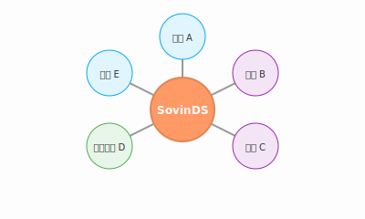
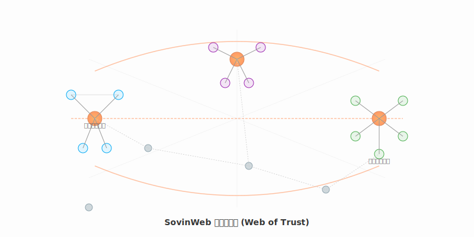

# 第六章 主权个人互联网

> 网络不是一种将人们聚集在一起的手段，它就是人们聚集在一起的结果。
> --- 佚名

在前两章中，我们构建了作为数字主权地基的个人数字系统（SovinDS），并掌握了保护这片领地的核心工具——加密学。然而，孤立的个人城堡即便再坚固，也无法独自构成一个完整的文明。为了实现真正的主权协作，我们需要将这些独立的“主权孤岛”连接起来。本章要讨论的 SovinWeb（Sovereign Individual Web），基于信任网络（Web of Trust, WoT）的理念，旨在设计一种全新的去中心化对等通信协议，将无数座“数字城堡”通过信任桥梁连接成一个新的互联网。在传统的互联网中，人们像是租住在大型科技平台（如 Facebook、微信、谷歌）提供的“数字公寓”里，隐私是昂贵的租金，数据是被收割的庄稼。而 SovinWeb 具有与传统结构完全不同的设计理念：它不再以平台为中心，而是以拥有数字主权的个人为中心。

它是对现有互联网架构的深度补充，精准修复了长期以来由于过度中心化而缺失的个人主权拼图。SovinWeb 并非要彻底取代现有的互联网生态，而是作为一个平行的“主权层”，与现有的网络环境并存并深度交互。这种共生关系意味着，SovinWeb 并不是要在真空中重建一切，而是在现有的信息流动之上，通过加密技术和去中心化协议，为个体找回被平台剥夺的身份、数据与资产控制权。在未来，用户既能享受传统互联网带来的便利连接，又能通过 SovinWeb 的底层保障，确保自己的数字意志独立于任何商业实体的意志。通过这种方式，互联网将完成从“信息互联”到“主权互联”的范式转移，让技术真正回归其服务于人类自由的初衷。

## 1 为什么需要新的互联网协议？

要理解 SovinWeb 的诞生，并不意味着要否定现有的互联网（Internet）或万维网（Web）协议。事实上，这些底层协议本身是极为成功且中立的人类技术杰作，它们实现了从物理比特传输到全球超文本协作的广泛应用，支撑了人类历史上最大规模的跨时空协作。真正的问题不在于这些基础协议本身，而在于由于历史局限性而建立其上的“中心化应用范式”。在上个世纪互联网爆发的初期，尽管公钥密码学已经问世，但其实际应用远未成熟，高昂的算力成本与复杂的管理流程使得普通用户根本无法拥有自己的“数字主权工具包”。在这种背景下，早期的互联网应用为了降低门槛和追求效率，不得不将身份验证、数据存储与信用中介等职能全部上收至中心化服务器。这种应用层协议的“主权留白”，最终演变成了由巨头平台垄断的“被动信任”模式：个体在连接他人时，必须首先向中介机构让渡自己的基础权利。SovinWeb 的使命，正是要用新的通信协议与去中心算法补齐这块缺失的“主权层”，通过重构信任模式、归还传播权以及确立个人主权优先的设计原点，从根本逻辑上完成数字权力的交接。

### 1.1 信任模式

在信任模式维度上，数字世界存在三种范式的博弈，每种模式都代表了对“风险”与“效率”的不同权衡。

首先是占据统治地位的高度中心化“被动信任”模式。所谓被动信任，是指用户无需也无法主动验证交互的安全性与公正性，而是将验证权与控制权全盘托付给中心化中介，并默认接受其设定的所有规则。从社交巨头、金融机构到各类电商平台，当今绝大多数互联网应用都遵循这一模式。这种范式的优势在于极佳的用户体验和极低的学习与理解成本，平台作为“超级管家”接管了绝大多数复杂的应用逻辑。然而，这种模式的代价是权力的极度不对称：用户必须接受平台作为全能神般的“黑盒”运行，将数据、身份乃至资产的生杀大权托付给随时可能修改规则照。在这种语境下，信任本质上是一种基于无奈的数字顺从，一旦中心节点发生故障、受到审查或产生恶意，个体将面临瞬间的“数字放逐”。

其次是以比特币和以太坊为代表的完全去中心化“无信任”（Trustless）模式。所谓无信任，并非指参与者之间缺乏信任，而是指该模式通过共识算法与加密学，将原本对“人”或“机构”的信任，彻底转移到了对“数学”与“协议”的信任之上。 这种模式在数学上排除了“人”的不确定性，其优点是拥有无与伦比的抗审查性和不可篡改性。然而，这种模式为了达成全网范围内的高度一致性，付出了极其沉重的架构代价。由于它要求网络中每一个节点都必须对每一个状态变更达成共识，导致系统在处理交互时存在天然的延迟与扩展性瓶颈。在这种范式下，即便是两个邻居之间的微小转账，也被视为必须知会全球的“宏大事件”，这种对“全体一致共识”的追求使得网络在应对海量、即时的社会协作时显得异常笨重。除了货币这种需要所有参与者达成一致共识的应用，绝大多数人类的贸易与社交活动都是局部的交互与信任，不需要全体共识。

更深层的问题在于，这种僵硬的纯算法逻辑很难承载现实人类社会中那些复杂的、基于语境的信用关系。在“代码即法律”的无信任模型中，为了维持算法的绝对确定性，人的介入往往被视为一种威胁。然而，这种彻底的冷酷性也剥夺了系统处理突发异常、识别真实意图以及利用社会常识进行柔性裁量的能力。一个典型的例子是早期的“The DAO”事件：当黑客利用代码逻辑中的漏洞合法地“盗取”资产时，由于缺乏人的介入与主观意愿判断，算法会严格执行这些破坏性的指令。在它眼中，一次恶意的攻击和一次正常的转账在数学上是平等的。又如，在现实的商业信用中，如果一个长期诚信的伙伴因不可抗力遭遇临时的流动性危机，人类的信任模式允许通过主观判断进行债务延期或重组；而在无信任的自动合约中，算法只会冷酷地执行强制清算。这种对“意图感知”与“社会关系”双重机制的匮乏，使得数字世界变成了一个脆弱且充满冷酷确定性的丛林，任何微小的代码误差都可能演变成不可挽回的系统性灾难。

SovinWeb 则采纳了第三条道路——社会性信任网络（Web of Trust, WoT）模式。所谓信任网络（WoT），是一种去中心化的身份验证与信任管理模型：它将人类日常生活中基于真实互动的信任关系映射为数字逻辑，通过参与者之间点对点的数字签名背书，建立起一个分布式的信用评价体系，从而摒弃了对中心化信用中介的依赖。 WoT 并非一种刻意发明的技术规范，而是对人类社会自然秩序的数字复刻。在现实生活中，除了像货币或宗教这种极少数需要全域达成一致共识的特例，信任从未依赖过所谓的“全网共识”，而是以个体为圆心、通过社交脉络向外层层扩散的局部信任。它遵循着自然界的涌现规律：你信任你的挚友，你的挚友信任他的专业伙伴，信任便通过这种“传递与跳跃”在人群中流转。SovinWeb 利用加密技术，将这种模糊的社会直觉转化为可计算、可验证的数字契约。每一个数字签名都是一次显性的背书，无数个点对点的局部信任交织在一起，最终汇聚成一张自生长、去中心化的全球信任网。这种模式既摆脱了对权力中心的被动依赖，也无需背负全球共识的沉重成本，让数字世界的连接拥有了如人类自然社会合作关系的灵敏与韧性。

然而，尽管 WoT 在逻辑上最趋近于自由意志的本原，但在过去几十年里，由于缺乏像 SovinDS 这样易用的底层系统，WoT 的基础协议和应用生态发展得异常缓慢。在大多数人的认知中，它仍停留在 PGP（Pretty Good Privacy）时代那种繁琐的密钥交换流程里。在 PGP 的传统实践中，建立信任的过程近乎于某种原始的宗教仪式：用户不仅要手动生成并妥善保管极其脆弱的公私钥文件，还必须在没有任何自动化搜索机制的情况下，通过物理手段去核实对方身份。为了确保屏幕后的“Alice”确实是其本人，极客们往往需要在线下举行“密钥签名聚会”（Key Signing Parties）。在聚会上，参与者会像交换秘密情报一样互相查验护照或证件，有时甚至需要手动比对那一长串长达数十位的十六进制密钥指纹（Fingerprint）。一旦当面确认无误，Alice 的真实身份才会与其公钥绑定并得到其他人的认可，这种“数字背书”虽然在数学上无懈可击，但在应用层却极其低效且充满门槛。用户需要亲自处理过期的证书、复杂的密钥环管理，并时刻防范因单个私钥文件丢失而导致的社交网络彻底崩塌。这种极高的认知负荷和缺乏无感交互的现状，导致 WoT 长期处于理论上可行，实际用起来困难重重的尴尬境地。SovinWeb 的出现，正是要通过现代化的工程手段，激活这一沉睡已久、个人可控的信任范式。

### 1.2 传播权

在传播权与注意力的争夺中，新协议的必要性体现为对“拉取式主权”的捍卫。现行互联网协议大多默认采用“推送范式”（Push Protocol），这导致了一种“发送者中心”的丛林法则：只要掌握了你的网络地址或电子邮箱地址，任何营销号、算法平台或骚扰者都能将信息强行塞进你的屏幕。在流量经济的操纵下，我们的注意力沦为被任意收割的公产，认知资源在无尽的通知与算法投喂中碎片化。

SovinWeb 引入的“拉取式协议”（Pull Protocol）彻底扭转了这种权力不对称。在“拉取”模式下，信息的流动不再取决于发送者的意志，而是取决于接收者的请求。这意味着数据默认留在创作者的“城堡”内，只有当获得授权的访问者主动发出查询时，信息才会发生位移。这种范式其实在互联网历史上并非毫无先例。最经典的例子莫过于 RSS（简易信息聚合）：用户通过订阅自己感兴趣的内容源，由阅读器主动去检查并拉取更新，而不是被动等待平台的推送。另一个例子是 BitTorrent（点对点文件分发）：当你想下载一个文件时，你的客户端会主动向拥有该片段的邻居发出“拉取”请求，这种去中心化的协作极大地提高了效率。

然而，这些优秀的拉取式尝试之所以未能成为主流，核心原因在于缺乏一种通用的、与具体应用无关的基础设施。在 RSS 的世界里，虽然网站可以通过代码支持自我发现，但由于缺乏去中心化的全局索引和信任背书机制，普通用户在浩如烟海的孤岛网站中主动寻踪并高效管理订阅源，依然存在极高的门槛。现有的 Web 协议能够解决“地址在哪里”，却无法在协议层解决“我为什么要信任这个地址”以及“如何安全地拉取私有数据”。当这种通用的、具备主权特质的基础设施缺失时，巨头平台便趁虚而入，通过提供“推送式”的便捷服务换取了用户的注意力和数据所有权。SovinWeb 的服务是建立这种通用的拉取基础设施：它确立了一个默认闭合且静默的私有系统，就像一座稳固且守卫森严的数字城堡，除非你主动向外发出请求或授权特定的信任节点，否则外界任何比特的流动都无法逾越边界侵入你的领地。这种基于协议层的“按需索取”转移，不仅终结了垃圾信息，更让每一个主权个人重新夺回了对大脑认知资源的绝对分配权。

### 1.3 个人主权的设计原点

SovinWeb 协议设计的核心逻辑，在于将“主权个人”确立为系统的唯一原点。在这一设计哲学中，现存的利益分配格局、复杂的官僚秩序以及既有的机构权力都不在设计的考虑范畴之内。协议的每一行代码、每一个参数的设定，其出发点都是为了确保个体在数字空间中的绝对自治与防御能力。

在传统互联网中，个人主权被稀释是一个系统性且多维度的过程，其根源在于协议设计时对身份与运作层面的主权缺位。首先，由于底层协议无法原生处理身份，个体被迫接受了由机构托管的“代管身份”。例如，我们习以为常的 OAuth 登录（如使用 Google 账号登录非谷歌的平台服务），表面上提供了便捷，实则将个体的数字生存权质押给了单一巨头——一旦巨头判定你“违规”或决定停止服务，你与成百上千个应用之间的联系将瞬间切断，这种“数字死刑”是传统架构下个体无法回避的梦魇。其次，传统协议催生了“数字圈地运动”，平台通过将社交图谱和用户数据锁定在自家的私有数据库中，构建了极高的退出门槛。以社交媒体为例，你辛苦积累十年的社交关系和内容资产平衡表并不是你的，而是平台的私产；如果你不满其审查政策想离开，你无法带走你的关注者和好友列表，只能选择“净身出户”。此外，在缺乏端到端加密和个人数字系统的情况下，个体的隐私权变成了一种可以被随意解释的“服务条款”。每一个“我已阅读并同意”的勾选框，本质上都是一份权利让渡契约，迫使个体在隐私与数字生活便利性之间进行无望的交换。这种设计导致设计者必须在巨头利益、监管合规与用户体验之间进行多方妥协，最终导致个人主权在层层权衡中被稀释殆尽。

相比之下，SovinWeb 并非某种社会运动的口号，而是纯粹的技术理性产物。它并不通过“推翻”现有法律或官僚体系来争取自由，而是直接通过底层协议的重新架构，赋予个体完整的数字控制权。当个体的身份不再由 Google 或微信“代管”，而是基于本地私钥自证明；当社交关系不再被封锁在平台的封闭数据库中，而是以加密文件的形式在 SovinDS 之间直接流转；当通信网关不再受制于传统中介机构的中心化管控，而是通过点对点的加密信道进行连接与交互——此时，原本由中介机构垄断数据流转而产生的“信息不对称”，以及通过封闭生态和代管机制人为设立的“准入门槛”，便随着这种权力结构的底层置换而彻底失去了存在的基石。机构曾经拥有的那种凌驾于个体之上的议价能力，并不是被有意识地“消灭”了，而是随着技术地基的整体置换，作为一种过时的“副作用”而自然瓦解。这种设计范式带来了几个深远的社会结构变化：

- 服务商的基础化降级：当用户握有完整的数据主权，信息服务商将失去“寻租”的门槛。它们将从规则的制定者、权力的垄断者，降级为纯粹的基础服务提供者。在主权个人互联网中，服务商必须通过提供可靠、安全的信息系统基础设施来吸引用户，而非通过封锁数据来锁定用户。在托管运行的 SovinWeb 系统中，用户拥有所有应用与数据的主权，服务商只收取基础设施服务的费用。
- “退出权”作为数字市场的终极平衡：SovinWeb 确保了用户可以随时带着自己的全部数字资产（身份、历史、关系）无损地迁移。这种“一键搬家”的能力让市场从“捕获经济”回归到“服务经济”。如果一个工具产生恶意或变得臃肿，用户可以瞬间撤销授权并转向竞争对手，这种极高的流动性从根本上消解了平台霸权。
- 官僚租金的终结：不再依赖中心化机构签发信用证或验证身份，意味着围绕这些环节产生的复杂官僚体系将失去存在的必要。价值的发现与协作将沿着信任的脉络自主寻径，将原本被机构攫取的“过路费”重新分配给创造价值的个体。

这种从“机构利益”向“个体主权”的深刻理念转型，才是 SovinWeb 能够从底层逻辑上重构数字文明、并最终构建自由未来的根本动力。

## 2 SovinWeb 的结构

SovinWeb 的构建并非自上而下，而是从每一个主权个体由内而外的自然生长。从每一个独立的主权个人数字系统（SovinDS）出发，通过真实的人际信任向外延展，由微观的、私密的连接最终汇聚成宏大的全球图景。这一自然生长的网络呈现出两个清晰的逻辑层次：第一层是以个人为圆心、通过直连信任构建的自我网络（Ecocentric Network），它精确映射了现实生活中的亲疏远近，划定了主权个体的第一道数字安全边界；第二层则是无数自我网络通过信任重叠与互联而形成的主权个人互联网（SovinWeb），它通过去中心化的方式实现了信息的全球化寻址与网络的极强韧性。这种“由点及面”演进，构成了数字主权时代的底层景观。

### 2.1 以个人为中心的自我网络 Ecocentric Network

自我网络（Ecocentric Network）是一种在逻辑和物理上都以主权个体为原点的网络拓扑。如果说传统的平台模式是“条条大路通罗马”（所有数据流向中心），那么自我网络则是“我即中心”——个体不仅是信息的出发点与终点，更是其数字世界的主权核心。它精准地模拟了生物个体的生存状态：每个生命都以自己为坐标系去感知和构建外部世界，通过信任的强弱来决定互动的深度与广度。

在 SovinWeb 的架构中，个人的 SovinDS 系统并不依附于任何中央服务器，而是通过一种自然的“信任网络”（Web of Trust）机制，直接连接那些被个体真实信任的对象。这种连接并非生硬的代码指令，而是现实世界复杂社会关系的数字孪生，它精准地映射了从“生死之交”到“泛泛而谈”的完整信任光谱。

作为数字生活的基石，强信任关系构成了自我网络最核心的支柱。这不仅关乎日常的沟通，更涉及主权在生命维度上的延续。例如，在由家庭成员构成的私有网中，强信任协议允许主权个人将珍贵的家族记忆、敏感财务数据甚至是比特币私钥备份授权给至亲。这种基于血缘与绝对信任的连接，使得数字资产的继承与共享不再依赖于律师或银行，而成为了主权在家族内部的自然流动。甚至当个体遭遇极端情况，如物理设备丢失或私钥遗忘时，预设的几个强信任节点——如多年挚友或商业委托人——可以通过共同签名的“社交恢复”机制协助找回数字身份或比特币密钥。这种设计让数字主权的安全性不再孤立地维系于一串冷冰冰的字符，而是深深植根于真实且厚重的人际契约之中。

然而，真实的社交生活并不仅仅由这些深刻的联系组成，自我网络同样包容了广泛的弱连接、临时社交场景，乃至与中心化机构的交互。值得注意的是，自我网络并非要彻底排斥现有的中心化机构，这些基于被动信任的机构同样可以被看作是自我网络的组成部分。传统的银行、大型社交平台、云服务商，在现阶段仍具有显著的存在价值和使用价值，尤其是在处理高频次、标准化事务或提供大规模公共基础设施方面。在 SovinWeb 的拓扑中，它们是位于外围或特定功能区的节点，主权个人根据需求与之建立连接。这让 SovinWeb 具有很大的应用灵活性。例如，对于那些仅仅因为周末球赛而结识的球友，或者在行业会议上初次谋面的同行，主权个人只需通过近场通信 （NFC） 交换一个专门针对该场景生成的数字身份。在这种路径下，权限被严格限制在特定的边界内。随着可控信任网络（WoT）逐渐提供更多成熟的替代方案——如更私密的存储、更自由的金融清算——个体对这些中心化机构的“被动信任”会自然而然地减少。这并不是一场权力的零和博弈，而是随着工具的丰富，个体获得了重新分配信任、选择最优路径的主动权。

通过这种颗粒化的信任管理，主权个人得以在不同的社交舞台与商业活动中自由切换角色。无论是作为核心合伙人签署机密契约，还是作为化名用户参与社区讨论，个体的不同身份之间始终保持着数据上的逻辑隔离。这种“自我网络”构成了个人数字生活的首圈护度河，确保了隐私与安全始终处于个体的绝对掌控之下。

### 2.2 从个体到全局的主权个人互联网 SovinWeb

当成千上万个这样的“自我网络”通过信任的脉络相互重叠与交织时，一种超越局部连接的协同效应随之产生，最终汇聚成了全球性的 SovinWeb。这不再是一个由中心化数据中心驱动、由算法黑盒操纵的虚拟世界，而是一张巨大的、具备“小世界”特征的数字神经网。在这个网络中，信息的发现与路由不再依赖于大型搜索引擎的抓取与权重分配，而是源于真实人际关系的自然延伸与信任共鸣。根据著名的“六度分隔”理论，在全球范围内，任何两个主权个体之间往往只需通过少数几个中间人的信任背书即可建立联系。SovinWeb 将这种潜藏的社会势能转化为了切实的技术协议：若甲信任乙，乙信任丙，那么甲在寻找特定的知识、资源或服务时，请求便能顺着这条可验证的信任路径安全抵达。这种“信任跳跃”构成了一种去中心化的、具备自我净化能力的寻址机制，确保了网络中的每一笔价值流转与每一条消息交互，其实都是在无数个主权城堡之间完成的一次次真实的信任传递，彻底杜绝了虚假流量与中介的操纵空间。更重要的是，SovinWeb 应该是未来数字世界应用的主要载体与操作系统。它不仅仅是一个新应用范式，而是一个确立了用户对数据、算法、信任以及传播权进行全维度掌控的全球数字新生态。

上图描绘了 SovinWeb 的宏观全景：一个由无数“自我网络”有机交织而成的全球化网格。它不再寄生于中心化的互联网中介，而是通过跨越地理与文化边界的“信任桥梁”，将局部的信任簇连接成一个具备极高冗余度与抗干扰能力的全球生命体。在这一范式下，应用不再是权力的霸主，而是回归到了服务的本质。首先，这种系统实现了数据控制权的彻底倒置。在传统模式下，数据是被禁锢在应用服务器里的资产；在 SovinWeb 中，数据物理性地存储于个体的 SovinDS 城堡内，应用逻辑只是经过认证与授权的“登门拜访”客体。这种转变带来的好处是巨大的：它打破了平台垄断的数据孤岛，使得不同的应用可以在用户的授权下无缝协作，创造出远超单一平台能力的复合型服务。其次，SovinWeb 赋予了用户对算法的审计与选择权。用户不再是被动接受黑盒算法“喂养”的受体，而是可以自主选择信任的算法逻辑来处理信息。这种算法透明化消解了算法霸权，让个体的注意力和认知空间重新获得了主权的庇护。

更深层的意义在于对信任与传播权力的重构。在 SovinWeb 这个全球网络操作系统上，社交图谱和信用记录是用户的个人资产，而非某个平台的锁定数据。这意味着“退出成本”降为零：如果一个社交工具变得臃肿或产生恶意，用户可以带着其完整的社交关系瞬间迁移到另一个系统，而无需经历“净身出户”的痛苦。同时，基于拉取协议的传播范式，使得信息的分发回归到了真实的人际信任。这不仅根治了垃圾信息和中心化审查的顽疾，更让高质量、真实且具有个体精神的内容在信任的脉络中获得了永恒的沉淀。这种由用户全权掌控核心支柱的架构，使得 SovinWeb 演变成了一个全球化、无国界的协作基础设施，它不具备单一崩溃点，也不受任何外来实体的监控，让互联网真正回归到了开放、平等、自由的公共财产初衷。

这种新型网络的抗脆弱性还源于其独特的彻底去中心化分布特性。在传统架构中，单一骨干网的故障或巨头服务器的宕机可能导致数亿人的数字生活瞬间陷入瘫痪；但在 SovinWeb 中，网络是弹性的、自发的和动荡的。即便局部地区的物理连接被切断，由于自我网络之间存在大量跨地域的“随机连接”（如跨地区好友或国际商务路径），信息总能像林间交织的地下菌丝网络（Mycelial Network）一样，即便局部路径受阻，也能凭借其天然的去中心化结构和生物智能般的灵活性，敏锐地找到新的缝隙继续穿行。这种由个体自下而上维护的宏大系统，消解了“全网开关”存在的可能性，也剥夺了“超级管理员”审查内容的权限。每一座 SovinDS 城堡都是独立运行的数字基站，它们共同维护着一个无须许可、不可封禁的全球基础设施。至此，SovinWeb 实现了真正的全球性信息自由与财产自由，标志着人类文明正式迈入了以个人主权为核心的数字新纪元。

## 3 SovinWeb 架构

主权个人互联网的运行，不仅需要数字身份的“名片”，还需要一套切实可行的通信架构。如果把各个主权城堡比作独立的城邦，那么通信信道就是连接它们的道路，而协议则是决定包裹如何封装、如何投递以及如何防篡改的法则。

### 3.1 信道无关的覆盖网络

SovinWeb 的底层通信被设计为一种高度适应性的“覆盖网络”（Overlay Network）。这意味着它在逻辑上“漂浮”在任何具体的物理媒介之上，具备极强的信道无关性（Channel Independence）。在繁华的都市，它可以利用现有的互联网骨干网或5G 信号作为高速公路；而在基础设施受损、自然灾害或人为封锁的极端场景下，它能瞬间切换到备选的物理层：利用短波无线电实现跨越山脉的低速连接，通过卫星链路实现跨越地理屏障的直接对接，甚至利用蓝牙或超宽带（UWB）在密集人群中进行短距离群体通信。这种“不择手段”的通信本能，确保了主权城堡之间的连接很难彻底断绝。它将互联网或任何的特定网络视为一种可选的承载而非唯一的生命线，这种“数字游击”般的灵活性使得 SovinWeb 具备了类似生命系统的边缘生存能力。

想象一场大地震后的灾区，基站损毁，传统应用全部瘫痪。然而，基于 SovinWeb 的设备会自动激活“信道发现”，与附近百米内的邻居建立 Direct Wi-Fi 连接。这些局部的、零散的信任节点会自发汇聚成一个流动的 Mesh 网络。受困者可以向附近发送带有地理坐标的加密求救信标。即便外界的互联网大陆已经沉默，局部地区依然能通过个体间的信息连接进行合作。

### 3.2 从被动到主动的范式转换

在通信范式的设计上，SovinWeb 彻底终结了传统互联网长期奉行的“推送模式”（Push Paradigm），确立了以个人意志为核心的声明式“拉取协议”（Pull-based Protocol）。

我们可以通过一个通俗的视角来审视这两种范式的本质不同。传统的推送模式就像是一个喧闹的露天广场，每个人都暴露在公共街道上。发送者（如营销算法、垃圾邮件商）拥有随时拦住你、并将传单强行塞入你手中的特权。在这种“发送者中心”的逻辑下，个体的注意力沦为被任意收割的公产，任何掌握你地址的人都能对你发起侵扰。与之形成鲜明对比的是，SovinWeb 将数字空间重塑为由无数座独立城堡构成的领地。在主权个人的图景中，每个人都退回到由 SovinDS 守卫的数字城堡内。这种架构从根本上取消了“公共街道”的暴露性：所有资源和服务都如同城堡深处的藏书，处于缺省的静默状态。除非主权个人产生明确意图，主动对外发出一个经过数字签名的“拉取请求”，并授予特定的访问权限，否则城堡的大门永远紧闭，信息的流动绝不会发生。

这种范式飞跃赋予了系统一个强悍的防御性特性：协议级静默。如果你的城堡没有主动向外发出“邀请”或“拉取信号”，外界发来的任何数据包在触碰到网络边界时，都会被底层协议直接丢弃。这不仅在物理层面上根治了 DDoS 攻击和黑客扫描，更捍卫了个体神圣不可侵犯的“数字宁静权”——你的数字领地，唯有在获得授权后方可进入。

### 3.3 基于信任的内容寻址

路由协议在 SovinWeb 中经历了从“找地址”到“找内容”的颠覆性进化。要理解这种跨越，首先需要洞察传统互联网“位置驱动”模式的天然脆性：在 IP 协议架构下，所有的通信都极其依赖于服务器的具体地理位置映射。这就像在现实中寻人，如果你只知道对方的门牌号（IP），一旦他搬离或房屋被封锁，你即便知道他在逻辑上依然存在，也无法建立连接。这种模式导致了信息对中心化服务器的深度寄生，一旦服务器关闭，信息即宣告死亡。相比之下，SovinWeb 采纳了命名数据网络（NDN）架构，将寻址的核心转向了“内容本身”。在 NDN 的逻辑中，信息的唯一标识是其内容的数学哈希名称，而非其存储的物理位置。这就像是在一座宏大的全球图书馆中寻书，你只需报出书籍的唯一编号，而无需关心这本书究竟被锁在主楼的哪个房间，还是正放在某位读者的书桌上。

在 SovinWeb 的信任网中，这种寻址机制被赋予了高效且具备社会属性的交互逻辑。当 Alice 需要获取一份特定的文件或服务“X”时，她的 SovinDS 会启动一个“兴趣包”路由过程。Alice 的系统会向其自我网络内的信任节点广播这一需求。如果好友 Bob 手中没有这份数据，他的系统并不会返回错误，而是会顺着自己的信任脉络继续向外传播 Alice 的“兴趣”。这个过程就像是在复杂的森林路径中洒下了一串指向 Alice 的面包屑，每一个接收并转发请求的节点都会在自己的“待决请求表”中标记出这个兴趣包的来向，从而建立起一条临时的、反向的意愿路径。寻址不再是一个盲目的、对全球 IP 库的探测过程，而演变成了一场在信任脉络中进行的意愿共鸣与价值发现。一旦该“兴趣包”触达到了网络中任何一个存有该内容的节点，带有内容实体的“数据包”就会顺着这些预留的“面包屑”路径，原路返回给 Alice。Alice 的 SovinDS 在接收到数据的一瞬间，就能利用内置的加密学工具验证数据包自带的数字签名。这种架构赋予了网络极高的效率：一旦验证了可信的数据源头，Alice 的系统既可以顺着原来的面包屑路径异步获取后续数据，也可以选择与该源头建立更高速的直接连接，甚至直接从物理距离更近、网络延迟更低的邻居缓存中拉取。在内容寻址的世界里，只要内容是通过原作者私钥签名的，它来自哪里并不重要。这种“就近拉取”和“多点并行”的机制极大降低了核心节点的负载，并显著提升了大规模内容分发的响应速度。

更为精妙的是，内容寻址还能天然地实现一种去中心化订阅机制。在 SovinWeb 中，订阅不再需要依赖中心化的协调中介，而是表现为 Alice 对某个“命名空间”（如 Bob 的发布频道）的长久兴趣。Alice 可以在网络中撒下一串“命名空间兴趣包”，标记她对 Bob 未来更新的关注。每当 Bob 发布了带有其签名的内容碎片，这些数据就会顺着信任脉络中预设的“兴趣路径”自动回流。由于整个过程基于信任路由，这不仅避免了中心化平台的流量拦截和算法干扰，更通过网络层的多点缓存极大提升了更新效率。由于数据包的路由完全依赖于“兴趣”在信任网中的传播，这种机制天然地构建了一个具备自净能力的生态：如果一份信息（如虚假广告或恶意病毒）在 Alice 的信任圈层中从未获得过信誉良好节点的背书，它将无法触发转发逻辑，最终会因为无法建立有效路径而自动“饿死”在数字荒漠中。至此，寻址彻底从冷冰冰的地址比对，升华为了一场基于社会共识与主权意愿的动态寻径。

### 3.4 缺省的端到端加密（E2EE）与主权防御

安全并非 SovinWeb 的一种附加功能，而是被深度刻进了通信动脉每一处接缝的底层基因。在 SovinWeb 的逻辑中，端到端加密（End-to-End Encryption, E2EE）被确立为系统的缺省通信模式。要理解其重要性，首先需要区分传统互联网中常见的“传输层加密”。在大多数主流应用中，数据虽然在传输过程中是加密的，但服务商在服务器端掌握着解密密钥，这意味着你的信息对于“管家”而言是全透明的。而 SovinWeb 的 E2EE 确保了密钥（Key）始终且仅存在于通信双方的 SovinDS 城堡内，任何包裹在离开城堡大门的那一刻起，就进入了由数学逻辑守护的绝对密文状态。这意味着连信道运营商、互联网服务提供商（ISP）甚至中间所有的路由节点都无法窥视其任何内容。

这种“数学锁死”机制带来了无与伦比的主权防御优势。首先，它彻底终结了中间人攻击和大规模监视的可能性：由于没有任何中心化机构持有“万能钥匙”，数据的安全不再依赖于对他人的信任，而是依赖于不可撼动的物理规律和加密算法。其次，它保障了数据的完整性，任何对密文的微小篡改都会导致解密失败，从而确保了信息的原汁原味。在 SovinWeb 中，E2EE 这种非对称防御能力赋予了个体在数字丛林中的安全，使得城堡之间的每一次交互都像是在无法偷听的密室中进行。

更为激进且深远的变革在于 SovinWeb 对元数据（Metadata）的深度防御。在目前的互联网生态中，即便通信内容被加密，你的“社交足迹”——即谁在和谁说话、说话的时间、频率以及物理位置——依然会暴露给监控者。这些元数据通过关联分析，足以精准地勾勒出一个人的社会关系网和行为模式，从而实现“无内容监视”。SovinWeb 通过将 E2EE 与混淆路由和匿名网络技术深度结合，不仅隐藏了对话的内容，更将通信的起点与终点掩埋在数字迷雾之中。它通过不断变换的节点路径和流量混淆，切断了元数据与真实身份之间的联系。这不仅保护了“说了什么”，更从协议层捍卫了“谁在和谁交往”这一核心社交主权。通过这种多层级的绝对防护，SovinWeb 构建了一个坚韧、私密且绝对自由的全球通信网格，真正实现了数字空间中个体主权的神圣不可侵犯。

## 4 一种自然生长的数字网络

基于上述协议层的创新与架构重组，可以看到 SovinWeb 展现出了从“平台中心”向“主权个人”的根本转型。这种转型并非通过商业巨头的顶层设计，而是由于它本身就是一个完全自发、植根于自然社会关系的有机协作网。它精准地映射了人类文明数千年来演化出的原始秩序：信任不是被某种权力机构自上而下赋予的，而是通过真实的交互在主权城堡之间自然“涌现”的。这种网络的自发性与对等性，使得数字世界的权力结构从等级森严的“主从关系”彻底回归到了自然正义的“伙伴协作”，从而在技术底座上实现了对传统互联网的全面置换与功能增强。

这种秩序的基石首先源于数学驱动的身份平权。在 SovinWeb 的世界里，个人的数字身份不再是一场向上位权力祈求的“恩赐”。在传统架构中，个人的生存权被质押在服务商的数据库里，所谓的账号本质上是随时可以被收回的特权。而 SovinWeb 将身份锚定在纯粹的数学随机性上——那是个体通过抛掷硬币生成的 256 位随机数。这种“数学即身份”的逻辑，不仅消除了第三方的准入限制与寻租空间，更赋予了每个节点平等的“数字出生权”。这种独立性确保了即便物理世界的中心化机构悉数停摆，只要主权个人手中持有 SovinDS 和私钥，他的社交契约与数字主权就始终完整。这种将连接从“平台特权”还原为“基本人权”的转变，构成了数字化生存中不可撼动的地基。

在这种身份平权的基础上，SovinWeb 构建了全程对等的协作架构。通过 Peer to Peer（P2P）通信范式，它打破了旧世界中“客户端-服务器”的权力非对称性。在这一范式下，每一个数字城堡在逻辑和功能上都是完全对等的伙伴，既是信息的请求者，也是服务者。这种架构不仅通过去中介化消除了中间人的拦截风险，更带来了一种独特的效能涌现：网络并不因为用户增加而变得臃肿，反而因为更多节点的加入而获得了更丰富的路由路径和数据备份。这种“人人都是基站”的逻辑，让网络展现出了类似生物组织的抗脆弱韧性。就像交织在地下的菌丝网络，当外部环境遭遇灾难或人为封锁时，局部城堡会自动启动“信任寻径”本能，利用 Direct Wi-Fi 等边缘连接技术建立信息的微循环。这种由内而外的自我修复能力，确保了关键的信息流能像岩缝中的流水一样持续穿行，从物理底层保护了人类协作的连续性。

最终，这种自然秩序在用户交互层面体现为一种意愿驱动的认知主权。SovinWeb 通过拉取协议彻底终结了“算法投喂”对个体精神的入侵。在传统的推送瀑布中，人们被动地消耗着碎片化的信息；而在 SovinWeb 的图书馆范式下，所有的信息流转都必须始于主权个体的明确请求。结合内容寻址与信任网的过滤机制，恶意营销、算法垃圾和无关杂音被物理性地挡在数字边界之外，使得城堡的大门只向信任的意愿开启。这种对“数字宁静权”的捍卫，配合缺省的端到端加密与深度元数据防御，将数字城堡从透明的培养皿重塑为军事级的堡垒。它不仅保护了对话的内容，更掩埋了社交的轨迹，真正实现了“技术作为自由的屏障”。在这种全方位的增强下，人类的数字生活正式告别了信息焦虑与监控阴影，实现了主权尊严在虚拟空间中的完全觉醒。

## 5 主权应用的崛起与自由的回归

当权利变为代码，原本由中心化平台垄断的通信、分发与金融功能被拆解并下放到每一个主权节点时，应用的形态也发生了根本性的质变。在 SovinWeb 的架构下，业务逻辑不再运行在巨头的云端，而是运行在参与者的城堡里。这种“权利变为代码”的进程，不仅催生了一系列前所未有的新型应用，更通过这些技术实践，保障了人类文明中最为宝贵的两种自由：信息自由与财产自由。

### 5.1 数字世界的有机协作与主权应用实践

在主权个人互联网中，社交媒体、视频分发乃至金融服务都回归了其“工具”的本质，从权力的垄断者降级为个体的数字仆从。

首先，SovinWeb 彻底还原了现实中“密室对谈”的通讯质感。目前的通讯工具，如微信或 WhatsApp，即便声称安全，其聊天记录和社交图谱依然被存储在平台的中心化服务器上，面临着被审计、封禁或泄露的风险。而在 SovinWeb 上，通讯应用直接驱动两座 SovinDS 城堡进行点对点（P2P）的逻辑握手。由于采用了拉取协议范式，你发出的信息并不会被“推”向某个中心暂存，而是静默在你的城堡内。只有当对方系统根据你授予的信任权限，并在对方点击阅读的瞬间，才会主动从你的城堡中将数据“拉回”。这种模式下，没有任何第三方能获知通信的发生。想象两名身处异国的合作者正在商讨一项敏感的商业计划，他们的每一次消息传递、每一份文档共享，都像是在一座绝对隔音、且在地图上不可见的移动密室中进行。这种极致的隐私不仅保障了表达的自由，更在协议层确立了数字空间神圣不可侵犯的边界。

与此同时，SovinWeb 上的个人门户、视频博客（Vlog）与语音播客（Podcast）实现了真正的“数字主权不动产”化。在旧有的 YouTube 或 Spotify 范式里，创作者本质上是平台的佃农：平台可以随时封禁你的频道，抽取高昂的佣金，而你积累的订阅者数据其实属于平台的私产。但在 SovinWeb 中，这种寄生关系被物理性地切断了。你的内容直接存储于你自己的 SovinDS 系统中，内容寻址架构确保了听众是直接访问你的“数字城堡”来获取流媒体。这意味着创作者夺回了完整的分发权与治理权：你可以自主定义访问策略，例如，为核心支持者开放 4K 原始素材，或为特定信任等级的好友开放未剪辑的幕后花絮。这种模式下，订阅关系不再是平台数据库里的一条记录，而是主权城堡之间真实的意愿连接。

这种变革最终在交易领域引发了深远的连锁反应。SovinWeb 将信任网络（WoT）转化为了全球性的信用体系，消解了银行和支付平台的门槛租金。这里的交易不再仅仅是金钱的往来，更涵盖了广泛的非金融价值交换。当 Alice 想要向身在柏林的陌生创作者 Bob 购买一份设计稿时，她不需要信任 Bob 本人，只需通过 SovinWeb 观察其在信任网中的“声誉指纹”——即 Bob 被多少个 Alice 信任的节点背书过。如果路径可达，Alice 的系统会自动签署一份包含多重签名托管逻辑的数字协议。整个过程无需通过第三方信用中介，极大降低了摩擦成本。甚至在非金融层面，这种模式支撑了极其灵活的互助协作，如 Alice 为 Bob 提供语言指导，而 Bob 为 Alice 提供网页设计。这种去中介化的协作模式让价值发现回归真实的人际连接，构建了一个基于信任的全球价值大循环。

在这一系列应用的背后，SovinWeb 与经过时间检验的比特币生态可以实现深度融合。这种融合并非偶然的拼凑，而是基于两者共有的去中心化基因——SovinWeb 致力于信息与信任的对等流转，而比特币专注于价值与资产的无国界清算。这种天然的哲学同构性，使得两者在技术逻辑上表现出极高的集成效率：主权网络可以直接利用比特币作为全球结算层的流动性与安全性，而无需“重复造轮子”。为了支撑主权应用中极其精细的价值脉动，SovinWeb 可以广泛采用比特币的基本货币单位——“聪”（Satoshi）。正如“分”是法币的基础，1 个比特币可细分为一亿个“聪”。这种极致的可分割性配合 SovinWeb 的点对点协议，让微额支付变得如呼吸般自然：在观看视频或收听播客时，价值的流动可以精确到“按秒计费”，每一分钟、甚至每一秒产生的微小回馈都会实时穿越网络，直达创作者的数字城堡。这种信息主权与货币主权的同构集成，真正实现了内容独立、技术自治与微型经济的完美合一。

### 5.2 自由的降临：从“被动受体”到独立经济主体

这些主权应用的普及，其终极意义在于保障了信息自由与财产自由。这种自由不再是仅存于纸面上的法律条文或社会契约，而是被直接编译进每一行通信协议、由个体信任与数学规律共同固化的生存权利。

在信息自由层面，SovinWeb 彻底粉碎了大型机构作为信息“守门人”的特权。当信息的流动不再受制于中心化服务器的审查与算法偏见，分发逻辑回归到基于真实人际的信任背书，个体便从信息的被动接收者进化为信息的自主分发节点。他可以不受阻碍地获取、发布和检索信息，无需担心因立场偏好被贴上标签，或由于不可预测的规则变动而被无故抹除。这种自由让思想的交流回归到最纯粹的本质：即基于信任的深度连接与意志共鸣。它终结了数字平庸主义的统治，让那些高质量、具备独特个体精神的内容能在信任的脉络中获得永恒的沉淀。

在财产自由层面，SovinWeb 赋予了每一个主权个人作为“独立经济主体”的崇高地位。财产自由是个体独立的最终基石，通过将数字身份、信任网络与比特币这一主权资产进行深度整合，SovinWeb 彻底重塑了人类的经济协作图景。利用比特币生态的无缝嵌套，主权个人系统避开了传统金融体系中繁琐的汇兑流程与严苛的机构审查，使财富不再是银行账本上随时可能被冻结或稀释的抽象数字，而是受 SovinDS 城堡绝对掌控的私钥主权。在这种基于信任网络的全域价值交换范式下，个体可以绕过所有外部关卡，直接参与全球化的生产协作。无论是跨越国境的大额资产转移，还是以“聪”为单位的微型情感打赏，他的劳动产出、创意价值与资源盈余，都能跨越地理边界，在城堡之间自由流转。这种自由宣告了一个深刻的逻辑：我的财产由我支配，没有任何力量可以未经授权干预我的资产流向。

更深层地看，信息自由与财产自由的交织，必然催生出一种全新的“主权自由市场经济”。这种经济范式彻底重塑了传统的市场边界：当信用不再由中心化的金融机构或评级巨头垄断，而是通过主权个人之间的信任网络（WoT）自下而上地涌现时，价值的流动便摆脱了机构寻租的枷锁。在这种去中介化的协作模型中，每一个数字签名不仅是身份的验证，更是信用的加注，无数真实的、局部的信任交互交织成一张全球性的、不可篡改的声誉图谱。交易不再是冰冷的、被外部实体监控的买卖行为，而是城堡之间基于共识的深度主权协作。它消解了原本被庞大官僚体系占据的交易成本，让价值能够沿着信任的缝隙实现秒级、无损的精准传递。这种模式不仅让主权经济体不再依赖于任何国家的货币政策或政治博弈，更在根本上强化了个体的独立性——它加速了权力的原子化转移，使主权个人，而非国家或大型机构，正式成为数字经济时代最基本、最核心的组成结构。在这样的自由市场中，个体的意志不再是宏大叙事下的被动受体，而是驱动全球价值流转的主动逻辑原点。这种经济模式的优越性在于它赋予了人类文明前所未有的韧性：自由不再是权力的恩赐，而是主权个人的本能。

在本章中，我们见证了 SovinWeb 如何通过重构协议与信任，为主权个人与主权自由市场经济筑起了一道坚固的数字屏障。然而，一个由主权个人构成的数字文明，不仅需要自由流动的比特，更需要一种不被任何人操纵、不被任何意志冻结的底层价值标准。如果说 SovinWeb 是主权文明的血肉与经脉，那么主权货币就是支撑其运转的核心骨骼。在接下来的第七章中，我们将深入金融的迷雾，揭开货币在数字时代的真实面目，探索比特币——这枚跨时代的数字硬币，究竟是如何在算法的纯净中，重构人类文明的价值根基并开启主权金融的新纪元。
