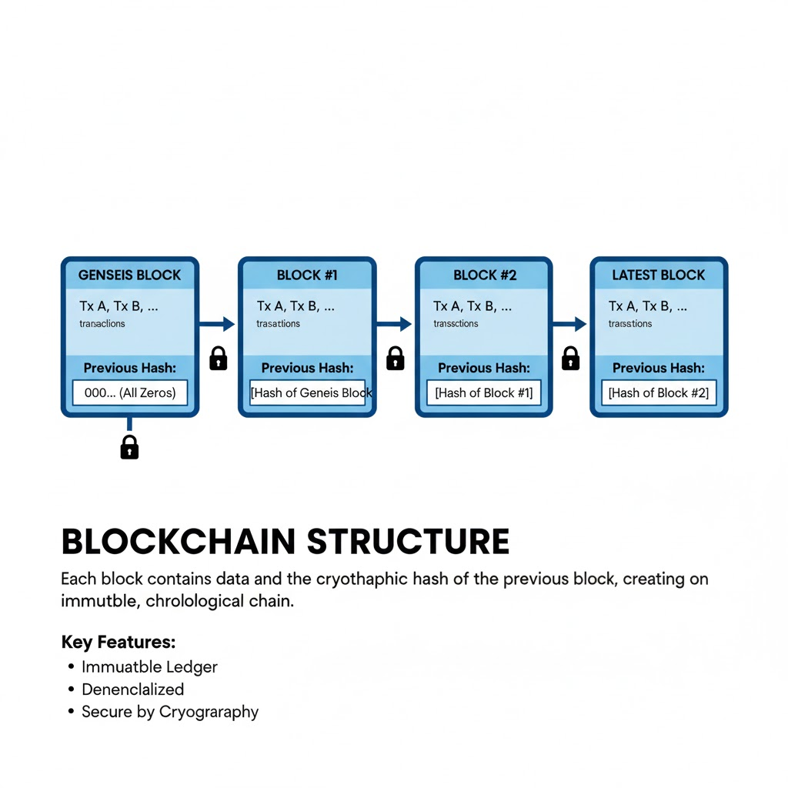
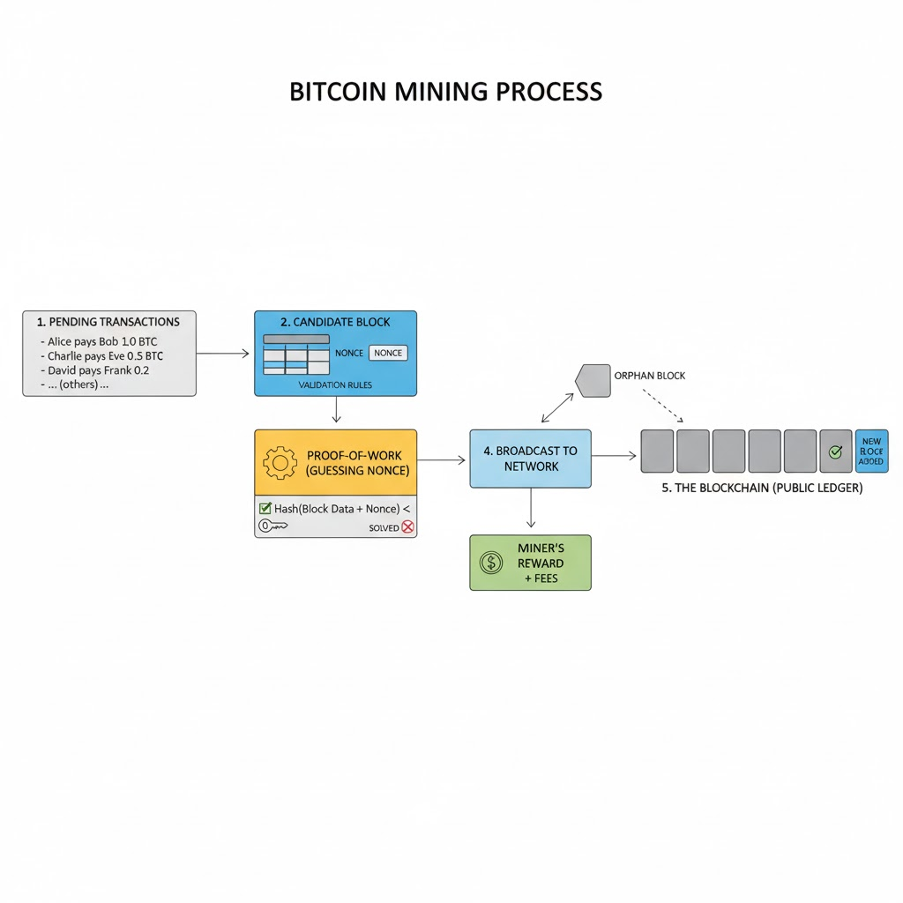

# 第八章 比特币的功能与实现

> 传统银行模式通过限制相关方和信誉良好的第三方访问信息来维持隐私。必须公开发布所有交易的需求排除了这种方法，但隐私仍可以通过在另一个地方切断信息流来维持：即保持公钥匿名。公众可以看到有人正在向另一个人发送一笔金额，但没有信息将交易与任何人联系起来。这类似于证券交易所发布的信息级别，交易的时间和规模是公开的，但不会告知交易双方是谁。
> --- 中本聪 《比特币白皮书》

对比特币的认识，如果仅仅停留在一种新型数字货币上，往往会让我们忽略它对人类货币文明最深刻的重构，这种“管中窥豹”式的视角，很难察觉到比特币作为人类历史上首个原生数字货币所蕴含的真正变革力量。比特币的诞生并非只是支付手段的简单升级，其核心价值在于通过精妙的技术手段，第一次将完整的财产主权真正交还给了个人，构建出一种不再依赖于国家信用、不再受制于银行审批、完全独立于传统中心化权力的价值形态。在这个二十四小时不停转的全球数字网络中，财富不再被地理边境所阻隔，也不再被繁杂的中介所延宕，价值真正实现了跨越时空的自由流转，而对于每一个追求独立自由的主权个人来说，这种对资产的绝对掌控，不仅是他们在变幻莫测的时代洪流中对抗不确定性的底气，更是让他们能够在最恰当的时机，从容地把握并驱动自己的命运。为了揭开这台“信任机器”的奥秘，我们从功能与实现两个维度展开，深入剖析比特币的各项核心能力，并揭示支撑这些宏伟愿景落地的底层技术机制。

## 1 比特币的货币功能

货币在本质上是一种跨越时空的价值传递工具。为了实现这一目标，它在历史上一直扮演着三个角色：价值存储、交换媒介和记账单位。传统货币如美元或欧元，其力量源于政府的强制法令，而比特币则开创了一个全新的范式——通过数学共识和密码学证明来履职。这种区别催生了原生数字货币这一物种。我们可以直观地感受一下这种力量：在 2025 年 10 月 6 日，当比特币单价冲破 12 万美元的高点时，其总市值已跃升至 2.4 兆美元。如果将比特币视为一个主权经济体，它的市值规模在当年已跻身世界第九大经济体，不仅超越了巴西和加拿大，甚至与意大利和俄罗斯比肩。然而，比特币的真正震慑力不在于规模，而在于它实现功能的方式：它将货币与国家脱钩，将金融主权归还给个人，成为了历史上第一种既完全数字化、又具备绝对稀缺性的资产。它不仅在与传统货币竞争，更在提供一种哲学层面的替代方案——一个由确定规则而非多变统治者主导的货币体系。

### 1.1 价值存储：数字时代的硬通货

推动比特币走向大众视野的首要功能是其作为避风港的价值存储作用。在中央银行可以通过印钞机稀释财富的时代，比特币提供了可验证的绝对稀缺性。它的货币政策被硬编码在协议中：总量永不超 2100 万枚。这种不可动摇的上限，与可以被政策制定者随意贬值的法定货币形成了鲜明对比。人们常把比特币比作数字黄金，但在实际应用中，它在很多维度上已经超越了黄金。存储和验证大量实物黄金需要极高的成本与专业设备，而比特币只需要你保管好一串私钥。更具传奇色彩的是它带来的主权审查抵抗——设想一个极端场景，一个难民在被迫离开家园时，由于黄金笨重且极易在边境被搜缴，他几乎无法带走财富。但如果他使用的是比特币，他只需要记住由 12 个简单单词组成的助记词（即“脑钱包”），就可以将价值数千万甚至数十亿美元的资产装进大脑。当他踏上另一片土地，只要能接入互联网，那些财富便能瞬间苏醒。这赋予了个人一种不可被剥夺的权利：将财富从沉重的实物彻底转化为纯粹的、属于个人主权、全球化的高流动性数字资产。

### 1.2 交换媒介：无需许可的数字现金

作为交换媒介，比特币的社交初衷是一个点对点电子现金系统。我们习以为常的现代数字支付——无论是刷卡还是扫码——实现上都是一种认证和记账请求：你向银行发送交易请求，银行验证你的身份后，在私有账本上扣除你的数字，再通知对方银行增加数字。这意味着交易是需要许可的，服务商随时可以冻结或撤销你的每一分钱。

比特币则完全不同。它无需许可。发送 10 亿美金就像递给对方一张 20 美元的现钞一样简单直接。只要你有接收方的地址和自己的私钥签名，任何银行都无法控制这笔转账，任何机构也无法查封这个网络。这让它成为了第一个真正意义上的原生数字资产：它既拥有现金的匿名（后面会详细说明这是一种程度有限的匿名）与终结性，又具备互联网跨越全球的瞬时性。虽然比特币的基础层为了极致的去中心化和安全性而牺牲了速度，每秒 7 笔交易量、10 分钟到 30 分钟的交易确认时间以及几美元到几十美元的手续费对于百万美金或更高额的交易不是问题，但对于日常的小额交易则不可用。许多比特币的应用协议比如闪电网络可以用于支持日常消费的交易。闪电网络通过在交易方之间建立另外的支付通道，实现了极速且手续费几乎为零的即时交易。它解决了比特币网络拥堵和成本高昂的问题，使微小额即时支付在经济上变得切实可行，极大地提升了比特币的可扩展性。

### 1.3 记账单位：中本聪的标准与能量的终极归宿

虽然比特币作为记账单位的功能目前仍被视作其最大的挑战——毕竟在价格剧烈波动的今天，没有人希望看到咖啡馆的价目表每隔几分钟就跳动一次——但其底层设计的精妙之处在于，中本聪通过最小单位“聪”（Satoshi）的划分，为人类提供了一个精度极高的、可编程的数字化衡量体系。一个比特币是一亿聪。这不仅仅是技术上的细节，更是一种关于未来的社会契约构想：在一种完全原生的数字经济体中，我们可能不再需要依赖通胀侵蚀下的纸币面值，而是拥有一个恒定且可细分的价值锚点，让极微小的数字化交换也变得精准可察。

另外一个容易被人忽略的深层逻辑在于比特币的货币共识机制正悄然将货币的基石从行政信用转向物理真理，即能量。在热力学的视角下，人类文明创造的一切价值本质上都是能量的低熵排序与功的输出：无论是收割一斤小麦、制造一块芯片，还是维持一个数据中心的运转，其底层逻辑都是热力学中功的转换。早在 1921 年，发明家亨利·福特就曾提出建立能源货币以打破金融精英的垄断，他认为只有基于千瓦时（kWh）等客观能量单位的货币，才拥有最稳固的物理根基。而比特币通过工作量证明机制（PoW），在数字世界中重现了这一构想：它像一个永不停歇的能量转换器，强制将现实世界的电能损耗转化为不可磨灭的数字化货币共识。每一枚比特币的铸造都伴随着真实物理能量的消耗，使其成为一种凝结的能量，从而为一种跨越时空的、绝对客观的价值评估体系打下了物理地基。

如果我们大胆预见一个超比特币化的未来，比特币或许将超越货币的范畴，进化为衡量全球财富流转的中立标尺。届时，一件商品的标价可能不再取决于某国央行的货币政策，而是取决于它在生产与运输过程中所折算的能源消耗值，并直接以聪来定价。正如物理学中的米定义了空间长度，秒定义了时间跨度，比特币也有望为混乱的全球经济提供一个不受政治操弄与人为干扰的价值参照系。尽管这种从数字资产到全球能量标尺的跨越在今天看来仍像是一场技术主义者的科幻狂想，且其最终形态依然笼罩在未来的迷雾之中，但中本聪已然通过代码埋下了火种，将人类引向了一个价值与物理法则高度统一的彼岸。而最终的答案，将由时间与全人类的共识共同书写。

## 2 主权个人金融

主权个人金融，本质上描述的是一种让个体重新夺回财富掌舵权的生存状态。这种金融模式将复杂的密码学封装成了普通人也能使用的工具包，让财富从一种依附于权力的租借物，变成了一种深藏于个体意识中、不可被剥夺的信息。在传统金融世界里，我们其实只是资产的临时托管者。政府的每一项货币政策，银行的每一次系统维护或账户冻结都在提醒我们，财富的主权并不在自己手中。然而，比特币的出现将这种脆弱的依附关系彻底翻转——它不再要求我们在每一次消费、转账或签约时向任何机构请求许可，而是赋予了个体像掌控自己身体一样，自主掌控财富和资源的权力。

为了让这种宏大的金融主权在日常生活中变得触手可及，比特币演化出了一种精妙的分层架构。你可以将比特币的主链——即我们通常所指的、由全球数万个节点共同维护的比特币网络本身（也被称为一层网络）——想象成一座由万米深根支撑的最高法院或全球金库。它的安全级别极高，由于要确保每一笔账目都经得起全网最严苛的审计，其处理速度相对缓慢，适合处理那些不容有失的大额清算或长期储备。而像闪电网络这样的各种应用，则更像是金库之上铺设的一层高速公路。在这个高速层级中，主权个人可以瞬间发起无数笔几乎零成本的交易，就像在咖啡馆互递现钞一样快捷。这种分层设计解决了一个长期的矛盾：既保留了如大地般稳固的极致安全性，又拥有了现代商业所需的极致效率，让个人可以一边像囤积黄金一样在地基层存储财富，一边像使用现金一样在高速层进行全球消费。

这种由技术支撑的生存方略，首先体现在一种极度自由的退出权上。想象一位生活在恶性通胀地区的自由职业者，他辛苦赚取的法币可能在几周内贬值一半，且当地银行有着严苛的外汇管制，让他几乎无法保护自己的劳动成果。但在主权金融的世界里，他可以瞬间将财富转化为一种非实体的数字能量。他不再需要携带沉重的金条，也不必去银行排队申请额度，只需守护好脑海中的一组助记词，他的全部财富就能在全球任何一个有网络的地方重现。这种金融层面的胜利大逃亡，让资产真正实现了与物理边界的脱钩，赋予了个体在面对环境动荡时，能够带着全部比特币家当随时开启新生活的底气。

除了资产的绝对防御，主权个人金融还通过一种无需中介的自动契约机制，让个人能够跨越法律和边境的阻碍进行主动协作。在传统世界中，如果你想和远在异国的陌生人签署一份对赌协议或贸易合同，往往需要昂贵的律师和公证人。但在比特币的现实应用中，你可以利用一种类似自动售货机的数字合约。设想一个跨国场景：一位身在非洲的小麦进口商与一位北美农场主想要签署一份价格保险。他们谁也不信任对方国家的法院，更不愿支付高昂的跨国律师费。于是，他们发起了一份比特币数字合约，分别将资金锁定在其中，并约定以公认的全球粮食价格指数作为数学裁判。到了约定日期，如果价格上涨，合约逻辑会自动将资金拨付给进口商以对冲成本；反之则划拨给农场主。在这个过程中，没有任何第三方中介可以触碰到钱，也没有任何机构能够阻止协议生效。这种方式让两个素不相识的个体，第一次可以绕过庞大的官僚体系，在物理法则的见证下建立起全球级的金融信任。

这种信任机制的终极形态，是主权个人正在构建的一种完全脱离监控的全球循环经济。在过去，你的每一笔咖啡消费都是全景监狱中的一个数据点；而在比特币的闪电网络中，交易就像互递现钞一样私密且迅速。越来越多的数字原住民开始尝试直接赚取比特币、直接支付比特币，彻底绕过法币兑换的关口。这种脱钩并非为了逃避责任，而是为了重拾被数字监控剥夺的隐私主权。对于主权个人而言，比特币不只是一项投资，它更是一扇通往平行数字世界的门——在那里，金融不再是一种来自上层的特权或恩赐，而是一项基于物理法则、由每个参与者自愿认可的货币共识。它为人类提供了一种终极的保障：无论现实世界如何变幻，你永远拥有掌控自身命运的最后一道防线。

## 3 能源消耗与铸币税

比特币的能源消耗始终是一个充满争议的话题，但在理性思考和物理学的视角下，这并非系统的缺陷，而是其维持独立运作的核心成本。正如任何体系的建立都离不开维护成本一样，我们不能只谈论比特币赋予个人的自由价值，而不去审视支撑这套系统运行的物理开支。将能源与铸币税结合起来观察，我们会发现比特币正在重新定义数字财富的根基：它拒绝依赖虚无缥缈的信任，转而寻求物理法则的庇护。

### 3.1 能源是比特币的热力学护盾

批评者常将比特币的能源消耗视为无用功，但这种视角忽略了这些能量在数字领域构建的物理边界。截至 2025 年，比特币已承载约数兆美元的全球财富，为了保护这一庞大的账本，网络每年消耗约 160 至 173 太瓦时（Terawatt hours： 一太瓦時等於一万亿瓦時）的电力。虽然这相当于波兰等国家的能耗量，但对比现有的金融基建——包括全球银行系统及其耗能巨大的数据中心、实体支行，乃至维护法定货币地位所必需的法律、行政甚至是军事暴力机构——比特币的能耗反而显得极具效率。

从本质上讲，比特币是用一道统一的能量屏障取代了传统的、由人类强制执行的安全体系。矿工消耗的电力在账本周围形成了一个物理意义上的热力学护盾。在工作量证明（PoW）机制下，如果你想篡改历史，你就必须投入并消耗掉比全网总和还要巨大的真实能量。由于能量是真实的、有限且不可伪造的，这就为数字资产锚定了一个物理层面的安全坐标。对于一个没有中央政府、没有常备军队来保卫其完整性的去中心化系统而言，这种能源消耗不仅是保护全球公共账本的唯一途径，更是让它在物理上变得非常难以攻击的终极保证。

### 3.2 铸币税

在经济学中，铸币税是指货币面值与铸造成本之间的差额。在法定货币体系中，铸币税几乎是中心化权力的特权——政府只需在数字账本上增加零，就能以零成本增发货币，这往往导致财富的隐形掠夺。而比特币通过 PoW 机制彻底终结了这种廉价货币。它重新引入了生产高成本货币的物理信号，正如从地下开采黄金需要艰苦的劳动一样，铸造新的比特币必须消耗真实的电能。这种机制弥合了虚拟资产与现实物理世界的鸿沟，确保了货币的稀缺性不是来自于某人的承诺，而是来自于不可篡改的数学和物理约束。

随着比特币逐渐接近 2140 年的发行总量，铸币税的内涵也将发生深刻转变：它将从新币创造的成本演变为维护账本安全的税收。当区块补贴最终消失，矿工的收入将完全依赖于用户支付的交易费用。这意味着未来的比特币安全预算将由真实的使用者承担。用户支付费用以购买稀缺的区块空间，矿工则将这些费用转化为电力护盾，从而维持系统在热力学上的永恒稳定。这种由市场驱动的安全税机制，确保了只要有人需要这台信任机器来存储数万亿美元的价值，它就能持续地吸收能源并将其转化为绝对的安全性。

### 3.3 没有免费的午餐

为了追求表面上的绿色环保，许多加密货币采用了权益证明（PoS）机制。然而，天下没有免费的午餐。PoS 的本质是将安全基于资产持有量而非能量投入，这在准入门槛上构筑了一道隐形的阶级鸿沟。在比特币的 PoW 体系中，准入门槛是纯粹物理性的：它不看资产背景，只看你是否愿意投入家庭级别的算力和能源参与竞争。这种无需许可与低门槛的特征确保了任何人都有机会通过真实的生产投入来分享账本红利。相比之下，在 PoS 机制中，新进入者必须向既得利益者购买筹码才能获得收益和话语权。华尔街知名投资人 Tom Lee 曾在 2025 年的[一次深度访谈](https://www.youtube.com/watch?v=p1jtfW4jAGI)中指出，对于像他那样持有庞大资产（如占总量近 4%）的巨头而言，质押产生的日收益即可突破百万美元，这种所谓的收益在本质上并非创造了新价值，而是一种针对从未质押者的权益稀释和内部通胀，最终导向了财富向顶层集中的富者越富的分配逻辑。

这种机制的缺陷远不止于公平性。PoS 剥离了物理锚点，使其在遭遇重大系统崩溃后极难恢复——当全网节点因极端情况停运时，PoS 节点无法在没有物理消耗的情况下验证哪一条历史记录才是真实的，这给了篡改者可乘之机。相比之下，比特币的工作量证明机制通过燃烧能量确立了历史的合法性。无论网络停工多久，任何新上线的节点都可以通过验证那堆惊人的累积算力，瞬间确认哪一条才是真正的账本。能源消耗在这里充当了真理的试金石：因为能量无法在瞬间凭空伪造。所以说，比特币的能耗是它作为独立、公正且去中心化系统所必须支付的代价。它确保账本的稳健不依赖于任何人的道德自觉或计划者的慈悲，而是依赖于持续的、不可逆的能源转化过程。这正是比特币在混乱的数字化浪潮中，依然能作为全球财富最终锚点的底气所在。

## 4 比特币实现了一个公共账本

比特币作为第一个独立的、实际可用数字货币的原创性本质常常被公众误解。人们习惯于用加密哈希或去中心化共识等复杂的科技术语来包装它，但比特币最核心、最优雅的理论突破其实极其朴素且古老：它成功解决了一个全球性的公共账本构建问题。这种创新可以追溯到上一章提到的雅浦岛莱石货币。与那些笨重的莱石一样，比特币的精髓并不在于货币实体，而在于其作为透明、共享且不可篡改的公共所有权记录的功能。在雅浦岛，当村民进行支付时，他们并不移动数吨重的巨石，而是通过整个社区的大脑共识来宣告所有权的转移。比特币正是这种古老传统的数字化巅峰继承者——它并非简单的电子硬币，而是一个在数万个节点中留下的、永恒的公共记事本。这种从私有账本（银行维护）向公共账本（全网验证）的转变，是个人主权货币的根本基石：如果每个人都能记账、每个人都能查账，那么任何权威机构都无法在阴影中篡改历史或捏造资产。

在数字世界中，所有货币都面临一个致命挑战——双重支付，即数字信息极易被无限量 100% 精确复制。传统的解决方法是引入一个中心化的中间人（如银行）来维护私有账本并验证真伪。而比特币则通过分布式账本（Distributed Ledger）机制，在无需任何第三方信任的前提下解决了这一难题。这里的分布式意味着网络中的每个节点并非只掌握账本的碎片，而是各自拥有一份完整的、一模一样的账本复本。这就像雅浦岛的每一位村民都随身携带一个记录着全岛莱石变动的小本子，每当发生新的交易，全村人都会聚在一起确认并同步更新自己的本子。这种高度冗余和公开透明的设计，确保了任何虚假的账目变更都会立刻被全网识破，从而为数字现金打下了最稳固的地基。

### 4.1 账户

比特币承诺的个人货币主权，首先体现在其账户体系的彻底开放性上。不同于传统银行需要身份验证、填写繁琐表格并等待审批，比特币账户的本质仅仅是一对基于数学生成的钥匙：公钥和私钥。严格来说，你的比特币地址是公钥经过复杂哈希运算后的结果——这种单向加密不仅缩短了地址长度，还通过哈希不可逆性为你的原始公钥增加了一道安全护盾。从普通用户的视角来看，你只需要使用开源软件在普通的电脑或智能手机上几秒钟内就能独立生成自己的比特币账户，无需向任何政府或机构申请。

比特币网络是完全无须准入（Permissionless）的，这意味着世界上任何人，无论其国籍、信用评分还是法律身份，都可以立即创建一个地址来接收全球资产。在这个民主化的网络里，唯一的入场券就是你对私钥的掌控——它是你在数学层面对财富所有权的终极证明。这种优雅的设计确保了系统不仅全球可访问，且具备极强的抗审查性：只要你能守住那串秘密字符，就没有任何权威能够剥夺你使用这个网络的权利。

### 4.2 交易

在比特币的世界里，交易的本质是所有权的重新分配。由于公共账本详尽记录了从创世区块以来的每一笔资金动向，因此任何一个地址中的数额都是可被全网回溯并验证的。当你发起一笔交易时，你实际上是在向全球节点网络广播一条带有你数字签名的指令：“我决定将之前收到的某些比特币，重新分配给以下这些新的接收地址。”这种设计允许你在一笔交易中同时处理复杂的业务需求，比如同时向两个不同的商家付款，并将剩余的金额（找零）退回到你控制的一个新地址中。

为了维持这个庞大账本的持续运行，每笔交易都需要包含一份小额的手续费。这份费用并非支付给某个中心公司，而是作为奖励提供给那些通过消耗资源来验证并记录你交易的节点。用户可以根据自己对确认速度的需求灵活调整费用水平：如果你急于完成支付，支付较高的费用将使你的交易在全网待办清单中获得优先处理权。本质上，比特币交易是一种公开的、受密码学保护的权利声明，它在定义财富转移的同时，也通过市场化的费用激励机制，确保了整个网络的去中心化运营。

#### 4.2.1 未花费交易输出（UTXO）

为了彻底根除双重支付并确保账本的稳健性，比特币并没有采用我们熟悉的“账户余额”模型，而是基于一种名为未花费交易输出 UTXO（Unspent Transaction Output）的会计体系。这个术语听起来很专业，但理解它的逻辑至关重要且其实非常直观。在比特币网络中，你的钱包里并没有一个存储总数的罐子，你的余额实际上是你当前所拥有的、所有尚未花费出去的交易收据的总和。

举例来说，如果你拥有 0.5 个比特币，这可能意味着你的账本上关联着几笔来自历史交易的记录。别人之前付给你的钱是那些交易的输出（Transaction Output）：比如一笔 0.1 BTC，一笔 0.15 BTC 和一笔 0.25 BTC 的收入，它们都是尚未花费的 UTXO。当你决定花费这些钱时，你必须像融化旧金币一样，将这些特定的 UTXO 彻底消耗掉，然后重新铸造成新的 UTXO 分配给接收方。一旦某个 UTXO 被使用，它就永远在账本中标记为已花费，从此失效。这种模型提供了极致的会计清晰度，因为网络中的每一笔金额都可以清晰地追溯到其诞生的一刻，彻底消除了所有权状态的任何歧义。

#### 4.2.2 交易构建：输入、输出和找零

一笔典型的比特币交易是由现有的 UTXO 作为输入构建而成的。要动用这些资金，你必须提供解锁这些收据的数字签名。这里有一个基本规则：所有输入的总价值必须大于或等于你打算支付的金额，其差额即为给矿工的手续费。由于作为输入的每个 UTXO 都必须被一次性全额销毁，因此对于你不想支付给对方的余额，你必须显式地创建一个发回给自己的找零输出。为了保护隐私，有经验的用户通常会将这笔找零发送到一个全新生成的地址，从而模糊自己的财富分布。整个过程遵循严密的会计恒等式：你消耗的旧输入，必须精确地等于你创建的新输出：给对方的钱 + 给自己的找零 + 留给网络的交易手续费。这种颗粒度极细的记账方式，确保了比特币网络在没有中心化审计师的情况下，依然能维持千年不坏的精确度。

#### 4.2.3 计量单位与激励机制：聪与手续费

为了支持极小额的全球支付并避免复杂的浮点数运算错误，比特币网络采用了“聪”（Satoshi）作为基础计量单位。聪是比特币的最小单位，代表一亿分之一的比特币（1 BTC = 100,000,000 sats）。所有价值均使用聪的大整数进行跟踪和计算，以保持精度并避免小数误差。交易的最后一个组成部分是交易手续费。该手续费并非指定的输出，而是剩余价值：输入金额的总和减去所有显式输出（接收方和找零）的总和。这部分剩余金额故意不予分配，由成功验证包含该交易的比特币网络节点收取，作为通过工作量证明机制保障网络安全的经济激励。发送方通过管理输入和输出之间的差异来设定其有效手续费率，从而根据其需要确认交易的速度来竞争区块空间。

### 4.3 区块与区块链

### 4.3.1 区块

比特币网络由数万个节点构成，所有的交易需要发送到所有节点并且最后需要统一确认其有效性与一致性，因此不可能一笔一笔处理交易。区块（block）存在的主要目的是为了通过批量处理提高效率和安全性。它并非将每笔交易立即添加到公共账本（这样做会造成混乱且消耗大量资源），而是将交易打包成一个单一的、统一的数据结构，即区块。区块是比特币网络数据存储与验证的基本单位。块基交易 Coinbase 是每个比特币区块中的第一笔交易。块基交易至关重要，因为它是新比特币进入流通供应的唯一方式。

与其他所有消耗现有未花费交易输出 (UTXO) 作为输入的交易不同，块基交易没有输入。相反，它承担着两个关键功能：区块奖励与区块标识。区块奖励由区块补贴与交易手续费两部分组成。区块补贴是新铸造的比特币，初始数量为 50 BTC，大约每四年减半。这是所有新比特币的来源。交易手续费则是该特定区块中包含的所有交易支付的手续费的总和。成功解决工作量证明难题的节点可以创建此交易，并将总奖励（补贴 + 手续费）作为输出发送到他们选择的比特币地址。区块标识是块基交易的输入字段，用于存储网络节点选择的任意数据。节点有时会使用此字段公开标识自身，或者在历史上，用于嵌入简短消息或时间戳，作为区块的唯一标识符，并以此表明对区块内容的承诺。块基交易是协议内置的网络安全资金机制。它向成功完成区块验证的节点支付报酬，将经济激励与区块验证过程直接挂钩。

#### 4.3.2 区块链

比特币的巨大成功催生了一个无处不在却又常被误解的术语：区块链（blockchain）。讽刺的是，中本聪最初发布的九页白皮书《比特币：点对点电子现金系统》中，从未出现过区块链这个单一而又意义深远的词汇。相反，中本聪选择了一种功能性的描述：区块的链（chain of blocks）。中本聪刻意选择强调功能而非抽象概念，重点放在了技术流程上：区块是经过验证的数据单元，而链则是防止双重支付并确保时间顺序的加密连接。这种功能描述对于比特币的理念至关重要，因为它将人们的注意力引向工作量证明（PoW）机制和最长链规则，这些机制是实现共识的保障。早期，比特币协议被视为一种基于时间链或分布式公共账本的数字现金技术创新，这种说法将这项发明定义为货币领域的突破，而链结构仅仅作为货币的安全机制。区块链的英文 “blockchain” 作为单独的名词发生在后期，主要是因为企业和金融机构试图在不接受比特币激进的政治和货币原则的情况下，想利用其底层的分布式账本技术做更多应用。在比特币证明了分布式账本技术的稳健性之后，企业（错误地！！！）意识到其可以应用于供应链管理、投票系统和私人银行联盟等有领域，这其实是一种误用。后面会详细讨论这个话题。

此处用区块链是一种链式数据结构的本意。区块是批量存储交易的容器，而链是连接这些区块的组织方式，旨在无需依赖中央管理者即可保证记录所有交易的账本的完整性和永久性。链结构的主要目的是创建一个完整、可验证且不易篡改的历史。每个新区块一旦经过验证并添加到网络中，其头部就包含一个关键信息：紧邻其前一个区块的加密哈希值。该哈希值是一个独特的数字指纹，源自前一个区块的所有数据。如果前一个区块（或其中的任何交易）中的任何一个字符发生更改，其哈希值将完全改变。因此，当前区块头部存储的哈希值将不再与前一个区块的哈希值匹配，从而立即使整个后续链失效。

这便形成了一种数字化的链条：每个区块都锁定了其之前所有区块的时间顺序和交易历史记录。如果恶意行为者试图篡改五年前的一笔交易，他们必须先成功重新计算出该旧区块的正确哈希值，然后重新计算出此后添加的每一个区块的有效哈希值，由于系统的工作量证明安全机制（后面会介绍），这在计算上是几乎是不可能的（或者说过于昂贵）。由于链的重建的成本极其巨大，因此区块链成为一个仅可追加的账本。在区块链末尾添加一个新的有效区块相对比较容易，但重写历史，即试图通过重组其后的区块来撤销现有交易的成本需要重做其后的所有工作量证明并得到多数节点认可是几乎不可能完成的任务。因此，区块链结构提供了一种优雅的解决方案，它通过一条不可破解的加密证明链，将网络中的每一笔交易都追溯到第一个的创世区块，从而建立了一条全球认可且不可更改的所有权时间线。

### 4.3.2 创世区块 The Genesis Block

创世区块是比特币区块链的第一个区块（计算机术语中是第零个区块，多数编程语言从 0 开始计数），它占据着一个独特的地位，超越了其作为区块起点的功能性角色。创世区块由中本聪于 2009 年 1 月 3 日创建，它确立了整个货币体系的核心参数，并在其中嵌入的隐藏信息，这既是比特币的奠基宣言，也是其政治评论。创世区块在技术上是独一无二的，因为它是区块链中唯一一个不引用前一个区块的区块。每个后续区块都使用前一个区块的哈希值链接回其父区块，但创世区块的前一个区块哈希值字段则填充为零。这使创世区块成为了一个永恒不变的锚点，所有后续历史和未来的工作量证明安全机制都由此衍生而来。尽管该区块包含了首笔块基交易（由此产生了最初的 50 个比特币补贴），但由于代码中的一个缺陷（是的，中本聪也会犯不止一个错，而且这个微不足道），这些原始比特币永久无法使用，仅作为区块创建的证明，从未进入流通。这种技术上的异常强化了该区块作为基石的象征性地位，而非活跃账本的一部分。

创世区块的一个有趣之处在于中本聪选择写入块基交易作为区块标识的文字：“《泰晤士报》2009年1月3日头版头条：财政大臣即将对银行进行第二次救助。” 这条信息摘自英国《泰晤士报》当日的头版头条，既是时间戳，也是一份强有力的哲学宣言。它将比特币的诞生与全球金融危机永久地联系起来，使这种去中心化货币不再仅仅被视为一种技术奇观，而是对中心化、基于信任的金融机构失败的直接且有原则的回应。通过嵌入这条特定的头条新闻，中本聪将创世区块塑造成一个无可争议的起点，开启了一个基于密码学证明而非机构信仰的替代货币体系。创世区块是比特币的白板，也是它的政治宣言。它确立了网络规则（初始补贴、区块结构），并提供了第一个不可伪造的存在证明。更重要的是，嵌入的信息定义了系统的核心目标：构建一个分布式、抗审查的金融体系，以替代被认为脆弱且依赖政府持续干预的金融体系。

## 5 比特币的共识机制：工作量证明 PoW（Proof of Work）

货币的本质是价值共识，所以比特币的运行逻辑完全建立在共识机制之上。这不仅仅是一套精妙的密码学算法，更是一场利用博弈论构建的经济大戏。它确保了全球数以万计、互不相识甚至互不信任的参与者（节点），能够对交易历史的唯一正确版本达成绝对一致。通过工作量证明 PoW（Proof of Work），比特币在无需中央仲裁的情况下，完美解决了三大难题：验证新交易的真伪、定义账本更新的节奏，以及构建一道坚不可摧的防线。本质上，这是一套以物理代价换取数字信任的精密程序，它让诚实成为了系统内最有利可图的选择，从而在混沌的网络世界中锚定了一个唯一的、不可篡改的现实。

### 5.1 节点和矿工

比特币网络的安全性由两种截然不同但又相互制衡的角色共同维系：节点和矿工。节点是网络的全天候守望者，任何运行比特币完整软件并下载了全量账本复本的计算机都可以成为节点。它们是规则的铁面执行者，被动地监控着网络中的每一笔呼吸——验证每笔交易的签名是否合法、检查 UTXO 是否已被双花、确认提议的区块是否符合协议。如果矿工试图递交一个违背规则的区块，分布在全球的节点会瞬间将其拒绝并拉黑。这意味着，在比特币的世界里，即便你拥有再强的算力，也无法强迫网络接受不合规的假账错帐。

相比之下，矿工则是网络中主动破壁的劳动力。作为特殊节点，矿工不仅要验证规则，还必须承担起最沉重的任务：执行工作量证明。他们将收集到的验证交易打包成候选区块，然后投身于一场耗资巨大的暴力哈希竞赛中。矿工的动力源自纯粹的经济激励——通过区块奖励（新币补贴与手续费）获取报酬。这种设计将矿工的个人逐利行为与全网的安全防御完美绑定：为了拿到奖励，矿工必须投入能源；而为了确保拿到的奖励有价值，矿工必须维护这个账本的诚实与稳定。这种利益共生的结构，是比特币的合作与技术基石。

### 5.2 区块验证

在比特币的流程中，一个新区块从提议到被全网接纳，必须经过一系列堪称严苛的数字安检。矿工在生成区块时，深知全世界的节点都在屏息凝视，任何细微的违规都会导致其投入的巨大电力付之东流。首先是语法与格式的有效性检查，确保区块符合协议的通信标准；其次是交易的深度审计，确保区块内的每一笔资金流向都清晰可溯、签名无误且未被二次花费。最关键的验证点在于工作量证明的合规性以及金额的限制。系统通过块基交易（Coinbase）严格锁定了矿工的奖励上限，任何试图私自多领工资的行为都会导致整个区块被全网废弃。此外，新区块必须在头部完美链接前一个区块的指纹，形成一条不可断裂的时间证据。这种多维度的交叉验证机制，确保了比特币网络在处理每秒数以千计的信息时，依然能维持如精密机械般的准确性。

### 5.3 工作量证明流程

工作量证明（PoW）的核心是一场资源密集型的竞赛，通常被称为挖矿。它要求矿工证明自己已经投入了海量的计算资源，从而获得记账的权利。这场竞赛的本质，是寻找一个特定的随机数（Nonce），使得整个区块头的哈希结果能够落在网络预设的目标难度之内。这就像是一场全球规模的数字彩票，彩票的规则被设定得极为严苛：你必须不断翻动那个随机数，进行每秒数万亿次的哈希运算，直到撞大运般地碰上那个以特定数量的“零”开头的哈希值。

由于哈希运算具有不可逆的物理特性，这种暴力破解没有捷径可走。矿工唯一的出路就是燃烧电力、提升算力。这种高昂的试错成本是比特币抵御攻击的核心盾牌：如果你想在账本上撒谎，你投入的成本将远超你可能获得的收益。每隔大约十分钟，全球总有一名幸运的矿工会率先解开这道难题。这种通过真实能量消耗换取的工作证明，向全网宣告了一个物理层面的事实——为了产生这个区块，世界在热力学意义上已经支付了相应的代价。

### 5.4 冲突解决：最长链规则

由于全球网络存在传输延迟，偶尔会出现两名矿工几乎同时解出题目并广播区块的情况。这会导致区块链出现临时的分叉，网络进入一种短暂的徘徊状态。为了解决这种冲突，比特币引入了优雅的最长链原则——或者更准确地说，是累计工作量证明最多的规则。

当节点面临两条竞争的链时，它会采取中立立场，暂时维持多条链的现状，并等待下一个区块的诞生。矿工们通常会选择在自己最先接收到的那个版本上继续挖掘。一旦下一个区块在其中一条链上被成功附加，这条链就积累了更高的计算能量，成为了全网公认的最长链。此时，所有诚实的节点都会瞬间达成共识，转向这条包含更多工作量的新区块链，而另一条较短链上的区块则会变成“孤儿区块”被遗弃。这种竞争机制确保了整个网络最终总能收敛到单一、全球公认的交易历史。它告诉我们：在比特币的世界里，真理不取决于谁的声音大，而取决于谁在背后支撑了最沉重、最真实的物理劳动。

## 6 比特币的设计理念

了解了比特币的运行原理，才能更深刻地体会其背后的设计理念。比特币的核心之魂可以概括为简洁与不可撼动的规则。不同于现代软件常见的快速迭代、后期修补模式，中本聪精心打造的是一个融合了技术、博弈论和货币政策的自我调节体系，通过源代码中固定的参数决定了网络的运行心跳、最终的货币供应量以及交易的经济机制，使其成为人类历史上第一个真正规则优于统治者的去中心化数字货币体系。

### 6.1 发布即定型

中本聪曾在讨论中明确指出：“比特币的本质决定了，一旦0.1版本发布，其核心设计在其余生中就已经定型了。”这种发布即定型的逻辑，确保了比特币协议的持久力与可靠性，因为它从根本上杜绝了后期通过人为修改规则来谋取私利的可能性。这种近乎顽固的定型，曾让无数试图寻求更高效率的工程师感到困惑甚至挫败。

世界顶级安全专家、曾因发现并修复 DNS 协议致命漏洞而被称为拯救了互联网的丹·卡明斯基 (Dan Kaminsky)，在 2011 年初识比特币时，凭借其多年的安全攻防经验试图寻找其中的逻辑漏洞或进行架构优化。他认为比特币每秒仅 7 笔的交易吞吐量简直是工业时代的残次品。然而，在海量的模拟实验中他惊讶地发现，每当他试图提升某一项性能指标，系统的安全性或去中心化程度就会像推倒的多米诺骨牌一样迅速崩塌——缩短区块时间会导致全网分叉加剧，增加容量则会让普通人无法运行全节点。最终，卡明斯基由衷感叹道：“我曾以为我能改进它，但最后我发现，中本聪在设计时已经推演了所有可能的博弈路径，这种简洁背后的严丝合缝，让任何试图锦上添花、自作聪明的改动都显得多余。”

不仅是卡明斯基，现代密码学的教父、DigiCash 的发明者大卫·乔姆（David Chaum）也曾对这个数字新生儿投以审视且挑剔的目光。作为盲签名隐私保护技术的奠基人，乔姆早在 90 年代就设计出了极其优雅、给了中本聪很多启发的匿名货币系统。然而，这个天才设计的致命伤在于它对中心化机构的底层依赖——DigiCash 需要依赖中心化的发行公司与银行系统来验证交易并防止双重支付。这种架构使得乔姆的系统在面对国家意志的监管压力时显得毫无还手之力。乔姆最初认为比特币那种依靠疯狂燃烧电力来换取安全的做法简直是数学上的野蛮行为，但他在深入拆解后不得不承认一个残酷的现实：比特币的伟大不在于它的数学公式有多么复杂，而在于它通过这种看似低效的物理消耗，真正解决了困扰分布式系统数十年的拜占庭将军难题，并建立了一个无需任何中心化信任节点的博弈闭环。即使是这位曾试图用代码改变世界的先驱，最后也意识到，比特币的这种顽固定型，实际上是它作为全球价值最终结算层必须具备的神圣刚性。

这些在开发者圈内耳熟能详的故事，有力地证明了比特币的设计绝非简单的技术堆叠，而是一场在物理限制、博弈逻辑与个人主权之间达成的神圣平衡。遗憾的是，后续出现的许多所谓改进，往往是各种利益团体打着创新的旗号，试图蚕食去中心化或发布即定型等核心原则。他们通过复杂的技术障眼法迷惑公众，以此在比特币的旗帜下收割私利。

## 6.2 简洁和低准入门槛的原则

比特币的理念基于这样的假设：如果一个货币系统过于复杂，就需要专业知识和权威机构的参与，这会立即违背去中心化的初衷。因此，其设计优先考虑两个关键要素：开源透明性和低参与门槛。每一行定义协议规则的代码都可公开审计，任何有基本编程知识的人都可以检查其逻辑，并验证是否存在任何隐藏机制。更重要的是，该系统旨在允许任何人运行一个完整的节点，所需的只是一台能够下载并验证完整交易历史的普通个人计算机。运行一个节点所需的计算资源被刻意控制在最低限度，确保全球各地的个人都能作为独立的规则执行者参与其中，而无需使用专业且昂贵的硬件。这种简洁性使得该网络无需许可且抗审查，如果规则足够简单，能够被普遍理解且易于验证，那么任何单一实体都无法秘密更改规则或阻止系统运行。

为了去中心化设置的低准入门槛也是很多人容易忽略的一个特点。这是理解比特币设计的关键所在：低交易吞吐量是其优先考虑去中心化的核心理念，而非最大化交易速度的直接且刻意的结果。由此导致的每秒约 7 笔交易（TPS）的限制并非技术缺陷，而是为了确保网络保持开放性和抗审查性而必须做出的基础性权衡。比特币的网络节点是规则执行者，它下载并验证整个区块链历史记录，确保每笔交易和区块都符合协议的既定规则，例如 2100 万枚比特币的供应上限以及 UTXO 模型的正确应用。如果运行全节点需要庞大的数据中心或难以承受的带宽，那么验证网络的能力就会集中在少数富裕实体手中，从而重新引入比特币旨在克服的中心化问题。因此，系统的简洁性是其政治韧性的关键，确保了验证节点的最大参与度和地域分布。

## 6.3 开放与隐私

在探讨比特币时，人们往往会陷入两种截然相反的认知错觉。一种认为它是完全透明且毫无隐私的监控工具，因为每一笔交易都像被放在全球广场中心的玻璃保险柜里，所有人都能看到资金的流动。另一种则认为它是绝对匿名且无法追踪的避风港，觉得只要用一串随机生成的字符作为地址，就能在数字世界里彻底隐身。事实上，这两种看法都是误区。比特币既不是绝对的密室，也不是完全的裸奔，它是一种建立在伪匿名基础上的有限隐私系统。

毫无隐私的错觉源于对比特币开放账本的恐惧。的确，比特币网络是一个全球共享的明文账本，记录了自 2009 年以来每一笔交易的详细数额和时间。但这种公开性并不等同于隐私的丧失，因为账本上显示的只是由数学算法生成的完全随机的账户地址，即公钥。生成这些地址不需要向中心化机构申请，更不需要提供身份证或手机号。只要你能够切断这串字符与你现实身份之间的逻辑联系，即便全世界都在盯着这笔交易看，也无法通过账户地址推测出其后的真正用户。在这个阶段，隐私保护依靠的是数学意义上的随机性。

绝对隐私的错觉则更为致命，它让许多用户在无意间暴露了底牌。很多人以为拥有了随机地址就万事大吉，却忽视了身份关联点的破坏力。正像美国政府在多起案件中展示的那样，执法部门追踪比特币并非靠破解数学算法，而是寻找数字世界与现实世界的交汇缝隙。最典型的例子是，当用户为了方便在需要实名认证的交易所购买比特币时，给出真实身份的那一刻，原本随机的地址就瞬间与个人信息挂钩了。此外，如果在发起交易时使用了计算机的真实网络地址而没有进行掩盖，你的物理坐标也会被记录。一旦这些线索被关联，比特币原本的隐身面具就会崩塌，其公开透明的特性反而成了追溯所有历史交易轨迹的呈堂证供。为了弥补网络层面的隐私漏洞，洋葱路由 Tor 成为了比特币爱好者的必备工具。Tor 的功能可以简单理解为一种多层加密的接力传输技术。当你通过 Tor 发送比特币交易请求时，你的原始数据会被像洋葱一样包裹上多层加密，并在全球众多的志愿者节点中随机跳跃。每一个节点只能解开最外层的一层皮，知道数据来自哪里、要去往下一个哪里，但无法获知数据的最终来源和最终去向。通过这种接力，比特币网络中的节点只能看到 Tor 出口节点的地址，而无法感知你计算机真实的物理IP地址，从而在底层通信上实现了物理隔绝。

比特币只提供有限且有条件的隐私保护。隐私的核心不在于比特币系统本身，而在于用户如何管理账户公钥与身份的距离。这种保护的本质在于切断联系。对于追求主权隐私的用户来说，这不仅意味着要选择不需要真实身份的交易方式，更意味着要学会使用类似 Tor 这类网络加密软件来隐藏计算机网络地址。在比特币的生态中，隐私不是一种天赋的权利，而是一门需要通过技术手段去悉心维护的个人主权课程。这也是这本书的一个目的：只有明白了比特币的本质并掌握了断开关联的工具，才能在透明的账本中获得真正的自由。

## 6.4 稀缺性货币政策

比特币的一个关键设计是其不可撼动的稀缺性原则。通过硬编码的数学算法，比特币的总量被永久锁定在 2100 万枚。这种固定供应量是其作为数字稀缺性的价值主张的基石，并通过每四年一次的“区块奖励减半”机制精准执行。尽管关于比特币的讨论通常集中在其稀缺性上，2100万枚的严格发行量限制以及每枚比特币的高美元价值，但其基本记账单位却是为微交易而设计的。这个单位是聪（Satoshi，简称 sat），它是比特币的最小单位，等于一枚比特币的亿分之一。1 个 BTC 有 100,000,000 聪。这种极高的可分割性意味着，即使一枚比特币的价格大幅上涨，其有效货币单位仍然足够小，可以用于日常交易，从而有效地防止比特币变得过于繁琐或昂贵，无法用于日常支付。使用聪作为基本单位解决了人们在处理高价值货币时产生的心理障碍，同时保持了比特币整体的非通胀特性。假设比特币的价格为每枚十万美元，一杯咖啡八美元。与其将一杯咖啡的价格视为 0.00008 BTC，不如更直观地将其定价为例如 8000 聪。

也可以从全球私人财富总额角度来理解。据[瑞银全球财富报告](https://www.euronews.com/business/2025/08/14/global-personal-wealth-which-countries-have-the-highest-shares-in-europe) 2024 年全球私人净资产总额约为 471 兆（万亿）美元。这里假设私人净资产总额数据为 500 兆美元进行估值。比特币的最大供应量上限为 2100 万枚。尽管许多比特币已经丢失，但仍使用最大供应量进行全球私人财富吸收的理论计算。如果全球每一美元的私人财富都以比特币计价，那么一枚比特币的理论价值约为 2380 万美元。这个数字凸显了比特币固定稀缺性带来的巨大经济影响。届时，记账单位将不再是比特币本身，而是聪（Satoshi），一聪的价值约为0.238美元。届时一杯八美元的咖啡约值 34 聪，仍是个可以接受的货币单位。至此不得不感叹中本聪的深思熟虑：比特币的总数量与基本记账单位可以让其在全球的操作层面直接实现货币的三个的基本功能：作为全球价值交换媒介、价值存储以及记账单位。比特币既可用于日常消费的小额支付，也可用于大型机构转账。

## 6.5 交易经济学：手续费与区块竞价

与严格锁定的供应量不同，比特币的交易手续费是一个动态的、由市场自由驱动的博弈参数。用户在创建交易时支付的费用，实际上是其消耗的输入值与输出值之间的剩余价值，这份价值将归属于打包区块的矿工。由于区块空间受到严格的容量限制，用户之间会通过提高手续费来竞标有限的记账权。这种收费机制在设计上具有两层深意：首先，它是一种高效的资源分配手段，能自动过滤垃圾交易并确保关键清算的优先权；其次，从长远来看，它旨在区块补贴归零后，作为维护网络安全预算的核心来源。这种市场驱动的激励结构，确保了只要有人需要这台信任机器，它就能通过经济驱动持续自我维持。

## 6.6 区块生成时间和大小

比特币公共账本的稳健运行与安全性，主要锚定在两个核心参数之上：区块生成的频率与数据的容量上限。协议的核心目标是将每一个区块的诞生时间稳定在约 10 分钟，这绝非随意的数字，而是一个关乎生存的设计权衡。较长的间隔确保了新产生的区块有充足的时间在跨越重洋的全球节点间传播同步，从而最大限度地降低链分叉的风险，确保了交易历史的唯一性。为了在算力（哈希率）如潮汐般波动的现实世界中锚定这 10 分钟的心跳，系统引入了每 2016 个区块（约两周）一次的难度调整机制。这是一种极其优雅的自我调节算法：如果前一个周期的平均产块速度快于 10 分钟，系统会自动提高解题难度，迫使矿工投入更多算力；反之则降低难度。这种不受行政干预、完全基于数学反馈的自我纠偏，确保了比特币货币政策的绝对可预测性，使其成为了数字世界里唯一永不迟到的钟表。

这种对物理真理最终沉淀的等待，也定义了主权个人使用网络的方式。当网络中由于延迟出现多个竞争区块时，最长链原则便发挥了终极仲裁的作用。这意味着单笔交易的绝对安全并非瞬间达成，而是随着后续区块的不断叠加，其被篡改的可能性呈指数级下降。通常情况下，等待 10 或 20 分钟（即二个或三个区块确认）足以满足绝大多数的交易安全需求。而对于涉及数亿美金以上的巨额清算，等待 60 分钟足以获得对抗超级大国级别攻击的终极安全保障。与这一时间参数并行的是 1 兆字节（1MB）的区块容量限制。这一硬性指标人为制造了区块空间的绝对稀缺性，不仅是驱逐垃圾信息、构建手续费竞价市场的必要手段，更是捍卫去中心化的最后防线。通过对小容量的这种克制，比特币避开了数据爆炸导致节点向巨型中心化机房集中的陷阱，将货币的主权实实在在地留在了每一个主权个人的书桌之上。
