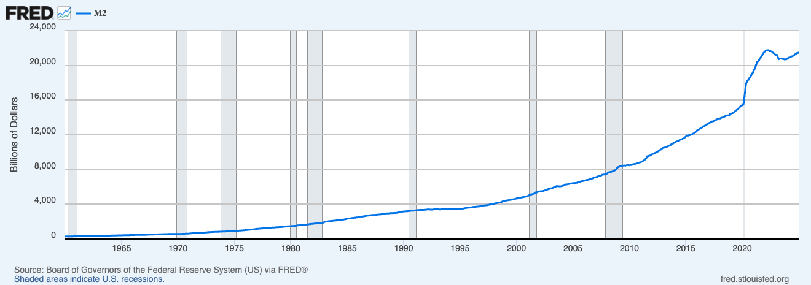
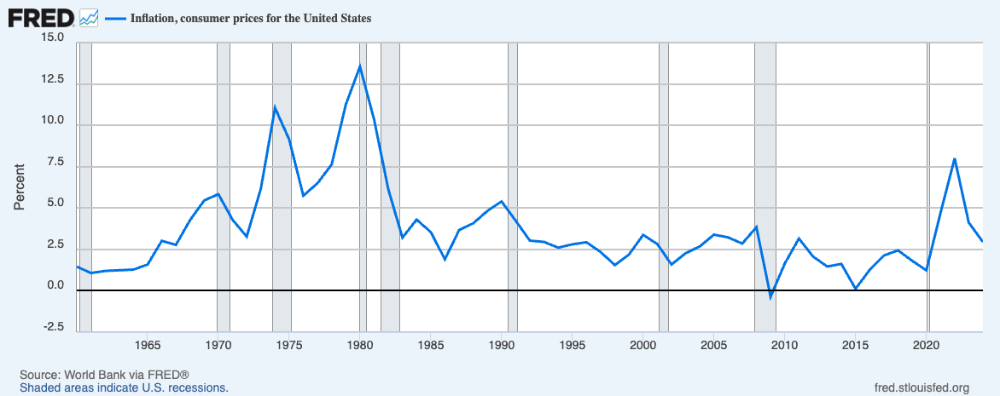
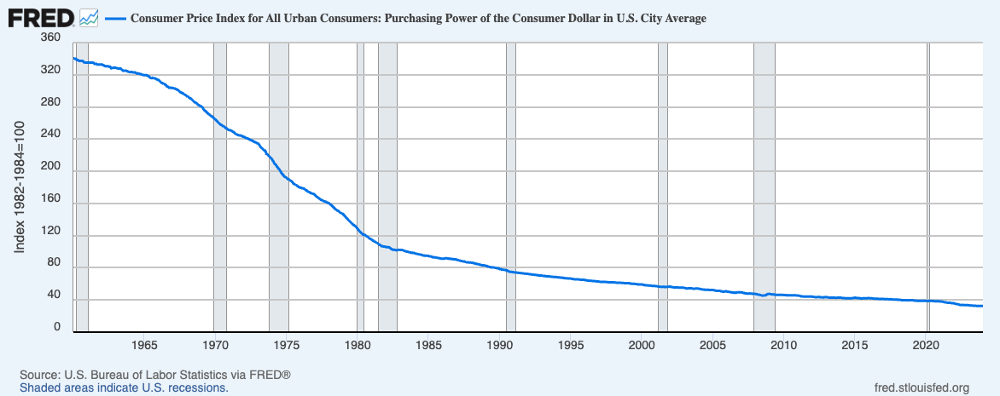

# 个人自由困境

>在当前的危机中，政府不是解决问题的办法；政府本身就是问题所在。
> In this present crisis, government is not the solution to our problem; government is the problem
> --- 罗纳德·里根 Ronald Reagan 1981 年美国总统就职演说

## 1 人权的戈尔迪之结（Gordian Knot）

这本书里反复出现的一个主题就是很多事情原则上可行，实际上困难重重到几乎不可能。个人的基本权利就是一个明显的例子。无论是联合国的世界人权宣言还是各国的法律都有明文规定，原则上可行，民间也有充分的共识，可是现实生活中这些基本权利却聊胜于无，状况堪忧。状况堪忧的情况不是只存在于强权专制统治的落后地区，很多发达的民主地区的人权倒退程度更加触目惊心。

当个人面对的是资源充沛的商业公司，甚至是拥有可以毁灭人类的强大核武器的政府，想守住属于自己的权利就如同要解开一个看不到绳头的戈尔迪之结（Gordian Knot）。戈尔迪之结是一个希腊神话传说，因出现在莎士比亚的戏剧《亨利五世》中而广为人知。据说在古代弗里吉亚王国（今土耳其境内），一位名叫戈尔迪亚斯（Gordias）的农夫在用牛车耕地时被神谕选为国王。为表达谢意，他决定把那辆为他带来好运的牛车献给宙斯。为了防止被偷，他将的牛车系在神庙的柱子上，并用极其复杂的绳结绑住车轭。这个结盘根错节，没有人能找到它的开端或末端。人们说，谁能解开这结，便能统治整个亚洲。这个结成了智慧的试金石和权力的象征。不知道曾经有多少人在它面前驻足、叹息、退去。多年后，年轻的亚历山大大帝率军征服小亚细亚，来到这座神庙。他站在那团难解的绳结前，沉思片刻，然后拔出佩剑，一剑斩断了绳结，轻松地解开了这个貌似无解的难题。

很多原则上可行，实际上困难重重的问题的出路就在于跳出现有的社会结构或技术框架的限制，当然有时候免不了需要一些新的发明创造。幸运的是，对与本书所要解决的信息与财产自由问题，所需的材料和工具已经存在了，而且更好的发明也已在路上。人们要做的只不过是跳过政府与商业公司制定的不合理游戏规则行动起来而已。

## 2 个人权利

### 2.1 信息与财产权

人类文明在漫长的历史中，经过无数次合作与冲突，逐渐形成了一套维系社会秩序与促进共同进步的道德规范。
其中一些最基本的原则，超越了文化与国界，成为全人类的共识。1948年通过的联合国世界人权宣言[世界人权宣言] 对一些基本共识作出了明确表达。其中第十二条规定：
>任何人的私生活、家庭、住宅和通信不得任意干涉，他的荣誉和名誉不得加以攻击。人人有权享受法律保护，以免受这种干涉或攻击。

第十七条规定:
>　㈠ 人人得有单独的财产所有权以及同他人合有的所有权。㈡ 任何人的财产不得任意剥夺。

这两条确立了个人自由的基本边界：一方面，个人的私生活与通信应受到尊重与保护；另一方面，财产的拥有与处置权应免于任意剥夺。这些原则构成人类社会自由与尊严的基础，也被许多国家写入宪法与法律。

进入信息时代，这些古老的权利在新的技术环境下获得了新的形式。通信与财产更多以数字化的形式运作。因此，传统的人权原则在数字环境中可以重新表述为三项关于信息与财产的基本权利：

- 个人主权：个人拥有自己产生的数据与合法所得财产的所有权；
- 隐私权：个人有权决定其通信与财产相关信息的披露范围；
- 分享权：个人享有自由通信与自主进行财产交易的权利。

这三项权利共同构成了信息时代个人自由的核心，它们是数字社会延续人类自由传统的技术化表达。这些权利的重要性，远不止保障个人层面的自由。奥地利学派经济学家弗里德里希·哈耶克（Friedrich A. Hayek）指出 [致命的自負]，财产权、契约制度以及言论与通信自由，并非出自人类理性的设计，而是在漫长的历史进程中，自然演化、反复试验并被实践筛选出来的社会规则。在他看来，那些偶然遵循这些自由原则的群体，在竞争与生存的长期过程中更能有效地组织合作、积累财富、传播知识，因而在文明演进中获得优势并得以延续。这些原则并不是抽象的理念，而是文明在无数次试错中沉淀下来的经验智慧。

哈耶克警告说，现代政府常以“理性规划”或“社会公正”的名义，试图以中央计划或行政命令重塑社会秩序。这种他称之为“致命的自负（the fatal conceit）”的态度，让人们误以为理性足以取代自发秩序，从而破坏了人类社会赖以繁荣的基本规则：尤其是财产权、法治与通信自由。当政府干预这些自然形成的制度基础时，实际上是在破坏支撑文明稳定的无形秩序。不幸的是，这种“致命的自负”并不仅存在于政府内部。在信息时代，许多大型商业公司同样沉溺于对社会与个人的技术性操控。现代信息技术为这种控制提供了前所未有的手段：庞大的数据系统、算法模型与监控网络，让干预个人生活与思想的成本降至历史最低。个人权利因此面临比以往更广泛、更隐蔽的威胁。

幸运的是，信息技术并非单向度的压迫工具，也为个人提供了不对称的防御能力。信息技术让个体首次具备以技术手段对抗国家级力量的可能。信息技术既是集中权力的工具，也是分散权力的武器。人类自由的未来，取决于选择如何使用它。

### 2.2 财产权的核心：货币与金融

数字化的信息权利比较容易理解，相比之下，财产权的相关论述需要特别说明一下。在人类社会的演化过程中，财产这一概念始终具有很多的具体形式。土地、房屋、工具、艺术作品、数据以及知识产权，都可以被视为财产的不同形式，它们共同构成人类生产与生活的物质与精神基础。然而，如果追溯财产权的结构，我们会发现其核心始终围绕着两个要素：货币与金融。货币是财产的计量单位与交换媒介，它使不同形态的价值能够被比较、衡量与转化，从而在社会中形成可计算、可流通的秩序。有了货币，价值才能被方便地记录、储存与转移。金融则是财产的动态维度。它通过借贷、投资、信用与风险管理，使价值得以在时间与空间中流动。金融体系不仅记录财富的分布，更决定了财富的方向与速度。在现代经济中，金融机制几乎等同于财产权的运行机制，它决定了个人能否自主支配自己的财富，也决定了财富能否参与社会创造。

与其他财产形态相比，货币与金融具有一个独特的技术特征：它们都可以被完全数字化。货币可以以数字符号的形式存在，金融交易可以通过算法与网络执行。信息技术使得财产的计量、交换与流通，彻底转化为一种计算过程。因此，在信息时代，对财产权的探讨不可避免地要回到货币与金融的数字形态。在数字系统中，财产权本身也成为一种技术问题，它不再仅仅关乎法律与经济学，而关乎代码、算法与主权的控制。本书聚焦于信息技术与个人自由的关系。因此，接下来的讨论将从货币与金融的角度，探讨当货币成为数据、金融成为算法时，个人如何在技术体系中重新获得对财产的主权。

### 3 贪婪的公司

在现实生活中，个人的信息权与财产权正面临商业公司前所未有的挑战。信息被持续采集、分析与谋利，财产被托管于算法与平台的体系之中。人们的通信、消费、投资、乃至思想表达，都依赖由大大小小商业公司控制的技术基础设施。在这种结构下，个人既无法真正拥有自己的数据，也难以完全掌控自己的财富。数据成为新的生产资料，却不再属于生产者；算法取代制度成为新的秩序，却缺乏透明与问责。

### 3.1 信息操控

信息时代的个人，往往在不知不觉中把自己的权利交了出去。在表面上，人们似乎拥有了前所未有的便利：可以随时沟通、随地支付、随心表达。但这些便利背后，有着隐形的代价。用户交出或产生的数据，是这个时代最有价值的资产。几乎所有的大型商业公司，都在以数据为原料构建自己的利润机器。人们每天在网络上浏览、搜索、购物、聊天，每一次点击、停留、转发，都被精确记录、分析、再利用。这些看似微不足道的行为，经过算法处理，就能勾勒出一个人的性格、喜好、甚至心理弱点。公司利用这些信息设计广告、制定定价策略，甚至预测并引导用户的下一步行为。在这个过程中，用户并不真正拥有自己生成的数据，只是一个被观察的对象，一个为算法提供素材的生产者。

作为数据的生产者，用户不仅无法掌控自己所创造的数据的所有权与收益权，常常连最基本的存取权也难以得到保障。许多平台在服务条款中明确规定，用户上传的内容将“被授权”用于产品改进或商业目的。这实际上意味着：一旦数据被上传，它便脱离了用户的控制，形式上仍属“个人内容”，实质上已成为平台的资产。在许多情况下，用户甚至无法完整导出或备份自己的数据。当账户被封禁或平台关闭时，个人积累多年的信息、照片、文字、社交关系，乃至部分记忆的数字化痕迹，都会瞬间消失。

更深层的不幸在于，个人的被动地位不仅止于信息被采集与被占有，还延伸到信息传播的双向被控制。商业公司通过算法同时掌控着人们发出的信息与接收的信息。在接收方向上，算法不断塑造着人所看到的世界。它依据平台的商业逻辑与心理模型，对信息进行筛选、排序与重组，把真实与虚假、重要与琐碎混合成“最能延长停留时间”的内容。结果是，每个人都被包裹在一层无形的“认知气泡”中，所看到的世界被算法裁剪得既熟悉又狭窄。人们以为自己在主动获取全面客观的信息，其实只是被动地消费算法为其量身定做的扭曲现实。在这种环境下，个体逐渐失去了独立接收与判断信息质量的能力。在发送方向上，算法同样决定一个人的声音能否被听见。它可以放大某些话题，也可以让另一些内容在算法的阴影中悄然消失。这种控制往往无声无形，你仍能发帖、评论、互动，一切看似正常，却在不知不觉中被系统“调低了音量”，变得无足轻重。有用户曾经描述这种经历：他们的帖子不再获得回应，关注者数量日渐下降，甚至朋友都看不到他们的内容。后来才发现，这是一种被称为“影子封禁”（shadow banning）的技术手段。平台不会明说你被限制，只是让算法在后台悄悄修改推荐权重，让你的内容在信息洪流中逐渐消失，仿佛被放逐到网络的边缘，一个仍能发声，却无人倾听的地方。这种现象不是个例，正成为越来越多人的现实写照。

所有这些控制方式都不需要暴力，也不需要法律，它只需要几行代码。在这无声的越来越普遍的操控中，个体逐步失去了信息的所有权与控制权。

### 3.2 金融特权

在金融领域，个人的财产权利同样面临被操控的处境。多数人的存款、支付、投资都依赖银行和大型金融平台。人们习惯了用网络转账与用交易，却很少意识到这些行为意味着财富其实始终掌握在他人的系统里。人们以为自己拥有金钱，其实只拥有“被允许使用金钱的权利”。一旦账户被冻结、系统中断、或平台修改规则，个人几乎没有反制的能力。下面这个散户与机构博弈的例子很能说明谁才是主宰者。

2021 年初，美国股市上演了一场罕见的金融风暴。一群普通投资者，在社交平台 Reddit 的论坛上，决定联合起来对抗华尔街的空头基金。他们选中的目标，是一家几乎被遗忘的老公司 GameStop，一家主营电子游戏零售的线下连锁店。在传统的金融逻辑中，这家公司几乎没有未来。基金们大举做空它，押注它会继续下跌。但网络上的散户投资者有着不同的情绪，他们并不只是想赚钱，而是想用市场的方式向金融体系证明：普通人也能撼动华尔街。短短几天，GameStop 的股价从十几美元飙升到几百美元。这是一场数字时代的草根狂欢。社交平台成为集结地，交易应用成为武器，每一次点击“买入”，都像是一种象征性的反抗。散户集体的买入行动让股价飙升，多家大型对冲基金被迫平仓，损失惨重。一时间，金融媒体上充满了前所未有的画面：专业投资机构被一群用表情包交流的年轻散户逼到墙角，散户的力量仿佛第一次超越了机构。这让 GameStop 事件超越了金融本身，它成了一场象征性的反抗，反抗那种由算法、资本与制度共同构成的金融秩序。

然而，高潮来得太快，结束也同样突然。就在市场最疯狂的那一天，交易平台 Robinhood 突然宣布用户不能再买入 GameStop 的股票，只能卖出。平台给出的理由是“系统风险与结算压力”，但在散户看来，这是一场精确的背叛。他们发现，自己所谓的“自由交易”，其实取决于一个后台指令的许可。几行代码，就能冻结一场群众运动；
一次“维护”，就能改变数百万人的命运。几小时之内，股价暴跌，许多散户的账户被清空。那种挫败感不只是金钱的损失，更是一种醒悟：所谓的“市场自由”，只是平台提供的幻象。

事件过后，Robinhood 的 CEO 在听证会上解释，他们的决定是为了“保护用户与系统安全”。这不是第一次，更不是最后一次，机构口中的“保护”的另一面就是“控制”。个人的财产权和交易权都依附在技术平台的意志之下。Robinhood（“罗宾汉”）这个名字，原本象征着从富人手中夺回权力、还给平民。而这场事件的讽刺在于所谓的互联网金融罗宾汉，其实就是整个金融系统的一个环节，其目的是成为一个依靠剥削平民致富的权贵。

## 4 自负的政府

虽然有关于个人信息权利的各种立法，比如欧盟的《通用数据保护条例》（GDPR, General Data Protection Regulation）和美国联邦层面的多部“行业或特定场景”（例如医疗、金融、儿童线上隐私等）适用的隐私/信息保护法律，但是这些立法多是针对企业的，撇开执行的力度和难度不说，各国政府本身在立法和实际操作上带头干涉个人的信息与财产权利。

### 4.1 信息权利

美国在911恐怖袭击后通过《爱国者法案》（Patriot Act, 2001），允许国家安全局（NSA）和联邦调查局（FBI）更广泛地获取公民的通信、金融和互联网记录。企业（如电话公司、互联网服务提供商）可被要求在“保密令”（gag order）下提供用户数据。2018年通过《云法案》（CLOUD Act, 2018），要求美国公司（如微软、Google）即使数据存储在海外服务器，也必须在美国执法机构要求下提供数据。同时允许美国与他国签订数据访问协议，绕过传统司法协作程序。2013年斯诺登揭露国家安全局（NSA）直接从大型科技公司（Google、Facebook、Apple、Microsoft等）服务器中提取电子邮件、聊天、文件、视频等。此事件揭露的对个人权利的广泛侵犯引发全球震动与外交争议。

端到端加密是个人通信隐私的基本保障。但是近年来，欧盟和英国政府在“国家安全”“反恐”以及“打击儿童性剥削内容”等理由下，均开始重新审视端到端加密技术的合法性与监管方式。欧盟委员会在《欧洲内部安全战略》（ProtectEU Strategy）中，将“端到端加密的合法访问”（lawful access）列为重点议题，认为强加密妨碍执法机构打击网络犯罪和恐怖主义并寻求让执法部门可以存取加密数据的可能方法[欧盟加密法案]。在英国，政府依托《调查权力法案》（Investigatory Powers Act 2016）[调查权力法] 和《在线安全法案》（Online Safety Act 2023[网络安全法] 拥有广泛的数据访问权。英国内政部（Home Office）多次表示，若端到端加密阻碍警方侦查，科技公司应提供“技术能力通知”（Technical Capability Notice），即在技术上保留解密手段。2024年至2025年间，英国政府曾要求苹果公司为其 iCloud 服务提供访问后门。苹果拒绝后决定暂停在英国提供“高级数据保护（Advanced Data Protection）”端到端加密功能，并在公众舆论压力下，英国政府最终于2025年8月撤回了该要求。纵观历史，政府在个人信息自由的保护方面毫无信誉可言，无法让人信任。

### 4.2 财产权

相比于对信息权利的露骨侵害，国家对财产权的控制更加的隐蔽和强势，因为国家完全控制了作为财产核心的货币。即使一个美国人手里的美元现金也并不完全属于此人，因为美国联邦法律禁止故意损毁或毁坏纸币与硬币。在越来越多的国家里，互联网和智能手机的普及改变了人们的消费习惯，现金使用减少，电子交易普及。个人的钱大多是数字形式的银行存款。股票、债券等金融票据也是以数字形式存于各个金融机构。这些都为国家提供了方便高效的操控个人财产的手段。

#### 4.2.1 微观层面

在微观层面的常用手段包括

- 利用司法或行政程序对违法所得或涉嫌犯罪的资产进行冻结、没收或罚款。操作变得非常方便，简单的金融账户修改就可奏效。
- 控制 Visa/Mastercard、ACH、SWIFT、PayPal、支付宝等入口，可间接切断个人或组织的资金通道。
- 强制金融机构采集并上报客户交易信息，为政府提供实时或后期干预的依据。
- 通过限制现金交易或强制报告大额现金来削弱匿名现金支付，迫使资金在可监管的系统内流动。

一个有代表性的例子是 1970 年美国国会通过了《银行保密法》（Bank Secrecy Act, BSA），这是现代金融监管体系中最早也是最具影响力的反洗钱法律。它的出发点并非“保密”，而是恰恰相反，强制银行向政府报告客户的金融活动。法案规定，凡个人或企业在单日内进行超过一万美元的现金交易，金融机构必须向财政部提交货币交易报告。这一规定的初衷，是让执法机构能够追踪大额现金流，防止毒品交易、逃税、洗钱与地下经济。然而，这项制度的隐性影响却随着时间的推移愈发显著。法案设立时的一万美元在 1970 年的购买力，相当于今日的近八万美元。半个世纪过去，这一金额从未随通货膨胀调整。结果是，越来越多普通人的日常现金交易被纳入政府监控范围：从汽车购置到婚礼筹备，从商业采购到房屋维修，很多使用现金的场合都可能触发报告义务。

更令人担忧的是，《银行保密法》还规定，故意规避报告要求本身就是犯罪。如果一个人将二笔或多笔九千美元的现金分别存入银行，他可能会因“结构化交易（structuring）”罪名而被起诉。这意味着，即便交易本身完全合法，单凭金额分布与“动机推测”，个人也可能成为被调查对象。有案例显示美国国税局和联邦调查局曾直接冻结中小商户的账户，只因为他们“多次存入略低于一万美元”的现金。

#### 4.2.2 宏观层面

在宏观层面的政府的常用操控手段有扩大货币发行、大规模干预金融市场以及限制资本流动。在很多人，尤其是奥地利学派经济学家，看来，政府的货币政策与市场操控是经济动荡不安和金融危机的主因。

政府最常见、也最直接的经济干预手段是印钞，或更准确地说，是实行扩张性货币政策。在现代金融体系中，印钞并不仅仅意味着印制实体货币，而是通过中央银行增加货币供应量（如 M2）来实现。衡量一个国家货币供应量的常用重要指标有 M1 和 M2 二种。M1 又称狭义货币，只包括流通中的现金与活期存款，M1 是人们可以立即支配、用来支付的资金。M2 比狭义货币（M1）范围更广，既包括流通中的现金与活期存款（M1），也包括准货币例如储蓄存款、短期定期存款和货币市场基金，也就是那些虽然不能立刻消费，但可以在短期内轻易转换为现金的资产。当美联储增加 M2（通过降息、购买债券等方式向市场注入资金）时，经济中的可用货币增加，通常会刺激消费与投资，但也可能导致通货膨胀。反之，若 M2 增速放缓或减少，经济流动性下降，可能引发紧缩效应。在过去几十年里，美国的 M2 呈持续增长趋势。下面是 1960-2024 美国的 M2 货币供应量、通货膨胀率以及美元的购买力数据。

[1960-2024 美国M2货币供应量]

[1960-2024 美国通货膨胀率和消费者价格指数](https://fred.stlouisfed.org/series/CUUR0000SA0R)

[美国城市消费者价格指数：美国城市平均消费美元购买力](https://fred.stlouisfed.org/series/CUUR0000SA0R)

可以看到，从 1960 年到 2024年 的 64 年内， M2 货币供应量从 $298.2 billion 增加到 $20,773 billion，增加了 68.7 倍。平均通货膨胀率大约 3%，美元购买力则从 340 减少到 32.4，减少了 9.5 倍。

通货膨胀有二个直接后果：购买力下降与降低已有债务负担。这二个后果对普通人、富人以及政府的影响大不相同。对普通人来说，原本能买一篮子菜的钱，如今可能只够买一半。这意味着储蓄和固定收入者的生活成本上升。钱放在手里越久，越不值钱。对于那些没有资产、主要依靠工资或养老金生活的人来说，这种慢吞吞的隐形掠夺最为沉重。与此同时，富人通常拥有大量资产和依托资产抵押的大笔债务，资产价格上升和实际债务水平降低是双倍利好，富人会变得更加富有。对依靠财政赤字、累积国债的政府，通胀会推高名义 GDP（因为物价上升带动总产值上升）和增加政府的税收收入，从而让债务占 GDP 的比例下降，短期内国家的债务负担似乎变轻了。这种如鸦片止痛一样的效果让各国政府成瘾，货币贬值与政府债务不断增加已成各国常态。其长期代价则是政府财政信誉以及国家货币信任的丧失，不可控的债务不可避免地引起周期性的经济衰退与政治动荡[國家為什麼會破產: 橋水基金應對大週期的原則]。

当系统性风险失控、金融危机爆发时，政府通常会迅速采取大规模干预，以防止市场全面崩溃。中央银行会降低利率来增加流动性、扩大货币供应、实施量化宽松，以稳定信贷体系。政府财政部门会推出救助计划，直接向濒临破产的银行、企业或关键行业提供资金支持，防止连锁倒闭。政府还可能担保存款与债务、接管重要金融机构，以恢复公众信心。与此同时，监管部门会暂停股市交易、限制资本流动、修改会计规则，缓解恐慌性抛售。这种干预短期内能阻止金融系统崩塌，但也意味着政府承担更高的债务与风险。政府用公共财产救助的对象是不负责任的大金融机构，把危机的成本从市场转移到整个社会。

各国政府都有一系列外汇管制措施来强化资本控制。其做法包括：限制居民购汇额度，要求个人或企业申报用途并逐笔审批；收紧海外汇款与投资渠道，防止资金大量流出；禁止或严格监管外币持有与兑换，迫使经济活动主要使用本国货币；以及限制外汇市场交易与跨境支付平台，确保所有资金流动都在政府可监控的体系内进行。这些措施的代价是限制国际投资与降低贸易自由度，使经济逐渐陷入封闭与低效的循环。

#### 4.2.3 最糟糕的情景

最极致的管控会出现在政府发行和强制使用可编程的中央银行数字货币（CBDC）的时候。通过 CBDC 的数字化账本和中央银行控制的支付网络，政府可实时获得每个用户的“谁花了多少钱、在哪儿花、买了什么、谁给谁转账”等非常细致的信息。个人会完全丧失匿名性与隐私。政府可对资金使用设定条件（用途、时间、地点），并即时冻结或限制某些账户/交易。通过大数据与身份体系，监管可对被标记账户实施实时交易限额、地理限制或商户黑名单。政府使用行为数据实施“条件化发放”（例如只允许购买“绿色产品”）或挂钩福利（如只有遵守某些行为才能获得补贴），间接影响个人财产获取与支配。宏观层面上，CBDC 为政府提供了更直接的筹资工具（例如数字货币直达财政账户、定向发放补贴）与利率操作，国家财政的无限延展带来极度高效但极度危险的金融集中化。

不夸张地说，CBDC 会成为政府管控的大利器和个人财产权的大噩梦。

## 5 硅基官僚的危险

二十一世纪的人类拥有前所未有的技术能力，但也陷入了前所未有的危机之中：从日益恶化的生态危机到可以短时间毁灭人类的大量末日武器，现在又新添了人工智慧 AI 这种有可能发展失控的新危机。可以理解智商 150 的人类对可能智商 1500 的未来 AI 的担心，但本书更加关注正在现实发生的事情：平台化企业与数字政府在算法与 AI 的驱动下展现出惊人的组织能力。计算机执行标准流程一丝不苟、效率极高，能并行处理海量数据，永不忘记且从不间断。在制度视角里，这样的硅基官僚简直是理想工具。它稳定、可复制、可度量，可以把个人的一举一动都转化成可实时处理的数据，能把流程压缩到近乎零误差，把成本摊薄到极致。

这样的系统随处可见而且在不断进化之中：短视频与资讯平台用上千个特征实时评估每条内容的“点击率预期”，在毫秒内决定分发给哪一批用户并立刻做调整；银行风控引擎在几百毫秒内读取上百项征信与设备指纹，完成贷款预审批并给出差异化利率；城市治理中，车牌识别与电子围栏自动生成罚单与拥堵费，连夜批量处理上百万条记录；税务与医保稽核把所有发票与报销单据做图像与结构化比对，按异常分值自动触发复审；疫情期间，健康码/通行码系统将个人出行管理、场所准入与通行许可嵌入同一算法管道，实现全城细化到个人级别的实时管控。这些场景让“标准化、自动化、规模化”的优势具象可见，也解释了为何集中式系统对机构而言如此具有吸引力。

但效率不等于稳健。集中化把复杂世界压缩为少数中枢，也把风险浓缩为单点失效与系统性误配。一旦目标函数设错、数据偏差进入、或关键环节被攻破，错误就会沿着统一管道被高速放大、自动执行。当官僚体制的流程固化与 AI 的目标优化耦合，二者相互强化，形成“流程越来越自动、决策越来越黑箱、纠错越来越迟缓”的结构性倾向。这样的集中化系统可能造成三类风险的叠加。首先是目标优化风险。集中系统依赖可量化指标代理复杂的现实，而现实总比指标更厚。古德哈特定律（Goodhart's Law）指出“一旦某个衡量指标被用作目标，它就不再是一个好的指标。”。为指标而优化在高性能 AI 的加持下更具破坏力，偏差不再是问题，而会被制度化地执行。其次是治理风险。算法管道化决策模糊了问责链。当模型被嵌入规章，纠偏的政治成本急剧上升，技术与制度的路径依赖让错误固化为默认。第三个风险是系统性安全风险。少数巨大而同质的中枢是最佳攻击面与最脆弱断点。相比无数小而异质的独立个人系统，巨型集中系统一旦出错，级联失败更广、更深、更难以恢复。

这不是对技术的悲观，而是对制度与结构的警惕。当以 AI 为代表的信息技术以理想工具的面貌进入机构，硅基官僚正成为日益可见的现实。当集中化的硅基官僚追求更大、更多、更优的控制时，人们更需要行动起来，利用信息技术为个体与社区重新定义权利的边界和保留自治空间。否则等到我们意识到“谁在驾车”时，方向盘或许早已消失了。

## 6 曙光乍现

2013年斯诺登事件曝光后，出现了多个法律辩护和生活的众筹项目（如 WikiLeaks 支持基金、Courage Foundation）来支持逃出美国的斯诺登。但这不是美国政府想看到的。于是应美国政府要求，全球主要支付平台（PayPal，Visa，MasterCard）和银行都拒绝或冻结向斯诺登及相关组织（如 WikiLeaks 基金）转账的交易。开始时美国政府沾沾自喜，如同当年发动的密码战争（Crypto Wars）一样。密码战争是指上世纪 1970–1990 年代，难得聪明的美国政府意识到加密软件与导弹一样，有巨大的能力但更难控制，因此将其列入军火清单（U.S. Munitions List），限制加密软件的开发、出口与使用。任何在美国境外传播强加密算法或软件的行为，都被视为“非法出口军火”。

1991 年，程序员菲尔·齐默曼（Phil Zimmermann）开发了加密软件 PGP（Pretty Good Privacy 相当不错的隐私），能让普通人加密电子邮件和文件，让隐私像信封一样普及。齐默曼将 PGP 软件开源并以自由共享的形式发布在互联网论坛（Usenet）和 BBS 上，允许自由复制传播。PGP 的加密强度超出当时政府能轻易破解的水平。1993 年，美国海关与司法部“非法出口军火”为由调查齐默曼：因为 PGP 的源代码被上传到国外服务器（哪怕只是别人转发），被视为“出口武器”。美国政府的起诉理由是**强加密的扩散可能被恐怖分子、外国政府或罪犯滥用，威胁国家安全或损害其他人的利益**。有意思的是，各国政府形态各异，勾心斗角，相互竞争，但这个理由竟成为他们的一致的共同诉求，用来剥夺所有个人的隐私权。齐默曼面临刑事指控，但他没有退步妥协。因为他认为这是公民自由的核心问题。政府不该把隐私当作武器来监管。他的理由简单而直白：“If privacy is outlawed, only outlaws will have privacy.”（如果隐私被定为犯罪，那么只有罪犯才拥有隐私。）

“隐私权即人权（Privacy is a Human Right）” 这样简单的道理在美国有强大的民意基础。许多学者、黑客、民权团体尤其是技术界（如 EFF，电子前沿基金会）都大力声援齐默曼。为了抗议出口限制，支持者将 PGP 的源代码以书籍形式印刷出版并出口。因为书籍受《第一修正案》（言论自由）保护，印刷版 PGP 源码被称为“合法出口的军火书”。还有很多人将 PGP 源码印在 T 恤衫上强化言论自由但效果。政府调查持续了 三年（1993–1996），齐默曼没有被正式起诉，但长期承受压力。在此期间，PGP 迅速在全球传播，为许多个人提供安全的可以抵抗国家审查的电子邮件通信。1996年1月11日，美国司法部正式宣布撤销对齐默曼的刑事调查，理由是“证据不足”。

回到斯诺登事件，支持他的组织在所有官方渠道关闭的情况下，通过比特币方式接受捐赠。这个事件引发了比特币发明者中本聪的隐退，也标志着这个星球最强大帝国的又一次挫败。其实不出意外的，FBI 早在斯诺登事件一年前的 2012 年就已经启动了对比特币的调查，但是由于找不到中本聪本人，又错过了阻止比特币流通的时机，只好作罢 [加密貨幣之王]。

在人类的竞争与生存历史上，技术的发展第一次让个人有能力在强权政府面前维护信息与财产自由的基本权利。

## 参考资料

[世界人权宣言]: https://www.un.org/zh/about-us/universal-declaration-of-human-rights
[致命的自負]: https://www.eslite.com/product/10012117792682837849007
[欧盟加密法案]: https://home-affairs.ec.europa.eu/policies/internal-security/lawful-access-data/encryption_en
[调查权力法]: https://www.gov.uk/government/publications/notices-regime-code-of-practice
[网络安全法]: https://www.legislation.gov.uk/ukpga/2023/50
[加密貨幣之王]: https://www.eslite.com/product/1001289172682113434002
[國家為什麼會破產: 橋水基金應對大週期的原則]: https://www.eslite.com/product/10012172932683000993008
