# 第十章 模仿游戏

> 除了比特币，所有的模仿者（山寨币）都未能实现完全的去中心化。由于缺失了去中心化这一抵御权力侵蚀与人性弱点的灵魂，用户始终无法实现对资产排他性的绝对掌控，真正的个人主权也就无从谈起。这些山寨币的生存之道通常只有两条：要么在猫鼠游戏中逃避监管，要么在妥协中被纳入监管的藩篱。它们的主要用途仍是高风险金融衍生品的投机，极少用于真正的价值转移。在这些眼花缭乱的模仿游戏背后，个人的货币主权早已荡然无存。
> --- 本书作者。

要洞察比特币与其众多模仿者之间的本质区别，只需理解两个基本事实。首先，一个追求无信任（Trustless）且完全去中心化的公共账本，其交易吞吐量必然受制于物理定律——全球长距离通信的延迟，以及维护全局一致性所需的共识成本，使得其每秒交易数 TPS（Transactions per second）天然地被锁死在较低量级。这种看似低效的设计，实质上是为换取绝对抗审查性而付出的必要代价。相比之下，现代中心化系统的吞吐量动辄可达每秒数十万甚至上百万笔，处理全球支付与复杂金融交易绰绰有余。由此可见，传统金融系统的慢与贵，根源并非技术落后，而是权力机构为了实现对资金流动全方位监控与控制，在系统内部层层人为设卡的结果。理解比特币的关键在于：它挑战的是国家对货币发行权与监控权的绝对垄断，而这种垄断背后是巨大的经济利益与对社会秩序的支配力。本质上，没有任何政府机构会真正欢迎去中心化的比特币。因此，去中心化的纯粹程度，便成了区分比特币与其模仿者最根本的标尺。

## 1 帝国的围猎

美国前总统罗纳德·里根（Ronald Reagan）曾对政府干预经济的逻辑有过一段经典概括：“如果它运转，就征税；如果它继续运转，就监管；如果它停止运转，就补贴。” [1] 当这段冷战时期的权力法则被带入数字时代，我们会惊奇地发现，美国政府对比特币态度的演变，正是一场完美符合该逻辑的滑稽剧：从最初的恐惧与抹杀，演变为深度的研习与利用，最终走向了成熟的监管与收割。在比特币诞生的初期，华盛顿的官僚机构对这个诞生于极客论坛的新事物展露出了最原始的敌意。对于习惯了掌控全球金融脉命的联邦机构而言，这种不可审查、无国界且去中心化的资产，无异于埋在主权货币大厦下的隐形炸弹。2010 年至 2012 年间，美国联邦调查局（FBI）与国土安全部（DHS）秘密启动了一场斩猎行动。按照取缔非法支付平台或盗版网站的传统经验，执法者的逻辑简单粗暴：只要揪出那个自称中本聪的幕后黑手，切断物理服务器的电源，这个荒唐的数字实验就会像泡沫一样破灭。为此，政府动用了顶级语言学家去解构中本聪的代码注释，派遣网络侦查专家分析其发帖的时区特征，甚至对比全球顶尖计算机科学家的笔迹。然而，调查越深入，挫败感就越强烈。办案人员发现，中本聪不仅是卓越的程序员，更是一位隐匿大师：他没有留下任何真实的 IP 轨迹，从未动用过属于自己的比特币，甚至在 2011 年留下那句“我已经转而去做别的事了”之后，彻底人间蒸发。更令政府脊背发凉的真相是：即使抓住了中本聪，比特币也早已越狱了。它不再是一个可以被查封的中心化实体，而是像一种具备自我复制能力的数字生命，寄生在全球成千上万个节点之中。当官方意识到这个系统根本没有电源插头可拔时，他们明白，传统的武力威慑在数学逻辑面前彻底失效了。

这种无力感最终促成了权力的转型。既然无法消灭敌人，就必须理解敌人的武器。于是，在硅谷中心演出了讽刺的一幕：多名来自司法部和国税局的技术专家，脱下了象征权威的西装，以访问学者的身份走进斯坦福大学（Stanford University）的教室，与穿着连帽衫的极客们一起深度研习哈希值与非对称加密。而这场近距离博弈，也让办案人员的命运走向了极端的分化。一部分猎人进化成了数字时代的守护者。他们意识到，尽管比特币无法被摧毁，但其公开透明的账本（Public Ledger）其实是执法的利器。通过大数据分析与地址关联，他们学会了如何在数字丛林中追踪每一颗比特币的流向，这直接促成了后来对丝绸之路等暗网帝国的精准打击。而另一部分猎人，却在金钱与绝对自由的诱惑下彻底崩塌。最臭名昭著的是调查丝绸之路案的两名特工——缉毒局（DEA）的卡尔·佛斯（Carl Force）和特勤局（Secret Service）的肖恩·布里奇斯（Shaun Bridges）。他们利用技术特权私吞了数万枚比特币，并以虚假身份勒索网站创始人。在他们眼中，比特币不再是需要封杀的威胁，而是通往个人主权的捷径。这些曾经代表国家意志的精英，最终被他们没有真正了解的数字牢笼吞噬。

今天，美国政府已然接受了比特币无法被杀死的事实，并纯熟地应用起里根的那套逻辑。其实这也不能理解，政府不过是披着正当外衣的暴力机构。黑帮可以利用的机制政府以国家利益用起来更加得心应手。当比特币在荒野中野蛮生长时，他们通过严密的反洗钱协议和身份验证系统（KYC），为每一枚硬币套上合规的枷锁，这便是里根所谓的监管；而当这股数字浪潮卷走万亿级别的流动性时，政府展现出了最现实的一面：通过巨额的执法没收和华尔街的金融工具，对每一颗跃过围栏的比特币抽取帝国红利。美国政府已经明白，与其追逐一个永远无法逮捕的创始人，不如守在数字世界的出入口，将这头怪兽圈养在法律与金融的围栏里。这种从抹杀到收割的策略转型，虽然为比特币提供了生存的合法空间，但也给了无数模仿者巨大的操作余地。低能且无效的政府管控，既是各种山寨币滋生的直接诱因，也从根本上决定了它们的生存逻辑。当主权货币体系在通胀与官僚僵化中逐渐失灵，人们渴望寻找替代方案的冲动便化作了技术创新的温床；而这种创新为了躲避或迎合权力，又不得不演变出形形色色的变体。万币齐发的魔幻景象由此拉开帷幕，但唯有拨开这些纷繁复杂的伪装，认清比特币那去中心化的本质以及数字货币的准确定义，我们才能在这场模仿游戏中，看清众多模仿者的真实面目。

## 2 数字货币的定义与分类

准确的定义是理解和讨论的基础。数字货币（Digital Currency）顾名思义就是任何数字形式的货币，比如银行账户余额，手机的支付应用余额等。加密货币（crypto currency）是指采用加密机制与去中心化算法的数字货币。这个定义排除了央行发行的数字货币 CBDC（Central Bank Digital Currency）和金融机构的传统数字货币形式。因为央行与金融机构对其发行的数字货币有完全的控制力，不需要用采用任何的去中心化机制来达成共识账本。

山寨币（Altercoin）则是指比特币之外的所有加密货币。山寨币的出现有多个因素：试图改进比特币、利用去中心化旗号敛财、在政府监管盲区提供更高效的货币与金融服务、甚至是开玩笑（比如迷因币），是的，你没有看错，有些市值不低的加密货币（DogeCoin）就是源自玩笑。不过理解了货币就是价值共识，共同的笑点或话题当然也可以成为货币。山寨币能有万亿美元的市场规模很大程度可以归于政府的货币政策与金融监管带来的种种弊端。山寨币的这种成功和普及与其说是源于它们在技术上对传统货币与金融的切实改进，不如说是源于它们对去中心化乌托邦愿景的摇旗呐喊与不遗余力的市场炒作。许多山寨币的实际采用中心化的技术或治理结构，关键利益相关者掌握着不成比例的权力，因此它们更像是一种现有系统的更高效替代方案，而非真正意义上的去中心化系统。通过巧妙地宣传加密货币的相关价值比如个人主权、匿名性和无需许可，它们成功地利用了市场对传统金融的不满来吸引用户。甚至一些打着加密货币旗号的山寨币运行的是源代码保密的集中式式系统，和加密货币的去中心化核心诉求完全相悖。本质上，多数山寨币是披着“去中心化”外衣的的高效的集中式数字化金融系统，是与传统金融系统展开竞争。迷因币是一个例外，它是一种情绪与价值观的宣泄。

加密货币市场已经远远超越了简单的点对点现金交易。它已经发展成为一个多元化的经济体。考虑到 1）比特币是目前真正唯一的在技术与治理层面都去中心化的数字货币；2）各种加密货币有形形色色的复杂形态；3）政府与传统金融机构的入局；这里有必要把数字货币做个简单的分类，方便用比较系统的方法来讨论一些有代表性的数字货币。理解这种分类是驾驭数字资产类别波动性与风险性的第一步。

### 2.1 信任是根本

首先，数字货币可以按是否需要信任分成二大类：非加密货币与加密货币。非加密货币包括中央银行发行的央行数字货币 CBDC、金融机构的数字化存款、甚至商业公司的电子代金券。由于这些发行者依靠自身的天然背书来保证数字账本的安全一致性，没有必要牺牲性能来使用分布式账本技术，因此它们基本都是稳定地锚定法币的。而以比特币为核心的加密货币，本质上是人类历史上第一次尝试建立一套无需信任（Trustless）的货币体系。这里的无需信任常被初学者误解为大家互不信任，但其核心逻辑其实是无需依赖对特定方的信任：你不需要信任某个银行行长的人品，不需要信任某个政府的财政信誉，更不需要信任某个管理员的操作，你只需要信任不可更改的数学法则与公开的代码逻辑。这正如自动贩卖机与人工柜台的区别：在柜台购物，你必须信任营业员不会多收钱且会如约交付；而面对设计精良的自动贩卖机，只要投入正确的硬币，机械结构与程序就会根据物理规律吐出商品，整个过程无需任何道德约束或人为信誉作为支撑。

这种无需信任的理想境界，并非建立在虚无缥缈的愿景之上，而是由《无信任宣言》[2] 所定义的六根支柱严密支撑的。首先是自主权，它确保每一笔交易都必须由用户亲自签署，任何中介机构都无法越俎代庖，代为发号施令，这在根本上杜绝了资产被代理机构“劫持”的可能性。与之相辅相成的是可验证性与抗审查性，这意味着账本不再是关在黑箱里的秘密，而是任何人都能在阳光下核实的客观事实，且任何合法的行动都无法被第三方中途拦截或恶意抹除。为了防止系统沦为权力或资本的玩物，可脱身性与可访问性成了用户最后的护身符：即便当前的服务商消失甚至反水，用户依然可以毫无障碍地携带资产转移至新环境，且系统的参与门槛始终对所有人开放，不被技术专家或特权阶层所垄断。最后，激励机制的透明度将所有参与者约束在公开的协议逻辑之下，确保系统的驱动力来自既定的规则，而非幕后的利益博弈。这六项要素互为表里，构成了去中心化的坚固闭环，缺失任何一项，系统就会不可避免地从开放的协议滑向封闭的平台，重新落入权力集中的怪圈。

然而，守护这种纯粹自由的代价极其高昂：它必须主动牺牲极致的执行效率，去拥抱看似冗余的存储与缓慢的共识过程。为了确保没有任何人能凌驾于规则之上，系统必须严守三条铁律：协议的每一步运行都不得依赖用户不知情的私密信息；任何中介角色必须是可随时替换的插件，确保参与权不被特定的服务器或运维技能锁死；且系统的任何状态流转，都必须能从完全公开的数据中被第三方独立重现并验证。这种严苛的设计虽然让比特币显得笨重且缓慢，却是保障数字资产真正属于个人，而非沦为另一座数字囚笼的唯一防火墙。对照这些准则，我们会发现一个残酷的事实：市面上绝大多数打着加密货币旗号的山寨币，其实都违背了无信任的底线。它们往往为了追求交易速度而牺牲了可验证性和参与门槛，或在治理逻辑中保留了创始团队随时可以关闭的后门。在这些模仿者眼中，去中心化只是一个用来吸引投机者的营销标签，而对比特币来说，去中心化是其生存的全部意义。

### 2.2 加密货币分类

由于比特币的原创性、完全的去中心化特性与过半的加密货币市场价值占比，加密货币可以分为二大类：比特币和山寨币。数以万计的山寨币按其用途可以分为三大类：隐私币、功能币和迷因币。

#### 2.2.1 隐私币

隐私币是山寨币中极少数试图承袭比特币完全去中心化灵魂的产物，它们的目标通常直指成为更好的比特币。然而，在任何真正的去中心化体系中，性能表现都无可避免地受到物理定律的严苛制约：信息在全球范围内的传播受制于光速，数万个节点达成同步共识需要极高的耗时。这意味着，任何试图在保持完全去中心化的前提下大幅提升交易速度的努力，往往只能在安全边际上做危险的妥协。以比特币现金（BCH）为例，它曾试图通过单纯增加区块尺寸来解决扩容问题，但即使是这种简单的性能改进不仅在实际应用中收效甚微，反而大幅提高了节点运行的硬件门槛，直接导致了社区共识的严重撕裂与分叉。这种以牺牲底层安全性与去中心化程度为代价的尝试，最终被证明是得不偿失的。

因此，去中心化技术更有生命力的进化方向在于隐私属性的挖掘。这种改进涵盖了从账户到交易的全方位匿名化。例如门罗币，它在系统中默认模糊了发送方、接收方以及具体的成交金额，使得每一枚币的流向在外部看来都是混杂且无法追溯的，从而实现了真正的资产同质化。而大零币（Zcash）则利用尖端的数学证明工具，允许用户在完全不展示交易细节的前提下证明交易的真实性。这些尝试试图在账本透明度与个人主权之间重新划定界限，提供一种能抵御大规模监控、不可被追踪的数字现金。

然而，剥开这些精妙的数学外衣，这类隐私币在现实运营中依然难以摆脱中心化的阴影。例如大零币的研发与维护高度依赖于受资本驱动的特定商业公司，其早期的奖励机制清晰地揭示了背后创投基金追求盈利的目的。此外，为了实现极致的匿名，隐私币采取的处理模式极其繁琐复杂，这不仅导致交易生成的计算成本巨大，也使得普通用户的参与门槛过高，难以真正普及。受限于各国监管机构的严厉防堵以及大型交易所的纷纷下架，隐私币的实际应用范围极其有限。目前，它们主要局限于暗网交易、特定地域的财富跨境转移等少数灰色地带，始终无法进入主流经济循环，更像是一场困在小众圈子里的理想主义实验。

#### 2.2.2 功能币

功能币是山寨币市场中规模最庞大、形态也最丰富的一类资产，它们的设计初衷不再是充当单纯的价值尺度，而是作为驱动特定去中心化网络运行的门票与燃料。如果说比特币是数字世界的黄金，代表着被动的财富储存，那么功能币则更像是数字时代的石油，它们是主动的消耗品，支撑着各类去中心化应用（DApps）的运转。以以太坊和 Solana 为代表的平台型资产，本质上是在构建一套覆盖全球的数字操作系统：开发者若想在这台公共计算机上部署一段智能合约代码，或者用户想要执行一次金融借贷，都必须向网络支付相应的原生代币（如 ETH 或 SOL）。这种支付机制（通常被称为 Gas 费）不仅是对网络维护者提供算力的报酬，也是防止由于无限滥用公共资源而导致系统崩溃的物理闸门。在这些平台上，代币的价值与其生态系统的生产力紧密挂钩：使用的人越多、构建的应用越复杂，对燃料的需求就越旺盛。

除了作为底层系统的燃料，功能币中还演化出了专门用于支付特定生产力服务的工具。例如，当一个智能合约需要获取现实世界的股市数据或天气信息时，它必须向去中心化预言机网络（如 Chainlink）支付相应的代币作为报酬；而当用户希望将海量数据永久且加密地存储在去中心化的云端时，则需要消耗特定的存储代币（如 Filecoin）来激励分布在全球的存储节点。这些代币在各自的协议内部形成了一个闭环的微型经济体，它们的价值来源于对特定功能——如数据获取或空间租赁——的真实需求。而在功能币这一庞大家族的支脉中，还存在着一个特殊的子类：稳定币。这类代币通过技术手段或资产抵押，将其价值与美元等法币强行挂钩，从而在波动剧烈的加密海域中筑起了一道避风港。它们是连接传统银行体系与新兴加密经济的桥梁，不仅充当了去中心化金融（DeFi）中的主要交易媒介，更因为其价格的稳定性，成为了支撑整个加密市场流动性的核心命脉。

然而，在这些繁复的功能背后，隐藏着一个无可辩驳的现实：没有任何一个功能币做到了真正、彻底的去中心化。它们要么在技术架构上选择了妥协，要么在治理运行上深度依赖于中心化的机构。许多项目为了追求所谓的商用级性能，放弃了比特币式的全节点广泛验证，转而采用由少数高性能服务器组成的验证集群，这在本质上回归了传统的集中式服务器架构，甚至很多项目运行的是源代码保密的私有系统。功能币在治理运行上的中心化根源往往在于极强的商业导向——在风险投资（VC）和早期投资机构的盈利驱动下，项目必须在短期内交出亮眼的性能数据以支撑币价泡沫。为了维护商业利益和开发效率，治理决策往往掌握在核心开发公司或受其控制的基金会手中，而非真正由分布式共识驱动。这种对高性能的盲目追求和对资本回报的急迫渴望，使得功能币在提供便利服务的同时，也悄然收回了用户手中的个人主权，使其沦为受制于新型技术官僚和资本寡头的数字租户。

### 2.2.3 迷因币

迷因币（Meme Coins）在加密货币生态中是一个极具争议的特殊存在，其本质是将互联网迷因、梗文化、社交情绪乃至亚文化符号进行代币化的产物。不同于旨在解决具体技术痛点（如交易速度或隐私保护）的功能币，迷因币通常完全缺乏清晰的技术路线图或实际应用场景。它们最典型的代表是狗狗币（Dogecoin），最初仅作为对比特币的讽刺玩笑而诞生，却因其亲民的形象和社交网络上的广泛传播意外获得了巨大的共识价值；另一个典型例子则是佩佩蛙币（PEPE），它直接利用了互联网历史上最著名的表情包之一，通过极短时间内的病毒式传播在没有任何技术支撑的情况下创造了数十亿美元的市值神话。这类资产的价值几乎完全脱离了传统金融的评估体系，而是植根于社区的归属感、社交媒体的狂热以及对主流叙事的解构与反叛。这种基于注意力经济的定价模式引发了剧烈的话题效应，进而将迷因币演变成了加密货币领域门槛最低、参与者最广的投机风口。由于迷因币的发行成本极低且在二级市场具有极高的波动性，它们创造出的造富神话往往能通过社交媒体（如 X、Telegram）迅速发酵，制造出一种无处不在的 FOMO（错失恐惧症）氛围。海量的散户投资者并非被其技术价值吸引，而是被其社交话题所裹挟，渴望在下一个流行梗爆发时通过极小的投入换取千百倍的回报。在这种逻辑下，迷因币已经从最初的幽默文化转变为一种全球性的、由情绪驱动的数字赌场机制。这种话题效应让加密货币不再是冰冷的代码或复杂的算法，而变成了一种可以随处参与、随时爆发的社交博弈，尽管这种博弈背后往往隐藏着极高的本金归零风险。

当前的迷因币市场已经演变成了一个极端分化的竞技场：一边是如多吉币这类纯粹出于幽默和社区自发共识的数字图腾，它们更像是一场关于社交实验的玩笑；而另一边则是诸如各种以政治名人为噱头的川普币（Trump Coins）或突发事件币，它们在本质上往往是资本精心设计的收割机器。这些代币精准捕捉大众的政治倾向或情绪燃点，利用话题热度吸引散户接盘，而幕后庄家则在热度达峰时迅速套现离场。这种利用话题敛财的投机逻辑，揭示了迷因币在作为文化符号的同时，也成为了数字金融中利用人性弱点进行精准围猎的重灾区。

## 3 山寨币

### 3.1 兴起

山寨币市场迅速崛起，其地位和规模的爆炸式增长主要源于填补了比特币原始协议在技术和功能上的缺陷。比特币确立了去中心化数字货币的概念，但其局限性主例如交易吞吐量低（每秒 7 个交易）、确认时间缓慢（每个区块大约需要 10 分钟，按安全度要求不同，需要二个或六个区块时间大概 20 分钟到一个小时确认交易）以及内置的编程语言功能有限造成了“价值真空”，开发者们纷纷涌入填补这一真空。最早的山寨币，例如莱特币 Litecoin（2011 年）和对等币 Peercoin（2012 年），主要关注一些细微的参数改进，例如更快的区块生成速度或不同的共识机制（例如引入权益证明混合机制）。这些早期创新使山寨币成为特定应用场景的可行替代方案，例如更快、更便宜的转账与日常交易支付，从而将整个市场结构从单一比特币转变为一个由相互竞争的分布式账本技术组成的多元化生态系统。历史上，比特币的市场份额波动剧烈，虽然其市值通常占加密货币总市值的50%以上，但在被称为“山寨币季”的投机时期，这一数字会曾受到挑战。2013 年，加密货币总市值估计略高于 10 亿美元，而如今已飙升至数万亿美元，这也得益于大量资金涌入山寨币。以太坊等主要参与者的持续增长（以太坊通常市值排名第二，占据两位数的市场份额）以及其他高吞吐量加密货币（如 Solana 和稳定币）的出现，标志着加密货币市场影响力的进一步扩展。

这种地位的转变部分上是是由加入一些非货币的技术功能驱动的。其中最重要的一类是以太坊为代表的平台在支持通用程序语言的基础上将加密货币从一个简单的交易账本转变为一个可编程的全球计算机，从而催生了去中心化金融 DeFi：一个无需中介即可提供借贷和交易等服务的非托管金融生态系统。此外，与法定货币 1:1 挂钩的稳定币（例如 USDT 或 USDC ）的兴起，为交易和全球支付提供了至关重要的稳定交换媒介，并迅速推动其市值达到数千亿美元。这些解决方案提供了更高的可扩展性、更低的费用和全新的经济结构，推动了山寨币的发展。

### 3.2 山寨币的中心化悖论

以比特币为先锋的加密货币的兴起，从根本上来说是对政府控制的货币和金融体系的一种回应，旨在用加密证明取代中心化的信任。比特币的去中心化设计为个人金融主权、匿名性和无需许可的操作树立了哲学标杆。然而，随后涌现的各种山寨币却带来了一个悖论。尽管这些项目表面上倡导相同的价值观，但仔细审视就会发现，许多山寨币在实施或治理方面未能实现真正的去中心化。在某些情况下，山寨币甚至无法满足无信任原则所要求的代码开源。绝大多数山寨币都未能兑现人们渴望的个人主权权利的承诺。

山寨币市场的吸引力往往源于其以更加灵活、高效和便宜的方式提供曾一直被传统金融体系垄断的功能。定位于去中心化金融（DeFi）并能提供更快交易速度的山寨币，为结算缓慢、跨境费用高昂、机构不透明的传统体系提供了一个极具吸引力的替代方案。它们承诺提供市场所渴望的个人自主性和匿名性，并将这些技术改进视为理念上的胜利。像以太坊、Solana 或各种稳定币这样的项目的根本竞争优势在于比商业银行更快、更便宜、更易获取，即使它们的基础结构与比特币激进的去中心化理念存在显著差异。许多山寨币并非真正的去中心化，这从其技术实现和代码透明度的事实中可以得到佐证。真正的去中心化，正如比特币开创的那样，需要一个开源代码的系统，允许全球任何用户审核规则、验证逻辑，并确保网络运行没有隐藏功能——这是用户主权的基石。相比之下，一些山寨币并非完全开源，或者严重依赖封闭组件，迫使用户基于对开发者的中心化信任进行操作，这直接违背了比特币“不要信任，要验证”的核心理念。此外，许多山寨币的发行机制本身就助长了中心化。首次代币发行（ICO）、预挖矿或向创始团队和风险投资公司分配大量代币，确保了代币供应的很大一部分以及其网络控制权从一开始就被集中起来。虽然许多现代山寨币为了提高速度和能源效率而采用权益证明 POS（Proof of Stake）机制，但验证者的选择过程往往将权力集中在少数大型质押者（通常是创始实体或早期投资者）手中，从而降低了串谋的门槛，并使网络依赖于少数强势群体。这种代币供应的集中从根本上破坏了无需许可的分布式网络的愿景。

在治理方面，去中心化幻觉就更加显而易见了。许多山寨币采用去中心化自治组织 DAO（Decentralized Autonomous Organization），其中投票权与持有的治理代币数量成正比。这种机制可能对代币的发行推广有利，但却不可避免地会导致寡头政治或财阀政治，而非真正的民主。研究通常表明，在主要的 DAO 中，持有代币最多的那几个百分点的人控制着大部分投票权。这意味着关键决策——例如软件升级、资金支出或规则变更实际上由少数“巨鲸”（指拥有大量此种加密货币的持有者）或早期投资的风险投资公司掌控，而这些公司往往与项目的盈利能力和持续发展有着既得利益。虽然从技术上讲，链上决策是匿名的，但决策过程远非去中心化，而是用新精英的集中权力取代了中央银行或政府的权威。山寨币的成功和普及与其说是源于它们对纯粹去中心化乌托邦愿景的忠实拥护，不如说是源于它们在技术上对传统金融服务的切实改进。由于它们未能采用去中心化技术实现或维护完全开源代码或实施真正分布式的治理模式，因此没有提供比特币所建立的那种无需信任和非托管主权权利。

### 3.3 政府的应对

各国政府和国际组织主要将对加密货币的监管努力视为打击犯罪和维护稳定的必要措施。政府的观点是加密货币的匿名性和跨境转账的便捷性使其成为恐怖组织和有组织犯罪集团（贩毒集团、人口贩运集团）的理想工具。一些大型加密货币交易所因缺乏适当的反洗钱 AML（Anti Money Laundering）和了解你的客户 KYC（Know Your Customer ）保障措施而被罚款或起诉。政府的做法是要求加密货币行业像传统银行一样行事，将真实身份与加密货币地址关联起来。政府监管的另一个理由是监管缺失使消费者容易遭受诈骗和交易所倒闭的威胁。此外，加密货币的高波动性和大规模资金外流可能对更广泛的金融体系的稳定性构成风险。所以政府认为有必要监管交易所和服务提供商，以确保投资者资金安全，并管理加密货币与传统金融相互关联所带来的系统性风险。

但是在批评者看来，虽然预防犯罪是一个合理的考量，但加密货币对国家构成的主要生存威胁涉及两个关键领域：税收和货币管制。政府的运作严重依赖所得税、资本利得税和销售税/增值税。加密货币的匿名性以及直接交易（点对点）或通过去中心化、不受监管的场所进行交易的能力，使得税务机关极难追踪资本利得或收入。国际货币基金组织（IMF）指出，日常支付普遍转向匿名加密货币可能导致增值税和销售税的大量逃税，从而大幅降低政府收入。即使是小额交易，由于是发生在数量庞大的用户之间，如果未征税，也可能造成巨大的财政缺口。税收权的丧失直接威胁到国家的预算和合法性。同等重要的是中央银行和政府通过对货币的垄断来维持其权力。它们控制货币供应（设定利率和抑制通货膨胀），并实施资本管制（限制公民可以转移到国外的资金数额）。如果公民广泛采用去中心化的非国家货币，中央银行将失去控制经济、通货膨胀和信贷的能力。加密货币使个人和企业能够轻松快捷地跨境转移财富，绕过政府为保护本国较弱货币而设定的限制。尽管政府的言论正确地强调了加密货币被用于恐怖主义和犯罪活动，但其根本紧张关系源于国家官僚担心加密货币会削弱国家的传统权力：对公民征税的能力以及发行和控制国家货币的专属权利。监管举措（KYC/AML）旨在将加密货币纳入国家监管范围，从而保障税收、货币调控和金融监管。

本质上几乎所有山寨币都是披着去中心化外衣但是在技术或治理层面的关键节点采用中心化模式的数字化货币与金融系统。山寨币所提高的新功能与高性能，如果用中心化系统实现都不难做到，传统金融系统不是做不了，而是监管政策导致的。山寨币利用监控滞后的空窗期，通过极低的合规成本和很少的风险管理机制迅速蚕食传统金融系统的市场利益。

### 3.4 山寨币的定位

自比特币诞生以来，加密货币领域一直存在着一种张力：一方面是最初激进去中心化的理念，另一方面是构建易于获取的金融基础设施的实际操作。这种张力引出了两个结果：首先，与加密货币世界相关的绝大多数犯罪并非源于比特币等去中心化协议本身，而是源于一些中心化的运营点；其次，除了稳定币之外的山寨币由于其交易支付功能仅限于特定加密经济网络，缺乏大范围共识，因此不能被视为通用货币。而目前的稳定币都采用中心化的技术或治理，个人的财产主权或交易隐私得不到保障。比特币作为真正去中心化的货币带来个人货币主权，迄今仍然保持着其独特的地位。

“加密货币犯罪”的说法具有误导性，因为从根本上讲，去中心化协议本身是无辜的。比特币拥有透明、可审计且不可篡改的账本，作为一个公共的开源会计系统运行，能够有效抵御暗箱操纵。绝大多数备受瞩目的加密货币欺诈、盗窃和市场操纵事件都发生在中心化的机构上。这些包括托管交易所、借贷平台以及资金管控不透明或采用专有软件的中心化山寨币项目。当大型交易所遭到黑客攻击时，资金会被盗，因为交易所（作为中心化的第三方）持有用户的私钥，这违背了主权的核心原则：“私钥不在你手里，币就不是你的”。同样，基于山寨币的跑路或平台内部操纵通常依赖于少数创始团队对代币供应或智能合约功能的集中控制。正是资产和权力的集中化造成了这些陷阱，从根本上违背了无需信任机构的承诺，并使这些机构在功能上与它们试图取代的传统银行类似，尽管它们通常受到的监管更少。

此外，大多数山寨币不应被简单地归类为“通用货币”，因为它们的设计用途截然不同。比特币的唯一设计目标是作为“点对点电子现金系统”，专注于稀缺性、抗审查性以及作为价值储存和交换媒介的功能。相比之下，山寨币市场主要由实用型资产、平台访问代币或类似股权的代币主导。例如，以太坊的以太币 (ETH) 本质上是运行其平台全球计算引擎所需的“燃料”。治理代币赋予去中心化自治组织 (DAO) 的投票权。去中心化金融 (DeFi) 领域的代币是用于抵押、借贷或收益生成的复杂金融工具。这些山寨币旨在支持特定应用和专业生态系统（例如游戏、供应链、艺术、网络基础设施），虽然它们可能用于内部支付，但其主要价值在于其在特定领域的实用性，而非作为通用货币的功能。正是这种专业化阻碍了山寨币达到全球主权货币所需的地位：广泛的共识。全球货币，无论是法定货币还是数字货币，都需要一种大规模的、非强制性的网络效应，一种跨越不同文化、行业和司法管辖区的普遍信念和共识，即它作为交换媒介、记账单位和价值储存手段的功能。比特币只专注于其货币属性，实现了最广泛的共识。而山寨币的设计本身就破坏了这种共识。它们迎合了特定的细分市场（例如，那些需要高速交易以用于特定应用的用户），但却未能将全球市场团结在一个共同的货币信念之下。每一种山寨币都试图解决不同的问题或优化不同的权衡（速度优先于安全性，实用性优先于货币稳健性），这与货币在全球范围内运作所必需的普遍社会契约不一致。因此，山寨币最好被理解为专门的数字资产或协议，而比特币仍然是唯一满足真正去中心化、主权数字货币必要要求的竞争者。

对加密货币领域的讨论必须将焦点从其固有技术转移到构建于其上的中心化架构。与加密货币相关的犯罪绝大多数是人为信任和中心化控制的产物，而比特币去中心化协议本身依然中性而且稳健。不多的以通用货币为目标的山寨币，包括稳定币，由于其技术复杂性、集中化的治理模式或小众的功能定位，市场接受度不高。与此同时，很多加密货币由于其功能上的专业化，已经从根本上偏离了建立通用、去中心化货币的目标。它们优先考虑特定应用场景，而不是达成统一的全球货币共识。这突显了比特币的独特地位：它不仅是第一个加密货币，也是目前唯一专注于提供真正数字主权货币并得到广泛使用的加密货币。

## 4 以太坊：世界计算机及其悖论

### 4.1 目的

在比特币给人们观念带来巨大冲击的同时，自然不乏想把其理念拓展到更多领域的尝试。对于《比特币杂志》的一位名叫维塔利克·布特林（Vitalik Buterin）的年轻撰稿人来说，比特币作为“可编程货币”的可编程性还不够。比特币的脚本语言（Script）有意地进行了限制：它没有循环语句（因此不是所谓的图灵完备），缺乏状态管理，并且其设计主要侧重于安全性而非灵活性。布特林的愿望并非仅仅在于改进货币，而是要将加密货币的创新本身推广开来。如果说比特币是一个全球的公共账本，那么布特林想要打造的就是一部通用全球计算机，记账只是其中一个简单的应用。正是这种雄心壮志催生了以太坊，一个旨在成为世界计算机的平台。通过将图灵完备的编程语言（Solidity）直接嵌入区块链，以太坊承诺不仅要实现货币的去中心化，更要实现整个互联网的去中心化。尽管以太坊已成功成为去中心化应用的主导平台，但如今它所面临的困境在于其理想主义的起源与务实且往往中心化的运营现实之间的深刻矛盾。

### 4.2 功能

以太坊的核心突破在于它引入了智能合约。为了理解这个概念，你可以把它想象成一台放置在区块链上的数字自动贩卖机。在传统的法律合同中，如果一方违约，你通常需要寻找律师、起诉并依赖法院来强制执行，这既昂贵又充满不确定性。而智能合约是一段“如果……就……”（If-Then）的自执行代码：一旦预设的条件被满足，它就会不折不扣地执行预定的动作，没有任何人能够干预或反悔。例如，在一场关于球赛结果的赌局中，智能合约可以自动锁定双方的赌注，并在比赛结果揭晓的瞬间，将奖金自动拨付给赢家。这种创新将区块链从一个被动的账本转变为一个主动的操作系统，其带来的益处是巨大的。

以太坊由此演变成了一个无国界、全天候运作的全球性金融市场。由于其全球计算机的特点，以太坊大幅降低了资产发行的门槛，使得任何人只需几行简单的代码，就能在全球范围内发行自己的加密货币（如 ERC-20 代币）。这种便利性吸引了海量的金融投机客，并催生了所谓的去中心化金融（DeFi）工具。在以太坊这个平台上，像 Uniswap 和 Aave 这样的协议允许用户无需中介即可进行极其复杂的抵押、借贷和交易博弈。它还普及了非同质化代币（NFT），通过代码实现了数字领域的稀缺性。甚至，它还催生了去中心化自治组织（DAO），使陌生人能够在没有公司实体的情况下在全球范围内协调资本和劳动力。通过各种标准化的货币与金融协议接口，以太坊成为了加密经济的一个重要平台。

然而，这种成功是有代价的。以太坊优先考虑灵活性和快速演进，却牺牲了比特币赖以存在的简洁性、不可篡改性和安全性。以太坊在技术逻辑上很难称得上是奇迹，因为它试图用极其复杂的去中心化架构去实现那些在中心化系统中轻而易举的功能，这种舍本逐末的尝试在技术上更像是一场失败。其高度中心化的治理现状和由少数质押者主导的权力格局，证明了这种去中心化愿景的破产。与其说它是一台世界计算机，不如说它是一个由技术官僚和资本寡头维护的、服务于全球投机市场的巨型博弈平台。

### 4.3 困境

以太坊想把比特币的去中心化理念拓展到货币之外的更广泛领域，但是去中心化的固有低效成为其难以逾越的难关。这种本质局限造就了以太坊许多困境。首当其冲的就是其治理机制。尽管以太坊标榜去中心化，但其治理结构却因其中心化的社会层而饱受诟病。比特币的创始人中本聪为了确保网络不存在中心故障而销声匿迹，而以太坊至今仍由其创始人维塔利克·布特林 (Vitalik Buterin) 主导。布特林的影响力常被形容为仁慈独裁者。虽然他没有正式的行政权力来强制推行变革，但他的软实力（即制定路线图、定义理念和左右社区共识的能力）却不容小觑。批评者认为，以太坊并非由代码统治，而是由以太坊基金会和一小撮核心开发者掌控。这种思想中心化带来了个人崇拜的风险；网络的路线图往往更像是布特林不断演进的愿景的自上而下实现，而非自下而上的市场演进。这种中心化治理在以太坊的硬分叉历史中体现得最为明显。在加密货币术语中，硬分叉是指对协议的彻底更改，导致之前的版本失效。发生在 2016 年的 DAO 黑客事件是以太坊历史上的一个决定性时刻。当一个编写不佳的智能合约（DAO）被黑客攻击，损失高达 6000 万美元时，以太坊管理层协调进行了一次硬分叉，回滚了区块链并返还了资金。这违反了代码即法律的核心原则。它表明以太坊的不可篡改性是有条件的——如果足够多的富裕利益相关者受到损失，规则就可以被修改。这导致了以太坊经典（ETC）的分裂，ETC 保留了原始区块链。此后以太坊将硬分叉（例如伦敦分叉或丹昆分叉）视为例行软件更新。虽然这允许快速创新，但也意味着协议在不断变化，使得用户难以依赖底层的稳定性。

2022 年，以太坊从工作量证明（PoW）过渡到权益证明（PoS）。虽然此次转变因能耗降低 99.9% 而备受赞誉，但也引入了严重的中心化问题与富者愈富现象。在 PoW 机制下，矿工必须不断投资硬件和能源，从而形成实际的竞争。而在 PoS 机制下，验证者只需锁定资金即可获得收益。这巩固了早期持有者和巨鲸的权力，因为占主导地位的质押者可以零边际成本快速积累财富。流动性质押中心化：质押的技术门槛（32 ETH）对大多数用户来说过高。这导致了 Lido 等流动性质押衍生品的兴起，Lido 一度控制了超过 30% 的已质押以太坊。PoS 带来的最令人担忧的后果或许是其易受监管俘获的风险。为了最大化奖励，大多数验证者将区块构建外包给使用名为 MEV-Boost 软件的专业“构建者”。这造成了一个瓶颈：少数中心化的“中继”（构建者和验证者之间的中介）处理了以太坊绝大多数的区块。由于这些中继和主要的质押服务提供商（例如 Coinbase 和 Kraken）都是受监管的实体，它们很容易受到政府的压力。2022 年美国对 Tornado Cash 实施制裁后，这一漏洞暴露无遗。此后，相当大比例的以太坊区块——有时甚至超过 50%——符合美国政府的要求，这意味着中继会主动过滤掉与受制裁地址相关的交易。虽然这通常会导致“延迟”审查而非永久排除（因为不合规的验证者最终会提交区块），但这代表着以太坊未能兑现其“中立互联网”或“不可阻挡的代码”的承诺。

以太坊也面临着自身复杂性的问题。布特林希望构建一台无所不能的机器，但他却创建了一个过于复杂而难以保证安全的系统，以太坊系统因此背负了巨大的技术债务。以太坊虚拟机 (EVM) 存在诸多效率低下和难以发现的错误。早期版本中添加的功能很难在不破坏向后兼容性的情况下移除，导致执行环境臃肿且成本高昂。为了解决可扩展性问题，以太坊已将部分活动转移到其应用系统，即二层网络。虽然这降低了手续费，但却分散了流动性，并使用户体验变得复杂。用户现在必须跨多个加密货币系统管理资金，在一个充满风险且令人困惑的过程中连接资产，这更像是在迷宫中穿行，而不是使用统一的计算机。

## 5 迷因币：荒诞的注意力经济

如果说比特币是旨在取代中央银行的数字黄金，以太坊是旨在实现互联网去中心化的世界计算机，那么模因币就是旨在嘲讽整个金融体系的数字涂鸦。模因币最初以狗狗币的形式在2013年出现，作为一种讽刺，如今已从一个玩笑演变成价值万亿美元的资产类别。它代表着从数字货币到代币化注意力的转变，其价值不再来源于技术效用或收益，而是来源于病毒式传播、社群信念和纯粹的投机能量。模因币是市场心理未经修饰的真实反映。它们剥去了加密货币行业的“技术伪装”，揭示了其本质：一场由贪婪、部落主义和社会信号操纵构成的博弈。尽管它们声称自己是加密货币领域最民主的板块——任何拥有少量资金的人都可以参与——但它们却面临着治理悖论，即“社区所有权”往往是复杂、中心化剥削的掩护。它们是荒诞经济对华尔街的回应：一个没有庄家，却由算牌者掌控的赌场。

模因币的主要功能并非解决技术问题，而是解决社会问题：在日益艰难的经济环境下，人们渴望归属感和快速积累财富。模因币如同网络部落的会员徽章。拥有特定的模因币（无论是狗、青蛙还是帽子）都表明你认同某个特定的亚文化或幽默风格。对于无力承担传统房地产和股票投资的一代人来说，模因币就像高波动性的赌博筹码。它们如同彩票市场，目标并非稳定的收益，而是不对称的上涨（100倍回报），其驱动力源于人们相信传统的金融体系已经崩溃。在注意力经济这个领域，营销是唯一的衡量标准。

很多模因币将自身标榜为去中心化金融的终极形式——纯粹的社区币，没有 CEO，没有路线图，也没有风险投资支持。然而，批判性分析揭示了一个深刻的悖论：在公平启动的品牌之下，隐藏着一个浑浊且高度中心化的权力结构，其运作并非由 DAO 主导，而是由幕后集团和社会工程手段掌控。模因币伦理的黄金标准是公平启动——不预售，不分配团队，100% 的流动性将被销毁。理论上，所有人都在同一时间开始，但是老练的内部人士经常使用高速算法在早期区块（上线后几秒钟内）购买大量代币。为了掩盖这一行为，他们使用捆绑软件将 20% 到 40% 的代币分散到数百个不同的钱包中。一种代币可能看起来有 10,000 个独立的持有者，但区块链分析通常会显示，持有量排名前 50 的钱包都与同一个实体相连。这就造成了一种虚假的多数治理，在这种治理模式下，社区完全受制于一个可以随意压低价格的内部人士。

模因币治理中一个独特的现象是社区接管。这种情况发生在最初的开发者抛售他们的代币（跑路）并放弃项目时。随后，社区会团结起来接管这种加密货币。在CTO（首席技术官）的领导下，治理权从区块链转移到了 Telegram 群聊。这造成了混乱的权力真空，声音最大的人，或者财力最雄厚的人（“鲸鱼”），会掌控话语权。尽管被宣传为人民的加密货币，但CTO往往会导致一个新的、未经选举的社区领袖寡头集团的出现，他们控制着营销资金和社交媒体账号。矛盾之处在于，为了在领导缺失的混乱局面中生存下来，社区不可避免地会重建一个中心化的等级制度，而这种制度的透明度通常低于正式的公司结构。在缺乏技术路线图的情况下，模因币的治理实际上由社交媒体上的关键意见领袖（KOL）控制。一位重要意见领袖的一条推文就能让一种加密货币的价格翻倍，也能让它彻底崩盘。这造就了一种实际上注意力垄断的治理模式，内部利益集团收买影响力人士，操纵社区共识以获取退出流动性。

## 6 稳定币

如果说比特币是波动剧烈的数字黄金，那么稳定币就是加密世界里最务实也最具讽刺意味的桥梁。它们诞生的首要原因非常直接：解决加密货币作为支付手段时的剧烈波动性。想象一下，如果你用比特币付房租，可能上午刚转账，下午这笔钱的价值就缩水了 10%，这种不确定性让任何商业合同都难以履行。通过与美元等法币 1:1 挂钩，稳定币扮演了转换器的角色，将传统金融中那种受监管、稳定的价值逻辑平移到了高速流动的数字世界，让加密资产能够无缝对接传统金融的日常支付与结算。然而，这种便利带来了一个必然的后果：由于每一枚数字代币的背后都需要真实世界的银行存款或国债做后盾，这就重新引入了比特币试图消除的信任假设——你必须相信发行公司（比如 Tether 或 Circle）真的在金库里存了足够的资产。这种对传统银行体系的深度依赖，注定了稳定币必须拥有中心化的可信主体，也就自然而然地被纳入了国家的监管视野，成为政府收编加密经济的最佳切入点。

表面上看，支撑稳定币实现全球价值流转的是一系列极具未来感的先进技术机制。这些架构打破了传统银行体系的营业时间限制和地域壁垒，实现了真正的 7×24 小时点对点价值传输。更为核心的是智能合约与可编程性的应用，让货币不再只是被动的价值载体，而是可以被编写进逻辑的金融组件。通过这种机制，稳定币能够驱动复杂的自动化金融操作；而原子化结算机制，即利用区块链的原子性确保一笔交易中的多个步骤要么全部成功执行，要么全部失败回滚，不存在任何中间状态。它将传统金融中分离的交易和结算环节合并为一个瞬间完成、不可分割的动作，从根本上消除了由于支付与交付存在时间差而导致的对手方违约风险。然而，这些光鲜的创新机制实际上全都源于并依赖着底层的集中化系统。无论是运行在以太坊还是 Solana 上的稳定币，其底层网络在节点控制权、资本分布和治理机制上，早已演变为由少数核心开发者和风投资本掌控的寡头网络。所有这些优点在集中化系统中都是轻而易举，现有金融系统不是做不了，而是监管政策导致的。是的，这是一个反复出现的主题。

基于这种底层架构，稳定币核心功能虽被定位为连接新旧世界的桥梁，但其实际使用场景的比例揭示了一个更趋向于现实的真相：其主要用途依然服务于投机性的加密市场，且运作过程始终置于政府的严密监管之下。数据统计显示，稳定币最主导的应用是作为交易对与避险工具，约占总使用量的 67%。当市场剧烈波动时，它为投机者提供了一个数字现金层，方便其迅速将高风险头寸转换为稳定资产。此外，稳定币也是所谓去中心化金融（DeFi）的引擎与核心抵押品，通过提供可预测的价值来支撑高息借贷。由于底层系统和稳定币发行方的中心化特质，如今的 DeFi 更像是一个建立在流沙上的高杠杆影子银行。相比之下，用于跨境汇款 and 商户结算的实际应用占比仅约 15%。尽管在阿根廷或土耳其等高通胀地区，稳定币确实成为了民众对冲本币贬值的生命线，但由于其出入金通道牢牢掌握在传统银行手中，其运作逻辑与多数加密货币交易所一样，必须在政府的强力监管框架内运行。

当采用加密货币资产为抵押品来借贷稳定币时，抵押的核心运作机制高度依赖于对外部真实价格的实时跟踪，这便引出了预言机（Oracle）这一关键组件。由于加密货币在设计上是一个与世隔绝、无法主动获取外界信息的封闭孤岛，它本身无法感知 1 美元在现实市场中的波动，预言机由此充当了连接真实数据与加密货币合约的信使桥梁。从定义上看，预言机是一个将链外信息验证后录入链上的接口，它在数字经济中扮演着事实核查员的角色。具体而言，它不仅负责将实时的法币汇率喂价给稳定币系统，还可以抓取航班状态、天气变化甚至物联网设备的传感器数据。例如，当预言机确认某架航班确实延误时，链上的保险合约会自动触发赔付；或者在国际贸易中，当预言机反馈货物已入库时，货款会瞬间完成原子化结算。然而，预言机的实现面临着巨大的技术与逻辑挑战，甚至被视为加密货币系统的致命弱点。因为一旦这个数据入口被投毒或操纵，所有基于此数据的智能合约都会根据错误的指令执行，导致大规模的系统错误。为了解决这个难题，目前的预言机方案普遍采用多中心化节点或依赖少数权威数据源的折中方案。这种运作方式不可避免地引入了人为管理和中心化的运营特征，本质上是把对代码的信任转嫁给了对预言机运营商的信任，这让预言机成为了另一个权力集中的瓶颈。

随着规模的扩张，稳定币最终未能逃脱被政府收编与利用的命运。这一结果并不令人意外，因为真正可靠且能被广泛接受的稳定币，必须具备百分之百的法币作为信用后盾。2022 年算法稳定币 Terra 的崩盘已经证明，试图脱离实物储备的算法炼金术在风险面前极度脆弱。而无论是受银行倒闭波及的 USDC，还是因储备不透明被标普全球下调评级的 Tether，都进一步印证了稳定币对传统中心化金融机构的绝对依赖。这种性质决定了稳定币必须依托于具有法律实体的中心化机构进行背书。这种结构恰好为政府提供了便利的管理抓手，通过实施严格的资本管制和反洗钱合规要求，各国监管机构顺理成章地将这些发行商变成了国家金融监管体系的延伸。与此同时，掌握话语权的极权体系正顺势推行央行数字货币（CBDC），试图以更快捷、更数字化的形式替代现金，但这背后也隐含着对金融自主权的终结：国家将获得微观管理公民经济生活的权力，甚至能直接决定个人是否能留在交易体系中。

说到底，稳定币虽然好用，但它也给我们出了一个挺扎心的难题：为了换取那点难得的稳定性，它其实已经把加密货币最初那种去中心化的梦想给弄丢了。你会发现，无论是像以太坊这样的底层大路，还是上面跑着的各种稳定币，其实都掌握在少数巨头和资本手里，根本躲不开法律的监管。发行公司不仅能随时盯着你的钱包，甚至还能一键冻结你的资产，这种掌控力比现金还厉害。稳定币就像是给加密世界这艘大船找的一根锚，虽然船稳住了，但这根锚其实死死地钩在传统金融体系的海底。所以，它并不是什么颠覆性的极客实验，而更像是一张穿着加密货币外衣、内核却依然听命于传统资本和政府信用的数字代币凭证。

## 7 央行数字货币 CBDC：全景监狱

如果说比特币是对国家货币垄断的反抗，那么央行数字货币（CBDC）就是帝国的反击。公众常常将CBDC与加密货币混淆，但实际上，它们截然相反。CBDC并非去中心化、无需许可，也并非不可篡改。它们是法定货币的数字化，旨在赋予中央银行对经济中每一单位价值的绝对可见性和控制权。尽管CBDC以普惠金融和现代化的名义进行推广，但批评者认为，它们代表着隐私和人权的终极噩梦——一种将货币从自由工具转变为监控和行为控制系统的技术架构。

一个关键问题是为什么CBDC不是加密货币？根本区别在于架构和理念。加密货币（例如比特币）使用去中心化账本来实现无需中介的点对点交易。它是无需信任的货币。央行数字货币（CBDC）使用完全由国家控制的中心化账本。持有CBDC并非持有无记名资产（例如现金或黄金），而是持有中央银行的直接负债。从这个意义上讲，CBDC与美联储的电子表格的相似之处远多于与比特币的相似之处。它将商业银行排除在外，在公民和国家之间建立了一种直接的数字联系。CBDC带来的最直接威胁是彻底消除金融隐私，成为“老大哥”的终极监控工具。“老大哥”出自乔治·奥威尔的反乌托邦小说《1984》，是掌控国家、无所不见的极权领袖形象。CBDC有二个直接后果：首先是现金的终结，实物现金是目前唯一真正匿名的支付方式，它允许公民在不产生数据的情况下进行交易，而 CBDC 的设计初衷就是为了取代现金；其次是全景监狱，在CBDC系统中，中央银行可以实时监控每一笔交易，他们知道你买了什么、你在哪里、你支持谁，这形成了一个“金融全景监狱”，隐私荡然无存。

央行数字货币（CBDC）的真正危险不仅在于交易的可视性，更在于对交易的控制。由于 CBDC 本质上是软件，因此可以成为可编程货币。这赋予了历史上任何独裁者都未曾拥有过的权力。下面是一些 CBDC 可以轻易实现的机制：

- 到期日：为了在经济衰退期间刺激经济，中央银行可以发行一种“过期”的货币，如果30天内未使用，该货币就会失效。这将迫使公民违背自身意愿进行消费，实际上剥夺了他们的储蓄能力。
- 消费限制：国家可以根据你的社会信用评分或碳足迹对你的货币进行编程，限制你的消费。你可能会发现，由于你超过了每月的碳排放限额，你的钱包会“拒绝”你购买机票或牛排。
- 政治地理围栏：在一种噩梦般的场景中，国家可以瞬间冻结政治异见人士的资产。我们在2022年加拿大“自由车队”抗议活动中就看到了这种做法令人不寒而栗的先例。政府援引《紧急状态法》冻结了抗议者以及那些仅仅为他们捐款的人的银行账户和信用卡。这一切都是在没有法院命令或正当程序的情况下进行的，实际上在一夜之间切断了公民与金融系统的联系。有了央行数字货币（CBDC），这种人工操作将实现自动化和绝对化。只需一行代码，就可以让一名抗议者“失去银行账户”，使他们无法购买食物或燃料，实际上就是在未经审判的情况下将他们驱逐出社会。

这个清单可以罗列很多。与目前银行系统通常需要搜查令才能访问私人财务记录不同，央行数字货币（CBDC）轻易就赋予国家对整个经济体交易历史的完全彻底的监控权限。

## 8 其它山寨币

山寨币像是一个快速的去中心化实验室，开发者们在这里尝试以巨头们无法做到的方式解决数字货币的三难困境：平衡安全性、可扩展性和去中心化。虽然经常被归为比特币之外的其他一切，但这个类别包含着许多目标明确、功能各异且存在关键局限性的子领域。有代表性的是数字货币的速度恶魔和协作大师。

如果以太坊是一台速度缓慢且成本高昂的超级计算机，那么这些加密货币的目标是成为互联网的高速光纤。他们的主要目标是可扩展性——以近乎零手续费实现每秒数千笔交易 (TPS) 的处理能力，从而实现大规模应用、游戏和微支付。像 Solana 这样的区块链使用独特的共识机制（历史证明）来实现去中心化交易所，其速度与中心化交易所一样快。低手续费使其成为非金融应用的理想平台，例如去中心化社交媒体 (DePIN) 和高频游戏，这些应用在以太坊上由于经济原因无法实现。但是速度往往以牺牲可靠性为代价。例如，Solana 曾多次遭遇网络中断，导致整个区块链停滞数小时——对于全球结算层而言，这种故障模式是不可接受的。实现高吞吐量需要验证节点配备庞大的硬件配置。这使得普通用户难以负担运行节点的成本，最终导致网络由专业服务器集群控制，而非由去中心化社区控制。

加密货币行业目前由一系列封闭的“围墙花园”组成；比特币无法与以太坊通信，以太坊也无法与 Solana 通信。互操作性项目的目标是构建加密货币互联网——一个通用的翻译器，使价值和数据能够在不同的独立网络之间自由流动。开发者无需在区块链上构建智能合约，而是使用 Cosmos 或 Polkadot 构建专为特定应用定制的区块链（例如，专门用于交易的链）。IBC（区块链间通信）等协议允许这些独立的链在不依赖中心化桥接的情况下交换资产，而中心化桥接历来容易受到攻击。对于用户而言，在这个生态系统中导航简直是一场噩梦。管理跨 50 个不同的加密货币钱包、交易费和相互连接会造成巨大的摩擦。小型、独立的加密货币比像以太坊这样的大型共享层更容易受到攻击。Polkadot 试图通过共享安全来解决这个问题，但其经济模型复杂且维护成本高昂。

## 参考资料

[1]: 罗纳德·里根 1986 年 8 月 15 日 [向全国白宫小企业会议各州主席发表讲话](https://www.reaganlibrary.gov/archives/speech/remarks-state-chairpersons-national-white-house-conference-small-business)
[2]: [无信任宣言](https://trustlessness.eth.limo/general/2025/11/11/the-trustless-manifesto.html)
