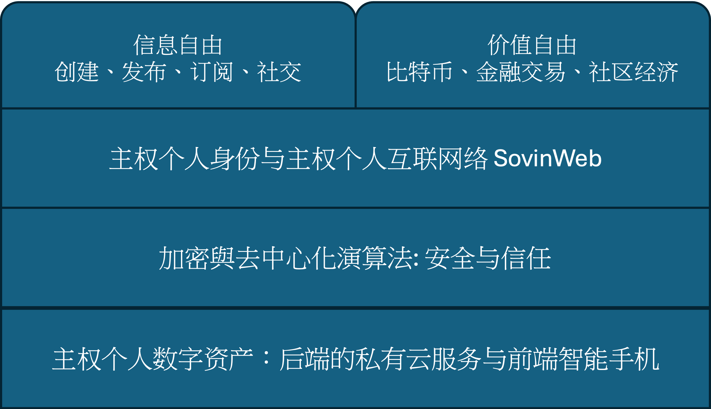

# 技术如何重建个人自由

> 我不能选择那最好的，是那最好的选择我。
> I cannot choose the best. The best chooses me.
> --- 泰戈尔《飞鸟集》

个人自由并不会因为科技的进步而自动增长，反而可能丧失更多。在信息时代，技术既是权力的工具，也是夺回自由的唯一可能。当个体在数字秩序中失去身份、信任与财产的控制权，困境的根源而在于技术的分配与利用：信息的所有权与处理权集中在少数机构手中，而防御的手段被封锁在专业系统的深处。

然而，技术并非天生属于权力的一方。同样的计算机、算法与网络，也可以成为个人的武器。只要个体能够重新拥有自己的信息资产，掌握处理、存储与传递数据的能力；只要个体能够借助加密算法保护通信、认证身份、确保财产安全；那么，自由便不再是一种制度赐予的状态，而是一种可验证、可执行的技术事实。

这一章要讨论的，正是这种新的自由形态：它不依赖他人的许可，不以信任为前提，而以计算为保障。去中心化计算、主权个人身份、端到端加密通信、个人加密货币，这些看似冰冷的技术，背后都潜藏着同一个革命性的意图：让个人重新成为自己信息与财产的主权者。

## 1 四层技术架构

理解了个人自由困境的表层和根本原因，就不难找到问题的解决方案。从根本原因着手，技术解决方案以分为四个层次。

第一层是主权个人数字资产。这是自由的技术地基。数字资产包括后端的私有云与前端的智能手机。后端的私有云让个人拥有自己的可靠、可扩展、一直在线的信息处理、存储与通信资源，能够独立运行程序、保存数据、与他人直接连接。前端的智能手机提供了方便的用户操作界面。主权个人数字资产意味着个人从“租用者”变回“拥有者”，从依附平台的用户变成信息世界的主体。

第二层是加密与去中心化算法。它们提供安全与信任机制。在这一层，算法取代机构成为新的仲裁者。通信通过加密保护，身份通过签名验证，协作通过分布式系统达成共识。信任不再建立在权威之上，而是建立在数学之上。

第三层是主权个人身份与主权个人互联网。在这层，个体可以按照需要自主生成可验证的数字身份，不再依附于平台账户或政府数据库。基于信任之网（Web of Trust）组成的主权个人互联网，让人们能够直接相互认证与连接，形成一个真正的去中心化的对等个人互联网。

第四层，是信息自由与财产自由的应用世界。这是个人主权的外在表达。在这一层，自由不再是抽象的理念，而是可被执行的实践。去中心化的社交、加密通信、社区货币、社区金融、社区经济、分布式自治组织等各种应用都是在不同领域中延伸出的主权个人自由形态。

## 2 自由的技术基础：主权个人数字资产

### 2.1 系统结构

主权个人数字资产是指个人拥有并控制的信息处理、存储与通信能力的整体体系。它由前端的用户设备与后端的私有云组成，两者共同构成个人在网络世界中的技术主体。

前端通常是个人随身携带的通信与计算设备，例如智能手机、平板电脑或个人计算机。这是个人与信息世界交互的界面。操作界面提供的常见功能包括简单的后端管理以及各种应用相关的身份认证、即时通信、信息查询、交易处理等操作。前端设备的意义在于，它将个人的意志直接转化为数字行为，是信息主权最直观的表达。

后端的私有云则是主权个人在互联网上的常驻基础设施。它具备 24 x 7 持续在线的网络连接、独立的计算资源与安全的存储空间，承担信息处理、加密通信、数据备份与程序运行等任务。可以将其理解为个人的数字化延伸：一个能够全天候执行指令、保存记录、维护身份的自主系统。私有云的实现方式具有灵活性。它可以是一台部署在家庭或办公室的本地服务器，也可以是租用的云计算实例，甚至是由若干信任个体共同维护的分布式资源池。关键不在于部署位置，而在于控制权的归属：主权个人应当能够完全掌控其计算与存储资源，并具备在不同服务提供者之间自由迁移的能力。这意味着数据加密、访问权限、密钥管理与备份策略都由个人直接制定与执行，而非依赖平台的默认设定。后端通常使用远程备份存储来进一步提高数据可靠性。

### 2.2 为什么必须拥有持续在线、可控的后端？

换句话说，为什么自由的理念需要一台随时运行的机器来实现？

信息社会的运作是连续的，通信、数据同步、身份验证、价值转移，都在全天候进行。一个人若要在这样的网络中拥有自主存在，就必须具备持续在线的技术代理。前端设备（手机或电脑）随时可能离线、关机或损坏，而后端的私有云则在个体离线时仍然保持运作。后端是拥有计算能力的执行环境，是个人在网络空间的“常驻身份”。它能执行种种需要持续运行或即时响应的工作，比如实时接收加密通信和验证签名、定时执行代理任务、按规则自动处理外部事件、以及更新数据备份等。个人自由的可持续性取决于这种技术连续性。没有自主后端的个人，只能以临时会话的形式存在，在系统关闭的瞬间便被信息世界遗忘。

### 2.3 后端的可信存储

后端的另一个关键意义，在于它提供了一个可信、可控、私有化的存储环境。在这个环境中，个人能够保存加密密钥、隐私数据以及所有无法公开的信息资产。这不仅是一种便利，更是一种制度之外的安全能力，一种目前任何商业平台或公共机构都无法真正提供的能力。

在信息社会中，密钥就是权力。它不仅决定谁能访问信息，更决定谁拥有信息。加密通信的私钥、数字签名的认证密钥、加密货币的钱包密钥，这些都是个人在数字世界中的“主权凭证”。一旦密钥的控制权交由他人，无论对方是政府、银行还是云服务提供商，个人的主权就在技术层面被让渡。当前的互联网体系建立在“代管信任”的逻辑之上。平台承诺安全、银行代管账户、云服务存储数据。然而，这种代管结构的本质，是权力的外包。个人在便利中失去了真正的控制：密钥可能被复制、数据可能被访问，安全性最终依赖于机构的政策与声誉，而非个人的能力。拥有自主后端的个人则不同。私钥被安全地存放在自己的后端系统中，所有涉及认证、签名、解密的操作都在本地完成。密钥不被上传、不被共享，外部系统只能验证结果而无法触及原件。

真正的数字自由，不仅需要思想的觉醒，更需要一台永不停机的机器。这个现在看上去显而易见的事实，却特别容易被忽略或低估其重要性。

## 3 信任的数学基础：加密与去中心化算法

在个人重新拥有信息资产之后，问题的核心不再是“是否拥有”，而是“如何保护”与“如何协作”。信息资产的主权若无法在技术上得到防御和验证，便很容易重新滑入被操控的状态。因此，个人自由的第二个技术层面，是通过加密与去中心化算法建立新的信任机制。

在传统社会中，信任依附于制度、身份或权威。人们相信政府、公证机构、银行或企业所维护的秩序并被其支配。而在信息社会，技术的进步与数据的处理速度已经远超传统制度与法律的响应能力，这为个人提供了创造新秩序的可能。信任可以从社会结构转向技术结构，从人治转向算法。加密技术的意义正在于此。它通过数学机制，将信任转化为可验证的计算过程。无论是通信、交易还是身份认证，加密算法都能在无需中介的条件下，确保信息的机密性、完整性与来源的真实性。加密让个体能够明确地决定，谁能访问、谁能验证、谁能修改自己的信息。
