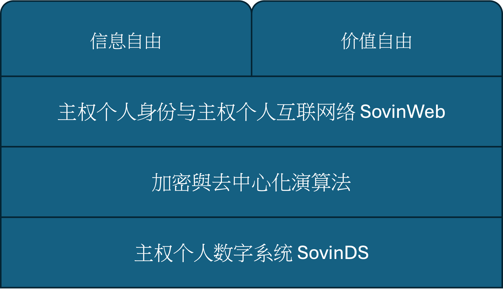
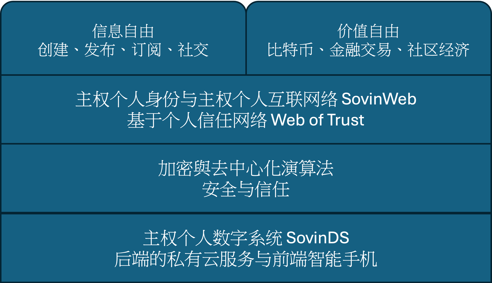

# 技术如何重建个人自由

> 我不能选择那最好的，是那最好的选择我。
> I cannot choose the best. The best chooses me.
> --- 泰戈尔《飞鸟集》

个人自由并不会因为科技的进步而自动增长，反而可能丧失更多。在信息时代，技术既是权力的工具，也是夺回自由的唯一可能。当个体在数字秩序中失去身份、信任与财产的控制权，困境的根源而在于技术的分配与利用：信息的所有权与处理权集中在少数机构手中，而防御的手段被封锁在专业系统的深处。然而，技术并非天生属于权力的一方。同样的计算机、算法与网络，也可以成为个人的武器。只要个体能够重新拥有自己的信息资产，掌握处理、存储与传递数据的能力；只要个体能够借助加密算法保护通信、认证身份、确保财产安全；那么，自由便不再是一种制度赐予的状态，而是一种可验证、可执行的技术事实。

这一章要讨论的，正是这种新的自由形态。它不依赖他人的许可，也无需被动地信任任何机构，而是以技术作为保障支点。去中心化计算、主权个人身份、端到端加密通信、加密货币这些看似复杂甚至神秘的技术背后，都蕴含着同一个革命性的目标：让个人重新成为自己信息与财产的主权者。

## 1 四层技术架构

理解了个人自由困境的表层和根本原因，就不难找到问题的解决方案。从根本原因着手，技术解决方案以分为四个层次。

第一层是主权个人数字系统 SovinDS（Sovereign Individual Digital System）。这是个人自由的技术地基。作为个人数字资产的主权个人数字系统包括后端的私有云与前端的智能手机。后端的私有云让个人拥有自己的可靠、可扩展、一直在线的信息处理、存储与通信资源，能够独立运行程序、保存数据、与他人直接连接。前端的智能手机提供了方便的用户操作界面。主权个人数字资产意味着个人从“租用者”变回“拥有者”，从依附平台的用户变成信息世界的主体。

第二层是加密与去中心化算法。它们提供安全与信任机制。在这一层，算法取代机构成为新的仲裁者。通信通过加密保护，身份通过签名验证，协作通过分布式系统达成共识。信任不再建立在权威之上，而是建立在数学之上。

第三层是主权个人身份与主权个人互联网。在这层，个体可以按照需要自主生成可验证的数字身份，不再依附于平台账户或政府数据库。基于信任之网（Web of Trust）组成的主权个人互联网，让人们能够直接相互认证与连接，形成一个真正的去中心化的对等个人互联网。

第四层，是信息自由与财产自由的应用世界。这是个人主权的外在表达。在这一层，自由不再是抽象的理念，而是可被执行的实践。去中心化的社交、加密通信、社区货币、社区金融、社区经济、分布式自治组织等各种应用都是在不同领域中延伸出的主权个人自由形态。

## 2 自由的技术基础：主权个人数字系统SovinDS

真正的数字自由，不仅需要思想的觉醒，更需要一个永不停机的系统提供持续的信息处理、存储与通信能力。这个现在看上去显而易见的事实，却特别容易被忽略或低估其重要性。这一节描述个人数字系统的基本结构和其存在的必要性，下一章详细讨论系统的组成部分、安全性、可靠性以及管理自动化。

### 2.1 系统结构

主权个人数字系统，是指个人拥有并完全控制的、具备信息处理、存储与通信能力的完整信息系统。它既是个人在网络世界中的“技术孪生”，也是其行使自由与主权的基础设施。这一体系通常由前端的用户设备与后端的私有云组成：前端设备主要提供人机交互界面，后端系统承担持续在线的计算、存储与网络服务。二者共同构成一个自主、可控、可迁移的技术实体，使个人能够独立地管理数据、运行程序并进行安全通信，从而在数字空间中真正拥有自己的信息与存在。

前端通常是个人随身携带的通信与计算设备，例如智能手机、平板电脑或个人计算机。这是个人与信息世界交互的界面。操作界面提供的常见功能包括简单的后端管理以及各种应用相关的身份认证、即时通信、信息查询、交易处理等操作。前端也可以独立处理储存在前端的本地数据。前端设备的意义在于，它将个人的意志直接转化为数字行为，是信息主权最直观的表达。

后端的私有云是主权个人在互联网上的常驻技术主体。这里的“云”一词有特别含义，它并非指依赖大型商业平台的集中式云服务，而是强调一种具备可靠性、可扩展性以及持续可用的信息处理架构。主权个人的“私有云”意味着计算与存储资源可以分布在不同节点上，但逻辑上统一受个人控制。这种结构使系统既能持续运行，又能根据需求灵活扩展，在保障安全与隐私的前提下，实现弹性计算与冗余存储。

后端的私有云具备 24×7 持续在线的网络连接、独立的计算资源与安全的存储空间，承担信息处理、加密通信、数据备份与程序运行等任务。可以将其理解为个人在网络中的数字延伸，一个能够全天候执行指令、保存记录、维护身份的自主系统。后端的实现方式具有灵活性：它可以是一台部署在家庭或办公室的本地服务器；也可以是租用的云计算实例；甚至可以是由多个信任个体共同维护的分布式资源池。关键不在于部署位置，而在于控制权的归属。主权个人应当能够完全掌控其计算与存储资源，并具备在不同服务提供者之间自由迁移的能力。这要求个人自行制定和执行数据加密、访问权限、密钥管理与备份策略，而非依赖平台的默认设定。为提高可靠性，后端系统通常会采用远程加密备份机制，在多个物理节点之间分布存储数据。

### 2.2 为什么必须拥有持续在线、可控的后端？

换句话说，为什么自由的理念需要一台随时运行的机器来实现？

数字世界的运作是连续的，通信、数据同步、身份验证、价值转移，都在全天候进行。一个人若要在这样的网络中拥有自主存在，就必须具备持续在线的技术代理。前端设备（手机或电脑）随时可能离线、关机或损坏，而后端的私有云则在个体离线时仍然保持运作。后端是拥有计算能力的执行环境，是个人在网络空间的“常驻身份”。它能执行种种需要持续运行或即时响应的工作，比如实时接收加密通信和验证签名、定时执行代理任务、按规则自动处理外部事件、以及更新数据备份等。个人自由的可持续性取决于这种技术连续性。没有自主后端的个人，只能以临时会话的形式存在，在系统关闭的瞬间便被信息世界遗忘。

### 2.3 后端的可信存储

后端的另一个关键意义，在于它提供了一个可信、可控、私有化的存储环境。在这个环境中，个人能够保存加密密钥、隐私数据以及所有无法公开的信息资产。这不仅是一种便利，更是一种制度之外的安全能力，一种目前任何商业平台或公共机构都无法真正提供的能力。

在信息社会中，密钥就是权力与控制力。它决定谁拥有信息，谁能访问信息。加密通信的密码、数字签名的认证密钥、加密货币的钱包密钥，这些都是个人在数字世界中的“主权凭证”。一旦密钥的控制权交由他人，无论对方是政府、银行还是云服务提供商，个人的主权就在技术层面被让渡。当前的互联网体系建立在“代管信任”的逻辑之上。平台承诺安全、银行代管账户、云服务存储数据。然而，这种代管结构的本质，是权力的外包。个人在便利中失去了真正的控制：密钥可能被复制、数据可能被访问，安全性最终依赖于机构的政策与声誉，而非个人的能力。拥有自主后端的个人则不同。私钥被安全地存放在自己的后端系统中，所有涉及认证、签名、解密的操作都在本地完成。密钥不被上传、不被共享，外部系统只能验证结果而无法触及原件。

### 2.4 个人数字资产的法律权责

从法律层面看，主权个人数字系统是完全属于个人的数字资产。个人能够独立地管理数据、运行程序并进行安全通信，不仅意味着技术上的自主，也能有效避免使用第三方系统所带来的法律与合规风险。在多数具备基本通信自由与私人财产保护的法治辖区内，这种以个人为主体的数字资产体系是被允许且受到法律保护的。它延续了传统意义上的“私人空间”与“财产边界”，只是将其从物理世界扩展到信息世界。主权个人的数字资产，是现代法治社会中合法而必要的技术延伸，它让个人在网络空间中拥有与现实世界同等的隐私与财产权保障。在制度失衡或权力过度集中时，主权个人数字资产成为信息时代的防线，它让个人仍能以技术手段维持自由与尊严。从这个意义上说，拥有并控制自己的信息系统，是现代人面对数字化权力结构时最根本的自我防御。

主权个人数字资产体系的另一个重要优势在于，它同样改变了技术与法律责任的边界。在这种架构下，提供相关技术或服务的公司与个人，仅仅提供工具、协议或计算资源，而不拥有这些系统数据的所有权与控制权。因为他们并不直接参与用户的数据处理、通信内容或资产管理，自然也不承担与这些行为相关的监管和法律责任。这种权责的重新划分带来了一个重要后果：技术提供者不承担“代管者”的角色，而是回归到纯粹的基础设施建设者。他们提供开放的技术与服务接口，而使用者自行负责数据的安全、通信的加密以及资产的管理。从法律与制度的角度看，这种结构为信息时代的技术创新提供了新的合规路径。

## 3 信任的数学基础：加密与去中心化算法

在个人重新拥有信息资产之后，问题的核心不再是“是否拥有”，而是“如何保护”与“如何协作”。信息资产的主权若无法在技术上得到防御和验证，便很容易重新落入被操控的状态。因此，个人自由的第二个技术层面，是通过加密与去中心化算法建立新的信任机制。

### 3.1 加密与隐私

加密技术让个人重新获得对信息的控制权，成为隐私的技术基础。在过去，隐私往往依赖制度或道德约束：我们需要相信他人不会随意查看或滥用我们的信息。而加密技术改变了这种被动状态，它使个人能够通过数学和计算机算法，主动决定哪些信息可以被他人看到，哪些必须保持私密。

加密的原理并不神秘。简单来说，它是把信息转换成只有持有特定“密钥”的人才能理解的形式。就像把信件写成只有收件人能解开的密码，任何第三方即使拦截到信息，也只能看到一串无意义的字符。这意味着隐私保护不再依赖外部的承诺或监管，而由技术本身直接保障。经过几十年的发展与验证，现代加密算法的安全性已经极高。即使最普通的智能手机或个人电脑，也可以运行经过严格审计和国际标准化的加密程序。在这些算法中，任何未经授权的破解尝试都需要庞大的计算资源，以目前的技术水平，可能需要数十亿年才能完成。换句话说，只要加密密钥得到妥善保存，个人的数据几乎不可能被外部强行解读。如今，端到端加密通信和加密存储已经被广泛应用于日常生活。人们在手机上发送消息、进行网络支付、保存文件时，都在无形中依赖这些算法来保护隐私与安全。加密技术让每个用户都能在信息世界中划定自己的边界，让“谁可以看见我”再次成为个人的选择。在这个意义上，加密用数学的方式让隐私重新成为自由的一部分。

### 3.2 数字身份与数字签名

在现实世界中，我们通过身份证、印章、签名来证明“我是谁”以及“这件事确实出自我之手”。在数字世界中，证明身份和保证信息真实性的方式，就是依靠密码学中的数字身份（Digital Identity）与数字签名（Digital Signature）。这二个功能的实现都依赖于一项关键性的密码学突破：非对称加密算法（Asymmetric Encryption）。它的出现，彻底改变了人类在数字世界中建立信任的方式。

在早期的通信系统中，人们只能使用对称加密。也就是说，加密和解密都使用同一把密钥。这种方法虽然简单，但存在一个致命问题：通信双方必须事先通过某种安全途径共享密钥。一旦密钥在传输中被窃取，信息的保密性就不复存在。非对称加密的发明打破了这个限制。它由两把数学上紧密相关、却不能互相推算出来的密钥组成：一把是公钥（Public Key），可以公开给任何人；另一把是私钥（Private Key），只由持有者本人保管。两者的关系是：用公钥加密的内容，只有私钥才能解密；用私钥加密（或签名）的内容，只有公钥才能验证。这看似简单的机制，让安全通信第一次在无需事先建立信任的环境中成为可能。任何人都可以通过对方的公钥发送加密信息，只有拥有私钥的人能够解密。而私钥一旦妥善保管，任何第三方都无法伪造身份或篡改消息。

当你在网络中发送一条带有签名的信息时，系统会使用你的私钥生成一段独特的数字签名；接收者只需用你的公钥验证，便能确认两件事：一是这条信息确实来自你本人（数字身份验证），二是内容在传输过程中没有被篡改（信息完整的签名）。因此，非对称加密让身份验证与信息认证从制度化的过程变成了可计算、可验证的技术行为。它使得数字世界中的信任不再依赖中心权威，而依赖数学的确定性。

### 3.3 去中心化算法、比特币与去中心化自治组织

在传统社会中，信任往往依附于制度、身份与权威。人们相信政府、公证机构、银行或企业所维护的秩序，而社会合作也建立在这种对权威的信任之上。然而，这种模式的代价是高昂的：它需要中介、许可与监管，权力与责任被集中在少数机构手中。进入信息时代后，技术的发展改变了这种格局。数据的产生、流通与处理速度早已超出传统制度的响应能力。在这种环境中，社会协作不再必须依赖中心化的权威，因为技术本身可以承担“建立信任”的职能。去中心化算法的出现，使这种新的合作方式成为可能。

去中心化算法的核心思想是：通过数学机制和公开规则，把信任从人际关系和机构授权中抽离出来，转化为一种可验证的计算过程。它让系统中的每一个节点既是参与者，也是监督者，每个人都验证他人，同时也被他人验证。这种相互验证的结构使信任被“平均分配”，不再依赖某个中心机构的意志，而依赖算法的执行与共识的形成。书写共识机制的代码成为新的社会契约。它让分散的个体在没有中央权威的情况下达成一致，以规则代替命令，以验证代替信任。这样形成的系统天然具有透明性与抗操控性：任何人都可以检查规则是否被遵守，任何节点的行为都可以被全网验证。比特币的出现正是这一思想的典型例子。它以分布式账本取代中心化数据库，以数学共识取代行政审批。信息的真实性不再由某个权威机构背书，而由网络中所有节点共同维护。这不仅消除了单点控制的风险，也在技术层面实现了“权力的再分配”。

去中心化算法的意义，不仅在于防止审查或篡改，更在于为人类合作提供了新的基础：信任不再是一种被动的对权威的信仰，而是一种透明可验证的计算。这种去中心化协作的最高形态，被称为去中心化自治组织（DAO, Decentralized Autonomous Organization）。它是一种以智能合约为核心的组织形式：成员共同制定规则，代码自动执行决策，资金流动、任务分配、收益分配都由算法完成。在DAO中，没有传统意义上的领导者或管理层，决策权通过投票或算法共识分布在所有成员之间。DAO不是乌托邦式的理想，而是技术实践的结果。它让“组织”从法律实体变成代码实体，让“制度”从纸面规则变成自动执行的逻辑。这种自治结构已经在开源社区、加密项目、数字艺术、乃至公益行动中得到实验性应用。它揭示了一种新的社会组织方式：个体以代码为契约，以共识为纽带，在全球范围内进行无需信任的协作。

## 4 主权个人身份与主权个人互联网

拥有信息资产与加密防护的个人，仍需在数字世界确立自身的存在。自由不仅意味着“拥有数据”，还意味着能够被世界识别与承认。拥有一个可被验证的身份，并以此与他人建立关系，还必须能够在可信与不可信的环境中，与他人进行安全的通信、交易与协作。

### 4.1 主权个人身份

在传统社会，身份由国家、机构或平台赋予；在信息社会，若要实现真正的个人自由，身份本身必须从依附的状态转变为自主的存在。非对称加密技术有一个革命性的特征：用户可以独立生成自己的公钥与私钥，而无需任何第三方的批准或注册。这意味着，个人可以在数字世界中自行创建身份：不依赖政府、银行或平台，不需要账号、验证或授权。这种自我生成的身份体系，正是所谓的主权个人身份（Self-Sovereign Identity）。在这种体系中，公钥就相当于一个公开的身份标识，而私钥则是身份的控制权凭证。只要你拥有私钥，就拥有对应公钥身份的一切权能。任何人都可以自由创建这样的密钥对，这让身份的产生从行政授权转变为数学生成。这种自我生成的机制，打破了传统社会中“身份必须被授予”的结构，使个体在网络空间中能够真正自我存在。你的身份不再依附于平台或政府系统，而是由你自己的密钥对定义和控制。这种机制的哲学意义在于：身份从被动的登记记录，转变为主动的、由个体计算生成的存在。主权个人身份可以应用在互联网上任何需要身份认证与数据签名的场合。在这个意义上，公钥与私钥不仅是加密工具，更是一种数字时代的自我定义权。

公钥作为数字身份的基础概念，并非抽象的理论，而是在多个系统中得到了广泛的实践。其中最早的代表是 PGP（Pretty Good Privacy） 加密通信系统，在 PGP 系统中，每个用户都通过生成一对公钥与私钥来建立身份。公钥相当于用户在网络上的公开名片，他人可以使用它加密信息，只有持有对应私钥的人才能解密。同时，用户还可以用自己的私钥为邮件或文件签名，以证明信息确实来自本人且未被篡改。PGP 以“信任网络（Web of Trust）”的方式运作，用户彼此签名验证公钥，从而形成去中心化的信任体系。在这种结构中，公钥即身份，信任来自相互验证，而非权威认证。

公钥数字身份在加密货币系统中得到了广泛应用。以比特币为例，每一个比特币“账户”并非由银行或机构创建，而是由用户自己生成的一对密钥：公钥相当于账户地址，私钥则是对该账户资金的唯一控制权。谁拥有私钥，谁就拥有账户中的比特币。正因为如此，比特币具备开放性：任何人、在任何地点，只需运行开源软件，就能创建密钥对并参与网络。无需申请，也无需许可。这意味着金融参与权第一次脱离了机构的管辖，转化为一种纯粹的技术行为。

### 4.2 主权个人互联网

比特币是建立在无信任（trustless）机制之上的对等网络。在这个系统中，交易的安全与真实性并不依赖任何中心机构或个人信誉，而是由公开的算法、加密与共识机制共同保障。这种结构极适合加密货币这样的场景，它是一种不需要信任、只需要验证的货币系统。然而，在现实生活中，人类社会的运作并非完全建立在“无信任”之上。人们早已形成了多层次、重叠的信任网络：家庭、同学、同事、社区、社群。这些网络构成人类合作的自然结构，它们通过相互了解与长期互动形成信任，而非通过算法达成共识。这种去中心化但有机的信任结构，在技术上可以通过信任网络（Web of Trust）的形式被重新表达。在这种模式下，一个身份的可信度不由中心机构授予，而是通过网络中多个独立节点的签名与验证逐步建立。信任不再自上而下地被分配，而是自下而上地被编织。不同社群、组织与个体可以形成各自的信任网络，它们相互交织，构成一个开放而多层次的信任生态。这种结构具有天然的弹性与抗审查性：任何单一节点的失效，都无法摧毁整体的信任体系。与区块链的全局共识不同，Web of Trust 的逻辑是局部的、关系化的、动态演化的，更接近人类社会中自然形成的信任模式，只是以技术形式加以实现。

当主权个人身份（Self-Sovereign Identity）与信任网络（Web of Trust）结合，一种新的互联网形态正在显现：一个不以平台为中心、而以个体为节点的网络。我们可以称之为 SovinWeb（Sovereign Individual Web），即“主权个人互联网”。在SovinWeb 中，个人可以直接与他人通信、交易与协作，无需依赖平台的认证、监管或中介。这并非对现有 Web 的否定或替代，而是一种结构层面的补充与进化。如果说传统 Web 以“机构”为中心，那么 SovinWeb 则以“主权个体”为核心。在这样的网络中，每个节点既是用户，也是服务的提供者；每个身份既能被验证，也能验证他人。它形成了一种基于个人信任网络的去中心化社会结构，也是技术条件下自由共同体的雏形。在这里，自由不再意味着逃避控制，而是在透明与可验证的规则之中，基于个人信任关系实现自治。这是从被命名到自我命名的转变，也是从被动信任到主动信任的过渡。PGP 作为早期成功的个人加密通信系统，同时采用了非对称加密算法与信任网络的架构，这绝非偶然。这种组合让个体得以在技术网络中重建“熟人社会”的信任逻辑，通过相互验证与声誉积累，在人与人之间重新形成可持续的信任链条，并在数字世界中探索更广泛、更具创造性的合作形式。

### 4.3 主权个人互联网的通信协议

SovinWeb（Sovereign Individual Web） 是建立在主权个人身份与信任网络（Web of Trust, WoT）之上的去中心化通信协议。它并非替代现有互联网，而是一种叠加（overlay）网络运行在现有通信基础设施之上，为主权个体提供安全、自治、对等的通信环境。SovinWeb 基于个人信任网络 Web of Trust 的局部共识，每个节点依据自身的信任关系和加密验证建立连接，构成一个由无数相互重叠的信任区域组成的全球通信网络。它的核心目标是构建一个以个人为中心的、可验证、自治的互联网层。

在数据传输层面，SovinWeb 可以运行在多种现有基础网络之上，包括公共互联网（Internet）、移动通信网络（Cellular Network），乃至直接的点对点连接（如 Wi-Fi Direct、蓝牙 Mesh 等）。这种灵活性确保了 SovinWeb 能够在不同环境下独立运作，甚至在网络基础设施部分失效时仍能切换到可用连接保持通信与协作。

SovinWeb 的通信协议借鉴了 [Named Data Networking (NDN)](https://named-data.net/) 的设计思路。其核心协议功能包括：

- 端到端加密与身份认证。SovinWeb 默认实现端到端的加密通信与身份验证。每个节点以主权个人身份为标识，默认所有通信都经由加密与签名验证，确保数据的保密性与真实性。对于不敏感的信息或匿名的信息，则可以选择不加密和不签名。
- 拉取式通信模型（Pull-based Communication）。通信以请求驱动（request-driven）的方式进行。节点主动“拉取”所需信息，而非被动接收推送数据，这种机制提高了网络效率与服务品质，同时避免了传统推送模式下大量垃圾信息的困扰。
- 基于内容名称的寻址。 SovinWeb 的通信寻址不是基于互联网的 IP 地址，而是基于数据名称（Content Name）。数据通过用户友好的内含层次的命名而非位置被检索，例如类似 `/mit/courses/network.mp4` 这样的名字方便记忆和使用。基于内容名称的寻址也便于缓存、路由与多播（multicast）分发，从而显著提高网络资源利用率。
- 基于信任的路由机制。网络的组织和路由机制并不依赖集中式的服务器或固定路径，而是基于个人的信任关系网络结构来自主形成。每个节点维护一组自己信任的节点列表，这些信任关系既可以由个人直接建立，也可以通过他人间接继承。当一个节点需要某个数据或服务，它会优先选择通过自己信任的节点进行查找。若查找目标不在直接信任圈中，系统便沿着信任链逐步转发消息，直到找到可达路径。
- 以数据为信任边界的安全模型。SovinWeb 的安全与认证对象是数据本身而非连接通道。每份数据均可携带签名与认证信息，
任何接收方都能独立验证其来源与完整性，无需信任中间节点或传输路径。

SovinWeb 采用的基于信任的路由机制带来的一个关键特征在于个人节点不仅是通信的参与者，也是网络结构的组成部分。每个节点在进行点对点通信的同时，还根据自身的信任网络承担缓存与转发的功能。这意味着，数据的传播不依赖中心服务器，而是通过个体节点之间的信任关系自发完成。这种机制使 SovinWeb 成为一个自组织网络（self-organizing network）。信息的流动路径不由中央调度，而由节点间的信任权重与连接状态动态决定。当一个节点收到数据后，可以选择将其暂存或转发给信任圈中的其他节点，从而在网络中形成多点冗余与弹性传播。信任越强的路径，数据传播的优先级越高；信任较弱的节点则只在必要时参与转发。这种设计让 SovinWeb 同时具备了可靠性与私密性。即使部分节点离线，网络仍能依靠信任关系自动维持通信；而由于数据仅在可信节点之间传播，隐私风险被自然地限制在局部范围内。

## 5 主权个人互联网应用

主权个人互联网让个人自由从潜在的可能，转化为可以被实践的现实。它代表了一种的新型个人为中心的数字社会结构。依靠下面三层的个人主权数字系统、加密与去中心化算法、主权个人身份与主权个人互联网，几乎所有的现存的个人应用都可以个人信息自由与财产自由为核心进行价值再造：从最基本的数字身份与加密通信，到加密钱包、金融交易、社交网络、自治社区与社区经济，这一系列技术应用织合成新的社会基础设施。

在这一新结构中，开放协议和对等架构取代了封闭平台，主动的个人信任取代了被动的机构信任，透明的算法与计算取代了人治与不透明的规则。每一个用户既是使用者，也是运营者；每一次交互都以独立、对等的方式进行。这种以个人为中心 SovinWeb 生态系统叠加在已有的 Web 生态之上，标志着技术自由与制度自由在同一社会结构中开始并行与交汇。现有的制度自由保障个人权利的合法性，技术自由则确保权利的具体落实，它们共同构成了信息时代个人主权的现实基础。

### 5.1 信息自由的实现

信息自由意味着个体能够在技术层面独立地沟通、发布与协作，不再依附于平台的监控、算法的审查或商业逻辑的限制。这一自由的核心，不仅是“能发声”，更是“能被听到”与“能自主选择接收什么”。SovinWeb 的信息系统结构重新定义了这一自由。在其体系中，通信与内容发布通过端到端加密完成，通信内容只属于通信双方，任何第三方都无法截取、篡改或屏蔽。信息的发布依赖加密签名来验证来源，并由个人信任网络传播，不再由平台算法决定可见性或传播范围。这不仅是隐私保护的进步，更是一种信息主权的恢复，个人重新掌握了信息的去向与可见度。在 SovinWeb 的生态中，去中心化的通信、社交与协作平台正在逐步替代传统的信息分发机制。常见的应用包括但不仅限于下面这些应用：

- 聊天与通信：基于信任网络的端到端加密通信系统，用户可直接与他人建立安全连接，无需服务器中转或集中式消息系统。
消息加密传输并带有数字签名，保证保密性与真实性。
- 内容发布与订阅网络：用户可在个人节点上发布内容（如博客、视频、数据集），内容附带加密签名以确保可验证、防篡改。
订阅者可通过信任路径选择信息来源，主动控制接收内容，避免算法推荐导致的信息泡沫与虚假信息过载。
- 去中心化社交网络：以主权身份为核心的社交协议让用户通过信任关系相互关注，社交关系不再由平台掌握。点赞、评论与分享都是加密签名的操作，社交数据完全存储在参与用户的节点中，还可以按约定完全删除。
- 分布式代码托管、开源协作和去平台化的知识共享： 项目成员以主权身份参与协作，代码版本与文档签名可追溯。
协作成果由智能合约自动分配收益，避免集中平台抽成。
- 分布式存储与档案系统：用户节点可根据信任关系共享存储资源，数据以加密块形式分散存储在多个节点上，即使部分节点离线，文件仍可重建。这种机制天然抗审查、抗单点故障，并支持隐私分级访问。
- 个性化信息聚合与推荐：用户可以构建自己的“信任过滤器”，仅从可信节点或签名源接收内容并聚合相关信息。这种机制消除了广告驱动的推荐偏差，让用户主动定义信息质量标准。
- 自治社区与社区协作的基础框架。成员通过个人主权身份与信任网络相互连接，以代码形式定义社区的规则、权利与责任。社区的治理与资源分配由算法自动执行，投票、资金流向、项目决策等过程都由智能合约或分布式协议完成。这使协作能够在无中央管理者的条件下保持秩序与透明度。每个成员都能验证规则的执行，每笔交易与操作都可追溯、可审计。

### 5.2 财产自由的实现

财产自由则是个人主权在经济层面的体现。在传统体系中，财产的存储、流通与价值确认，都依附于银行、支付平台和金融监管机构，个人的财富只是寄存在机构数据库中的数字，账户可以被冻结、转账可以被审查，甚至货币的价值也受制于政策与系统的规则。SovinWeb 的架构为财产自由提供了新的技术基础。在这里，财富的所有权不再依附于机构记录，而由个人掌握的加密密钥直接定义。正如加密货币世界中那句著名的格言：“不是你的密钥，就不是你的钱。”在 SovinWeb 的语境下，这句话具有更广泛的意义，它象征着个人主权的恢复，财富的归属、转移与增值，都可以在个人可控的技术体系内完成，无需许可、无需代管、无需信任中介。这种转变的核心，是所有权与控制权的统一。密钥成为财产主权的技术化表达，个人可以直接管理资产。金融活动可以不再依赖第三方中介机构，而以算法共识与加密签名为保障由交易双方直接达成。这使经济行为第一次从制度结构转化为可执行的代码结构，财产自由成为技术层面的现实。SovinWeb 的一些代表性应用包括：

- 主权个人加密钱包，用户通过私钥直接管理数字资产。钱包支持多种资产形态，包括加密货币、加密凭证与数字商品，
所有交易均通过端到端签名验证完成，确保不可篡改与抗审查。
- 点对点支付协议。用户可通过信任网络进行即时结算，无需银行账户或支付平台。交易在节点之间直接完成，并通过局部共识实现清算。
- 基于个人信任网络的共享经济。商品、服务与知识资产都可通过自主身份注册与交易。支付与评价均依赖签名与信誉系统，无需中心化平台仲裁。用户可以直接在网络上提供短期住房、车辆共享、技能服务或数字作品，功能上相当于一个无平台版本的 Airbnb 或其它共享经济系统。

### 5.3 SovinWeb 不是 Web3

基于个人信任网络的 SovinWeb 与基于区块链的 Web3 在理念上有相似的目标：都希望让个体重新掌握自己的数字身份、资产与数据。然而，两者在结构与技术逻辑上存在本质的区别。SovinWeb 建立在局部信任网络（Web of Trust）之上，强调以个人为中心的、可验证的信任关系。它通过主权身份、加密通信与点对点协作，形成一个由多个去中心化的个人信任网络连接起来的全球网络。信任在其中是有层次、有边界、可积累的社会结构，而不是单一算法维持的全局一致状态。

相比之下，Web3 的概念最早由以太坊联合创始人 Gavin Wood 于 2014 年提出，用以描述下一代去中心化互联网。然而，Web3 并未形成统一的技术定义。主流理解，例如 Wikipedia 的 [Web3 条目](https://en.wikipedia.org/wiki/Web3)，将其与“去中心化”、“区块链”以及“通证经济（token-based economics）”直接绑定。这种以区块链和通证经济为核心的设计带来了新的问题：

- 区块链的全局共识机制需要全网节点同时验证每一笔交易，效率低下，难以扩展。
- 通证经济模型则面临现实价值支撑与法律监管的挑战。在监管不到位时，容易滑向投机与泡沫化。在监管加强时，又会和政府与商业公司合作来监视限制个人的活动。

以比特币为代表的区块链体系，在解决“货币去中心化控制与所有权”方面极为成功，但其底层的全局共识机制并不适合其它非货币的场景。SovinWeb 吸收了区块链的开放用户身份机制，也会利用其成熟的加密钱包，个人主权货币和之上的金融交易机制为个人服务，但不采用“全局共识”与“无信任广播”的架构。它选择了一条更贴近现实社会结构的道路，以局部信任、加密验证与去中介协作为核心，让网络在效率与自治能力都有更大的提升空间并适合更广泛的应用场景。相比基于区块链的 Web3， SovinWeb 的优势体现在二个方面：

- 共识是不必要的或局部的。作为一个通用网络，上面提到的许多 SovinWeb 的应用比如加密通信或信息发布都不需要共识。需要共识的场景比如自治社区和社区经济则多数是小范围的本地协作，可以有比较高的通信效率。
- 隐私是可控的。SovinWeb 采用基于信任的局部验证方式，信息的交换与验证仅发在可信节点之间，不需要向全网广播或公开存储。信息的控制单位与可见范围由个人设定，加密保证信息只在必要的路径中流动，而且在应用层可以设为按条件触发删除操作。在这种结构中，隐私不再是监管之外的秘密，而是信任关系内部的自然属性。
