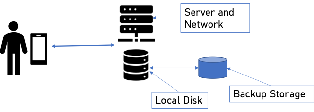

# 主权个人数字系统

个人自由不能仅仅被动地祈求法律条文的保护，信息技术赋能个人建立一个可以独立安全运作的技术实体来保障自己的合法权益。就像工业时代的自由建立在对生产工具的掌握之上，数字时代的自由也需要建立在对信息工具与数据资产的掌控之上。主权个人数字系统 SovinDS（Sovereign Individual Digital System）指个人拥有并控制的一整套信息处理、存储与通信系统，是完全从属于个人的数字资产。它既是个人在数字空间中的技术孪生，也是其主权的实现方式。在这个系统中，个人可以独立地存储数据、运行程序、进行安全通信，不必依附于任何第三方平台或机构。这种数字资产不仅是一种技术结构，更是一种权力结构。它让个体从被动的使用者变为主动的拥有者，从租用他人信息服务的用户，变为掌控自己信息系统的主权主体。这样的自主体系不仅改变了个体在数字世界的地位，也重新定义了法律、经济与社会的边界。本章将从主权个人数字资产的设计理念与系统结构出发，探讨它的技术组成、运行逻辑与法律地位，以及它如何成为个人自由的技术基础。

## 1 信息技术平权

SovinDS（Sovereign Individual Digital System）的设计理念建立在技术与法律的双重前提之上：当计算与通信能力已经普及且强大到足以支持个体独立运作时，个人不仅具备构建自身数字基础设施的能力，也应当拥有这样做的权利。

### 1.1 信息技术赋能

最能体现信息技术进步的是著名的 摩尔定律（Moore’s Law）。这一规律最早由英特尔联合创始人 戈登·摩尔（Gordon Moore） 于 1965 年提出。他观察到：集成电路上可容纳的晶体管数量大约每隔 18 至 24 个月翻一倍，而成本则保持不变或下降。这意味着，计算能力以指数级速度增长，而计算成本则以同样的速度下降。在过去半个世纪中，摩尔定律不仅是一条技术经验曲线，更成为推动现代文明进程的力量。它让计算能力的增长远远超越任何传统资源的扩张速度，在人类历史上，没有任何能源、材料或交通技术能以如此稳定的指数趋势持续演进数十年。这是前所未有的现象：技术第一次以自我加速的方式推动社会演化

[Source: Wikipedia](https://en.wikipedia.org/wiki/Moore%27s_law)

人们往往低估了指数增长的力量。一个具体的例子可以帮助理解摩尔定律的真正含义。依照维基百科超级计算机历史数据 [History of supercomputing](https://en.wikipedia.org/wiki/History_of_supercomputing)， 1999 年全球最快的超级计算机 Intel ASCI Red/9632 的性能约为 2.38 万亿次浮点运算 。而 26 年后的 2025 年，维基百科数据[Apple A19](https://en.wikipedia.org/wiki/Apple_A19) 显示，苹果 iPhone 17 Pro 搭载的 A19 Pro 芯片运算能力已达到每秒 2.49 万亿次浮点数运算，超过当年全球最快超级计算机。换言之，如今一部智能手机的计算性能，已经超越了二十世纪末国家级科研机构所能掌握的全部运算资源。这正是指数增长的震撼之处。过去的“超级”能力，如今已握在每个人的手中。

从经济的角度看，摩尔定律的含义是计算的成本每两年减半。持续多年的技术的进步引起的是资源分配的质变。它将计算从昂贵的机构资源，变成人人可负担的基础能力。下图描述了每一美金可以购买的运算能力，同样的指数增长。

[Source: Wikipedia](https://en.wikipedia.org/wiki/Moore%27s_law)

1999 年的超级计算机 Intel ASCI Red/9632 成本当时约为 $46 million，考虑到通货膨胀约是今天的 $89 million，不是个人甚至普通机构可以奢望的。而 iPhone 17 Pro 的美国零售价为 $1,099，差不多相当于普通美国人一周的工资收入。信息技术的指数发展带来了一个革命性的个人赋能，个人设备的性能已足以承担过去只有超级计算中心才能执行的任务。

加密算法与分布式通信协议的发展使个人能够在安全性、可靠性与可扩展性上实现近似谷歌云与苹果云的水准。换句话说，技术门槛不再是机构与个人之间的分界线。当计算能力的获取变得平权化，个人就有机会成为数字世界中的独立技术主体，而 SovinDS 正是这种新形态的基础。

### 1.2 数字资产私有权

在多数具备基本通信自由与财产权保护的法治社会中，个人拥有数字资产的权利已经包含在宪法与人权框架之内。在成熟的法治框架下，个人对数字资产的权利并非额外赐予，而是既有基本权利在新介质上的自然延伸。

- 通信自由延伸为数字通信主权。保护个人选择通信工具与协议的自由（自建邮件、消息服务器、P2P 协议、端到端加密），并免于不当审查与任意屏蔽。其核心不再仅是“可说话”，还包括“可选择怎样说话”（例如选择加密、选择不依赖平台）。
- 隐私权延伸为数据自决与设备不可任意搜查。保护设备内与云端数据免受任意访问。机构要求获取个人数据须有合法依据与必要性。
- 财产权则以“可排他控制”为标准，覆盖密钥控制的加密资产、账号、域名与受保护的数字作品。数字资产虽可能并非传统“物”，但可控制性、可转让性与经济可得性使其具备财产属性，从而受财产权与侵权规范保护。任何未经所有者授权的访问和改动都构成侵权或犯罪。

换言之，权利的类型未变，只是客体与场景数字化了。落到实践层面，个人凭此可主张一组“可操作的权能”。其中包括自主管理通信与加密，以最小化、选择性披露与匿名/化名技术控制数据暴露，以自托管密钥掌控资产与高价值账号，以及对机构的干预要求正当程序与有限度的必要性。

## 2 SovinDS 系统结构

### 2.1 前后端结构

主权个人数字系统（SovinDS） 由两大部分组成：前端的用户设备与后端的私有云。两者通过端到端加密与双向身份验证安全相连，构成一套完整、自主、可持续运行的个人信息基础设施，使个体能够独立管理数据、运行程序并进行安全通信，从而在数字空间中真正拥有并控制自己的信息与存在。

前端是个人在信息世界中的感知与操作界面，通常指随身携带的通信与计算设备（智能手机或个人计算机）。它承担人机交互、身份认证与即时通信等核心任务，并提供图形化、多媒体的操作界面，使个人可以随时通过可信终端访问与管理自己的信息系统，以主权身份在网络中安全地开展活动与交互。需要强调的是，前端设备具有非持续在线的物理属性（可能关机、离线或损坏），而数字世界的运行却是持续且异步的；仅依赖前端，无法保证数字身份与服务的连续性。这正是后端存在的根本理由。后端的私有云是主权个人在互联网上的常驻技术主体，也是整个系统的执行层与存在层。它提供独立、可靠、可扩展且高可用的计算环境，用于运行应用程序、管理数据、执行调度任务与处理加密通信。此处的“云”并非指依赖大型平台的公共云，而是指一种由个人完全掌控、强调可靠性与可扩展性的持续信息处理架构：资源可分布在不同物理节点上，但在逻辑上统一受个人控制，确保在前端离线或故障时，身份与服务仍能不间断地运行。后面会讨论私有云的各种实现方式。

前端是比较简单的单个手机或个人电脑，运行 SovinDS 的客户端应用，通过双向认证的加密通道与后端协作。后端的实现方式根据应用的安全性、可靠性、复杂度、成本、性能以及用户的技术能力可以有很多选择：它可以是一台部署在家庭或办公室的本地服务器或计算机集群；也可以是租用机架式服务器；云计算的专用或共享的虚拟计算机或计算机集群；甚至可以是由多个信任个体共同维护的分布式资源池。由于数据，特别是密钥的重要性，后端必须有远程的云存储数据备份系统。这个远程数据备份系统提供较短时间间隔（比如一个或数个小时）的增量数据备份与固定时间（比如一一周或一月）的数据与系统状态全备份。由于云存储采用多副本、容错码与跨区域存放，用户可以得到企业级的数据可靠性。当然，特别重要的用户密钥比如加密货币的私钥，还是需要用户用另外的分散的离线的安全方式保存。

### 2.2 系统安全性

SovinDS 的系统本身应该是安全可信的，否则运行在系统里的应用的安全性无从谈起。系统安全性包括前后端设备的硬件安全、系统软件的安全、数据存储以及传输的安全。

智能手机与计算机是信息系统的运算核心。它们之所以可信，不靠厂商的自觉，也不指望运营商的善意，而是因其分层的安全系统结构以及安全的使用方法。在安全硬件的基础上，把密钥握在用户手里，把内容在出门前就锁好，把每一层都做成可验证、可隔离。这里描述的是 2015年 之后生产的主流智能手机与计算机（统称为计算机）的安全性。

首先，计算机都有安全开机检查，这是一套让设备“开口前先自证清白”的机制。它从最底层固件开始，层层验证上一级的软件是否是原版、未被改动的，每一层都只在验签通过后才会把控制权交给下一层。任何一环验签失败则报警停止工作。有些设备支持用户自有的启动签名密钥，用户自己签名的引导程序/系统才能启动，让用户自己完全掌控硬件的合法性。

其次，计算机有内置安全芯片。安全芯片是一块专门负责“保密”和“验明正身”的小型处理器。它像一个与世隔绝的微型内部工作室：在里面生成并保存密钥，只提供在机器内部的加密/解密签名等安全服务，密钥的明文从不离开安全芯片。如果需要把密钥导出发送到其它地方，则需要加密后才导出，这样就保证了密钥与加密服务的安全性。

计算机安装的系统软件比如管理计算机的操作系统、管理数据的数据库学以及通信软件发布时都会盖上厂商的“数字印章”（签名）。在安装或开机时，会检查这个印章，确认是原厂发布、未被篡改的版本；对不上号就拒绝安装/启动。同样的签名机制也适用于系统的更新升级。SovinDS 会采用更加安全、开放的免费开源软件。主流开源操作系统（如 Linux）、数据库（如 PostgreSQL、SQLite）和通信协议（如许多端到端加密实现）都有多人、长期的代码审查机制。系统会启动自动更新来保证及时修补安全漏洞。

在安全的计算机与系统软件之上，数据的安全来自两道互补的防线：存储时加密与传输时端到端加密。前者保护“静止的数据”，后者保护“在路上的数据”。两者合在一起，等于把内容在离开你眼前之前就装进密封箱，再沿着加密隧道运送；哪怕设备遗失、服务器被攻破或网络被窃听，别人看到的也只是看不懂的密文。

### 2.3 易用与自动管理

SovinDS 是普通个人的私有系统，私有系统意味着自由，也意味着责任。SovinDS 的成功不在于技术有多先进，而在于让非工程师也能用得安全而且方便。换句话说就是它要像家里的供电系统一样默默工作、默认安全、出现问题给出清楚提示，而不是把每个人都变成系统管理员。基于这个目标，SovinDS 的设计同时追求三件事：安全、易用、尽可能自动管理。

SovinDS 系统是个人安全边界与信任来源：身份在此发生，签名与认证在此完成，隐私在此封存，策略在此下达。虽然不同的应用需要在安全与体验之间做不同的取舍，整体系统设计还是遵循一个基本原则：把复杂交给系统，把确定还给人。前者指一切可自动、可形式化、可验证的复杂性（加密、同步、恢复、风控、策略执行）应尽量沉入系统；后者指人只在不可替代的决策点介入，并得到清晰、可读、可追溯的确认与必要的灾难恢复能力。系统自动完成数据加密、签名认证等日常管理功能，这些都不需要用户操心，是默认的系统设置。系统给密钥生成、账号创建、密码重置之类的高风险操作设置多重保护机制，让危险变得不容易发生。

易用不是用少一道门槛牺牲安全性，而是让重要的决定看得懂。SovinDS 在手机、平板、电脑上虽然可能有用户界面的微小差异，但会通过同一套共享代码使用同一种操作逻辑。无法自动处理的各种异常会给用户清晰的提醒并让用户选择处理方式。被拦下的动作会说明为什么、怎么办。

对绝大多数人，最好的一种管理就是无需管理。SovinDS 把繁琐工作交给后台自动完成。系统自动完成备份与恢复，安静地做增量备份，需要时可以快速地恢复数据。系统默认会提供自动更新与体检，安全更新与健康检查在后台完成，有异常才提醒。作为最后的恢复手段，系统会有状态和数据的定期快照而且有远程云备份，让用户可以方便的恢复系统的运行。

这里用比较有难度的前端设备更换为例说明一下安全易用的设计理念。用户换手机或手机丢失虽不常见，却是系统必备的重要功能。换手机的操作相对简单，只需要在旧手机里输入新设备的识别码，并在新设备里重新登录即可同步所有前端需要的操作数据。手机丢失的操作则需要更多的安全确认。当用新手机直接登录时，系统先以“只读”方式恢复账号与数据快照。你可以查看消息与文件，但暂时不能改动任何数据。同时系统会提示最近一次的前后端同步时间及其它相关信息，让用户确认是否吊销旧设备。确认后，新设备自动完成密钥轮换与权限接管，恢复已有的应用会话与设置。

## 3 SovinDS 系统功能

前端与后端的结合，使 SovinDS 形成一个独立的计算实体：前端是个人意志的接口，后端是其行动的载体。二者协同工作，为各类应用提供可靠、可扩展的基础设施，使个人在无需依赖外部平台的情况下，独立且安全地完成以下核心能力：

- 数字身份验证与签名
- 安全的双向通信
- 信息的创建、查询、修改与删除
- 数据存储、备份与恢复
- 系统管理与状态监控

由此，“主权个人”不再停留于理念，而成为工程上可执行的现实。借助 SovinDS，个体首次能够在数字世界中持续存在、独立运作并自我防御，以技术的形式真正实现个人主权。
