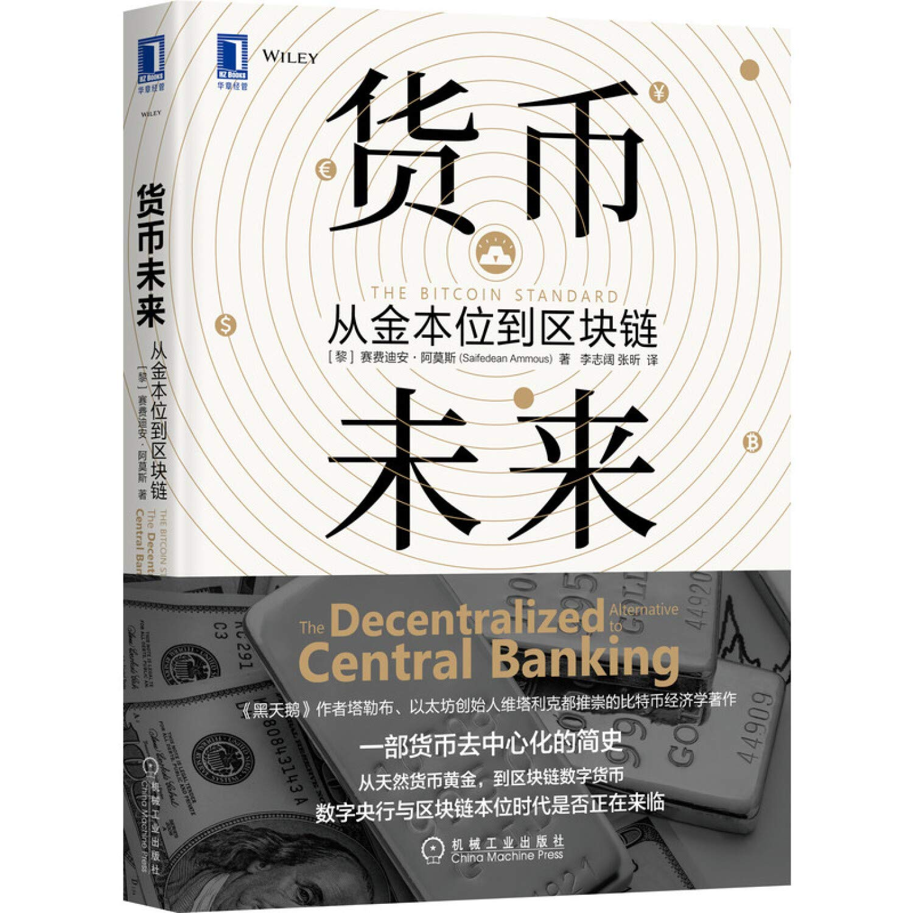
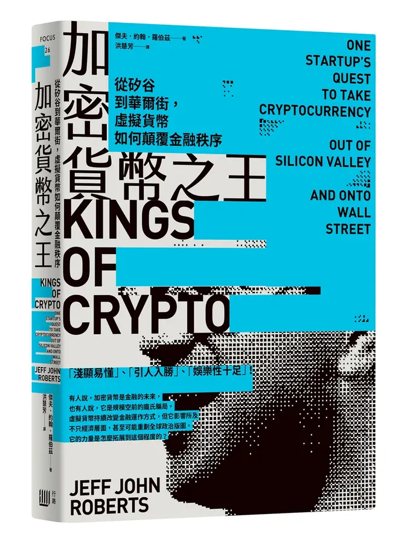
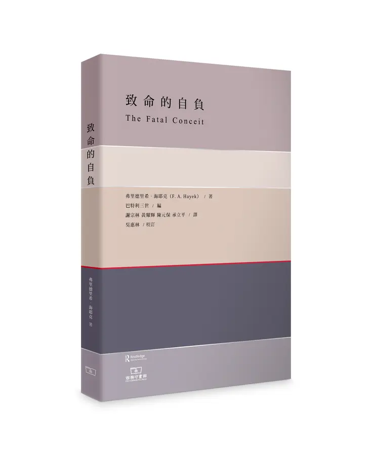
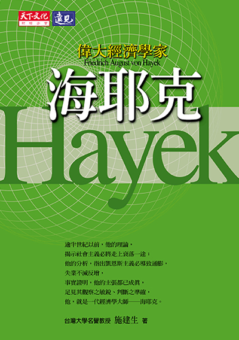

# 参考书目

书的相关信息和照片多数出自[诚品线上](https://www.eslite.com/)或[豆瓣读书](https://book.douban.com/). 点击书名可以看书的详细介绍。

## 货币

### [貨幣失能: 通貨膨脹擋不住? 攸關全人類的金融革命即將到來!](https://www.eslite.com/product/10012043902682932816003)

Broken Money: Why Our Financial System is Failing Us and How We Can Make it Better

- 作者：琳．奧爾登
- 譯者：吳書榆
- 出版社：奇光出版
- 出版日期：2025/07/09
- ISBN13：9786267685150
- 頁數：464

我是看了傑克．多西（Jack Dorsey）的推荐才买来看看的。傑克是推特（Twitter）共同創辦人暨前執行長、Block公司現任執行長。他的评语是“為我緩緩撥開了迷霧。傑出之作。” 我完全赞同。普通人如果只看一本关于货币的书，这是目前最好最有实效的。其中关于货币历史、法币、比特币甚至以太坊的描述都很有价值。几乎每章我都能学到新知识或加深理解。

### [货币未来：从金本位到区块链](https://book.douban.com/subject/35178904/)

- 作者: [黎] 赛费迪安·阿莫斯（Saifedean Ammous）
- 出版社: 机械工业出版社
- 译者: 李志阔 / 张昕
- 出版年: 2020-8
- 页数: 284
- ISBN: 9787111659129

这本书对于货币历史和比特币的描写直击本质。作者是有工程背景的经济学家，加上比特币核心开发人员的帮助，无论是经济属性还是技术的描写都很到位。是很多人了解比特币的入门权威著作。

### [以太思維](https://www.eslite.com/product/10012014082682520624003)

V神首本親筆著作 Proof of Stake: The Making of Ethereum and the Philosophy of Blockchains

- 作者：維塔利克．布特林
- 譯者：趙盛慈
- 出版社：三采文化股份有限公司
- 出版日期：2024/02/23
- ISBN13:9786263582729
- 頁數: 440

这是以太坊创始人 Vitalik 的文章合集。在他的[个人网站](https://vitalik.eth.limo/)都有。节选的文章比较适合没有技术背景的普通读者阅读。文章从2014年以太坊创建之前的构想到2022的发展规划都有涉及。可以看到他的理念 - 同时也是以太坊的理念，属于不可多得的第一手资料。

### [以太奇襲: 一位19歲天才, 一場數位與金融革命](https://www.eslite.com/product/1001143242682071856007)

The Infinite Machine: How an Army of Crypto-Hackers is Building the Next Internet with Ethereum

- 作者：卡蜜拉．盧索
- 譯者：洪慧芳
- 出版社：早安財經文化有限公司
- 出版日期: 2021/09/30
- ISBN13: 9789869932974
- 頁數: 416

这本书描述了以太币的创建和知道写书时2020年之间的发展历程。因为很多早期参与者现在都做各种加密货币，了解这些人的背景对于了解很多山寨币的背景知识都有帮助。

### [加密貨幣之王: 從矽谷到華爾街, 虛擬貨幣如何顛覆金融秩序](https://www.eslite.com/product/1001289172682113434002)

Kings of Crypto: One Startup's Quest to Take Cryptocurrency Out of Silicon Valley and Onto Wall Street

- 作者：傑夫．約翰．羅伯茲
- 譯者：洪慧芳
- 出版社：行路出版
- 出版日期：2022/01/05
- ISBN13：9786269537631
- 頁數：320

描写了美国的合规加密货币交易所 Coinbase 的创建发展历史。可以看到美国政府对加密货币的监管历程。

## 经济学

### [致命的自負](https://www.eslite.com/product/10012117792682837849007)

The Fatal Conceit

- 作者：弗里德里希．海耶克; 吳惠林/ 校訂
- 譯者：謝宗林/ 黃耀輝/ 陳元保/ 承立平
- 出版社：商務印書館（香港）有限公司
- 出版日期：2025/02/25
- ISBN13：9789620767241
- 頁數：296

从1944年《通向奴役之路》出版到1988年《致命的自负》出版，經過接近半個世紀的沉澱，海耶克的思想所涉及的學科內容，日益繁雜且精深。《致命的自负》作為海耶克畢生思想菁華的總結，從市場秩序、哲學、傳統道德、語言學等角度切入，全面而系統地剖析了社會主義在理論上的致命瑕疵，向讀者揭示“人類自以為理智萬能，離職有能力改善或取代一切文明煙花出來的機能”這一“致命的自負”在實際運用中的危險之處。书的特点：

-【畢生菁華】本書為海耶克畢生思想精華總結，立論基礎除奧地利學派經濟學之外，又從哲學、法學、歷史、語言學、文化人類學等各門學科中汲取證據，形成了一個既十分繁複又有邏輯一貫性的論證體系。
-【深入淺出】擺脫一般學術性寫法，令其論證和觀點相對易懂，對一般讀者來講也相對易讀。
-【獨家譯本】本書譯者均為經濟學研究領域知名學者，對於奧地利經濟學派理論有深入了解

### [偉大經濟學家海耶克](https://www.eslite.com/product/1001122731709956)

- 作者：施建生
- 出版社：遠見天下文化出版股份有限公司
- 出版日期：2007/07/20
- ISBN13： 9789864179626
- 頁數：294

逾半世紀以前，他的理論，揭示社會主義必將走上衰落一途；他的分析，指出凱恩斯主義必導致通膨，失業不減反增，他，就是一代經濟學大師－－海耶克。

「社會科學的學者們必須畏懼大眾的讚揚；當所有的人都在對你們歌功頌德時，災難就與你們同在了。」1974年，海耶克獲頒諾貝爾經濟學獎，頒獎晚宴上，海耶克引用經濟大師馬夏爾的這一段話。這一席話，正可反映出海耶克對於自身肩負的社會責任，是多麼地戒慎恐懼。

海耶克的著作影響層面很廣，舉凡經濟、政治、哲學、社會學等領域，都是他研究的主題。但他的經濟理論，早年受凱恩斯學說的壓抑而備受冷落，直到獲頒諾貝爾經濟學獎，奧國學派的理論終獲國際社會重視，並在過去幾十年各國政府遭遇嚴重的經濟問題時，適時地提供了一個不同於凱恩斯學派的解決方案。

作為奧國學派的代表性人物，海耶克極力反對政府的干預，《到奴役之路》一書，則被認為是二次世界大戰之後，許多國家免於投入社會主義陣營的一項重要因素。在極權主義與社會主義蔚為風行的時代，海耶克與奧國經濟學派的同伴孤軍奮戰，力抗潮流，海耶克的一生，可說大半輩子都在孤寂中度過，但是為了自己的信仰，海耶克仍堅持走下去，就如他自己曾說過，「只要我深信自己所做的工作終會被重視，就算一時沒有得到公眾的認同，我還是會繼續做下去。」

作者施建生是國立中央大學學士、美國哈佛大學碩士。在哈佛期間曾受教於熊彼德門下，親炙當代經濟學家熊彼德及其他名師的風采與學識涵養。從事教學工作五十餘年，現任國立台灣大學名譽教授、中華經濟研究院研究顧問、台灣經濟研究院研究顧問。曾任台灣大學教授、法學院院長；中國文化大學教授、經濟學系主任、經濟研究所所長、法學院院長；美國密西根州立大學客座教授；美國威斯康辛大學勒考斯校區客座教授。著有《經濟學原理》、《經濟政策》、《現代經濟思潮》、《偉大經濟學家熊彼得》等書籍。

### [國家為什麼會破產: 橋水基金應對大週期的原則](https://www.eslite.com/product/10012172932683000993008)

How Countries Go Broke: The Big Cycle

- 作者：瑞．達利歐
- 譯者：唐傑克/ 陳世杰/ 鍾玉玨
- 出版社：商業周刊
- 出版日期：2025/10/02
- ISBN13：9786267678657
- 頁數：384
